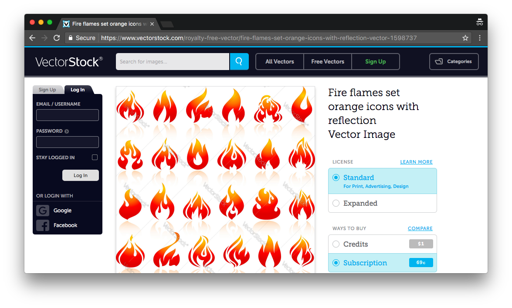
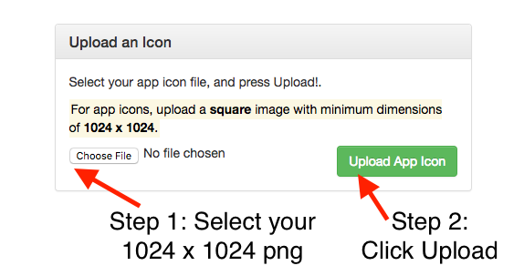
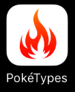
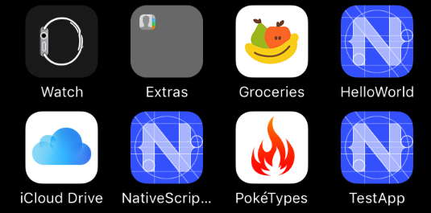
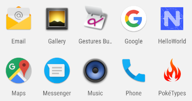
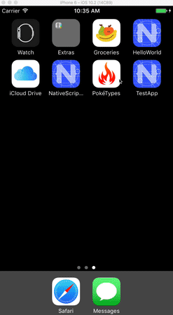
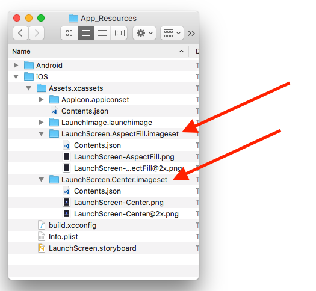
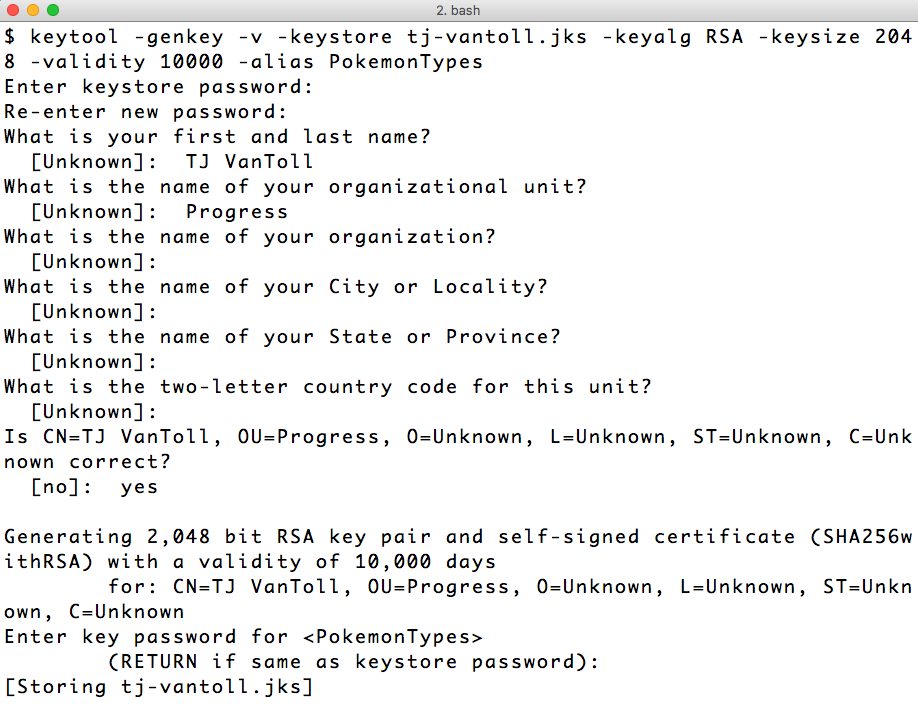

# 8 Steps to Publish Your NativeScript App to the App Stores

This article is a straight-to-the-point checklist that walks you through the various tasks you’ll need to complete to deploy a NativeScript-built app to the iOS App Store and Google Play.

Publishing an app to the stores is hard—there’s no point sugarcoating that. If you’ve never published an app to the stores, you should set aside at least two full days—yes, days—to handle the monotonous processes of getting your various image assets, configuration files, and code signing logistics in place.

Don’t worry though; once you’ve completed these steps once it’s a whole lot easier to go through the process again in the future. And I’ll be sharing tips that I’ve learned the hard way as we go through the steps in this article. In fact, to give this article a bit of real-world context I’ll be using a simple app I recently deployed to the stores, [Pokémon Types](https://github.com/tjvantoll/pokemon-types), to give concrete examples of the steps you need to take.

When you’re ready, grab some coffee, and let’s start getting your app ready for deployment.

## Steps

* [Step 1: Create your app icons](#step-1)
* [Step 2: Create your splash screens](#step-2)
* [Step 3: Configure your metadata](#step-3)
* [Step 4 (optional): Webpack](#step-4)
* [Step 5: Android release build](#step-5)
* [Step 6: Google Play](#step-6)
* [Step 7: iOS release build](#step-7)
* [Step 8: iTunes Connect](#step-8)

<h2 id="step-1">Step 1: Create your app icons</h2>

An app’s icons are the first thing you notice about an app. When you start a new NativeScript app you get a placeholder icon, which is fine for development, but for production you’ll need to replace that icon with the image you’ll want to go to the stores with.


*The NativeScript placeholder icon on the home screen of an iOS device*

To get your production-ready app icons in place, you’ll need to start with a 1024 x 1024 pixel png image asset. [Here’s the image I used for Pokémon Types](https://github.com/tjvantoll/pokemon-types/blob/master/assets/icon-white.png).

If you work with designers this is where you’ll want to ask them for the final image asset that should represent your app. If you don’t work with professional designers, there are a few sites that can help. I bought the Pokémon Types icon from [VectorStock](https://www.vectorstock.com/), for example, which offers high-quality image assets for a few dollars.


*VectorStock is one of many sites that offers high-quality image files you can use icons at reasonable prices.*

Once you have your 1024 x 1024 image, there are a few sites that will generate images in the various dimensions that Android and iOS require. For NativeScript development I recommend the Brosteins’ excellent NativeScript Image Builder, which is available at [nsimage.brosteins.com](http://nsimage.brosteins.com/).

Go ahead and visit the site, find the “Upload an Icon” box, choose your newly created png file, and click the “Upload App Icon” button.



You will start downloading an `icons.zip` file that contains `Android` and `iOS` folders with the image assets you need to move into your NativeScript app.

Start by opening your app’s `app/App_Resources/iOS/Assets.xcassets/AppIcon.appiconset` folder. This folder contains the NativeScript placeholder images for iOS. Delete the entire contents of this folder and replace them with the files in the `iOS` folder from your `icons.zip` download.


With these new images in place, go ahead and run your NativeScript app on iOS to ensure the image looks ok. Here’s what the Pokémon Types’ icon looks like on the iOS simulator.



Now that iOS has been taken care of, let’s move on to Android. To complicate your life Android has a completely different set of conventions for handling icons. (Different processes for iOS and Android is a recurring theme in this article, by the way, just so that you’re prepared.)

The first thing you should know is the you might want to use a different base image for generating your iOS icons than your Android icons. On iOS almost all icons have solid color backgrounds. For Pokémon Types my icon image has a solid white background to fit in with other iOS icons.



But on Android icons often have a transparent background. As such, for Pokémon Types my icon has a transparent background to fit in with other Android icons.



What that means is you might want to upload two different 1024 x 1024 images to the NativeScript Image Builder, one with a solid background color for iOS, and another with a transparent background for Android. That’s what I ended up doing for Pokémon Types.

Regardless of your design decision, once you have your image assets ready for Android, start by opening your app’s `app/App_Resources/Android` folder. Next, move the `icon.png` files from your `icons.zip` file’s `Android` folder into their corresponding place in the `app/App_Resources/Android` folder. Refer to the image below for specifics on what file goes where.


After these files are in place, go ahead and run your app on Android to ensure that your new icons are showing up as intended. Here’s what the Pokémon Types looks like on my Android emulator.


And that’s it for icons. Phew! I warned you that these steps can take a while 😄

But keep your image editors open, as the next thing you need to tackle is splash screens.

<h2 id="step-2">Step 2: Create your splash screens</h2>

Splash screens are what the user sees when the open your app before it’s ready to use. For example, here’s what the user sees when they open Pokémon Types on iOS.



Although there are many things you can potentially do with a splash screen, most applications show the app’s logo, and perhaps the app’s name. NativeScript has a series of conventions in place to make this sort of splash screen relatively easy to implement for both iOS and Android.

Let’s start with iOS. Open your app’s `app/App_Resources/Assets.xcassets` folder, and notice two folders named `LaunchScreen.AspectFill.imageset` and `LaunchScreen.Center.imageset`.



These files contain the default splash screens you’ve used in your app to this point. You can [refer to the NativeScript docs](https://docs.nativescript.org/publishing/creating-launch-screens-ios) for details on exactly how NativeScript uses these files, but the basics are pretty simple—the _AspectFill_ images are your splash screen’s background, and the _Center_ images are centered on top of the background. Therefore, assuming you want a relatively simple splash screen, your task is to change the background color of the _AspectFill_ images, and to place your logo in the _Center_ images.

Feel free to look over [the `Assets.xcassets` folder of Pokémon Types](https://github.com/tjvantoll/pokemon-types/tree/master/app/App_Resources/iOS/Assets.xcassets) to see the specifics, but essentially [the _AspectFill_ images are solid white](https://github.com/tjvantoll/pokemon-types/blob/master/app/App_Resources/iOS/Assets.xcassets/LaunchScreen.AspectFill.imageset/LaunchScreen-AspectFill.png), and [the _Center_ images contain the app’s logo](https://github.com/tjvantoll/pokemon-types/blob/master/app/App_Resources/iOS/Assets.xcassets/LaunchScreen.Center.imageset/LaunchScreen-Center.png) centered. Here’s what my app’s `LaunchScreen-Center.png` file looks like, for instance.


> **NOTE**: Wondering what the `LaunchImage.launchimage` files are for in your app? Launch images are for displaying splash screens on iOS 7 and below. If your app no longer supports iOS 7, you’re safe to ignore these files. (You can even remove the `LaunchImage.launchimage` folder, but if you do, also remove the `ASSETCATALOG_COMPILER_LAUNCHIMAGE_NAME = LaunchImage;` line from your app’s `Info.plist`.)

At this point go ahead and run your iOS app to make sure your new splash screen files are working as expected.

Once you’re all set on iOS, you’re ready to move on to Android, where luckily your steps are nearly identical this time. In your app’s `app/App_Resources/Android` folder you’ll find a series of `background.png` and `logo.png` files. Much like on iOS, NativeScript uses the `background.png` as a background of your splash screen, and centers the `logo.png` file on top of it. You can refer to [the appropriate files in Pokémon Types](https://github.com/tjvantoll/pokemon-types/tree/master/app/App_Resources/Android) as a reference, but really this step is just more of the same image editing.

When you’re all set run your app on Android to make sure everything looks alright, and then let’s move on to configuring your app’s metadata.

<h2 id="step-3">Step 3: Configure your metadata</h2>

iOS and Android applications have a lot of information that you need to configure before you deploy your apps to their respective stores. NativeScript provides intelligent defaults for many of these values, but there are a few you’ll want to review before you deploy.

### Application id

Your application id is a unique identifier for your app that uses reverse domain name notation. For example the application id of Pokémon Types is `com.tjvantoll.pokemontypereference`. The NativeScript CLI has a convention for setting the application id during app creation, `tns create MyApp --appid com.mycompany.myappname`, but if you didn’t use that option it’s easy enough to change your app id.

Open your app’s root `package.json` file and find the `"nativescript"` key. Make sure the `"id"` attribute contains the value you’d like to use.

```
{
  "nativescript": {
    "id": "com.tjvantoll.pokemontypereference",
    "tns-android": {
      "version": "2.5.0"
    },
    "tns-ios": {
      "version": "2.5.0"
    }
  },
  ...
}
```

> **NOTE**: If you’re switching your application id in your `package.json` file, you might also need to change the value in your `app/App_Resources/Android/app.gradle` file (find the `applicationId` key), for the change to take effect on Android.

### Display name

You app’s display name is the name the user sees next to your icon on their screen. For example, Pokémon Types uses a display name of PokéTypes, and that name shows up as such.


By default NativeScript sets your app’s display name based on the value you passed to `tns create`, which is oftentimes not exactly what you want the user to see. For example, running `tns create pokemon-types` results in an app with a display name of “pokemontypes”.

To change that value first open your app’s `app/App_Resources/iOS/Info.plist` file. The `Info.plist` file is iOS’s main configuration file, and here you’ll find a number of values you may want to tinker with before releasing your app. For display name you’ll want to alter the `CFBundleDisplayName` value. Here’s what this value looks like for Pokémon Types.

```
<key>CFBundleDisplayName</key>
<string>PokéTypes</string>
```

One note: although there’s no real character limit to display names, both iOS and Android will truncate your display names after somewhere around 10–12 characters. For example, when I tried to use “Pokémon Types” as a display name of my app, I ended up with the following truncated display.


Because the truncated display is less than ideal, you might have to be creative in how you choose your app’s display name.


On Android the process for changing your display name is similar. In your app look for a `app/App_Resources/Android/values/strings.xml` file. If the file doesn’t exist (it doesn’t by default), go ahead and create it, and paste in the following code.

```
<?xml version="1.0" encoding="utf-8"?>
<resources>
    <string name="app_name">PokéTypes</string>
    <string name="title_activity_kimera">PokéTypes</string>
</resources>
```

And then change the two “PokéTypes” references with your own app’s display name. After you’re done, run your app on Android again to make sure all looks well.

### Other metadata

Although application id and display name are the two most common values, there are a few other values you might need to check before deploying your app.

If you open your app’s `app/App_Resources/iOS/Info.plist` file you’ll see other values you may wish to change, such as your app’s supported orientations. For details on these various keys, you can refer to [Apple’s documentation on the topic](https://developer.apple.com/library/content/documentation/General/Reference/InfoPlistKeyReference/Articles/AboutInformationPropertyListFiles.html).

On Android there are additional configuration values in your app’s `app/App_Resources/Android/AndroidManifest.xml` file. One thing you’ll want to check here is the permissions you’re currently requesting, and whether they’re up to date with the current state of your app. Check the [Android documentation on permissions](https://developer.android.com/guide/topics/manifest/manifest-intro.html#perms) for more details.

One final note: your `Info.plist` and `AndroidManifest.xml` files also contain your app’s version numbers, which NativeScript sets to 1.0 by default. If you’d like to change those values, or if you need to update the values for an app update, refer to the NativeScript documentation on versioning—here are [the iOS docs](https://docs.nativescript.org/publishing/publishing-ios-apps#builds), and here are [the Android docs](https://docs.nativescript.org/publishing/publishing-android-apps#build-versioning).

With the metadata out of the way, let’s move on to optimizing your code itself.

<h2 id="step-4">Step 4 (optional): Webpack</h2>

In NativeScript your source code is JavaScript, and much like JavaScript code on the web, you may wish to optimize your JavaScript code before you push that code to production. For NativeScript apps the tool of choice to optimize that JavaScript is [webpack](https://webpack.github.io/), which NativeScript has built-in support for.

Before we get started it’s worth noting that webpack usage is optional. The advantages of using webpack are reduced app loading times and app package sizes, but just how much of a benefit you’ll get depends on the app that you’re building, most notably its current size.

The disadvantage of using webpack is NativeScript is having another thing you have to configure and maintain. Although [NativeScript’s webpack plugin is super easy to install and get started with](https://docs.nativescript.org/tooling/bundling-with-webpack#installation-and-configuration), it can be tricky to configure for advanced usage, especially if you’ve never used webpack before. You might want to considering deploying your apps to the stores as a first step, and optimizing those apps with webpack in a subsequent version.

The decision is up to you, but if you’d like to give webpack a shot go ahead and go through the [NativeScript webpack documentation](https://docs.nativescript.org/tooling/bundling-with-webpack). If you run into issues go ahead and ask around on the [NativeScript community forum](https://discourse.nativescript.org/).

Once you’re all set, let’s move to building your apps.

<h2 id="step-5">Step 5: Android release build</h2>

Now that you have all of your configuration in place, you’re ready to get your app built and into the app stores. Let’s start with Android, as getting your app into Google Play is considerably easier than dealing with the iOS App Store.

Before you go out to Google Play to register and publish this app (which is the next step), you first need to generate an executable Android file for your application. On Android this file has a `.apk` extension, and you can generate this file using the NativeScript CLI.

The `tns run` command you’ve been using during NativeScript actually generates a `.apk` file for you and installs that file on an Android emulator or device. But the build you must perform for an actual Google Play release must also be code signed. You can refer to [Android’s documentation on code signing](https://developer.android.com/studio/publish/app-signing.html) if you want to dive into the cryptographic details, but at a high-level you need to do two things to create a release version of your Android app.

* 1. Create a `.keystore` or `.jks` (Java keystore) file.
* 2. Use that `.keystore` or `.jks` file to sign your app during a build.

The Android documentation give you a [few options on how you can create your keystore file](https://developer.android.com/studio/publish/app-signing.html#release-mode). My preferred approach is the `keytool` command-line utility, which is included in the Java JDK NativeScript depends on, so it should already be ready to go on your development machine.

Specifically, take the following command, replace `tj-vantoll` with your name or company’s name, and replace `NameOfYourApp` with the name of your app.

```
keytool -genkey -v -keystore tj-vantoll.jks -keyalg RSA -keysize 2048 -validity 10000 -alias NameOfYourApp
```

The `keytool` utility will ask you a number of questions, several of which are optional (name of organization, as well as the names of your city/state/country), but the most important ones are the passwords for both the keystore and the alias (more on that momentarily). Here’s what the `keytool` process looks like when I generate the keystore I used for Pokémon Types.



Before we move on to how to use this `.jks` file there’s one important thing you need to know. **Put this `.jks` file somewhere safe, and do not forget the password for the keystore or for the alias.** (Personally I like using the same password for my keystore and my aliases to simplify my life.) Android requires you to use this exact same `.jks` file to sign any and all updates to your app. Meaning, if you lose this `.jks` file, or its password, you **will not be able to update your Android app**. You’ll have to create a brand new entry in Google Play and your existing users will not be able to upgrade. So don’t lose it!

Oh and one more thing: in most cases you’ll want to use a single keystore file to sign all of your personal or companies’ Android applications. Remember how you had to pass a `-alias` flag to the `keytool` utility, and how that alias had its own password? It turns out that one keystore can have many aliases, and you’ll want to create one for each Android app that you build. (Note: [the easiest way to add an alias to an existing keystore is in Android Studio](http://stackoverflow.com/questions/38073219/how-to-add-an-alias-to-android-java-keystore).)

Ok, so now that you have this `.jks` file, and you have it stored in a nice and secure location, the rest of the process is quite easy. Run the `tns build android` command, and pass it the information you just used to create the `.jks` file. For example, here’s the command I use to create a release build of Pokémon Types.

```
tns build android --release --key-store-path ~/path/to/tj-vantoll.jks --key-store-password my-very-secure-password --key-store-alias PokemonTypes --key-store-alias-password my-very-secure-password
```

Once the command finishes, you’ll have a release `.apk` file in your app’s `platforms/android/build/outputs/apk` folder. Note the location of that file, as you’ll need it in the next step—deploying your app on Google Play.

<h2 id="step-6">Step 6: Google Play</h2>

Google Play is where Android users find and install apps, and the [Google Play Developer Console](https://play.google.com/apps/publish/) is where developers register and upload apps for users to find.

<h2 id="step-7">Step 7: iOS release build</h2>

<h2 id="step-8">Step 8: iTunes Connect</h2>

- Configure release certificates and provisioning profiles
- `tns build ios --release --for-device`

- Add the app in iTunes Connect
- Take screenshots on 7 plus and iPad 12.9 and upload

