# 8 Steps to Publish Your NativeScript App to the App Stores

This article is a straight-to-the-point checklist for deploying a NativeScript-built app to the iOS App Store and Google Play.

Publishing an app to the stores is hard—there’s no point sugarcoating that. If you’ve never published an app to the stores, you should set aside at least two full days—yes, days—to complete  the monotonous processes that this article spells out.

Don’t worry though; once you’ve completed these steps once, it’s a whole lot easier to go through the process in the future—and I’ll be sharing a handful of tips & tricks as we work through these steps. In fact, to give this article a bit of real-world context I’ll be using a simple app I recently deployed to the stores, [Pokémon Types](https://github.com/tjvantoll/pokemon-types), to give concrete examples of the things you need to do to make your next app a reality.

When you’re ready, grab some coffee, and let’s get started!

## Table of contents

* [Step 1: Create your app icons](#step-1)
* [Step 2: Create your splash screens](#step-2)
* [Step 3: Configure your metadata](#step-3)
* [Step 4 (optional): Webpack](#step-4)
* [Step 5: Android release build](#step-5)
* [Step 6: Google Play](#step-6)
* [Step 7: iOS release build](#step-7)
* [Step 8: iTunes Connect](#step-8)

<h2 id="step-1">Step 1: Create your app icons</h2>

Your app’s icon is the first thing you users notice about your app. When you start a new NativeScript app you get a placeholder icon, which is fine for development, but for production you need to replace the placeholder icon with the image you’ll want to go to the stores with.


*The NativeScript placeholder icon on the home screen of an iOS device*

To get your production-ready app icon files in place, you need to first create a 1024 x 1024 pixel `.png` image asset that represents your app. [Here’s the image I used for Pokémon Types](https://github.com/tjvantoll/pokemon-types/blob/master/assets/icon-white.png), as an example.

If you work with designers, this is where you’ll want to ask them to create the final image file for you. If you don’t work with professional designers, there are a few sites that can help. For example, I bought the Pokémon Types icon from [VectorStock](https://www.vectorstock.com/), which offers high-quality image assets for a few dollars.


*VectorStock is one of many sites that offers high-quality image files you can use icons at reasonable prices.*

To make your life difficult, both iOS and Android require you to provide a variety of icon images in a wide array of sizes. Don’t worry though; once you have a 1024 x 1024 image, there are a few sites that will generate images in the various dimensions that Android and iOS require. For NativeScript development, I recommend using the [Brosteins’](https://brosteins.com/) excellent NativeScript Image Builder, which is available at [nsimage.brosteins.com](http://nsimage.brosteins.com/).

Go ahead and visit the site, find the “Upload an Icon” box, choose your newly created `.png` file, and click the “Upload App Icon” button.


*How to use the NativeScript Image Builder to create the icon files you’ll need for your iOS and Android app*

After the Image Builder completes, you’ll automatically start downloading an `icons.zip` file. That archive contains `Android` and `iOS` folders with the image assets you need.

To put those images in the appropriate places, start by opening your app’s `app/App_Resources/iOS/Assets.xcassets/AppIcon.appiconset` folder. This folder contains the NativeScript placeholder images for iOS. Delete the entire contents of this folder and replace them with the files in the `iOS` folder from your `icons.zip` download.


*How to replace the default NativeScript icon images with your own image files from the NativeScript Image Builder*

With these new images in place, go ahead and run your NativeScript app on iOS to ensure the new icons looks ok. Here’s what the Pokémon Types’ icon looks like on the iOS simulator.


> **TIP**: iOS and Android both cache these icon files to save you a bit of time during your builds. If you’re not seeing the icon changes, use `tns platform remove ios` to clear all existing native iOS files. Then use `tns run ios` to run your app again with your new image assets in place.

Now that your iOS icons are complete let’s move on to Android. To complicate your life, Android has a completely different set of conventions for handling icons. (Different processes for iOS and Android is a recurring theme in this article, by the way, just so that you’re prepared.)

There’s one other important difference you should know before generating your Android images. On iOS, almost all app icons have solid color backgrounds. For Pokémon Types my icon image has a solid white background to fit in with other iOS icons.


*iOS icons usually have solid color backgrounds*

But on Android icons usually have a transparent background. As such, for Pokémon Types my icon has a transparent background to fit in with other Android icons.


*Android icons usually have transparent backgrounds*

What that means is you might want to upload two different 1024 x 1024 images to the NativeScript Image Builder, one with a solid background color for iOS, and another with a transparent background for Android. That’s what I ended up doing for Pokémon Types.

Regardless of your design decision, once you have your image assets ready for Android, start by opening your app’s `app/App_Resources/Android` folder. Next, move the `icon.png` files from your `icons.zip` file’s `Android` folder into their corresponding place in the `app/App_Resources/Android` folder. Refer to the image below for specifics on what file goes where.


*How to replace the default NativeScript Android icon images with your own image files from the NativeScript Image Builder.*

After these files are in place, go ahead and run your app on Android to ensure that your new icons are showing up as intended. Here’s what the Pokémon Types looks like on my Android emulator.


And that’s it for icons. Phew! I warned you that these steps can take a while 😄

But keep your image editors open, as the next thing you need to tackle is splash screens.

<h2 id="step-2">Step 2: Create your splash screens</h2>

Splash screens are what the user sees when the open your app before it’s ready to use. For example, here’s what the user sees when they open Pokémon Types on iOS.


Although there are many things you can potentially do with a splash screen, most applications show the app’s logo, and perhaps the app’s name. NativeScript has a series of conventions in place to make this sort of splash screen relatively easy to implement for both iOS and Android.

Let’s start with iOS. Open your app’s `app/App_Resources/Assets.xcassets` folder, and notice two folders named `LaunchScreen.AspectFill.imageset` and `LaunchScreen.Center.imageset`.


*The location of the iOS splash screen files in a NativeScript app*

These files contain the default splash screens you’ve used in your app to this point. You can [refer to the NativeScript docs](https://docs.nativescript.org/publishing/creating-launch-screens-ios) for details on exactly how NativeScript uses these files, but the basics are pretty simple—the _AspectFill_ images are your splash screen’s background, and the _Center_ images are centered on top of the background. Therefore, assuming you want a relatively simple splash screen, your task is to change the background color of the _AspectFill_ images, and to place your logo in the _Center_ images.

Feel free to look over [the `Assets.xcassets` folder of Pokémon Types](https://github.com/tjvantoll/pokemon-types/tree/master/app/App_Resources/iOS/Assets.xcassets) to see the specifics, but essentially [the _AspectFill_ images are solid white](https://github.com/tjvantoll/pokemon-types/blob/master/app/App_Resources/iOS/Assets.xcassets/LaunchScreen.AspectFill.imageset/LaunchScreen-AspectFill.png), and [the _Center_ images contain the app’s logo](https://github.com/tjvantoll/pokemon-types/blob/master/app/App_Resources/iOS/Assets.xcassets/LaunchScreen.Center.imageset/LaunchScreen-Center.png) centered. Here’s what my app’s `LaunchScreen-Center.png` file looks like, for instance.


*The `LaunchScreen-Center.png` file for my Pokémon Types app*

> **NOTE**: Wondering what the `LaunchImage.launchimage` files are for in your app? Launch images are for displaying splash screens on iOS 7 and below. If your app no longer supports iOS 7, it’s safe to ignore these files. (You can even remove the `LaunchImage.launchimage` folder, but if you do, also remove the `ASSETCATALOG_COMPILER_LAUNCHIMAGE_NAME = LaunchImage;` line from your app’s `Info.plist`.)

At this point go ahead and run your iOS app to make sure your new splash screen files are working as expected.

Once you’re all set on iOS, you’re ready to move on to Android, where luckily your steps are nearly identical this time. In your app’s `app/App_Resources/Android` folder you’ll find a series of `background.png` and `logo.png` files. Much like on iOS, NativeScript uses the `background.png` as a background of your splash screen, and centers the `logo.png` file on top of it. You can refer to [the appropriate files in Pokémon Types](https://github.com/tjvantoll/pokemon-types/tree/master/app/App_Resources/Android) as a reference, but really this step is just more of the same image editing.

When you’re all set, run your app on Android to make sure everything looks alright, and then let’s move on to configuring your app’s metadata.

<h2 id="step-3">Step 3: Configure your metadata</h2>

iOS and Android applications have a lot of information that you need to configure before you deploy your apps to their respective stores. NativeScript provides intelligent defaults for many of these values, but there are a few you’ll want to review before you deploy.

### Application id

Your application id is a unique identifier for your app that uses something called _reverse domain name notation_. For example the application id of Pokémon Types is `com.tjvantoll.pokemontypereference`. The NativeScript CLI has a convention for setting the application id during app creation, `tns create MyApp --appid com.mycompany.myappname`, but if you didn’t use that option it’s easy enough to change your app id.

Open your app’s root `package.json` file and find the `"nativescript"` key. Make sure the `"id"` attribute contains the value you’d like to use.

```
{
  "nativescript": {
    "id": "com.tjvantoll.pokemontypereference",
    "tns-android": {
      "version": "2.5.0"
    },
    "tns-ios": {
      "version": "2.5.0"
    }
  },
  ...
}
```

> **NOTE**: If you’re switching your application id in your `package.json` file, you might also need to change the value in your `app/App_Resources/Android/app.gradle` file (find the `applicationId` key), for the change to take effect on Android.

### Display name

You app’s display name is the name the user sees next to your icon on their screen. For example, Pokémon Types uses a display name of “PokéTypes”, and that name shows up as such.


*The display name of your app shows up next to its icon.*

By default, NativeScript sets your app’s display name based on the value you passed to `tns create`, which is oftentimes not exactly what you want the user to see. For example, running `tns create pokemon-types` results in an app with a display name of “pokemontypes”.

To change that value on iOS, first open your app’s `app/App_Resources/iOS/Info.plist` file. The `Info.plist` file is iOS’s main configuration file, and here you’ll find a number of values you may want to tinker with before releasing your app. For display name you’ll want to alter the `CFBundleDisplayName` value. Here’s what this value looks like for Pokémon Types.

```
<key>CFBundleDisplayName</key>
<string>PokéTypes</string>
```

One note: although there’s no real character limit to display names, both iOS and Android will truncate your display names after somewhere around 10–12 characters. For example, when I tried to use “Pokémon Types” as a display name of my app, I ended up with the following truncated display.


*Both iOS and Android truncate long display names. Here, iOS is truncating a display name of “Pokémon Types”.

Because the truncated display is less than ideal, you might have to be creative in how you choose your app’s display name.

On Android the process for changing your display name is similar. In your app look for a `app/App_Resources/Android/values/strings.xml` file. If the file doesn’t exist (it doesn’t by default), go ahead and create it, and paste in the following code.

```
<?xml version="1.0" encoding="utf-8"?>
<resources>
    <string name="app_name">PokéTypes</string>
    <string name="title_activity_kimera">PokéTypes</string>
</resources>
```

Next, change the two “PokéTypes” references with your own app’s display name. After you’re done, run your app on Android again to make sure all looks well.

### Other metadata

Although application id and display name are the two most common values, there are a few other values you might need to check before deploying your app.

If you open your app’s `app/App_Resources/iOS/Info.plist` file you’ll see other values you may wish to change, such as your app’s supported orientations. For details on these various keys, you can refer to [Apple’s documentation on the topic](https://developer.apple.com/library/content/documentation/General/Reference/InfoPlistKeyReference/Articles/AboutInformationPropertyListFiles.html).

On Android there are additional configuration values in your app’s `app/App_Resources/Android/AndroidManifest.xml` file. One thing you’ll want to check here is the permissions you’re currently requesting, and whether they’re up to date with the current state of your app. Check the [Android documentation on permissions](https://developer.android.com/guide/topics/manifest/manifest-intro.html#perms) for more details.

One final note: your `Info.plist` and `AndroidManifest.xml` files also contain your app’s version numbers, which NativeScript sets to 1.0 by default. If you’d like to change those values, or if you need to update the values for an app update, refer to the NativeScript documentation on versioning—here are [the iOS docs](https://docs.nativescript.org/publishing/publishing-ios-apps#builds), and here are [the Android docs](https://docs.nativescript.org/publishing/publishing-android-apps#build-versioning).

When you’re satisfied with your configuration and ready to go, let’s move on to optimizing your code itself.

<h2 id="step-4">Step 4 (optional): Webpack</h2>

In NativeScript your source code is JavaScript, and much like JavaScript code on the web, you may wish to optimize your JavaScript code before you push that code to production. For NativeScript apps the optimization tool of choice is [webpack](https://webpack.github.io/), which NativeScript has built-in support for.

Before we get started, it’s worth noting that webpack usage is optional for NativeScript apps. You get one big thing from using NativeScript: because webpack reduces the amount of JavaScript code in your app, your app will load quicker, and you’ll have a smaller app size when your app appears in the app stores. Just how much of a benefit you get from webpack depends on the app that you’re building, most notably its current size.

The disadvantage of using webpack in NativeScript is having another thing you have to configure and maintain. Although [NativeScript’s webpack plugin is super easy to install and get started with](https://docs.nativescript.org/tooling/bundling-with-webpack#installation-and-configuration), it can be tricky to configure for advanced usage, especially if you’ve never used webpack before. If you’re already feeling overwhelmed by the deployment steps in this article, you could consider deploying your apps to the stores as a first step, and optimizing those apps with webpack in a subsequent version.

The decision is up to you, but if you’d like to give webpack a shot, go ahead and read through the [NativeScript webpack documentation](https://docs.nativescript.org/tooling/bundling-with-webpack). If you run into issues, try asking for help on the [NativeScript community forum](https://discourse.nativescript.org/).

Once you’re all set, let’s move to building your apps.

<h2 id="step-5">Step 5: Android release build</h2>

Now that you have all of your configuration in place, you’re ready to get your app built and into the app stores. Let’s start with Android, as getting your app into Google Play is considerably easier than dealing with the iOS App Store.

Before you go out to Google Play to register and publish this app (which is the next step), you first need to generate an executable Android file for your application. On Android this file has a `.apk` extension, and you can generate this file using the NativeScript CLI.

The `tns run` command you’ve been using during NativeScript development actually generates a `.apk` file for you, and installs that file on an Android emulator or device. But the build you must perform for an actual Google Play release must also be code signed. You can refer to [Android’s documentation on code signing](https://developer.android.com/studio/publish/app-signing.html) if you want to dive into the cryptographic details, but at a high-level you need to do two things to create a release version of your Android app.

* 1. Create a `.keystore` or `.jks` (Java keystore) file.
* 2. Use that `.keystore` or `.jks` file to sign your app during a build.

The Android documentation give you a [few options on how you can create your keystore file](https://developer.android.com/studio/publish/app-signing.html#release-mode). My preferred approach is the `keytool` command-line utility, which is included in the Java JDK NativeScript depends on, so it should already be available on your development machine’s command line.

To use `keytool` to generate a keystore for code signing, take the following command, replace `tj-vantoll` with your name or company’s name, and replace `NameOfYourApp` with the name of your app.

```
keytool -genkey -v -keystore tj-vantoll.jks -keyalg RSA -keysize 2048 -validity 10000 -alias NameOfYourApp
```

The `keytool` utility will ask you a number of questions, several of which are optional (name of organization, as well as the names of your city/state/country), but the most important ones are the passwords for both the keystore and the alias (more on that momentarily). Here’s what the `keytool` process looks like when I generate the keystore I used for Pokémon Types.


*Output of running the `keytool` command to generate a keystore*

Before we move on to how to use this `.jks` file there’s one important thing you need to know. **Put this `.jks` file somewhere safe, and do not forget the password for the keystore or for the alias.** (Personally I like using the same password for my keystore and my aliases to simplify my life.) Android requires you to use this exact same `.jks` file to sign any and all updates to your app. Meaning, if you lose this `.jks` file, or its password, you **will not be able to update your Android app**. You’ll have to create a brand new entry in Google Play and your existing users will not be able to upgrade. So don’t lose it!

Oh and one more thing: in most cases you’ll want to use a single keystore file to sign all of your personal or company’s Android applications. Remember how you had to pass a `-alias` flag to the `keytool` utility, and how that alias had its own password? It turns out that one keystore can have many aliases, and you’ll want to create one for each Android app that you build. (Note: [the easiest way to add an alias to an existing keystore is in Android Studio](http://stackoverflow.com/questions/38073219/how-to-add-an-alias-to-android-java-keystore).)

Ok, so now that you have this `.jks` file, and you have it stored in a nice and secure location, the rest of the process is quite easy. Run the `tns build android` command, and pass it the information you just used to create the `.jks` file. For example, here’s the command I use to create a release build of Pokémon Types.

```
tns build android --release --key-store-path ~/path/to/tj-vantoll.jks --key-store-password my-very-secure-password --key-store-alias PokemonTypes --key-store-alias-password my-very-secure-password
```

Once the command finishes, you’ll have a release `.apk` file in your app’s `platforms/android/build/outputs/apk` folder. Note the location of that file, as you’ll need it in the next step—deploying your app on Google Play.

<h2 id="step-6">Step 6: Google Play</h2>

Google Play is where Android users find and install apps, and the [Google Play Developer Console](https://play.google.com/apps/publish/) is where developers register and upload apps for users to find.

Android’s documentation on [uploading apps and setting up your store listing](https://support.google.com/googleplay/android-developer/answer/113469?hl=en) is quite good, so I’m not going to recreate all that information here. Instead, I’ll give a few tips you might find helpful when uploading your own NativeScript apps to Google Play.

### Screenshots

On the “Store Listing” tab in the Google Play Developer Console you’ll have to provide at least two screenshots of your app in action. Although there are many ways you may choose to create these screenshots, I thought I’d spell out my preferred approach.

Launch your app in an Android AVD (Android Virtual Device) using the `tns run android` command. The Android AVDs have a built-in way of taking screenshots using the little camera icon in the emulator’s sidebar.

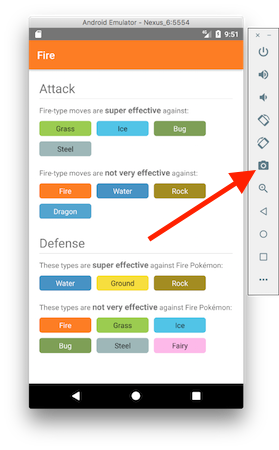
*The button you can use to take screenshots from an Android Virtual Device*

Use this button to take a few screenshots of the most important screens in your app, and the image files themselves will appear on your desktop. From there you could take those files an upload them directly into the Google Play Developer Console, but I personally recommend using a service like [DaVinci](https://www.davinciapps.com/) to add a little flair to your screenshots, and turn them into a small little tutorial of what your app does. For example, here are the screenshots I use for Pokémon Types.

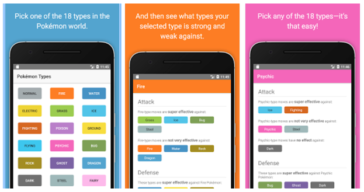
*The screenshots I used for Pokémon Types. Notice how the screenshots do more than show a static image of the app.*

Little touches like polished screenshots can make the difference between users hitting the _Install_ button or moving on, so it really is worth taking a few extra minute to making high-quality screenshot files.

### Feature graphic

Google Play also requires you to upload a 1024 x 500 “Feature Graphic” image file. This file will appear at the top of your store listing. To give you an idea of what that looks like in action, here’s what the Pokémon Types “Feature Graphic” looks like on my Nexus 6.

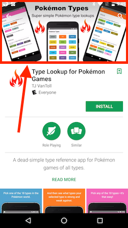
*The location of the “Feature Graphic” on a Google Play app listing*

Designing a feature graphic can be hard, and as someone that lacks design talent, I don’t think I did a particularly good job with Pokémon Types. If you’re having trouble designing one of these images, one thing you might want to try is just using your app’s logo against a solid background color. Several popular apps take this approach, such as Facebook.

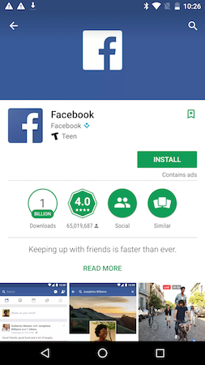
*Many popular apps, such as Facebook, use a simple icon for their Feature Graphic*

### APK

The “App Releases” section of the Google Play Developer Console is where you upload the `.apk` file you generated in the previous step of this article. Just as a reminder, that file is located in your app’s `platforms/android/build/outputs/apk` folder.

Once you have your APK uploaded, and all of your app’s information spelled out in the Developer Console, you’re ready to submit your app! Android app reviews generally take a few hours, and unless Google flags any problems, your app should be available in Google Play within a half day or so.

With Android out of the way, now you’re ready to tackle iOS.

<h2 id="step-7">Step 7: iOS release build</h2>

There’s no point lying to you—releasing an iOS app to the iOS App Store is one of the most painful processes you’ll go through in your software development career. So in case you get stuck or confused in these steps, just know that it’s not just you—everyone gets frustrated releasing iOS apps the first time.

As with the previous steps, I’m not going to spell out every step for generating an iOS release build in this article—both because the necessary steps change frequently, and because the NativeScript documentation already covers the topic of [creating iOS release builds in detail](https://docs.nativescript.org/publishing/publishing-ios-apps). What I will do is spell out a few things that you should know.

### Apple developer account

To deploy iOS apps to the iOS App Store you absolutely must have an active Apple Developer account. It costs $99 USD per year to be a part of the program, and you can sign up at [developer.apple.com/register](https://developer.apple.com/register/).

### Certificates, identifiers, and profiles

Once you have an Apple Developer account, you’ll need to create a production certificate, an app ID, and a distribution provisioning profile on the Apple Developer portal. This is the most tedious part of the entire process, as it takes some time to learn what each of these various files do and how to use them.

The NativeScript documentation has [steps that walk you through the process](https://docs.nativescript.org/publishing/publishing-ios-apps#certificates-identifiers--profiles), but honestly the best thing you can do is find someone else that’s been through these steps to walk you through the necessary steps. If you get stuck ask for help on the [NativeScript community forum](https://discourse.nativescript.org/).

### Generating your `.ipa` file

The iOS equivalent of Android’s `.apk` file is a `.ipa` file, and you’ll need that file to upload your app to the iOS App Store.

In NativeScript there are a few different ways you can generate this file. My preferred route is using the NativeScript CLI’s `tns build ios` command with the following flags.

```
tns build ios --release --for-device
```

> **NOTE**: The above command requires you to fill in the code signing information in your `app/App_Resources/iOS/build.xcconfig` file—specifically, uncomment the `CODE_SIGN_IDENTITY` and `DEVELOPMENT_TEAM` lines, and provide the appropriate values. The `CODE_SIGN_IDENTITY` should have the same name as your distribution iOS certificate (I called mine “iOS Distribution”), and you can find your `DEVELOPMENT_TEAM` id on [https://developer.apple.com/account/#/membership](developer.apple.com/account/#/membership) (look for “Team ID”).

After this command finishes, you’ll have the `.ipa` file you’ll need in your `platforms/ios/build/device` folder. Make a note of the location of that file, as you’ll need it in the final step of this guide.

Phew! Hopefully you’ve made it to this point in one piece. You’re now ready for the final step, which I wish I could tell you was easy—iTunes Connect.

<h2 id="step-8">Step 8: iTunes Connect</h2>

iTunes Connect is Apple’s equivalent of the Google Play Developer portal, just worse. And by worse I just mean that it’s at least 50% more time consuming to fill in the appropriate information and figure out what you’re supposed to do.

As with previous steps, I’m not going to provide a step-by-step guide to uploading your apps to iTunes Connect. Apple changes that portal too often, and their [documentation on iTunes Connect](https://help.apple.com/itunes-connect/developer/) is pretty good. I will, however, give you a few tips on how to register your app for iOS distribution.

### Create a new app

The first thing you’ll need to do is register your app. To do that, visit <https://itunesconnect.apple.com/>, click “My Apps”, and, click the “+” button (currently in the top-left corner of the screen), and then select “New App”.

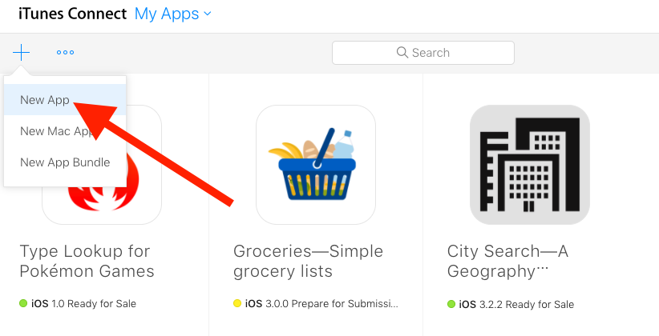
*To register a new app in iTunes Connect, use the above “New App” link.*

Here you’ll have to provide a few pieces of information about your app, such as its name and its app id. Here’s the information I provided for Pokémon Types.

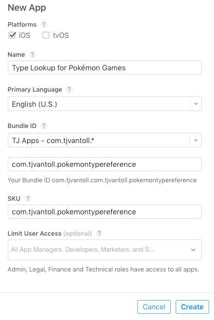
*A sample of the information you need to provide to register a new app in iTunes Connect*

After providing this information you’ll be taken to your app’s dashboard where you need to provide more metadata about your application. Most of this information is pretty straightforward, such as descriptions, pricing, and so forth, but there are a few “fun” pieces you’ll have to deal with, such as screenshots.

### Screenshots

Much like on Android, iOS requires you to provide screenshot files in order to submit your apps. Previous versions of iTunes Connect required you to provide five screenshots for every supported iPhone and iPad resolution, which is just as painful as it sounds.

Luckily, iTunes Connect now only requires you to upload two sets of screenshots, one for the largest iPhone devices (5.5-inch displays), and another for the largest iPad devices (12.9-inch devices). Apple still gives you the ability to provide optimized screenshots for each and every iOS device dimension, but if you provide only 5.5-inch and 12.9-inch screenshots, Apple will rescale your provided screenshots for smaller display devices automatically.

To get those screenshots you could run your app on physical iPhone Plus and iPad Pro devices, but I find it far easier to get these screenshots from iOS simulators. To do so, go ahead and run your iOS app on any iOS simulator.

```
tns run ios --emulator
```

Once your iOS simulator is running, use the simulator’s “Hardware” --> “Device” menu to switch to an “iPhone 7 Plus”, as that’s a device you can use to get 5.5-inch screenshots.

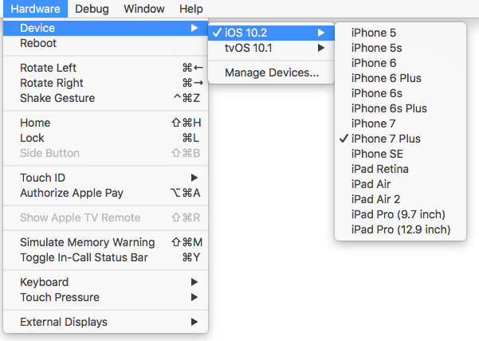
*You can use the iOS simulator’s Hardware menu to switch to different iOS devices.*

> **NOTE**: After you have the correctly sized simulator running, you need to re-run `tns run ios --emulator` to deploy your app to that new simulator.

With the correct simulated device running, you can use the simulator’s `Cmd` + `S` keyboard shortcut to take a screenshot of your app, which save the appropriate image file to your desktop. Like you did with Android, take a few screenshots of the most important parts of your app in action.

When you’re done, use the simulator’s “Hardware” --> “Device” menu to switch to an “iPad Pro (12.9 inch), as that’s a device you can use to get 12.9-inch screenshots. Deploy your app to the iPad simulator with the `tns run ios --emulator` command, and then use the `Cmd` + `S` keyboard shortcut to get a few iPad-sized images.

At this point you’re all set. You may want to a service like [DaVinci](https://www.davinciapps.com/) to polish your image files, but when you’re ready, drag your images into the “App Preview and Screenshots” area of iTunes Connect. Here’s what my screenshots look like for Pokémon Types.

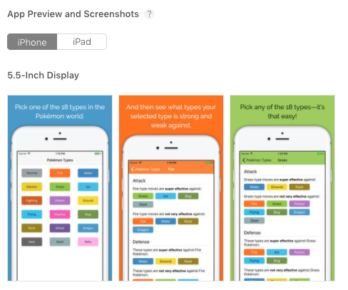
*How screenshot files appear in iTunes Connect*

> **TIP**: You may want to consider adding an app preview video for your application in this section of iTunes Connect. App previews are small videos you can use to showcase your app in action, and can really help drive downloads when done right. To learn more about App preview videos, and how to create good ones, refer to [Apple’s documentation on the topic](https://developer.apple.com/app-store/app-previews/).

### Uploading your `.ipa` file

You’re almost there! Once you have all your information entered into iTunes Connect, your final step is to associate your built `.ipa` file with all the information you just typed out. Specifically, you need to fill in this section within iTunes Connect.

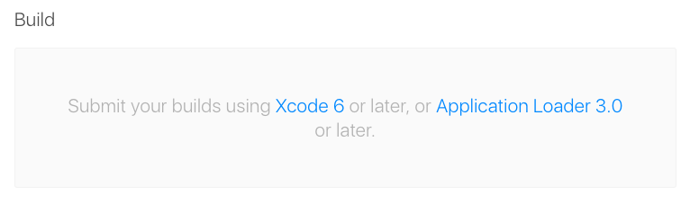
*How the “Build” section looks in iTunes Connect by default*

As Apple’s message says, there are many ways you can upload your `.ipa` file, including using Xcode, or a tool called [Application Loader](http://help.apple.com/itc/apploader/e3). But my personal preference is to use the built-in upload behavior in the NativeScript CLI.

Run the following command to publish your app to iTunes Connect.

```
tns publish ios --ipa <path to your ipa file>
```

> **TIP** Remember that your `.ipa` file is in your app’s `platforms/ios/build/device` folder. For Pokeémon Types the full command I ran was `tns publish ios --ipa platforms/ios/build/device/pokemontypes.ipa`.

And that should be it. One important note though: for whatever crazy reason, there’s a non-trivial delay between the time you upload your iOS app, and the time that app shows up in iTunes Connect. I’ve seen the delay be as short as 30 seconds, and as long as an hour. It’s bizarre, and iTunes Connect gives you no clue that some sort of processing is occurring. So be patient, and hit the refresh button liberally until your build file appears. When it does you’ll see something like this.

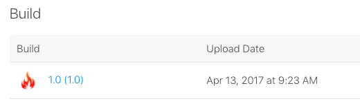
*How the “Build” section looks in iTunes Connect after you upload a valid `.ipa` file*

After you select a build you could be all set. Go ahead and hit the big “Submit for Review” button... and cross your fingers. 

Apple has a notoriously sporadic delay for reviewing the iOS apps that you submit. At the time of this writing, the average review for the iOS App Store is around 2 days. It look almost exactly two days for me to hear back about Pokémon Types.

> **TIP**: The site [appreviewtimes.com/](http://appreviewtimes.com/) provides aggregates app review times to give you an idea of current app review times.

If all goes well you’ll receive a happy message in your inbox that looks something like this.

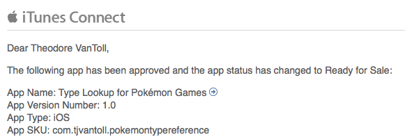
*An example of the message you see after Apple approves your iOS app*

## Wrapping up

And with those eight steps, you now have your app listed both on Google Play and the iOS App Store. If you’ve made it this far, congratulations 🎉 

Make sure to let us know about your app on the [NativeScript showcases page](https://www.nativescript.org/showcases)—we can help spread the word about your cool new app.

Deploying apps is not easy, but now that you’ve went through the process once it should be a whole lot easier when you need to do this for your future apps.

> **NOTE**: Did you get stuck while going through this guide? The [NativeScript community forum](https://discourse.nativescript.org/) is a great place to ask any questions you might have related to all things NativeScript. Let us know how you can help.
