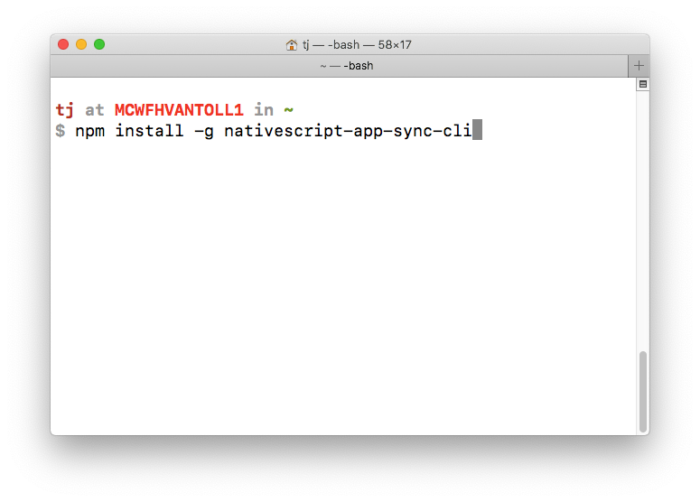
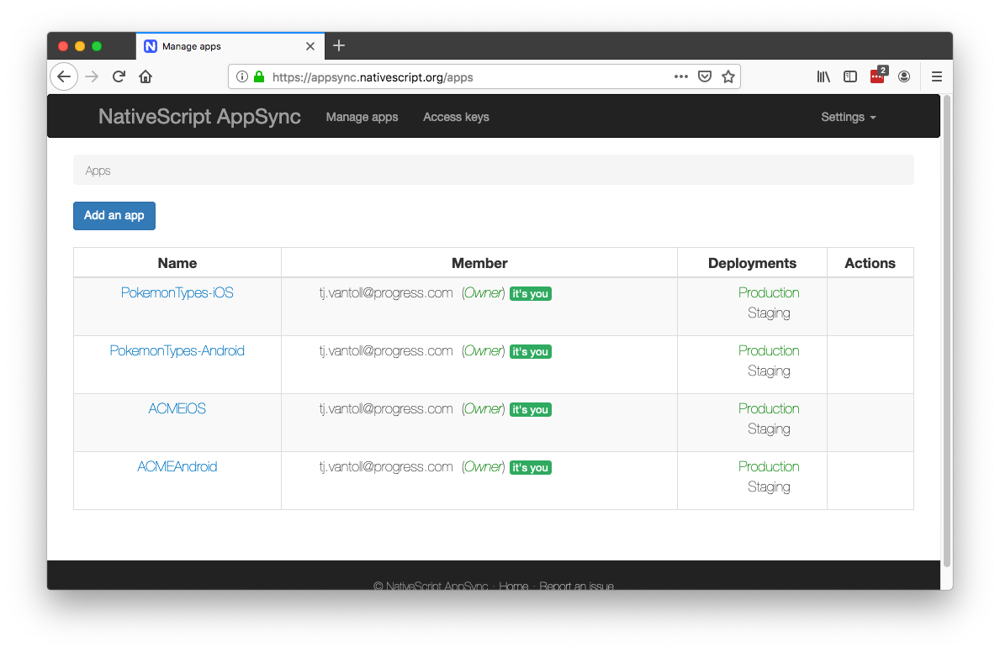
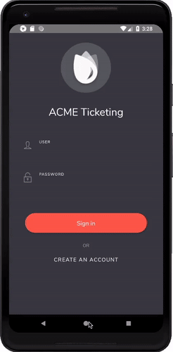
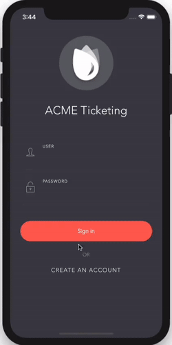

# Enable Live Updates of Your iOS and Android Apps Using NativeScript AppSync

In the [recent NativeScript 6.0 release](https://www.nativescript.org/blog/announcing-nativescript-6.0---webpack-all-the-way-seamless-app-updates-new-core-theme-and-a-lot-more#comments), we announced a new beta service called [NativeScript AppSync](https://market.nativescript.org/plugins/nativescript-app-sync), which allows you to update NativeScript-built iOS and Android apps without using the App Store or Google Play.

If you haven’t yet seen this feature in action, this 7-minute segment from the recent [NativeScript 6.0 release webinar](https://www.youtube.com/watch?v=qR1ESQTALI0) will get you up to speed.

<iframe width="560" height="315" src="https://www.youtube.com/embed/qR1ESQTALI0?start=2538" frameborder="0" allow="accelerometer; autoplay; encrypted-media; gyroscope; picture-in-picture" allowfullscreen></iframe>

In this article I want to go beyond the basic demo, and answer some common questions about using this service. Like, why would you want to do this in the first place, and, is Apple cool with me enabling this in my app?

## Why use this?

Everyone that has updated an Android or iOS app hates the process. Each update involves a number of manual steps, like creating a new release build, updating a number of different versions numbers correctly, writing release notes, and, on iOS, waiting for a review before your updates go live.

And the problems go beyond developer productivity. Suppose you discover an error in your production app that’s costing your business money. To fix that error with the normal deployment processes you have to: manually create the build, upload that build to the stores, wait for an approval (on iOS), and then wait for your users to download and install that update on their devices.

That process can easily take days, and in the meantime, your business is losing money, and your users are getting frustrated with your buggy app. With NativeScript AppSync you can make updates immediately.

## How exactly does AppSync work?

There are a few different components of the AppSync service, and I think explaining them individually is the best way to show how the service works as a whole.

**AppSync CLI**

The AppSync service has its [own command-line interface](https://github.com/eddyverbruggen/nativescript-app-sync), which you can install with `npm install -g nativescript-app-sync-cli`. After installation, you’ll have a new `nativescript-app-sync` command on your terminal that you can use to interface with the AppSync server.



This includes registering for the AppSync service, adding the applications you want to use the service with, and uploading code updates for those apps.

**AppSync Server**

The [NativeScript AppSync server](https://appsync.nativescript.org/) provides a front-end for viewing the access keys and deployment keys needed to connect your application code with the AppSync server.



The server also serves as the location your code updates themselves live, from which your apps will check for updates and download them as necessary.

**AppSync Plugin**

The final piece of the puzzle is the [AppSync plugin](https://market.nativescript.org/plugins/nativescript-app-sync), which you can install into any NativeScript app using `tns plugin add`.

```
tns plugin add nativescript-app-sync
```

With the plugin installed, you need to add a call to the AppSync plugin’s `sync()` method in your app using the code below.

``` TypeScript
import { AppSync } from "nativescript-app-sync";

AppSync.sync({
  deploymentKey: "..."
});
```

The `AppSync.sync()` method calls the AppSync server to check if any new updates are available for your app. If it finds one, it silently downloads that update in the background so it’s available the next time the user restarts the app.

## How should I use this in a real app?

Technically you can call `AppSync.sync()` anywhere in your app, and call it as many times as you’d like. However, the most common approach is to place the code below in your `app.js` file for NativeScript Core and NativeScript-Vue apps, and in your `main.ts` file for NativeScript Angular apps.

``` TypeScript
import * as application from "tns-core-modules/application";
import { AppSync } from "nativescript-app-sync";

application.on(application.resumeEvent, () => {
  AppSync.sync(...);
});
```

This code attaches an event handler to NativeScript’s application resume event, which NativeScript triggers every time your user resumes using an app (which can either happen when they unlock their device, or when they switch to your app from another app).

What’s important to note is that `AppSync.sync()` only determines whether an update is available, and if so, downloads that update in the background. The `sync()` method does _not_ actually apply the update—after all, it’s the app’s source code itself that needs to change, which isn’t something you can do while the app is running.

That being said, there are some options you can use to confirm exactly how your application synching works.

## What options should I use?

The AppSync plugin’s `sync()` method allows you to confirm that way your syncs happen in a number of different ways. Here’s a quick look at some of the options available, along with their default values.

``` TypeScript
import { AppSync, InstallMode, SyncStatus } from "nativescript-app-sync";
import { isIOS } from "tns-core-modules/platform";
 
AppSync.sync({
  deploymentKey: isIOS ? "your-ios-deployment-key" : "your-android-deployment-key",
  installMode: InstallMode.ON_NEXT_RESTART,
  mandatoryInstallMode: isIOS ? InstallMode.ON_NEXT_RESUME : InstallMode.IMMEDIATE,
  updateDialog: {
    updateTitle: "Please restart the app",
    optionalUpdateMessage: "Optional update msg",
    mandatoryUpdateMessage: "Mandatory update msg",
    optionalIgnoreButtonLabel: "Later",
    mandatoryContinueButtonLabel: isIOS ? "Exit now" : "Restart now",
    appendReleaseDescription: true
  }
});
```

* `deploymentKey`: The `deploymentKey` is required as its what connects your application code to the AppSync server. You will have different keys for iOS and Android, so the same code includes a ternary check so you can provide both values.

* `installMode`: By default, AppSync only installs updates when the user restarts an app. AppSync does, however, have the ability to immediately apply updates, and will if set your `installMode` to `InstallMode.IMMEDIATE`. There is one big caveat to this: `InstallMode.IMMEDIATE` shows an installation prompt (see image below), which Apple does not allow for iOS apps distributed through the App Store. Therefore, only set `InstallMode.IMMEDIATE` for iOS if you’re building enterprise-distributed iOS apps.

* `mandatoryInstallMode`: When you release AppSync updates through the AppSync CLI (`nativescript-app-sync release`), you can optionally designate that release as mandatory using the `--mandatory` flag. The `mandatoryInstallMode` option gives you the ability to immediately install updates you mark mandatory, while allowing non-mandatory updates to wait until the next app restart. Once again, do not use immediate releases for App-Store-distributed iOS apps.

* `updateDialog`: The AppSync plugin has a built-in mechanism for displaying a dialog informing users about updates when using `InstallMode.IMMEDIATE`. The gifs below show the dialogs in action on Android and iOS. On Android, the plugin is able to immediately restart your app with the new changes in place. On iOS, apps are not allowed to restart themselves, and as such, the plugin dialog instead instructs users to restart the app manually. (Presumably, this poor user experience is why Apple doesn’t want you to use this sort of workflow for App-Store-distributed apps.




The AppSync plugin’s `sync()` method also accepts a callback function as a second parameter. Here’s what that looks like in action.

``` TypeScript
import * as application from "tns-core-modules/application";
import { AppSync, SyncStatus } from "nativescript-app-sync";

application.on(application.resumeEvent, () => {
  AppSync.sync({
    ...
  }, (syncStatus: syncStatus) => {
    if (syncStatus === SyncStatus.UP_TO_DATE) {
      console.log("No pending updates; you’re running the latest version.");
    } else if (syncStatus === SyncStatus.UPDATE_INSTALLED) {
      console.log("Updated found and installed. It will be activated upon next cold reboot");
    }
  });
});
```

You might find this callback helpful during debugging or troubleshooting production apps.

## Is Apple cool with me doing this?

Let’s start with the easy part of this question. If you’re developing iOS apps with an enterprise development certificate, you’re free to push updates however you’d like, and notify your users of those updates however you’d like; Apple really only cares about apps distributed through the App Store.

And when it comes to the App Store, Apple has [this guideline](https://developer.apple.com/app-store/review/guidelines/) in place.

> Apps may contain or run code that is not embedded in the binary (e.g. HTML5-based games, bots, etc.), as long as code distribution isn’t the main purpose of the app, the code is not offered in a store or store-like interface, and provided that the software (1) is free or purchased using in-app purchase; ...

There’s a lot of legalese in the full text, but the key part is this.

> Apps may contain or run code that is not embedded in the binary as long as code distribution isn’t the main purpose of the app.

Basically, as long as your app isn’t distributing code as a feature of the app itself, and as long as you don’t abuse AppSync to fundamentally change the purpose of your app (aka suddenly turn your calendar app into a gambling app), you should be good to go.

It’s worth noting that NativeScript AppSync is based on Microsoft’s CodePush project, which has been used by thousands of developers to deploy and update iOS applications.

> **NOTE**: Apple has made it clear that they don’t want your apps showing update dialogs to users, so once again, make sure you’re not using `InstallMode.IMMEDIATE` on iOS.

## What else can AppSync do?

There are a lot of other tweaks you may want to make to AppSync to meet your needs.

For example, the AppSync CLI and server have the ability to handle staging and production releases, giving you the ability to test your updates locally before sending them out to your production users.

Additionally, both the AppSync CLI and Server offer data on your deployment history, including which numbers on exactly how many users have received the updates you push out. You can even rollback updates using `nativescript-app-sync rollback` if something goes wrong.

```
$ nativescript-app-sync deployment history ACMEAndroid Staging
┌───────┬──────────────┬─────────────┬───────────┬─────────────┬───────────────────────┐
│ Label │ Release Time │ App Version │ Mandatory │ Description │ Install Metrics       │
├───────┼──────────────┼─────────────┼───────────┼─────────────┼───────────────────────┤
│ v1    │ 2 hours ago  │ 1.0         │ No        │             │ Active: 100% (1 of 1) │
│       │              │             │           │             │ Total: 1              │
└───────┴──────────────┴─────────────┴───────────┴─────────────┴───────────────────────┘
```

As you can see, there’s a lot that AppSync can offer to improve your development workflow, and help you get fixes out to your users faster. For more details, refer to the [AppSync plugin’s documentation on NativeScript Marketplace](https://market.nativescript.org/plugins/nativescript-app-sync), and if you have any other questions about using the plugin, feel free to reach out in the comments.