# Developing a watchOS App For Your NativeScript App

In this article we’re going to look at how to develop a watchOS companion app for your NativeScript-built iOS app. If you follow along with this article’s steps you’ll have a little app that looks a little something like this.

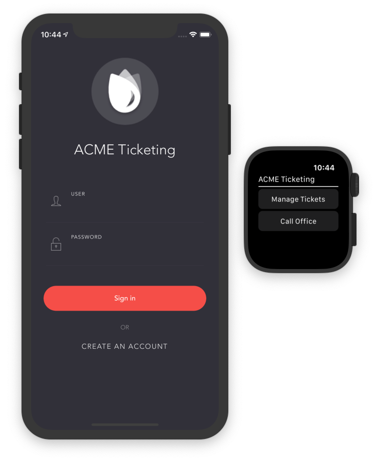

> **NOTE**: The final code for this article is available on GitHub at <https://github.com/ignaciofuentes/nativescript-acme-sample>.

Two important things to point out before we continue: first, watchOS companion apps for NativeScript apps must be built with native code using Xcode. And because Xcode only runs on macOS, the following steps can only be performed on a Mac.

Second, watchOS support for NativeScript is currently in beta and has some limitations, such as only being able to develop your watchOS apps using Objective-C (and not Swift), and not being able to share native code between your main app and your watch extension.

That being said, the fact that you can now build a fully functional watchOS extension for NativeScript apps is pretty exciting, and I’d encourage everyone to try out the workflow to see just how easy it is.

Let’s get started 🙂

## Creating your watchOS app

Your first step for developing a watchOS app is to open your NativeScript app in Xcode, which you can do by double clicking on your project’s `platforms/ios/<projectname>.xcodeproj` file. If your project uses Podfiles you’ll also have a `platforms/ios/<projectname>.xcworkspace` file, and you should open that file instead.

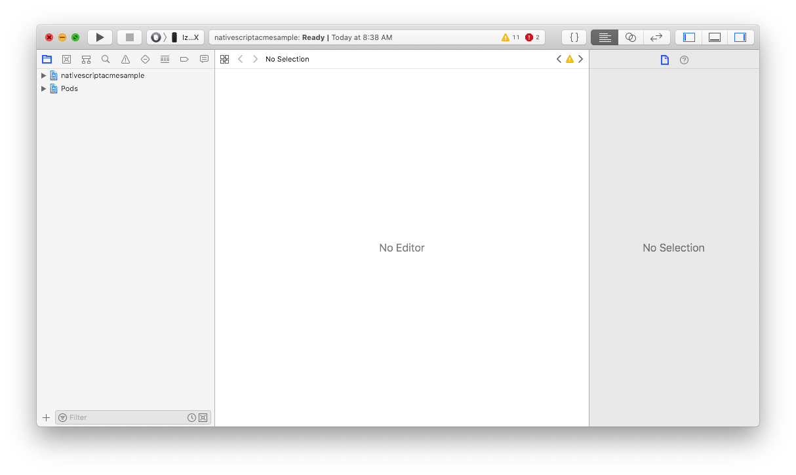

With Xcode open, go to the menu bar and select **File** --> **New** --> **Target...**, which brings up the dialog below.

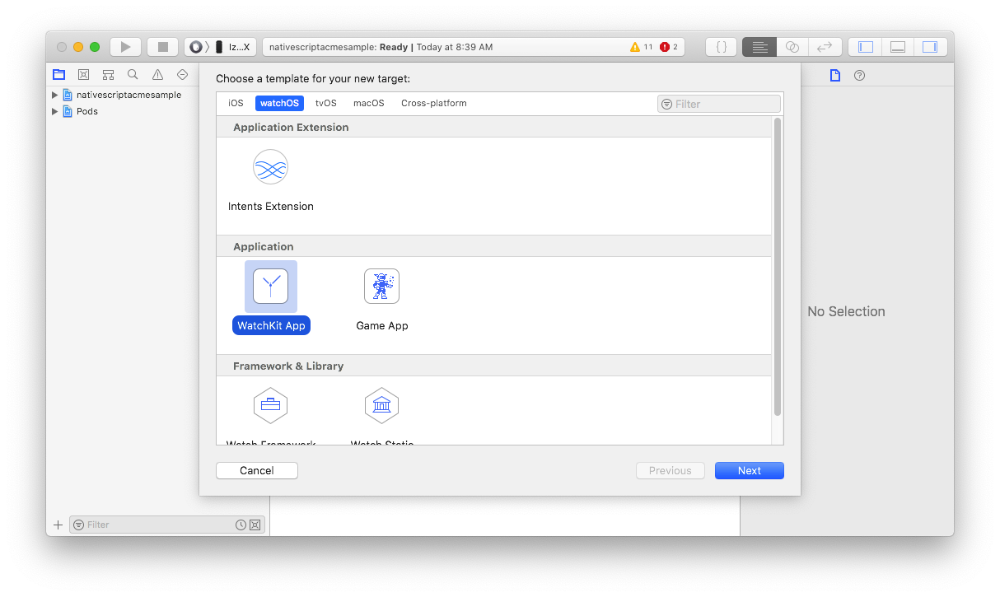

As the image above shows, switch to the **watchOS** tab and select the **WatchKit App** option. Click **Next**.

At the next screen, give your watch app a name (oftentimes it’s the same as your main app). Make sure to leave the language as **Objective-C**, as it’s the only language NativeScript currently supports for watchOS development. Click **Finish**.

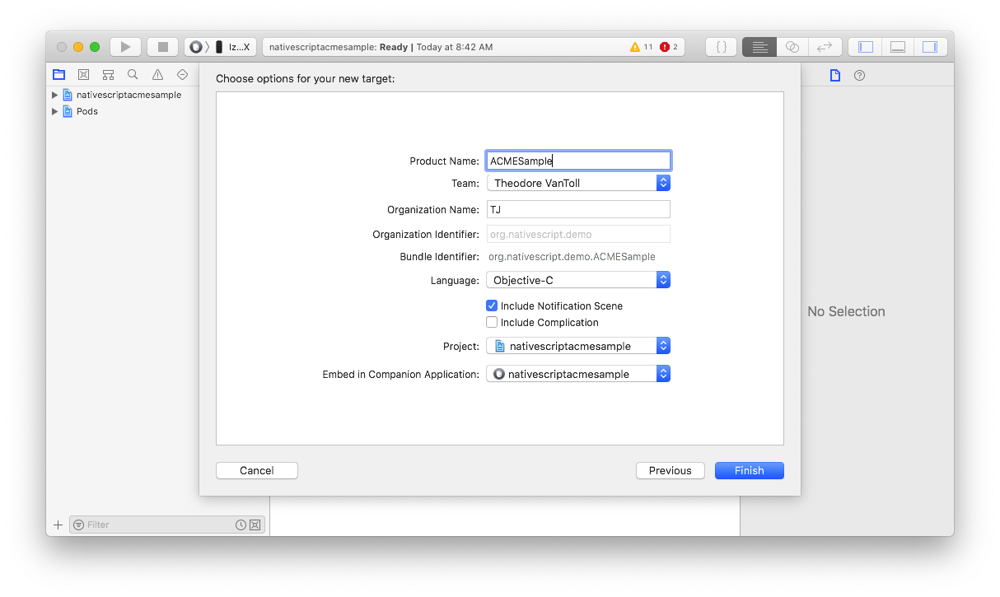

Xcode will ask you whether you want to activate a scheme for your new your app, which you’ll want to do because it’ll allow you to run your watchOS app, which we’ll do momentarily.

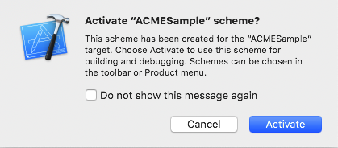

And at this point, although it’s not immediately obvious, you now have a simple watchOS ready for development.

## Building your watchOS app

Developing a watchOS companion app for your NativeScript is no different than building a watchOS app for a completely natively built iOS app. As such, any guides you find online for watchOS development will work just fine for NativeScript + watchOS development, with the one caveat that you currently have to develop your watchOS companion apps using Objective-C.

Here are a few resources you might find useful:

- []()
- []()
- []()

For this article we’ll create the world’s simplest watchOS app so you can try out the full development workflow.

To do so, start by expanding your new watch app in the sidebar on the left-hand side of Xcode, and then double clicking on the `Interface.storyboard` file. After you do so you should see the screen below.

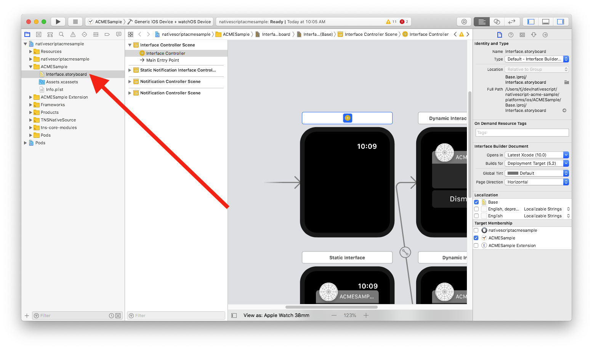

Storyboards is the mechanism Xcode provides for visual app development. There are many tutorials you can find online for learning about storyboards (here’s [one I like](https://www.raywenderlich.com/464-storyboards-tutorial-for-ios-part-1)), but for today’s purposes let’s just look at how to add a few visual components to your watch app’s main screen.

Start by finding the icon at the top of Xcode that looks like a square in a circle.

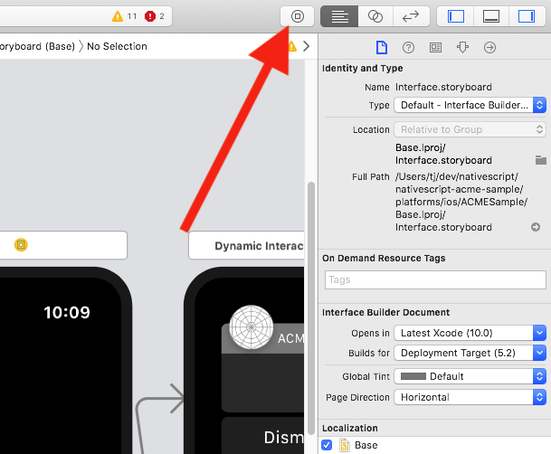

This button opens an object explorer that you can use to visually drag user-interface components into your watch app. To get an idea of how exactly this works, check out the gif below.

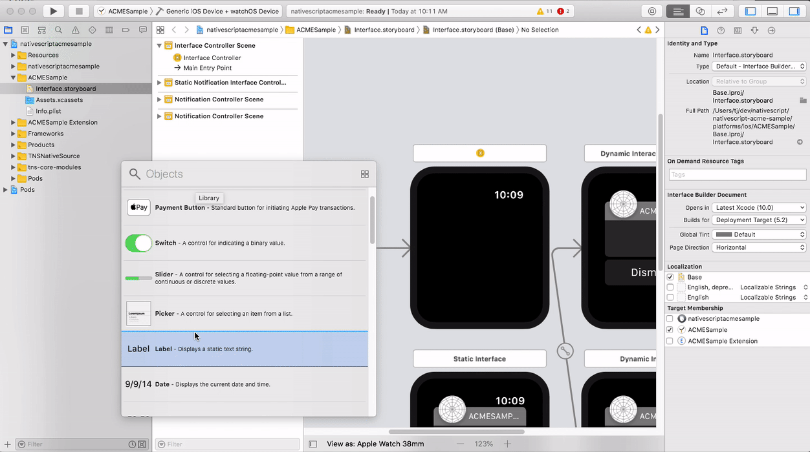

Go ahead and drag over a few UI components so you have something minimal that you can test out. When you’re ready, refer to the screenshot below to find out how to select and run your app on both an iOS and watchOS simulator.

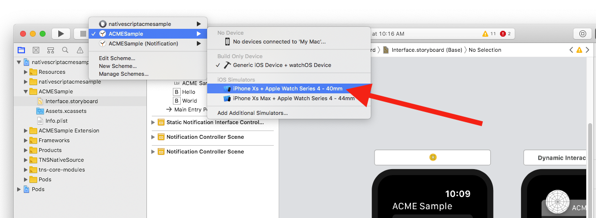

After you’ve selected the appropriate simulator combination, hit the play button in the top-left corner of Xcode to build and run your app. When the build completes, you should see your NativeScript-built iOS app along with your newly build watchOS companion app.


You’ve now created a watchOS app that you can test on a simulator. There’s one problem left to solve: currently, your watchOS app lives in your NativeScript app’s `platforms` folder. And as a NativeScript developer you might know that the `platforms` folder is generally considered generated code, and if you leave your watchOS app in your `platforms` folder it could easily get blown away in future builds.

Therefore your last step is to move your watchOS app to your NativeScript app’s `App_Resources` folder.

## Making your watchOS app work with NativeScript

The [NativeScript documentation on watchOS development](https://docs.nativescript.org/tooling/ios-watch-apps) has thorough steps on how to move your watchOS app from your `platforms/ios` folder to your `App_Resources/iOS` folder, so you should refer to that document for specifics, but I’ll offer a few quick tips here.

When you first open your `platforms/ios` folder you’ll find folders for your watch app and also what’s known as a watch extension.

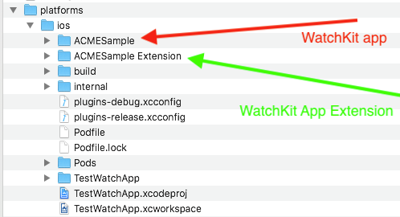

The watch app is where the UI for your app lives, such as your storyboards and assets, whereas the extension is where all the code for your watch app lives. For your purposes at the moment all you need to know is that you need both for your app to work.

> **TIP**: This [StackOverflow thread](https://stackoverflow.com/questions/52687924/ios-watchos-what-is-the-difference-between-watchkit-app-and-watchkit-app-exten) has more information on the difference between the two if you’re curious.

After you follow the NativeScript documentation for moving your files, which again is [here](https://docs.nativescript.org/tooling/ios-watch-apps), you’ll have a folder structure that looks like this.

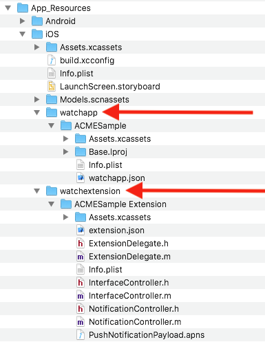

Note the new `watchapp` and `watchextension` folders, which are the locations you’ll want to copy and paste your watch app and extension from `platforms/ios`.

Note also the new `watchapp/<watch app name>/watchapp.json` and `watchextension/<watch extension name>/extension.json` files, which, at the time of this writing, should contain the following contents.

**`watchapp.json`**

```
{
    "assetcatalogCompilerAppiconName": "AppIcon",
    "targetBuildConfigurationProperties": {
        "WATCHOS_DEPLOYMENT_TARGET": 4.1,
        "LD": "\"\""
    }
}
```

**`extension.json`**

```
{
    "targetBuildConfigurationProperties": {
        "LD": "\"\""
    }
}
```

The cool thing is that once you setup this structure, you can continue to develop your watchOS app in Xcode, without having to do this setup again.

That is, you can open your `ios/platforms/<app name>.xcodeproj` (or `ios/platforms/<app name>.xcworkspace`) file, make changes to your watchOS app, and those changes will automatically be saved to your watch app in your `App_Resources` folder. There’s no need to copy and paste files around once you’ve completed the initial setup.

## What’s next?

If you followed through this article in its entirety you’ve now developed a complete watchOS app to compliment your NativeScript iOS app. I’ll end this article with a few reminders.

First, the [NativeScript ACME sample app on GitHub](https://github.com/ignaciofuentes/nativescript-acme-sample) has a fully functional watch app that you can refer to if you want to see a live project with this workflow in action.

Second, remember that watchOS support in NativeScript is in beta. As such, if you are interested in watchOS development we’d love to hear from you. Should we invest more time polishing this workflow and adding more documentation? Are there features you’d like to see that we don’t offer today? Let us know in the comments.