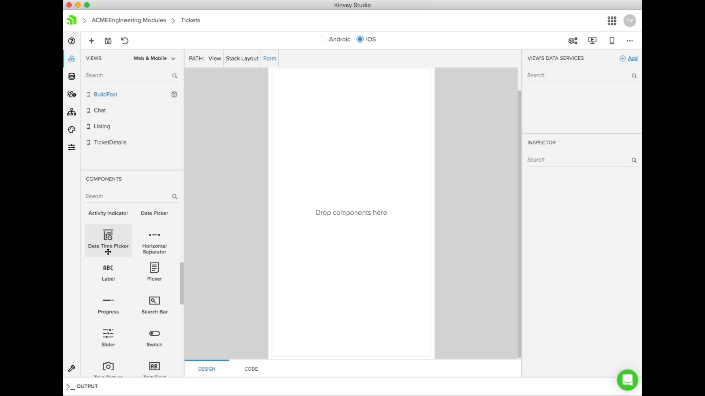
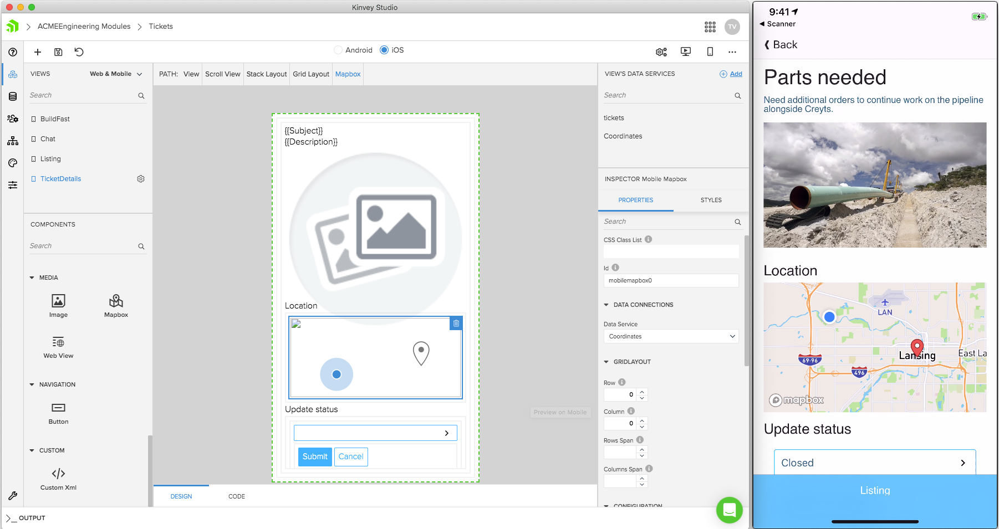
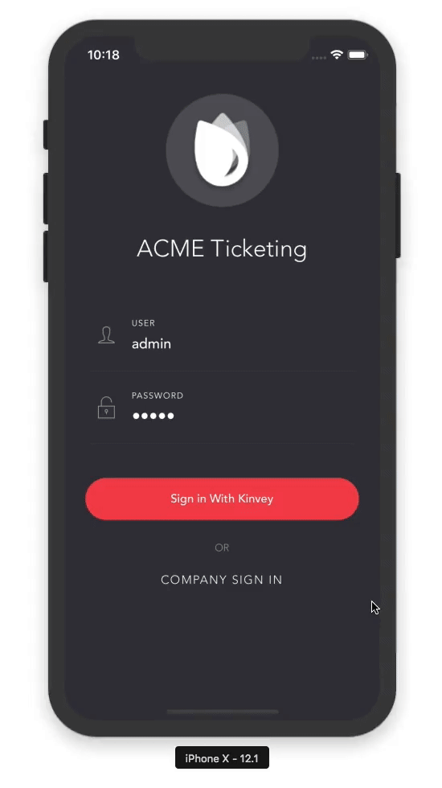
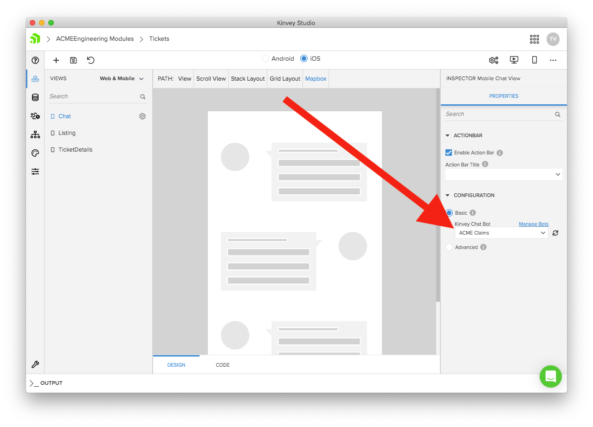
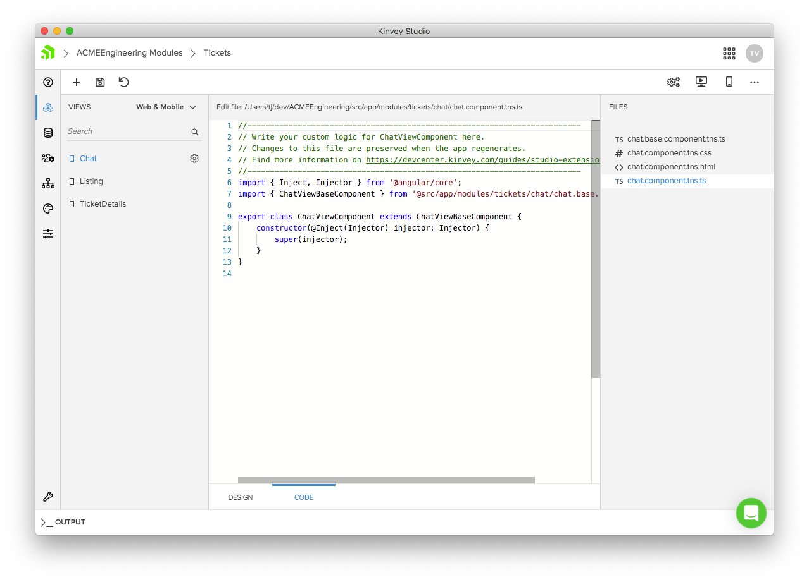
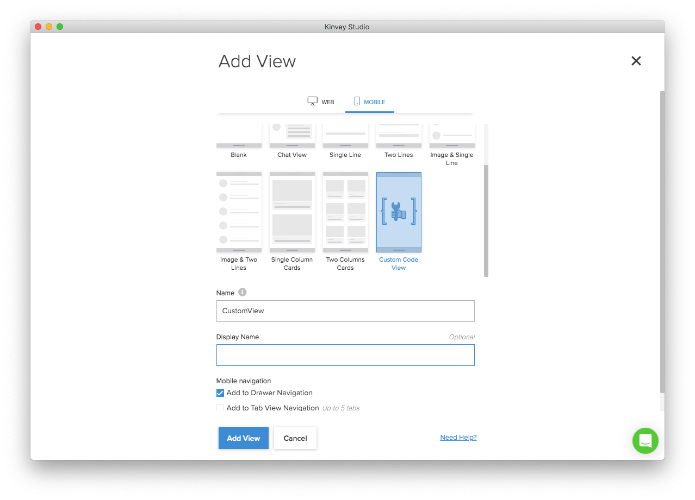

# Five Reasons NativeScript Developers Should Check Out Kinvey Studio

Earlier this March we unveiled [Kinvey Studio](https://www.progress.com/kinvey/studio), a low-code tool from Progress to help pro developers build apps fast.

It’s been a few months since we checked in with Studio, so let’s look at what’s new, and why you, as a NativeScript developer, should care about any of this.

> **TIP**: [Sign up for our Kinvey Studio webinar this Thursday](https://www.progress.com/campaigns/kinvey/low-code-real-world-webinar?utm_medium=social-owned&utm_source=nativescript-blog) for a guided tour of everything this article covers and more.

## Reason #1: Quick and easy scaffolding

Kinvey Studio allows you to visually build web and mobile apps. You can easily create views from a variety of templates, and then drag-and-drop UI controls to build up your interfaces quickly.

Under the hood, Studio uses NativeScript to drive the mobile apps you build, so Studio-built apps have the same performance you’d expect out of NativeScript-built iOS and Android apps.

New to Kinvey Studio is a Mapbox UI component, which lets you easily add powerful native maps to your Studio apps.

## Reason #2: Code sharing out of the box

In addition to helping you quickly build mobile apps, Kinvey Studio also allows you to build web apps from the same project.

Under the hood Studio uses [NativeScript and Angular’s official code-sharing approach](https://docs.nativescript.org/angular/code-sharing/intro), so you can rest assured you’re building apps on top of open standards.

If you’ve been thinking about getting started with code-sharing with NativeScript, Studio is a great place to start.

## Reason #3: Connect to existing data and auth systems

Everything in Kinvey Studio builds on top of the powerful [Kinvey platform](https://www.progress.com/kinvey). As such, you can easily tie into many of Kinvey’s best features, such as Kinvey’s data and identity connectors.

Does your company have data that lives in SQL Server, Salesforce, SAP, or Oracle? Do you need to use that data as part of a mobile app? If so, Kinvey makes it easy to [connect to that data](https://devcenter.kinvey.com/nativescript/guides/rapid-data) and use it to build mobile apps with Studio’s visual tooling.

Do you have an existing identity solution your organization already uses, like Active Directory? Kinvey can [connect to any identity provider that supports OAuth2, OpenID, or SAML](https://devcenter.kinvey.com/nativescript/guides/mobile-identity-connect), and once you make the connection, you can seamlessly integrate your existing authentication provider directly into Studio-built apps. The end result looks like this for Active Directory.

## Reason #4: Easily add chatbots to your apps

Another awesome feature of Kinvey is a [fully featured chatbot development platform](https://www.progress.com/kinvey/chat).

If you’ve been considering integrating a chatbot into your applications, Kinvey Chat is a great place to start, as it allows you to build bots that run the on the web, in mobile apps, and even places like Facebook Messenger.

New to Studio is a chat view, that allows you to connect to Kinvey Chat instances with a simple dropdown.

> **TIP**: Check out our new tutorial on [Kinvey Chat](https://www.progress.com/kinvey/chat/chatbot-tutorial-intro) if you want to learn how to build new chatbots from scratch.

## Reason #5: Build fast while maintaining control

Although Kinvey Studio is a visual tool, we wanted to ensure developers maintain the ability to extend Studio-built apps with custom code.

Studio builds app using open source and standard tools, such as TypeScript, Angular, and NativeScript for Studio-built native apps. In Studio we never hide your code, and there are plenty of extensibility points for you to extend your views with custom logic.

New in Studio is a Custom Code View, which you can use to build code-only views that work with Studio’s other visual tooling.

## Learn more

Overall, Studio gives professional developers a way to build fast, while preserving the ability to customize you apps to meet the real-world needs of your users and customers.

If you found this interesting and want to learn more, [sign up for our Kinvey Studio webinar this Thursday](https://www.progress.com/campaigns/kinvey/low-code-real-world-webinar?utm_medium=social-owned&utm_source=nativescript-blog), where we’ll cover everything in this article and more.