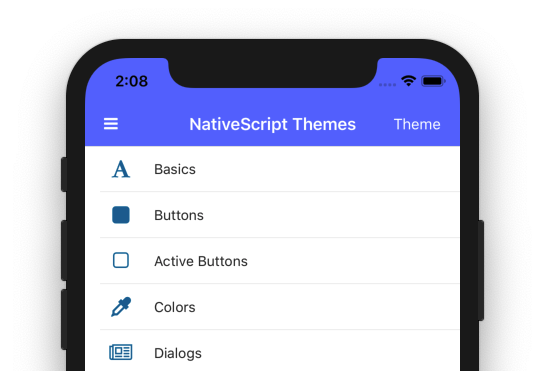

# An Early Look at the New NativeScript Core Theme

With the [NativeScript 6.0 release](https://www.nativescript.org/blog/announcing-nativescript-6.0---webpack-all-the-way-seamless-app-updates-new-core-theme-and-a-lot-more) we announced a new beta of the NativeScript core theme, which looks a little something like this.



In this article we’ll take a deeper look at the new theme, including what changed, and how to try out the new theme for yourself today. Let’s start by looking at how you can get up and running.

## Upgrading to the new theme

The new NativeScript theme is already on npm as version 2.x, and you can change any existing app to use the new theme by running the `tns plugin update` command.

```
tns plugin update nativescript-theme-core
```

> **NOTE**: Because the 2.0 theme is still in beta, all NativeScript app templates still use version 1.x of the theme by default. Therefore, if you start a new NativeScript app today you still need to run `tns plugin update` to try out the updated theme.

Next, add the following line of code to your JavaScript or TypeScript code. This will be your `app.js` or `app.ts` file if you’re using NativeScript Core or NativeScript-Vue apps, and your `main.ts` file if you’re using NativeScript Angular.

``` TypeScript
import "nativescript-theme-core";
```

This line of code adds the class names below to the root element of your app, and the theme utilizes these class names for styling purposes. You might also find these class names useful for your own custom styling.

* `ns-root`
* `ns-ios`: Present on iOS only
* `ns-android`: Present on Android only
* `ns-phone`: Present when your app runs on phones (and not tablets).
* `ns-tablet`: Present when your app runs on tablets (and not phones).
* `ns-os-dark`: Present when your user has an OS-level dark mode enabled on their device.
* `ns-os-light`: Present when your user does _not_ have an OS-level dark mode enabled on their device.

> **NOTE**: In the NativeScript 6.1 release the above class names [will be present by default in all apps](https://github.com/NativeScript/NativeScript/issues/7313), meaning, you will no longer need to explicitly add `import "nativescript-theme-core";` in your JavaScript or TypeScript code.

Finally, in your `app.css` file you need to update the syntax to include the theme’s CSS file. Find your current import which will look something like this.

```
@import '~nativescript-theme-core/css/<skin-name>.css';
```

And replace it with the following.

```
@import "~nativescript-theme-core/css/core.css";
@import "~nativescript-theme-core/css/blue.css";
```

> **NOTE**: If you use SASS your imports will instead be `@import "~nativescript-theme-core/core";` and `@import "~nativescript-theme-core/blue";`.

The second file (e.g. `blue.css`) determines your app’s color scheme. You must include a color scheme in order for the theme to work correctly, and you can choose between the following options: `aqua.css`, `blue.css`, `brown.css`, `forest.css`, `grey.css`, `lemon.css`, `lime.css`, `orange.css`, `purple.css`, `ruby.css`, or `sky.css`.

If you’re looking for a way to quickly experiment with your color options, the [NativeScript theme’s GitHub repo](https://github.com/nativescript/theme) contains a demo app that makes it easy to test out your choices. You can download and run this demo by executing the following commands in your terminal or command prompt.

```
git clone https://github.com/NativeScript/theme.git

cd theme

tns run android

-- or --

tns run ios
```

When the app is up and running, tap the “Theme” button in the top-right corner to experiment with different looks.


> **NOTE**: We’ll look at how to enable the material theme and dark mode you see in the gif above momentarily.

With these steps complete you should now have the new theme up and running, so let’s next look at the changes and new features you can try out.

## Plug and play

There’s one big update to the way the new core theme works, and I think it’s easiest to understand by looking at a bit of code first.

``` XML
<!-- Before -->
<Button text="My Button" class="btn"></Button>

<!-- After -->
<Button text="My Button"></Button>
```

Before, the NativeScript theme required you to explicitly provide a class name to enable the theme styling, for example the `btn` class name for `<Button>` components.

This is no longer necessary, and all NativeScript components get a base set of styles without any class names at all. For example, here’s what the default button looks like in a NativeScript app using the new theme and the blue color scheme.


A number of the other theme class names have been shortened to make them easier to use. For example, here’s a before and after of how to use the various NativeScript button class names.

``` XML
<!-- Before -->
<Button text="Normal Button" class="btn"></Button>
<Button text="Primary Button" class="btn btn-primary"></Button>
<Button text="Outline Button" class="btn btn-outline"></Button>
<Button text="Rounded Button" class="btn btn-primary btn-rounded-lg"></Button>
<Button text="Another Rounded Button" class="btn btn-outline btn-rounded-sm"></Button>

<!-- After -->
<Button text="Normal Button"></Button>
<Button text="Primary Button" class="-primary"></Button>
<Button text="Outline Button" class="-outline"></Button>
<Button text="Rounded Button" class="-primary -rounded-lg"></Button>
<Button text="Another Rounded Button" class="-outline -rounded-sm"></Button>
```

And here’s what those buttons look like in that same NativeScript app using the blue color scheme.


One super important note before we go further: **the NativeScript 2.0 theme provides full backwards compatibility with the 1.0 theme class names**. Therefore, you can update to the new theme without having to change all the class names throughout your apps.

That being said, you will likely need to make CSS changes in your app when updating to the new theme. For example, suppose you use this button in your app.

``` XML
<Button text="Confirm your choice"></Button>
```

Because this button does not use the `btn` class name, it was not styled with the NativeScript 1.0 theme, but it _will_ be styled as soon as you update to the NativeScript 2.0 theme; therefore, you might need to write some custom CSS to ensure these type of components continue to look correct in your updated app.

With this big change out of the way, let’s look at some of the cool new features the new theme offers.

## Dark mode

Twitter has a dark mode, iOS is getting a dark mode, and now your NativeScript app can have a dark mode too. The new NativeScript theme has a built-in dark mode that works for all color schemes.

For example, here’s what our simple button app looks like with the new theme’s dark mode applied.


Enabling this dark mode is as easy as adding a `ns-dark` class name to the root element of your NativeScript app. 

There are a few different elements that might be your root depending on how you built your app. For NativeScript-Angular apps your root element is usually your `<page-router-outlet>`, which usually lives in your `app.component.html` file.

``` XML
<page-router-outlet class="ns-dark"></page-router-outlet>
```

If your app uses a [drawer](https://docs.nativescript.org/ui/professional-ui-components/SideDrawer/getting-started), your root element will likely be a `<RadSideDrawer>`.

``` XML
<RadSideDrawer class="ns-dark">
    ...
</RadSideDrawer>
```

And finally, if your app does _not_ use a drawer, and does _not_ use Angular, you’ll likely need to apply the `ns-dark` class name to a `<Frame>`.

``` XML
<Frame class="ns-dark"></Frame>
```

Regardless, once you apply the `ns-dark` class name your app should instantly change to display using a dark set of colors, regardless of the color scheme you’re using.

There is additionally a JavaScript / TypeScript API for programmatically switching your app from dark mode to light mode, in case you want to provide dark mode as an option for your users to toggle.

``` TypeScript
import Theme from "nativescript-theme-core";

Theme.setMode(Theme.Dark); // Or Theme.Light
```

Here’s what that API looks like in action in our sample app.


> **TIP**: You can [detect whether the user has dark mode enabled on their iOS device](https://github.com/EddyVerbruggen/nativescript-dark-mode), and conditionally apply a dark mode in your app based on the user’s global iOS preference. Pretty cool, huh?

Now that you know how to use the new theme and how to try out dark mode, let’s look at one last cool feature of the new theme—the ability to use the Kendo UI ThemeBuilder.

## Creating themes with Kendo UI ThemeBuilder

[Kendo UI ThemeBuilder](https://themebuilder.telerik.com/kendo-ui) is a tool for visually creating themes.


Historically the tool was used only for web apps, but now you can use the same tool to configure color schemes for your NativeScript apps as well.

To try it out, [visit the tool](https://themebuilder.telerik.com/kendo-ui), select **Start Theming**, select a base theme (**Material** is a good starting point for mobile apps), and click the **Create** button.


Feel free to play with the theme colors if you’d like, and then click the **DOWNLOAD** button in the top-right corner, which will give you a `.zip` bundle with two files, an `app.css` file you can use on the web if you’d like, and a `variables.scss` file you’ll need for using the color scheme with NativeScript.


One important note before we continue: to use ThemeBuilder-built color schemes in NativeScript you must use SASS in your NativeScript apps, as ThemeBuilder outputs SASS variables, which the new NativeScript theme consumes.

The good news is that SASS is really easy to use in NativeScript. In fact, as of NativeScript 6.0, SASS support is built into all new apps by default, and all you need to do is create an `app.scss` file in the same folder as your `app.css` file to get started.

Once you’ve configured your theme in ThemeBuilder, downloaded the appropriate file, and created an `app.scss` file for your app, open your `app.scss` file and paste in the contents of your downloaded `variables.scss` file. Your `app.scss` file should look like this.

``` SCSS
/* Contents of variables.scss */

@import "~nativescript-theme-core/index";

/* Your custom CSS */
```

For example here’s what the default Material theme looks like.

``` SCSS
$base-theme:Material;
$skin-name:material;
$swatch-name:Material;
$border-radius: 2px;
$primary-palette-name: indigo;
$secondary-palette-name: pink;
$theme-type: light;

@import "~nativescript-theme-core/index";
```

And... that’s it! Just by plugging in those variables you’ll have an app that uses your ThemeBuilder-configured theme. For example here’s what the ThemeBuilder Material color scheme looks like for our sample button app.


Feel free to experiment with Kendo UI ThemeBuilder to create the perfect theme for your own apps.

## Next steps

The new NativeScript theme provides a new look, as well as a number of new features you can leverage in your apps, such as a dark mode and the ability to use Kendo UI ThemeBuilder to build custom themes.

The new theme is in beta, and as such we’d love to have your feedback. What do think about the updates to the theme class names? Does dark mode seem like something you’ll use? Does everything work like you expect? Do you like using Kendo UI ThemeBuilder?

Let us know in the comments, and if you find any issues when testing the theme, [create an issue on GitHub](https://github.com/nativescript/theme/issues) so we can address it before the theme’s final release.
