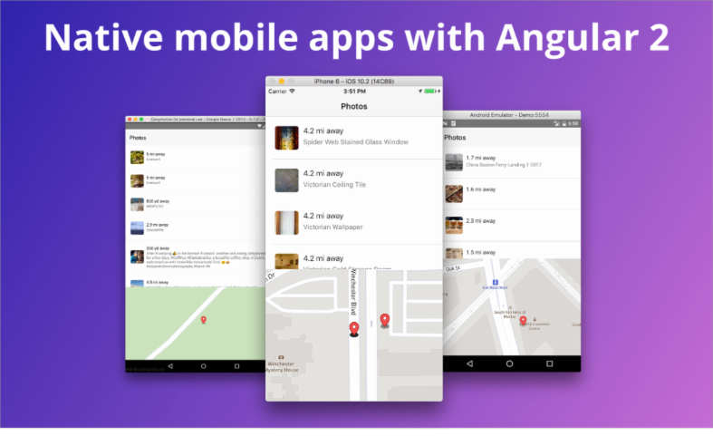

# NativeScript is in ng-book 2!

Today we’re happy to announce that a chapter on NativeScript is now available as part of the popular [ng-book 2](https://www.ng-book.com/2/).

## What is ng-book 2?

ng-book 2 describes itself an in-depth, complete, and up-to-date book on Angular 2. And it really is. The book teaches Angular from the ground up, including thorough tutorials on TypeScript, components, routers, RxJS, Redux, and a whole lot more.

Furthermore the book has done a really amazing job keeping up with Angular releases, and is committed to continue doing so into the future. When’s the last time you saw a book with a [changelog](https://www.ng-book.com/2/p/Changelog/)?

## What can I find on NativeScript in the book?

New to the book is a new chapter by our own Telerik Developer Expert [Nic Raboy](https://twitter.com/nraboy). In the chapter you will:

* build both an iOS and an Android app using the same code
* build an Angular 2 app with TypeScript
* get comfortable with the NativeScript APIs
* integrate native APIs with your application, like GPS
* connect to an external API (Flickr)
* integrate a OpenGL-based map (MapBox)
* build a multi-page app with stack-based navigation
* and more!

## How can I get a copy?

You can purchase ng-book 2 at [ng-book.com/2](https://www.ng-book.com/2/). You can download the first chapter for free to get a taste of what the book is like.