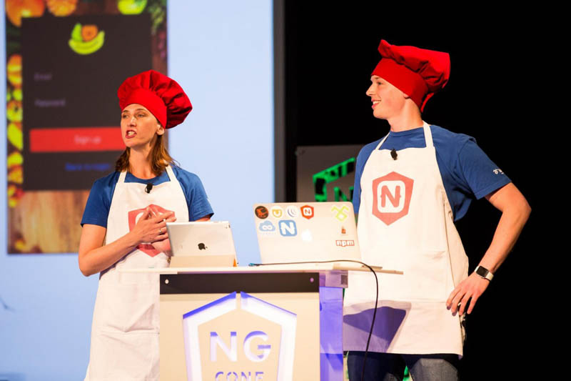
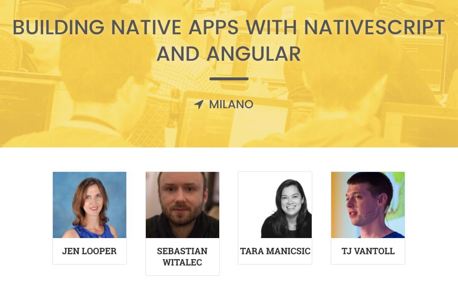
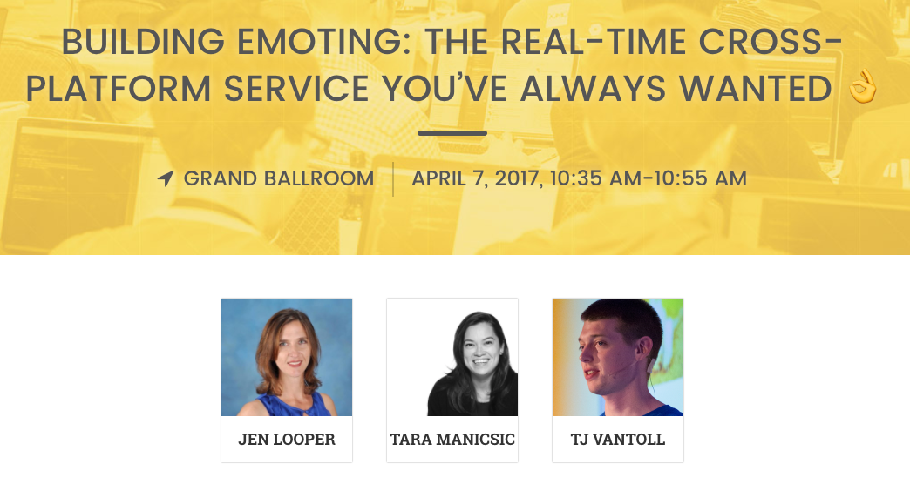

# NativeScript at ng-conf

Last year the NativeScript team took [ng-conf](https://www.ng-conf.org/) by storm. This year we’re back with more—more workshops, more sessions, and more questionable outfit choices.

Here’s a full list of the things you can expect from us at ng-conf 2017.

## Workshop 🔧

Want to learn NativeScript? On April 4th, one day before the main ng-conf event, Jen Looper, Sebastian Witalec, Tara Manicsic, and I will be giving a [full-day workshop on NativeScript & Angular](https://www.ng-conf.org/sessions/building-native-apps-nativescript-angular-2/). You’ll learn NativeScript from the ground up, and get up to speed on everything you need to build performant iOS and Android apps for your clients or users. Register today using the link below.

[Sign up for the NativeScript & Angular workshop at ng-conf.](https://www.ng-conf.org/sessions/building-native-apps-nativescript-angular-2/)

## Robots 🤖

Do you like robots? Great! On April 6th, day two of ng-conf, Sebastian Witalec will be demonstrating how to build a robot army with NativeScript. The session is a great way to get up to speed on using bluetooth on the web and in NativeScript apps, so don’t miss it.

 

[Learn more about Sebastian’s robot session](https://www.ng-conf.org/sessions/building-roboarmy-angular/)

## Emoji 😎

What could be better than robots? Emoji!

On April 7th, day three of ng-conf, Jen Looper, Tara Manicsic, and I will be demonstrating how to create a real-time cross-platform emoji service. We’ll be showing off how to use Angular in Kendo UI, how to build robust charts and graphs, and how to use Firebase to make everything update in real-time.

Plus, we promised costumes for this one, so you won’t want to miss that.

_Side note Shout out to the ng-conf team for preserving the emoji in our session title and URL._

[Learn more about the NativeScript emoji session](https://www.ng-conf.org/sessions/building-emoting-real-time-cross-platform-service-youve-always-wanted-%F0%9F%91%8C/)

## Booth 🎉

We’re going to have a booth at ng-conf again this year, and if last year is any indication out booth is a pretty hip place to be.

We’re still working on the details, but you can expect swag and a lot more.

## Meet us 👋

And finally, a number of us from the NativeScript team will be at the event, so feel free to stop by and chat. We’d love to chat about NativeScript, Angular, or whatever.

We’ll see you there!

