# How I Won a Dancing World Championship That One Time

I’m not usually a New Year’s Resolution kind-of guy, but this year I decided to make one: to write more, and to specifically write about random things more—not just tech stuff.

With that context in mind, I figured I might as well start with the best story I have to tell: how I—seriously—won a dancing world championship. See, here’s a totally-not-embarrassing picture of me with the a big trophy from 2006.

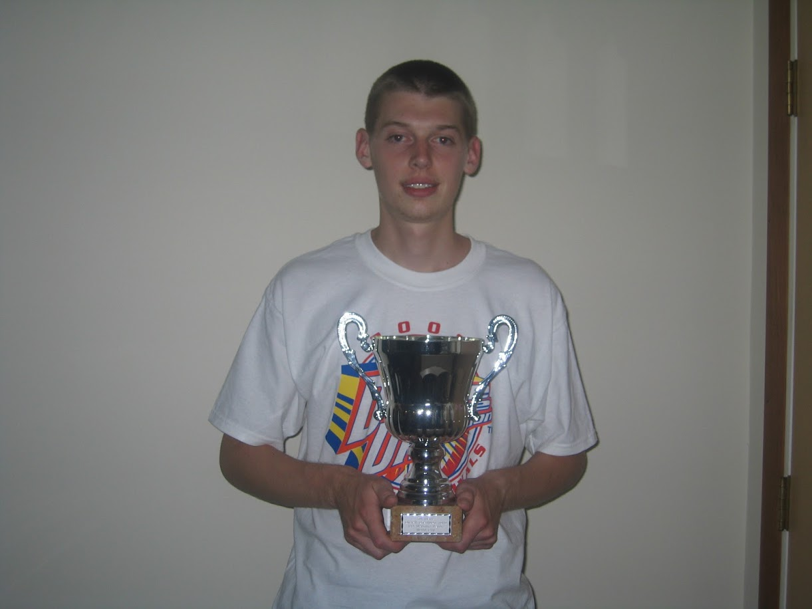

There’s a catch though. If your brain immediately envisioned me dancing something like the tango, thank you for your inflated opinion of my abilities, but you’re unfortunately way off base.

No, instead, think dancing, but, think of the nerdiest way to do dancing. Like, really, really nerdy. The dancing I’m talking about is Dance Dance Revolution, and in 2006, I won the “Overall Champion” of the “IDO Machine Dance World Cup” held in Oslo, Norway.

This is a serious thing that happened in reality, and this blog is my way-too-detailed story of how things went down.

## The game

Growing up in southeastern Michigan, we made a yearly pilgrimage to [Cedar Point](https://www.cedarpoint.com/), the roller coaster capital of the world.

Cedar Point is best known for their coasters, but they also have an enormous arcade, and sometime in the early 2000s they got a big new game cabinet that they put right at the front: Dance Dance Revolution.

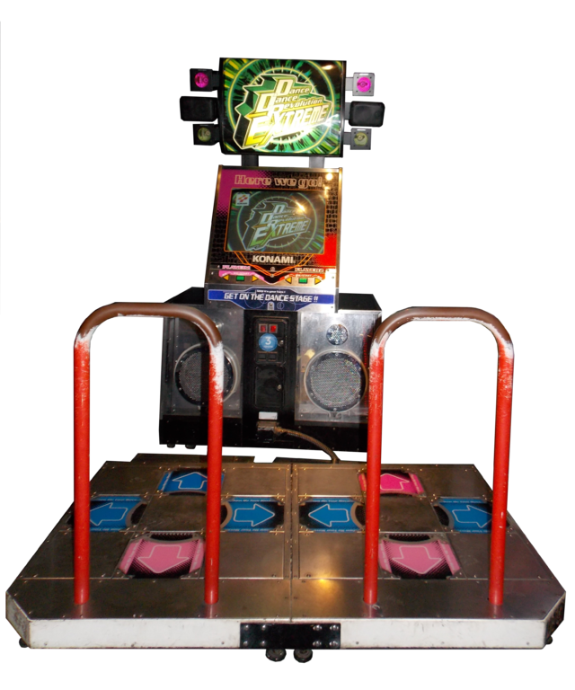

Dance Dance Revolution, or DDR, requires you to hit the arrows on the floor in time with arrows that appear on the screen, all to the rhythm on music playing from the arcade cabinet.

I was transfixed.

The game merged essentially my primary interests at the time: video games, sports (as you’ll see it’s a fairly athletic game), and Japanese culture.

My brother and sister also loved the game, and shortly after the Cedar Point, we got the home version that came with a pads you could plug in as a PlayStation controllers.

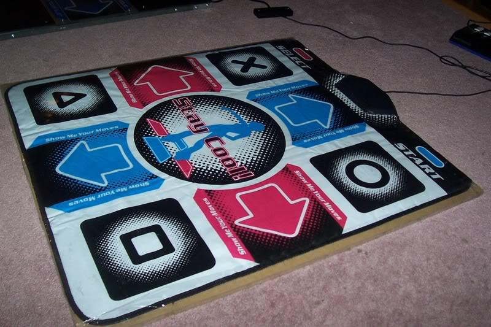

We spent months playing on those pads until we were able to clear the hardest songs in the game, but we slowly started to figure something out: if you want to play Dance Dance Revolution seriously, you really can’t do so on home pads.

Home pads don’t grip the floor, they have sensors that don’t stand up to heavy gameplay, and they don’t offer the player any feedback on whether your foot hit an arrow or missed, as the entire pad feels the same.

Playing on a full-blown arcade machine was the only way to further my obsession, and luckily for me arcades were still a thing in the early 2000s.

## The Malls and tournaments

The closest DDR machine to my house was at an American Fun Center in the Westland Mall, and I spent an absurd amount of time and money there. When I started college shortly thereafter at Central Michigan University, I had two convenient DDR options: one at the Malt Shop right on campus, and another in Soaring Eagle Casino, which unexpectedly had a really nice arcade with two DDR machines.

The thing that took me from a casual player to obsessive was the first time I heard that DDR tournaments were a thing. As I would soon find out, the game was popular enough for there to be a competitive scene, mostly online through community leaderboards, but occasionally through in-person tournaments at arcades throughout the world.

Throughout 2004 and 2005 I remember competing in a variety of random tournaments, mostly throughout Michigan, but occasionally out of state as well. Unfortunately I don’t have a ton of pictures of these tournaments, but here’s a few that survived so you can get a sense of what the atmosphere was like.

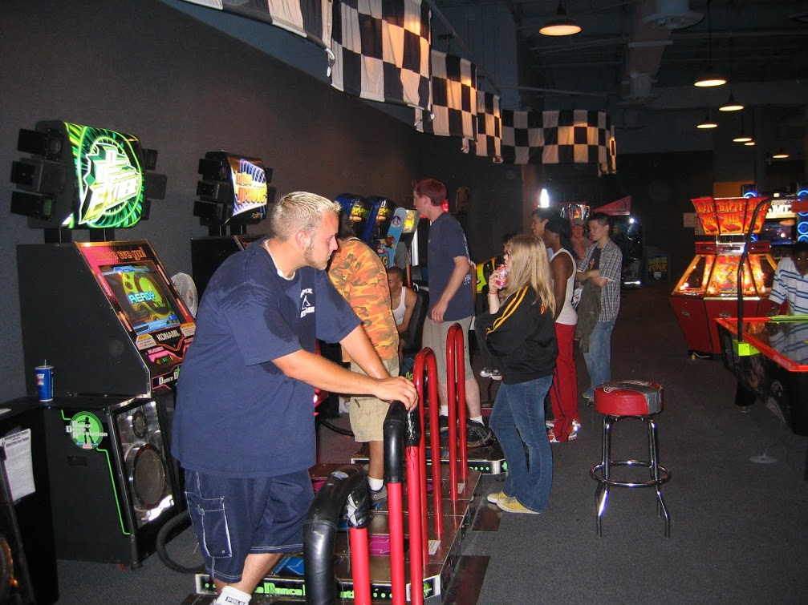
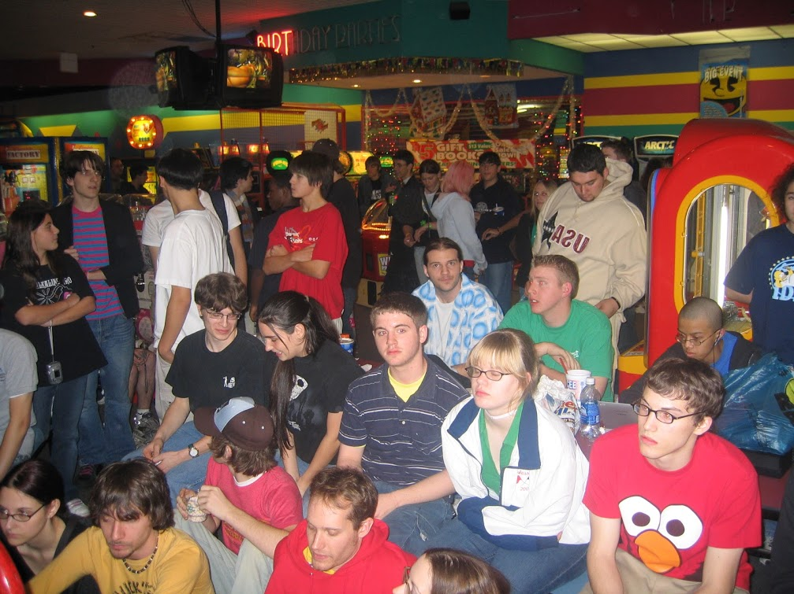

I got hooked on trying to win these tournaments and up my ranking on online leaderboards. I also realized something: I had a competitive advantage, as I had been an athlete all my life, and most of the DDR community had not. And when you get to the harder songs the game offers, those years of playing baseball, basketball, tennis, and cross country started to pay off.

I started to win local tournaments and being competitive at a national level. And that’s about the time In the Groove shook up the machine-dancing world.

## In the Groove

Dance Dance Revolution is a Konami game made in Japan. The company sold arcade cabinets to malls and arcades around the world, but they didn’t do anything to try to build a competitive scene for the game. All the tournaments and leaderboards were community-run, and Konami never stepped in to try to support the community efforts.

Furthermore, Konami had let DDR languish. Dance Dance Revolution Extreme, the most popular title of the time, debuted in late 2002, and years later had received no updates. Meanwhile, competitive players had achieved perfect scores on nearly every song in the game, and were looking for more.

In late 2004, Roxor Games stepped in with In the Groove, a new take on DDR that used the same basic concept, but gave dedicated players a lot of what Konami’s games lacked.

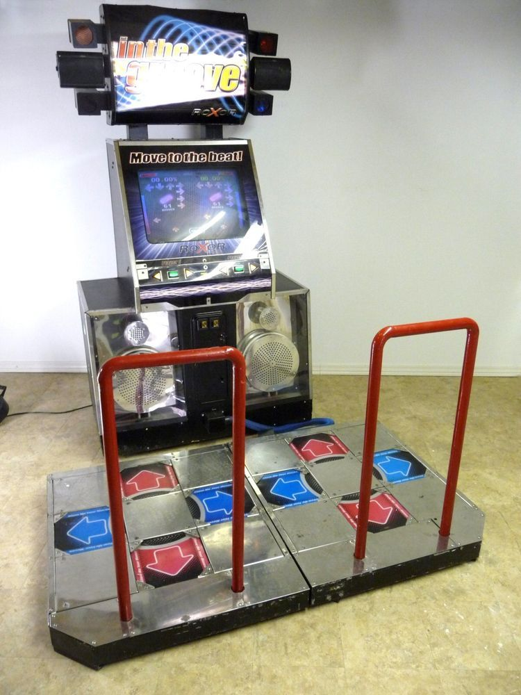

First and foremost, In the Groove delivered fresh music, new gameplay modes, and harder songs, all of which reinvigorated a community that was getting bored with the same DDR game they had been playing for years.

Around this time I also got a digital camera that could take decent video, so I’ll start to embed the ones I have in this article as they make sense. Here’s one I have of my sister and me playing an In The Groove song named Queen of Light in 2005, that shows off some of the new gameplay, such as needing to use your hands to hit arrows.

<iframe width="560" height="315" src="https://www.youtube.com/embed/Ch6AKCbxYCU" frameborder="0" allow="accelerometer; autoplay; encrypted-media; gyroscope; picture-in-picture" allowfullscreen></iframe>

Roxor did something that was more important than just building a better game though: they spent a lot of time and effort trying a relationship with the community that Konami had ignored. And the reason this is a big deal for my story is that 

And this included officially-sanctioned worldwide competitions. ~20-year-old me was ecstatic, and I, and most of the dancing-game community, started playing In The Groove exclusively.

## In The Groove tournaments

The team at Roxor announced a tournament series that would start in 2005 and culminate with a world championship sometime in 2006. The first step towards the championship were a series of regional finals, in which you had to finish in the top handful of positions to qualify for a US-wide tournament in Vegas.

The closest regionals to me were in Chicago, and in November of 2005 I took third place to qualify for the Vegas tournament. Here’s a video of a match I won.

<iframe width="560" height="315" src="https://www.youtube.com/embed/7pfAhyhAHVc" frameborder="0" allow="accelerometer; autoplay; encrypted-media; gyroscope; picture-in-picture" allowfullscreen></iframe>

I remember the Vegas tournament being a big deal to me because it was, at that time, the farthest from home I had ever been. It was only my second time on an airplane, and the first place outside of the midwest that I traveled to by myself.

The tournament itself was held in the Adventure Dome in Circus Circus, which turned out to be a decent venue as there was a lot of space for the large crowd. Unfortunately again I’m short on high-quality pictures with my early-2000s-era camera, but hopefully this gives you an idea of the atmosphere.

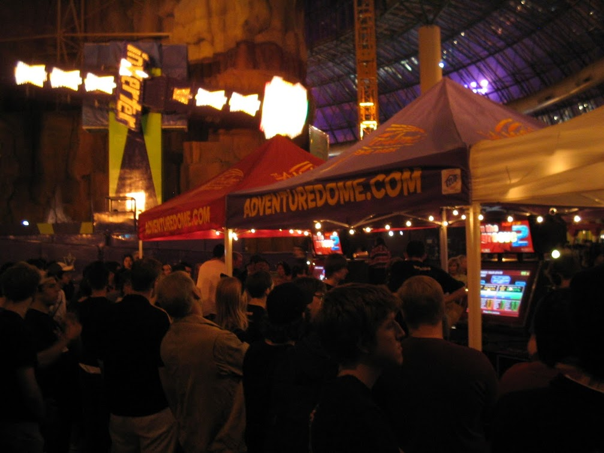

The prizes were by far the largest of any dancing tournament to date. The top 3 competitors won a trip to Norway for next year’s world championship tournament, and the top prize won an In The Groove 2 arcade cabinet, which retailed for about $10,000 USD at the time.

Going into the tournament I was ranked somewhere around 10th in the US, so I knew my chances of winning were slim to none, but I was hoping I could luck my way into the top 3, as a trip to Norway sounded incredible.

The biggest thing I remember about the tournament itself is that it took forever, as it was a double-elimination format with something like 50+ players, and only two machines to do the matches on. I took a picture of the final bracket at the end, and if you look closely you can see “TJ” being eliminated in the bottom-left corner.

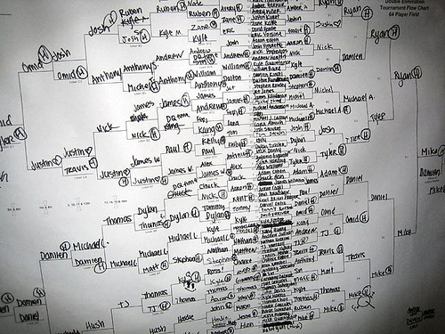

I finished in 12th place, which, while disappointing, was about where I was supposed to finish so I left happy enough. Good enough that I was interviewed by the Detroit News, leading to a story that I still have framed on my wall today.

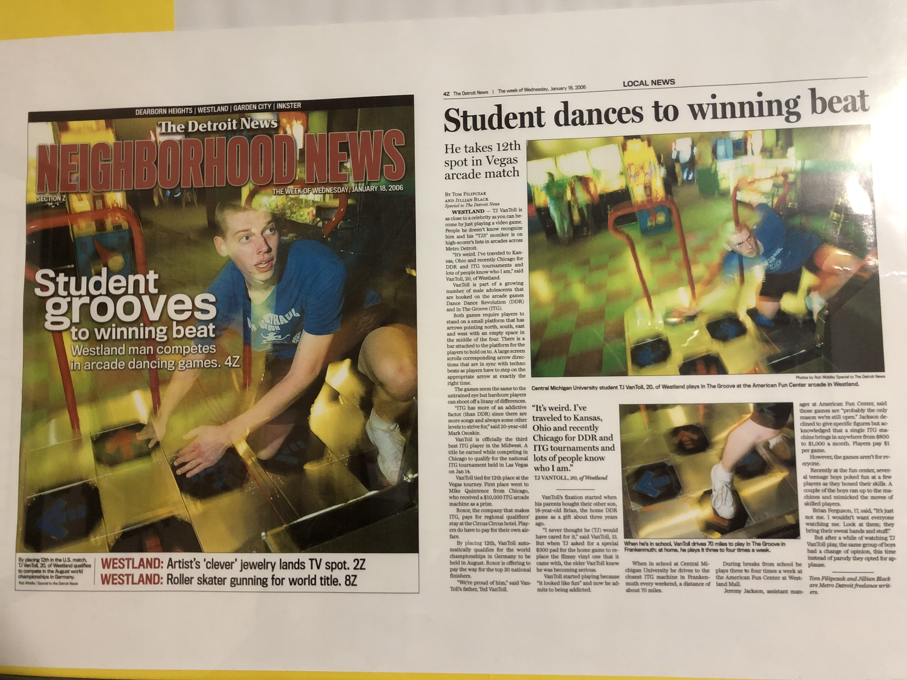

At the end of Vegas tournament though I got a surprise: Roxor announced that they were holding another world-championship tournament in early 2006, but this time the tournament would be held for doubles.

## Doubles

When you start a game in DDR or In the Groove (ITG), the very first thing the game will ask you is where you want to play in single mode or double mode. Single mode is played on four arrows, whereas double mode uses all eight arrows on the machine. The overwhelming majority of players played singles, but doubles had a niche following as it offered a slightly different way to play the game.

In 2005, when In the Groove was first growing in popularity, I started learning doubles out of boredom. At college I didn’t have a local In the Groove machine, and I had become bored playing the same DDR Extreme songs I had been playing for years. I quickly learned that doubles is a unique challenge, and although some of your skill transfers from singles, becoming good at doubles requires a solid time investment. Here’s a video of me playing a some called Temple of Boom so you can have a mental picture of what playing doubles looks like.

<iframe width="560" height="315" src="https://www.youtube.com/embed/DZp7AVDEh1E" frameborder="0" allow="accelerometer; autoplay; encrypted-media; gyroscope; picture-in-picture" allowfullscreen></iframe>

I quickly discovered that I was pretty good at doubles, somewhat because it fit my play style, and also somewhat because I had an unfair advantage on some songs because I’m 6‘2”, and thus just larger than most of my competitors.

Whereas I was ranked somewhere around 10th in the country in singles, in doubles I rose to be the top-ranked doubles player. But although this sounds good to say, it didn’t mean a whole lot competitively, as I had never heard of a doubles competition ever happening.

This is why Roxor announcing a doubles competition in 2006 was an enormous deal to me: I actually had a tournament I could win.

## How to get to Austin?

The specifics ended up being a doubles tournament held in Austin, TX in March of 2016. For me this was great minus one big problem: I was a broke college kid with very little money.

I was able to get to Vegas because Vegas flights are relatively cheap, and because I was able to split a room with several of my friends that were also competing. Austin flights were more expensive, and I had no one to share a room with as my friends didn’t play doubles, and therefore weren’t making the trip.

This is when one of the most random things happened in my life, and to tell this story I have to give you a bit of background. I mentioned earlier that I had no place at school to play In The Groove. And while this is true, I did have one option: driving 75 minutes to Frankenmuth, MI, where the Bavarian Inn Lodge had an amazing arcade with a brand new In The Groove arcade cabinet.

I started making a weekly trip to Frankenmuth with a friend to get in as much In The Groove as I possibly could. At some point I got to know the manager there, who probably couldn’t help but be intrigued by a sweaty kid showing up to play the same game for hours at a time.

One big thing the manager did for me was change a setting that made doubles mode cost the same as singles. Normally doubles costs, well, double—which makes sense if you think about it, as you are taking up both pads when you play a game. The fact that doubles costs more is one big reason so few people played in doubles mode.

The next thing this guy did for me really surprised me though. After explaining the tournament in Austin to him, he offered to have the arcade sponsor my trip down there to compete. All I had to do was wear their shirts during the tournament, and they pay my way there and back.

From a financial perspective this makes zero sense for them—what does a random arcade in Michigan have to gain from me wearing their shirt for a not-especially-important tournament in Texas?—so I can only assume this guy was doing this as a massive favor, and for that I’m eternally grateful.

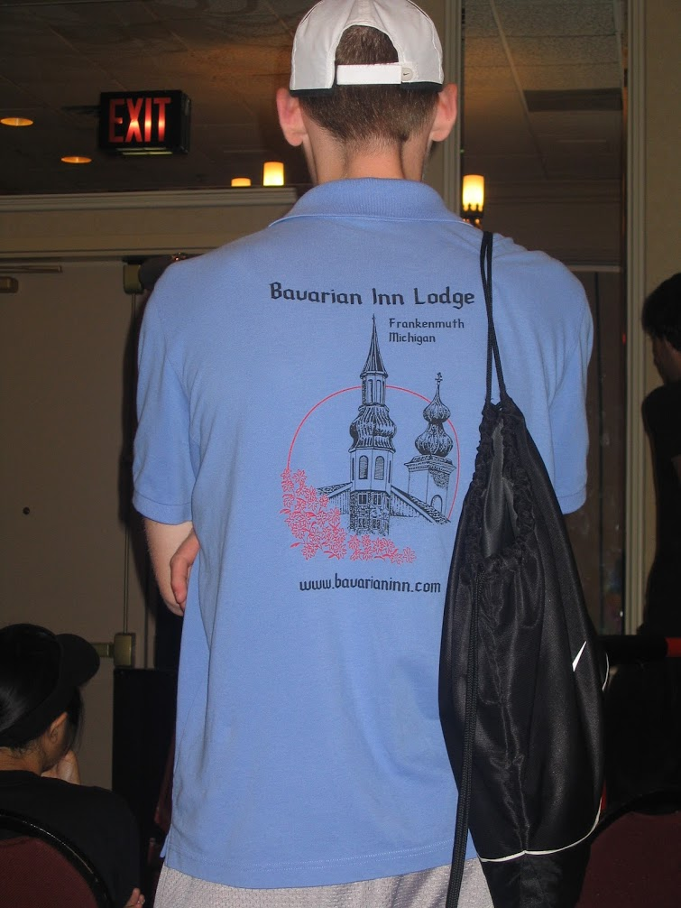

## Austin

I travelled to Austin in March of 2016 and I won doubles national tournament pretty easily. The win wasn’t so much because of my skill, but because doubles wasn’t super popular and some of the people that might’ve been able to beat me didn’t make the trip.

I have a few videos and pictures from the event itself. Here’s one that’s from the semifinals.

<iframe width="560" height="315" src="https://www.youtube.com/embed/V3i285MIcMM" frameborder="0" allow="accelerometer; autoplay; encrypted-media; gyroscope; picture-in-picture" allowfullscreen></iframe>

And here’s a picture of me in front of the bracket, wearing the shirt I was sponsored to wear.

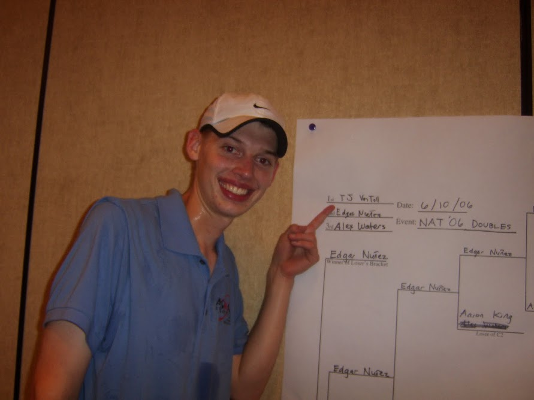

As a prize I had the choice between $1,000 cash and a trip to the world championship in Norway, and I accepted the trip immediately.

## Norway

In August 2016, I boarded a plane in Detroit to travel to Oslo, Norway, on what would be the first time I traveled outside the United States in my life. (Technically I had been to Canada, but in Michigan we don’t really count that.)

When I arrived in Oslo