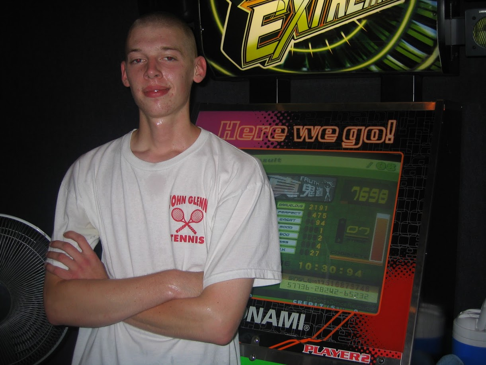

# How I Won a Dancing World Championship That One Time

I mean look, I’m as surprised as anyone to see the words “I” and “Dancing World Champ” appear in the same sentence, but this story is 100% true. See, here’s a totally-not-embarrassing picture of me with the a big trophy in 2006.

There’s a catch though. If your brain immediately envisioned me dancing something like the tango—thank you for your inflated opinion of my abilities, but you’re unfortunately way off base.

No, instead, think dancing—but, think of the nerdiest way to do dancing. Like, really, really nerdy. This picture of me at an arcade in 2004 will either help you or confuse you way more.

Ok, I’ll tell you. The game was Dance Dance Revolution (also In the Groove, but more on that later), and in 2006 I won the “Overall Champion” of the “IDO Machine Dance World Cup” held in Oslo, Norway.

This is a serious thing that happened in reality, and I feel like I’m legally required to tell you the story behind all of this.

## The game

Growing up, the majority of our summer vacations were a trip to [Cedar Point](https://www.cedarpoint.com/) in Ohio in the US. It’s an amazing theme park that’s 100% worth a trip if you’re a serious roller-coaster fan.

Cedar Point is best known for their coasters, but they also have an enormous arcade, and sometime in the early 2000s they got a big new game cabinet that they put right at the front: Dance Dance Revolution.

Dance Dance Revolution, or DDR, requires you to hit the arrows on the floor in time with arrows that appear on the screen, all to the rhythm on music playing from the arcade cabinet. If you don’t totally understand don’t worry, as I have a bunch of videos of me playing that I’ll share later.

I was transfixed.