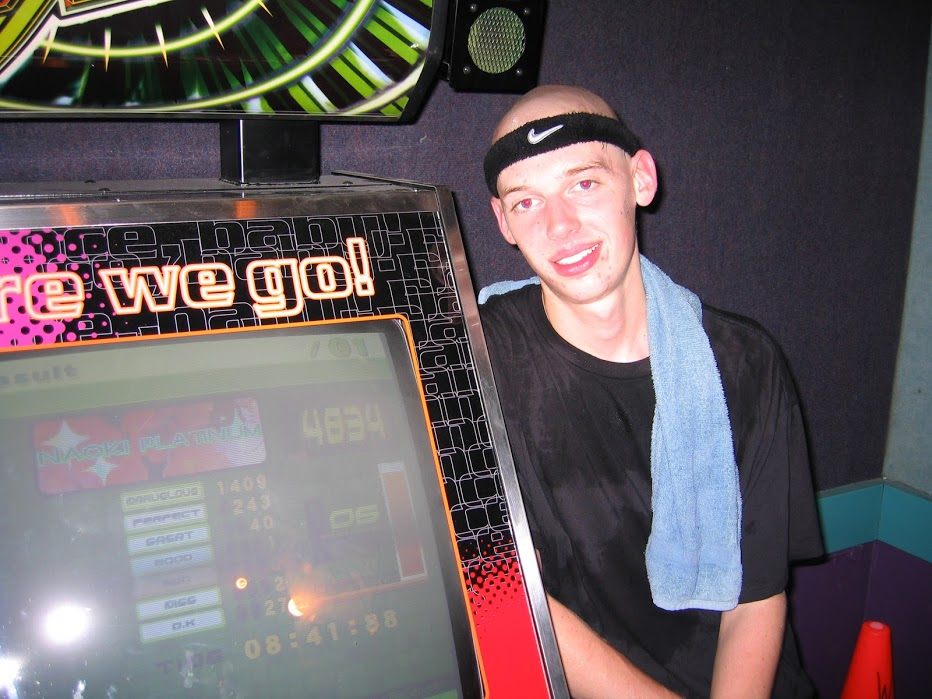

# On Following Your Passion

I’m not normally a New Year’s resolution kind of guy, but this year I decided to make one: to write more, and to write about random things that spark my interest.

Today I’m going to tell you a bit about my life, because this is my blog and I can do whatever I want. Specifically I want to talk about this tweet that randomly hit my Twitter timeline this weekend.

<blockquote class="twitter-tweet">
Video games are the absolute worst Loser Habit you could have   Hours &amp; hours spent on an ultimately useless skill   Sitting and getting fatter and weaker and skinnier and paler   Completely impaired social skills   Video games make you a bottom tier subhuman
&mdash; Alexander J.A Cortes (@AJA_Cortes) <a href="https://twitter.com/AJA_Cortes/status/1174658605561372672?ref_src=twsrc%5Etfw">September 19, 2019</a></blockquote> 

It’s not hard to refute this designed-to-be-controversial argument, but I’m going to do it anyways using my life experience. And I’m going to attempt to make a broader point: that you should follow your passions in life, not matter how nerdy or weird those passions might be.

And speaking of nerdy and weird, let’s talk about my life.

## Dance Dance Revolution

Our story starts in 2004. I was in college; I had decided that shaving my head was cool, that headbands were a thing, and that Dance Dance Revolution was life.

Here’s a definitely-not-embarrassing picture of me to prove my point.

_4834 was a really good score people. Also, red eyes in photos were still an unsolved problem._

If you’re not familiar with Dance Dance Revolution, or DDR, it’s this thing you might have seen in an arcade at some point.

Basically you hit the arrows on the floor in rhythm with music playing from an arcade cabinet. If you’re still not sure what I’m talking about, here’s a video of me playing with my sister (yes, she was in on it too) from 2005.

<iframe width="560" height="315" src="https://www.youtube.com/embed/Ch6AKCbxYCU" frameborder="0" allow="accelerometer; autoplay; encrypted-media; gyroscope; picture-in-picture" allowfullscreen></iframe>

I spent a _lot_ of time playing Dance Dance Revolution, and its doomed pre

## Distance running

## Software development

## Pokémon GO

