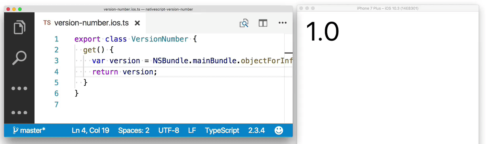
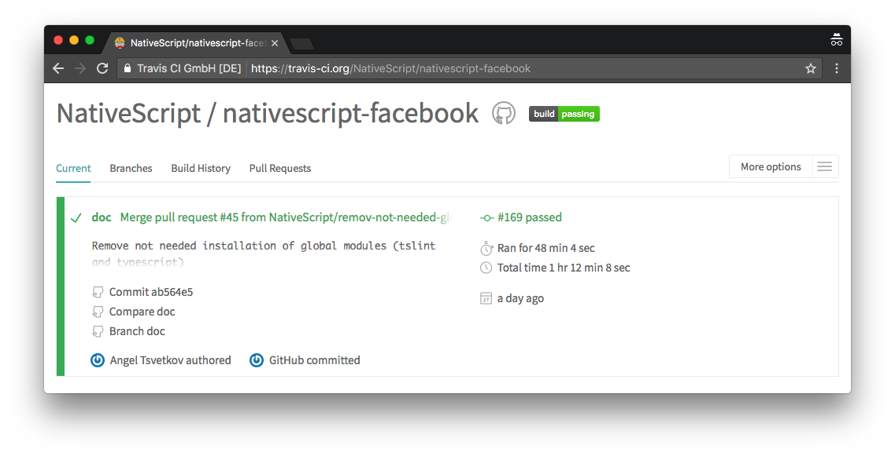

# Introducing the Official NativeScript Plugin Seed

Plugins are a critical part of what makes NativeScript a compelling framework to develop iOS and Android apps. Because plugins have become essential to your apps, we on the NativeScript team are taking steps to ensure that the NativeScript plugin ecosystem remains strong.

Today we’re happy to announce the first of our plugin initiatives: [an official plugin seed for building NativeScript plugins](https://github.com/NativeScript/nativescript-plugin-seed).

The seed is heavily based off of [Nathan Walker’s work](https://github.com/nathanwalker/nativescript-plugin-seed)—thanks Nathan!—and offers a simple way for building NativeScript plugins that are easy to create, test, and maintain. Specifically, here are a few of features that the NativeScript plugin seed offers out of the box.

## Feature #1: Intelligent scaffolding

The NativeScript plugin seed automatically sets up your TypeScript settings, a demo project, and default settings for configuration files like your `.gitignore`, `.npmignore`, and `package.json`.

These intelligent defaults make you more productive as a plugin author. For example, the seed automatically sets up TypeScript autocomplete for native iOS and Android APIs.

Having a consistent plugin folder structure brings other benefits as well. For example, contributing to NativeScript plugins is a whole lot easier when you already know the plugin’s folder structure and development workflow.

## Feature #2: A powerful development workflow

One of the hardest part of NativeScript plugin development is coming up with a workflow that lets you change your plugin’s source and see those changes in a demo app at the same time. We spent a lot of time trying to get this right, and finally ended up with [a workflow that we think works pretty well](https://docs.nativescript.org/plugins/building-plugins#step-2-set-up-a-development-workflow).

Developing plugins should now feel just like you’re working on a normal NativeScript app—you can make changes and see those changes immediately.

## Feature #3: Built-in unit testing setup

Testing is an important part of any robust software ecosystem, and the NativeScript plugin world is no exception. NativeScript plugins are driving an increasing number of mission-criticial application; therefore, it’s important that plugin authors have the testing tools they need to ensure reliability as their plugins evolve.

The NativeScript plugin seed [automatically adds Jasmine-based unit testing support to new plugins](https://github.com/NativeScript/nativescript-plugin-seed#unittesting). Your plugin’s demo app will have a series of sample tests in its `demo/app/tests` folder, and we hope you’ll find it easy to configure these tests to verify your plugin is working as intended

## Feature #4: Built-in support for Travis CI testing

Once you have unit tests, adding a CI (continuous integration) workflow helps you make sure those tests continue to pass over time. A CI workflow helps plugin authors catch regressions in their own changes and in community pull requests.

The NativeScript plugin seed comes with a fully functional `.travis.yml` file that deploys your testing app to an Android emulator and iOS simulator, and runs your tests on those emulated devices.

All you have to do is [enable your plugin’s repo on the Travis CI site](https://github.com/NativeScript/nativescript-plugin-seed#travisci) and you get some pretty powerful functionality. For example, on each commit Travis will run your unit tests to check for potential regressions.

Once you have this workflow in place, you can add a little badge to your plugin so that your users know your plugin has passing tests. Check out the [NativeScript facebook plugin](https://github.com/NativeScript/nativescript-facebook) as an example.

## Feature #5: Scripts to help you publish your plugin to npm

Finally, when you’re ready to share your plugin with the world, the NativeScript plugin seed makes publishing as easy as changing a few strings in your `package.json` file and [running a publish script](https://docs.nativescript.org/plugins/building-plugins#step-4-publish-your-plugin).

The script takes care of some of the trickier aspects of publishing, such as including only the correct JavaScript and TypeScript files, and making sure you don’t publish your full demo app and test files.

## Get started now

If you’ve been thinking about building NativeScript plugins, now is a great time to get started. If you have existing NativeScript plugins, now is a great time to convert your plugin to the new seed’s format for consistency, and also to take advantage of some of the new features that the seed provides.

To help with these tasks, we have a few new plugin documentation articles you can find on our documentation site. Start with the article on building plugins, and then move on to some of the more advanced topics on plugin development.

* [Building Plugins](https://docs.nativescript.org/plugins/building-plugins)
* [Debugging Plugins](https://github.com/NativeScript/docs/blob/master/plugins/debugging-plugins.md)
* [Building UI Plugins using Composite Components](https://github.com/NativeScript/docs/blob/master/plugins/ui-plugin-composite.md)

> **TIP**: You can also refer to our [new nativescript-facebook plugin](https://github.com/nativescript/nativescript-facebook), a wrapper of the Facebook iOS and Android SDKs, as it’s a concrete example of a plugin built using the plugin seed.

The new plugin seed is the first of many plugin-related initiatives we have in the works. Let us know what you think! You can comment on this blog post of join us in the #plugins channel on the [NativeScript community Slack channel](http://developer.telerik.com/wp-login.php?action=slack-invitation).

Now is a great time to get in on the fun world of NativeScript plugin development 😄
