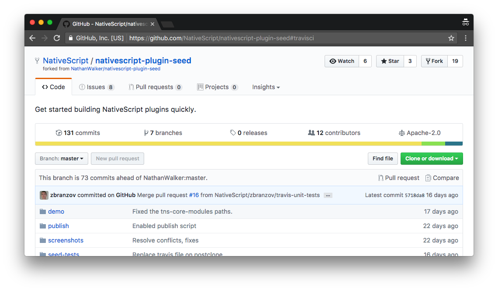

# Introducing the Official NativeScript Plugin Seed

Plugins are a critical part of what makes NativeScript are a compelling framework to develop iOS and Android apps. As plugins have become essential to many of the apps you’re building, we on the NativeScript team are taking steps to ensure that the NativeScript plugin ecosystem remains strong.

Today we’re happy to announce the first of our plugin initiatives: [an official plugin seed for building NativeScript plugins](https://github.com/NativeScript/nativescript-plugin-seed).

The seed is heavily based off of Nathan Walker’s work—thanks Nathan!—and offers a simple way for building NativeScript plugins that are easy to create, test, and maintain. Specifically, here are a few of features that the NativeScript plugin seed offers out of the box.

1) Plugin scaffolding that automatically sets up TypeScript settings, a demo project, and more. TypeScript autocomplete for native iOS and Android APIs just works in editors like Visual Studio Code.

2) A development workflow that lets you make changes to your plugin and instantly see those changes in your demo app.
3) Sane default settings for configuration files like your `.gitignore`, `.npmignore`, and `package.json`.
4) Sample unit tests and testing workflow.
5) Scripts to help you publish your plugin to npm.
6) Built-in support for Travis CI testing.

If you’ve been thinking about building NativeScript plugins, now is a great time to get started. If you have existing NativeScript plugins, now is a great time to convert your plugin to the new seed’s format for consistency, and also to take advantage of some of the new features that the seed provides. To help with these tasks, we have a few new plugin documentation articles you can find on our documentation site. Start with the article on building plugins, and then move on to some of the more advanced topics on plugin development.

* [Building Plugins](https://docs.nativescript.org/plugins/building-plugins)
* **TODO**: List the other plugin articles here when they’re ready.

> **TIP**: You can also refer to our [new nativescript-facebook plugin](https://github.com/nativescript/nativescript-facebook), a wrapper of the Facebook iOS and Android SDKs, as it’s a concrete example of a plugin built using the plugin seed.

The new plugin seed is the first of many plugin-related initiatives we have in the works. Let us know what you think! You can comment on this blog post of join us in the #plugins channel on the [NativeScript community Slack channel](http://developer.telerik.com/wp-login.php?action=slack-invitation).

Now is a great time to get in on the fun world of NativeScript plugin development 😄
