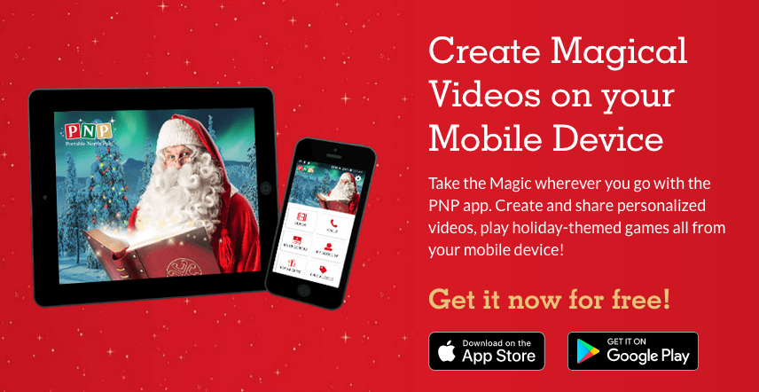
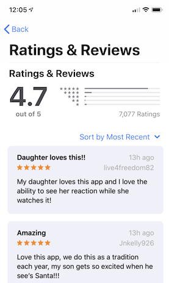
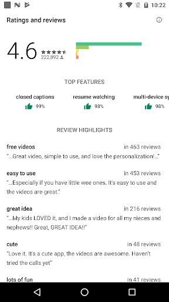
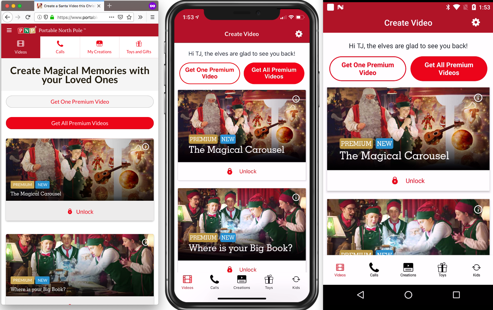
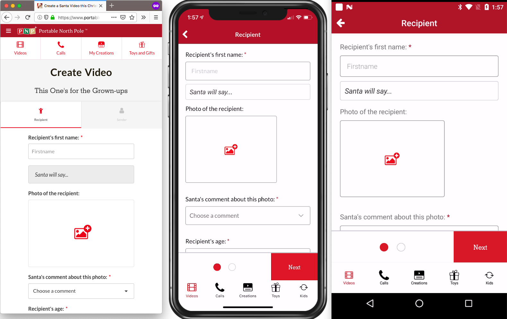
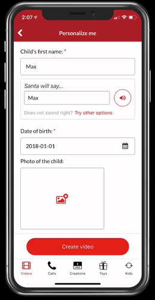
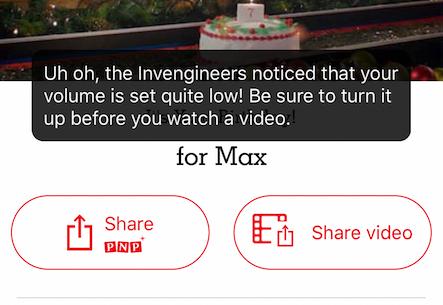
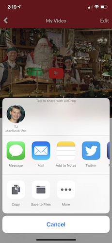
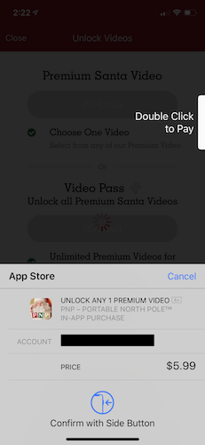

# Portable North Pole—Your Go-To NativeScript App This Holiday Season

The holidays are busy times for many, myself included, but for most of us, holiday planning doesn’t including architecting an app that can handle more than 100,000 simultaneous users.

This is the challenge [UGroupMedia](http://ugroupmedia.com/) faces every year with their absurdly popular [Portable North Pole app](https://www.portablenorthpole.com), which allows users to create personalized Santa video content in a number of really cool ways.

UGroupMedia uses NativeScript to build and deploy Portable North Pole from a single JavaScript codebase, and it seems to be working well, as the app’s reviews have been consistently high throughout the holiday season.

    
    

Since this is the NativeScript blog, let’s take a look at just how the team at UGroupMedia built Portable North Pole.

## Architecture

Portable North Pole uses [xplat](https://nstudio.io/xplat/), a free-to-use code-sharing solution from [nStudio](https://nstudio.io/). xplat is an Angular-based solution that allows you to build for the web, for iOS, and for Android—simultaneously. Richard Smith, the Lead Mobile & Web Lead Application Developer at UGroupMedia [had this to say of the approach](https://www.businesswire.com/news/home/20181219005208/en/NativeScript-Powered-Portable-North-Pole-App-Exceeds-Quarter).

> “We needed the ability to develop and maintain our app for iOS, Android, and Web, but with a small team, an efficient and reliable code-sharing solution was necessary. With NativeScript, the shared xplat code-base allows developers with diverse backgrounds to contribute comfortably to all 3 platforms, while still being able to utilize their previous experience and specializations. It is a great environment to work in and enables us to deliver much more with our existing team.”

You can see the power of a code-sharing solution in action in many different parts of the Portable North Pole app, such as the main screen where you pick between their video options.

Or, the form you use to customize your videos before they get processed on the Portable North Pole backend.

> **TIP**: Interested in getting started with your own NativeScript code-sharing app? Check out our [documentation hub on the topic](https://docs.nativescript.org/angular/start/introduction).

Even though UGroupMedia uses a code-sharing approach to boost their productivity, they’re still able to provide really polished experiences on each platform they build for.

For example, both the web and mobile versions of PNP allow you to upload images, but the mobile version allows you to crop the image you select.

Being able to perform small little tweaks like this can really enhance the user’s experience, and with NativeScript you can easily add this polish while remaining in a code-sharing structure.

There are a ton of these nice little tweaks throughout the app. For example, the app can detect when your volume is low and give a helpful message.

The video sharing integrates with a device’s native sharing capabilities.

And you can pay for the premium videos using your device’s built-in in-app purchase APIs.

And this is just scratching the surface.

Portable North Pole is also doing some really cool things with video, such as recording a child’s reaction using the device’s camera. They natively support four languages, and offer a built-in way to switch languages directly in the app. Oh, and they have a complete integration with Zendesk, which includes a built-in way to view help documents directly in the app.

To see it all in action you’re just going to have to check out the app for yourself.

## Try it out

Portable North Pole is a great app to experiment with if you want to see what NativeScript makes possible, or, if you just want to make a fun video for the children in your life.

To try it, head to [portablenorthpole.com](https://www.portablenorthpole.com/), or, use one of the links below to try the app out on your iOS or Android device.

And, if you want to learn more about the technology behind the app, start learning NativeScript at [nativescript.org](https://nativescript.org), and learn more about sharing code between web and native apps on [the NativeScript documentation site](https://docs.nativescript.org/angular/code-sharing/intro).

Happy holidays from us on the NativeScript team. And look forward to more technical writeups from the Portable North Pole team in the coming months 😉
