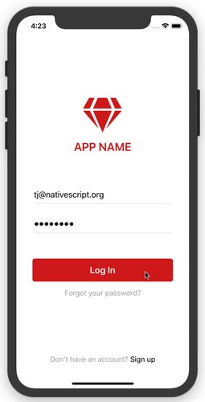
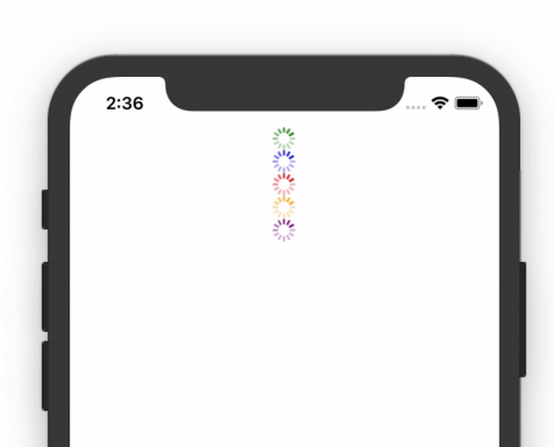
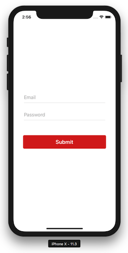
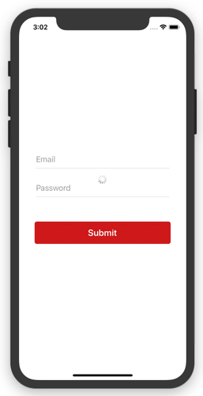
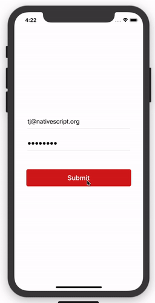

# Showing a Nice Looking Activity Indicator During Processing

If you’ve built a form in a NativeScript app you’ve probably had the need to show an activity indicator during submission. In this article we’ll look at how to do that by building the example you see in the gif below.



> **NOTE**: You can check out [this article’s code in NativeScript Playground](https://play.nativescript.org/?template=play-ng&id=Hqp5UQ&v=313).

Let’s start by looking at the NativeScript control for making these sort of UIs possible—ActivityIndicator.

## Working with the ActivityIndicator component

NativeScript’s ActivityIndicator component is a really simple UI control for showing a spinner. The ActivityIndicator works like any other NativeScript UI control, meaning, you can use NativeScript’s layouts to place the ActivityIndicator anywhere you’d like in your app’s screens.

For example, the following stacks a number of ActivityIndicators on the screen.

``` XML
<StackLayout>
  <ActivityIndicator color="green" busy="true"></ActivityIndicator>
  <ActivityIndicator color="blue" busy="true"></ActivityIndicator>
  <ActivityIndicator color="red" busy="true"></ActivityIndicator>
  <ActivityIndicator color="orange" busy="true"></ActivityIndicator>
  <ActivityIndicator color="purple" busy="true"></ActivityIndicator>
</StackLayout>
```

Here’s what that looks like on a device.



The ability to position the ActivityIndicator is important, as normally you want to show the spinner at a very specific part of the screen.

For the purposes of this article let’s suppose that you’re building a login the uses the following markup.

``` XML
<StackLayout class="input-field">
  <TextField class="input" hint="Email"></TextField>
</StackLayout>

<StackLayout class="input-field">
  <TextField class="input" hint="Password"></TextField>
</StackLayout>

<Button class="btn btn-primary" text="Submit"></Button>
```

With a bit of CSS that markup looks like this on device.



There are a few different places you could choose to show an ActivityIndicator on a form like this, but for this article we’ll center the ActivityIndicator directly in the middle of the login form.

The code below alters the previous example to surround the UI with a parent `<GridLayout>`, and adds an ActivityIndicator that spans the dimensions of that new parent layout.

``` XML
<GridLayout rows="auto, auto, auto">
  <StackLayout row="0" class="input-field">
    <TextField class="input" hint="Email"></TextField>
  </StackLayout>

  <StackLayout row="1" class="input-field">
    <TextField class="input" hint="Password"></TextField>
  </StackLayout>

  <Button row="2" class="btn btn-primary" text="Submit"></Button>

  <ActivityIndicator rowSpan="3" busy="true"></ActivityIndicator>
</GridLayout>
```

With this approach your form fields take up exactly the same dimensions they did before, however, they now have a parent `<GridLayout>` container that you can use to position the `<ActivityIndicator>`. The end result looks like this.



Feel free to change the position of your ActivityIndicator depending on the needs of your apps. When you’re ready let’s look at how to bind to an ActivityIndicator’s `busy` attribute, and how to also disable form controls during submission.

> **TIP**: Need help mastering NativeScript layouts? Try the interactive tutorials on [nslayouts.com](https://www.nslayouts.com/).

## Disabling form controls appropriately

Allowing users to mess with a form while a submission is in progress is not a good idea. You stand a good chance of confusing your users, and you might even screw up your backend by sending multiple requests.

Luckily, NativeScript’s form controls all provide an easy-to-use `isEnabled` attribute to make shutting down your form relatively easy.

To start implementing this, you first to create a variable to track whether a request to your backend is in progress. For example, in an Angular app you might want to use the `processing` instance variable in the code below. Notice how the variable is set to `false` by default, and set to `true` right before you initiate your backend processing.

``` TypeScript
import { Component } from "@angular/core";

@Component({
  selector: "app-login",
  ...
})
export class LoginComponent {
  processing = false;

  submit() {
    this.processing = true;
    callMyBackendService()
      .then(() => {
        this.processing = false;
        // Handle response
      })
  }
}
```

The idea behind creating a variable like `processing` is it gives you a value you can bind each component’s `isEnabled` attribute to, as well the `<ActivityIndicator>`’s `busy` attribute. For example, here’s how you can accomplish that in an Angular app.

``` XML
<GridLayout rows="auto, auto, auto">
  <StackLayout row="0" class="input-field">
    <TextField [isEnabled]="!processing" class="input" hint="Email"></TextField>
  </StackLayout>

  <StackLayout row="1" class="input-field">
    <TextField [isEnabled]="!processing" class="input" hint="Password"></TextField>
  </StackLayout>

  <Button row="2" [isEnabled]="!processing" class="btn btn-primary" text="Submit"></Button>

  <ActivityIndicator [busy]="processing" rowSpan="3"></ActivityIndicator>
</GridLayout>
```

With these changes in place your form now looks like this.


As a final step, NativeScript provides a `:disabled` CSS selector for you to style disabled form controls. You’re welcome to customize your apps as much as you’d like, but oftentimes bumping down the `opacity` is enough to visibly show that a control is disabled.

``` CSS
:disabled {
  opacity: 0.5;
}
```

With that your form now adds a little bit of opacity whenever submissions are in progress.



And if you add in some [login form functionality from a previous article on this blog](https://www.nativescript.org/blog/building-an-awesome-login-screen-with-nativescript), you end up with the final state of this example.


As a reminder, the full source code for this example is [available on NativeScript Playground](https://play.nativescript.org/?template=play-ng&id=Hqp5UQ&v=313). If you run into problems using this code, or have any other tips & tricks related to activity indicators you’d like to share, feel free to post them in the comments.

