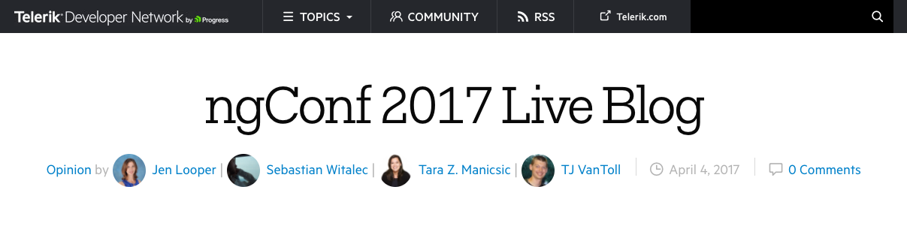
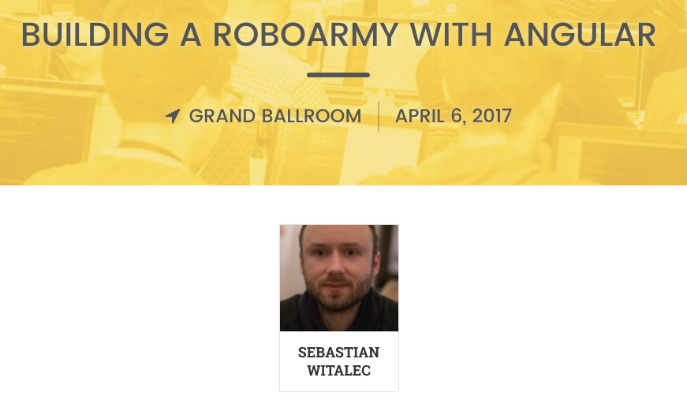
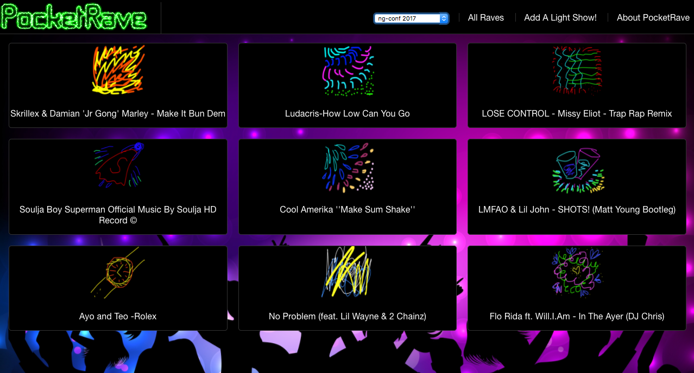
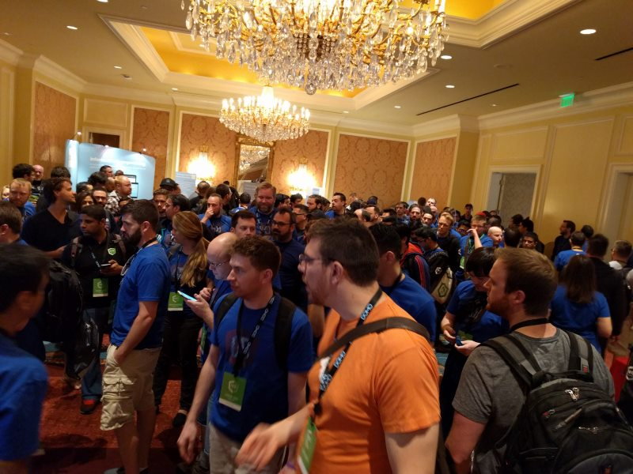

# Progress at ng-conf 2017

Last year Progress took ng-conf by storm, and this year will be no different, as we have numerous sessions on the schedule, a swag-filled booth, and a workshop that involves robots, drones, and more.

Not able to attend ng-conf? No worries, you’ll be able to virtually attend all of our sessions through ng-conf’s excellent livestream. Let’s look at the full list of activities that you can join.

* Wednesday, April 5th
    * [Keynote live blog 🎤](#keynote-live-blog)
* Thursday, April 6th
    * [Robot session 🤖](#robot-session)
    * [Rave party 💃](#rave-party)
* Friday, April 7th
    * [Emoji session 😎](#emoji-session)
* All days
    * [Our booth 🎉](#our-booth)
    * [Meet us! 👋](#meet-us)

<h2 id="keynote-live-blog">Keynote live blog 🎤 (Wednesday, April 5th)</h2>

The ng-conf opening keynote runs from 11:00 AM to 12:00 AM US Eastern Time, and we’ll be live blogging the whole thing here on the Telerik Developer Network.

Our live blog is a great way to follow along with the ng-conf keynote if you can’t be at the event itself. Jen Looper, Sebastian Witalec, Tara Manicsic, and I will be at the event and sharing what we see in the room, and offering our perspectives on the future of Angular. Bookmark the page below and come back on Wednesday to follow along.

* [Telerik Developer Network’s ng-conf 2017 Live Blog](http://developer.telerik.com/featured/ngconf-2017-live-blog/)

<h2 id="robot-session">Robot session 🤖 (Thursday, April 6th)</h2>

Do you like robots? Great! On April 6th, day two of ng-conf, Sebastian Witalec will be demonstrating how to build a robot army with [NativeScript](https://www.nativescript.org/). The session is a great way to get up to speed on using bluetooth on the web and in NativeScript apps.

 

Sebastian’s session starts at noon Eastern US time on Thursday. Use the link below to watch the session live at that time.

* [ng-conf Day 2 live stream](https://www.youtube.com/watch?v=_MrOw8iywC8)

<h2 id="rave-party">Rave party 💃 (Thursday, April 6th)</h2>

On Thursday, April 6th we’ll be hosting a rave party based on Jen Looper’s [PocketRave app](https://pocketrave.me/). We’ll have free snacks, free drinks, and a Jen-Looper-crafted Spotify playlist playing.

The party starts at 7:00 PM (Salt Lake City time), so make sure to join us if you’re attending the event.

<h2 id="emoji-session">Emoji session 😎 (Friday, April 7th)</h2>

What could be better than robots and a rave party? Emoji!

On April 7th, day three of ng-conf, Jen Looper, Tara Manicsic, and I will be demonstrating how to create a real-time cross-platform emoji service. We’ll be showing off [how to use Angular in Kendo UI](http://www.telerik.com/kendo-angular-ui/), how to build robust charts and graphs, and how to use Firebase to make everything update in real-time.

Plus, we promised costumes for this one, so you won’t want to miss that.

Our talk starts at 12:35 PM US Eastern time on Friday. Use the link below to watch the session live at that time.

* [ng-conf Day 3 live stream](https://www.youtube.com/watch?v=EzRZOoRXNUM)

<h2 id="our-booth">Our booth 🎉</h2>

We’re going to have a booth at ng-conf again this year, and if last year is any indication out booth is a pretty hip place to be. Stop by and say hi, and pick up some swag for your favorite Progress products.

<h2 id="meet-us">Meet us 👋</h2>

And finally, a number of us from Progress will be at the event, including several members of the NativeScript and Kendo UI teams. We’d love to chat about NativeScript, Kendo UI, Angular, or whatever.

<blockquote>Can’t be at the event and want to make sure to catch our sessions? Make sure to follow us on social media for reminders, including links to videos after the conference ends.

* [Follow NativeScript on Twitter](https://twitter.com/nativescript)
* [Follow Kendo UI on Twitter](https://twitter.com/kendoui)
* [Follow Telerik on Twitter](https://twitter.com/telerik)
* [Follow Progress on Twitter](https://twitter.com/progresssw)</blockquote>