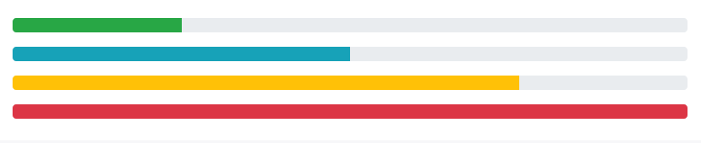
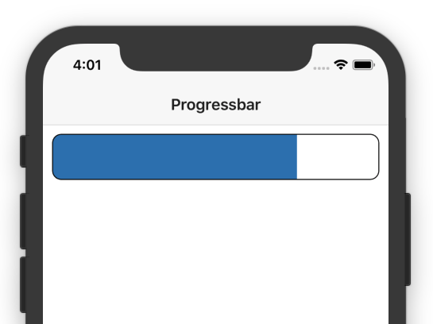
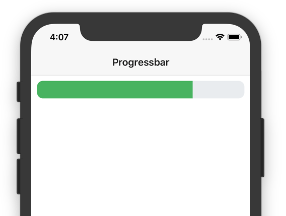
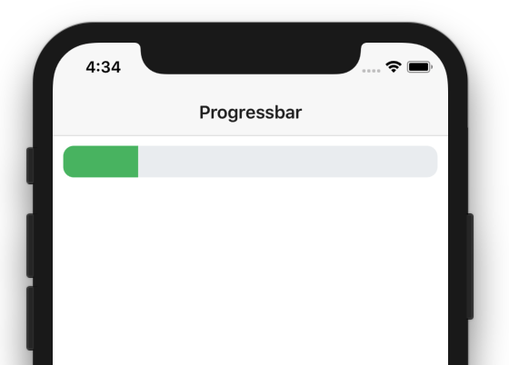
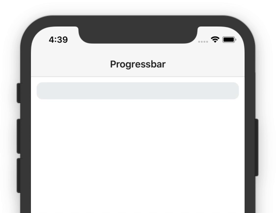

# Building a Simple Progressbar for your NativeScript App

Progressbars are a common user interface component regardless of development platform. For example here’s what Bootstrap’s progressbar component looks like.



In this article we’ll look at how you can easily recreate this UI component for your NativeScript apps, and learn a bit about NativeScript’s layout system in the process.

## Progressbar markup

To create a simple progressbar you only need two components, a `<GridLayout>` to use as the bar itself, and a `<StackLayout>` to serve as the filled-in portion of the bar.

``` XML
<GridLayout columns="3*, *" class="progressbar">
  <StackLayout col="0" class="progressbar-value"></StackLayout>
</GridLayout>
```

The key thing driving this example is the `GridLayout`’s `columns` attribute, but we’ll come back to that in a minute. First, so that you can get a visual of what this looks like, let’s add in a bit of CSS to make this markup look like a progressbar.

``` CSS
.progressbar {
    height: 50;
    margin: 10;
    border-radius: 10;
    border-color: black;
    border-width: 1;
}
.progressbar-value {
    background: #337ab7;
}
```

With that CSS in place you should have a progressbar that looks like this.



If you have more design talent than me you might want to play with different colors, and maybe even experiment with [NativeScript’s new support for linear gradient backgrounds](https://docs.nativescript.org/ui/ns-ui-widgets/styling#gradients).

Just to give you an idea of what’s possible, here’s a slightly different look for the same progressbar with a bit of alternative CSS.

``` CSS
.progressbar {
    height: 30;
    margin: 10;
    border-radius: 10;
    background: #ECEFF1;
}
.progressbar-value {
    background: #51BC6B;
}
```



Regardless of how you choose to style your progressbar, the next thing you need to do is come up with a way of controlling the bar’s width. Let’s look at how to do that.

## Progressbar logic

To explain how this is going to work, let’s return to this example’s markup.

``` XML
<GridLayout columns="3*, *" class="progressbar">
  <StackLayout col="0" class="progressbar-value"></StackLayout>
</GridLayout>
```

In this example, the `GridLayout` specifies two columns, one with a width of `3*`, and another with a width of `*`. This creates four units of width, and assigns three to the first column, and one to the second. This is why the bar takes up 75% of the overall width in our example.


To make this width dynamic, all you need to do is dynamically assign that width in JavaScript or TypeScript. Using Angular, that code looks a little something like this.

``` XML
<GridLayout [columns]="columns" class="progressbar">
  <StackLayout col="0" class="progressbar-value"></StackLayout>
</GridLayout>
```

``` TypeScript
import { Component, OnInit } from "@angular/core";

@Component({
    ...
})
export class ItemsComponent implements OnInit {
  columns;

  ngOnInit(): void {
    this.setProgressbarWidth(20);
  }
}

  setProgressbarWidth(percent) {
    this.columns = percent + "*," + (100 - percent) + "*";
  }
}
```

Here, you bind the `columns` attribute of the `GridLayout` to a `columns` property in your Angular component.

In the component, you also define a `setProgressbarWidth()` method, which takes a 0–100 integer and sets the attribute to appropriate value.

> **NOTE**: If you’re confused by exactly what `setProgressbarWidth()` does try running through the logic with a few specific values. For example, if you pass in `70` the method sets the `columns` property to `70*,30*`; if you pass in `50` the method sets the `columns` property to `50*,50*`.

With this code you can now easily use TypeScript code to set the progressbar’s width to a percentage width. For example, the code above renders a progressbar that looks like this.



To make the progressbar move all you need to do is call `setProgressbarWidth()` with a new value. For example, the following code moves a progressbar from 0–100.

``` TypeScript
import { Component, OnInit } from "@angular/core";

@Component({
  ..
})
export class ItemsComponent implements OnInit {
  columns;

  ngOnInit(): void {
    let percent = 0;
    let intervalId = setInterval(() => {
      this.setProgressbarWidth(percent);
      percent++;
      if (percent > 100) {
        clearInterval(intervalId);
      }
    }, 50);
  }

  setProgressbarWidth(percent) {
    this.columns = percent + "*," + (100 - percent) + "*";
  }
}
```




## Wrapping up

Hopefully this article has given you an idea of how you can implement progressbars in your own apps, and maybe even a little bit about how NativeScript’s GridLayout works.

Feel free to tinker with this example’s code if you’re looking to do something a bit more custom, and if you come up with something cool, make sure to post it in the comments 🙂