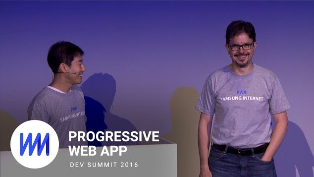
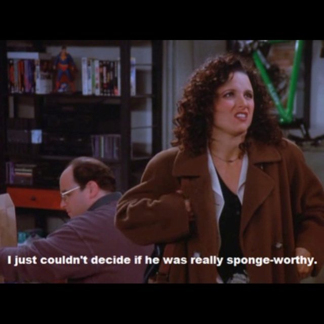

# Progressive Web Apps — Yeh or Meh?

The onus for this chat came when our very own Burke Holland dropped this hot take in the Progress DevRel Slack:

>	“I'm still so meh on PWAs that I can't even.”

For those unfamiliar, [Progressive Web Apps](https://developers.google.com/web/progressive-web-apps/), or PWAs, is a Google-led initiative to bring native app features such as home screen access and push notifications to the mobile web. PWAs have been in the tech news a lot of late, which led to those of us in Progress DevRel to from strong opinions on the technology.

After Burke’s PWA meh bomb, each of us found our place on the PWA Yeh <--> Meh scale (see below), and we agreed to argue our sides publicly—because no one has ever regretted that decision. Here’s everyone that’s participating in this chat.

```
Yeh <-------------------> Meh
Brian    Tara    TJ     Burke
```

Burke, can you expand on your thoughts on PWAs to get us going?


Burke Holland ☁️ [2:07 PM] 
I should qualify my feelings by saying that maybe I don't fully understand PWAs. My issue is that from what I understand, a PWA is a mobile web site with a service worker (ok), a home screen icon (this is not new) and push notifications (which nobody wants). My concern is that they do not address the fundamental issue with the mobile web, which is performance

TJ VanToll 🌫 [2:08 PM] 
Basically yes, and you’re hitting on my main complaint with PWAs: that they’re marketed as some brand new great thing, when really it’s just a handful of new features for the web.

Good features, sure, but it’s not a completely different approach.

Tara Z. Manicsic 🌧 [2:08 PM] 
I think PWAs are our first step into optimizing we applications to be more accessible for more people across the globe and focusing on how we can look into performance of our applications to make them better.

[2:09] 
@tzmanics How to the technologies behind PWAs relate to performance though?

Brian Rinaldi 🌤 [2:09 PM] 
Don’t service workers address performance? For instance, this article notes a 3–4 second improvement for sites using Service Worker to cache their app’s shell https://medium.com/dev-channel/progressive-web-app-libraries-in-production-b52cad37d34

Tara Z. Manicsic 🌧 [2:10 PM] 
yes, service workers are to help with performance and to deal with unreliable networks

TJ VanToll 🌫 [2:11 PM] 
@remotesynth @tzmanics Gotcha, yeah that makes sense. I can see how service workers would definitely help with loading times, especially if you’re using a bunch of code that doesn’t change very often.

Burke Holland ☁️ [2:10 PM] 
Service workers are not supported on iOS, correct?

Burke Holland ☁️ [2:10 PM] 
And they are Android only

Brian Rinaldi 🌤 [2:10 PM] 
Right. http://caniuse.com/#feat=serviceworkers

Burke Holland ☁️ [2:11 PM] 
So maybe my issue is that I don't understand PWAs because I do not own or use any Android devices

Brian Rinaldi 🌤 [2:11 PM] 
But then you aren’t taking issue with the “concept” so much as Apple’s lack of support for it at the moment

Burke Holland ☁️ [2:11 PM] 
If you're telling me that an application with a service worker screams on Chrome for Android, then yes, I support it

TJ VanToll 🌫 [2:12 PM] 
Well it’ll load faster, but it’s not going to change the runtime performance as far as I know.

Burke Holland ☁️ [2:12 PM] 
But my experience with Chrome For Android is that it is a really laggy experience

[2:12] 
I have a hard time believing that service workers fix this

TJ VanToll 🌫 [2:12 PM] 
(The faster loads are also only for repeat visits. Users still need to load that app shell from the network on your their visit.)

Brian Rinaldi 🌤 [2:13 PM] 
Right.

Tara Z. Manicsic 🌧 [2:13 PM] 
and PWAs still work on iOS
here’s a great article focusing on this https://cloudfour.com/thinks/ios-doesnt-support-progressive-web-apps-so-what/

Burke Holland ☁️ [2:13 PM] 
Right, but then they are just mobile web apps

It’s not the load time that kills me, it's everything that happens after that

[2:13] 
We used mobile Twitter as a great example

[2:14] 
re-written as a PWA, with service workers and React and yet, at least on iOS, it's still a mobile web experience with all of the usual caveats

Tara Z. Manicsic 🌧 [2:14 PM] 
what are the usual caveats so we can see how they’re affected

Brian Rinaldi 🌤 [2:14 PM] 
It’s also important to keep in mind that we work in a bit of a bubble. While I may be the only Android user on the team here are the latest stats I was able to dig up on market share:

> Gartner    Q3 2016    Units sold in quarter    Android: 87.8%    iOS: 11.5%

While that is global, US Sales are more  Android 52.8% and iOS 43.6% (according to ComScore)


Burke Holland ☁️ [2:15 PM] 
This is a good point that I don't want to undermine

[2:15] 
I am probably not the target for this technology

[2:15] 
To @tzmanics's question, scroll is janky. Sometimes half the app doesn't load. Sometimes it zooms in for no reason. It doesn't remember your position when you go back.

[2:16] 
it's just a flimsy experience when compared with the native Twitter app

[2:16] 
Pretty much exactly what I would expect from the mobile web

Brian Rinaldi 🌤 [2:16 PM] 


Tara Z. Manicsic 🌧 [2:16 PM] 
I think it targets everyone, really. It’s just the beginning stages so there are things that will need to improve but it’s a step. I also think the big thing is that this helps improve web applications but definitely does not replace mobile applications.

Burke Holland ☁️ [2:17 PM] 
Let's get into how it improves them

Tara Z. Manicsic 🌧 [2:17 PM] 
@burkeholland to be fair I’ve had the same kind of experiences with native mobile apps lol

Burke Holland ☁️ [2:17 PM] 
Sure. A platform isn't going to save you from yourself when it comes to building an app.

TJ VanToll 🌫 [2:18 PM] 
So I mean the big hitters for how PWA improves your app are 1) push notifications, 2) offline access, and 3) home screen icons.

Burke Holland ☁️ [2:20 PM] 
These all sound like good things

Tara Z. Manicsic 🌧 [2:19 PM] 
I like the approach that we take with PWAs of first loading and caching the app shell, which is the part of your app that will always be present, then loading in the data as needed/available

Brian Rinaldi 🌤 [2:20 PM] 
What we’re calling “home screen icons” is actually more like “installable” - they’ve been working to move the experience to coexist on a more even plane with the app experience on Android. So it will show up not just on home but on your list of apps.

Tara Z. Manicsic 🌧 [2:20 PM] 
yes it’s recognized as an app bc of the manifest (edited)

Brian Rinaldi 🌤 [2:20 PM] 
https://www.theverge.com/2017/2/3/14497570/google-chrome-add-to-home-screen-web-apps-android-improvements

Burke Holland ☁️ [2:21 PM] 
It's important to note that Google did this with the desktop as well (Chrome Packaged Apps) before they just killed it midstream (edited)

Brian Rinaldi 🌤 [2:21 PM] 
True

Tara Z. Manicsic 🌧 [2:21 PM] 
bc it’s a web app you bypass the app store to install, just head to the link (edited)

Burke Holland ☁️ [2:21 PM] 
And that's not good for Google

[2:22] 
If you aren't searching, they aren't making any money

Brian Rinaldi 🌤 [2:22 PM] 
I think the good news is that other major companies beyond Google are behind this. Both MS and Samsung have been recently pushing their PWA support.

Burke Holland ☁️ [2:22 PM] 
Unfortunately, the only other player that matters is Apple

TJ VanToll 🌫 [2:22 PM] 
@burkeholland Well Google has ads everywhere, but I think you’re probably right that they’d rather you see their native ads.

Brian Rinaldi 🌤 [2:23 PM] 
Example…here’s a recent take from Samsung https://medium.com/samsung-internet-dev/progressing-the-story-of-progressive-web-apps-94d1d79434f8



Tara Z. Manicsic 🌧 [2:23 PM] 
they look really happy

[2:23] 
see PWAs make you happy

[2:23] 
lolol

Brian Rinaldi 🌤 [2:24 PM] 
Clearly they dumped a ton of money into t-shirt design too @tzmanics

TJ VanToll 🌫 [2:23 PM] 
I think the one thing driving PWA’s publicity is that you can’t really be against the technology. The worst thing you can possibly have to say is, meh.

Burke Holland ☁️ [2:23 PM] 
The only thing that I'm buying at the moment is 1) Being a better steward to those on slow/expensive connections and 2) making web apps first class citizens

Burke Holland ☁️ [2:24 PM] 
Neither of which address the primary issue that the mobile web is super slow

[2:24] 
which sparks these tweet storms about how React is ruining everything

Tara Z. Manicsic 🌧 [2:24 PM] 
well Google is also working on AMP
https://www.ampproject.org/ (Accelerated Mobile Pages)

[2:24] 
which is also OSS

Burke Holland ☁️ [2:24 PM] 
Now AMP is fast

Burke Holland ☁️ [2:24 PM] 
ridiculously fast

Brian Rinaldi 🌤 [2:24 PM] 
Yeah, though AMP is way more controversial than PWAs

Tara Z. Manicsic 🌧 [2:25 PM] 
the goal is to build your PWA with AMP you know FTW

TJ VanToll 🌫 [2:25 PM] 
omg

Brian Rinaldi 🌤 [2:25 PM] 
I don’t find many “meh” on AMP. I either see, AMP FTW or AMP is destroying the internet.

Burke Holland ☁️ [2:25 PM] 
I like AMP

[2:25] 
but I can see why publishers don't

Burke Holland ☁️ [2:25 PM] 
As a consumer, it's a WAY better experience

TJ VanToll 🌫 [2:25 PM] 
What’s interesting is that Google does a great job surfacing AMP content.

TJ VanToll 🌫 [2:25 PM] 
Which they don’t really do with PWAs interestingly.

Tara Z. Manicsic 🌧 [2:26 PM] 
i was introduced to PWAs along with AMP so it immediately went hand-in-hand in my mind (edited)

TJ VanToll [2:26] 
@remotesynth Curious, have you encountered a PWA in the wild?

Brian Rinaldi 🌤 [2:26 PM] 
I use the Washington Post PWA

TJ VanToll 🌫 [2:26 PM] 
Ah cool. Have you ever found one via search?

Tara Z. Manicsic 🌧 [2:27 PM] 
yea w the lil AMP logo!

TJ VanToll 🌫 [2:27 PM] 
I meant PWAs. Too many acronyms!

Brian Rinaldi 🌤 [2:27 PM] 
AMP I see all the time

[2:27] 
but PWA, hmm, not sure

TJ VanToll 🌫 [2:28 PM] 
I’m still absolutely shocked Google hasn’t done something to surface PWAs through their search monopoly.

[2:28] 
Seems like they could massively incentivize developers.

[2:28] 
I mean look how AMP worked out.

Brian Rinaldi 🌤 [2:28 PM] 
Granted, I’m not sure I’d care if I did. I am very picky about installing anything on my phone. For an app you have to be “sponge-worthy” but for a PWA maybe slightly less than that, but the rest, I’ll just use the web, thank you very much.

TJ VanToll 🌫 [2:28 PM] 
Now like all content sites have AMP versions.

Brian Rinaldi 🌤 [2:29 PM] 


Burke Holland ☁️ [2:29 PM] 
@tjvantoll I don't think that PWAs really jive with Google's monetary interest in the internet. That could be why.

Tara Z. Manicsic 🌧 [2:30 PM] 
well @burkeholland and I are bound to learn more next week at #GoogleIO
lots of PWA sessions (edited)

Burke Holland ☁️ [2:30 PM] 
Yes we are!


TJ VanToll 🌫 [2:30 PM] 
@burkeholland Yeah if you keep searching you keep loading ads. Once you have the app on your phone—no more ads.


Tara Z. Manicsic 🌧 [2:30 PM] 
:thumbsup:

Burke Holland ☁️ [2:30 PM] 
Here is what I want - something that fixes the mobile web so that it's like using Chrome on a desktop. I would build an electron app in a heartbeat. I mean, we use Visual Studio Code as our IDE and that's just a web app. I want this same thing for mobile.

[2:31] 
I don't see that PWAs are the way to get there, but maybe that's not what they are aiming for

[2:31] 
And maybe my expectation is not appropriate

Tara Z. Manicsic 🌧 [2:32 PM] 
Although I am looking at this as an advancement to web apps i DO think the long-term plan is to replace native mobile applications

[2:32] 
because then there is only one place for all the things

Burke Holland ☁️ [2:32 PM] 
That is definitely not in their best interest though, right?

[2:32] 
Because Android

Brian Rinaldi 🌤 [2:33 PM] 
@tzmanics I disagree. I think the goal is to replace _many_ mobile applications, but not mobile apps in general

Burke Holland ☁️ [2:33 PM] 
And when we go to Google IO, it will be really clear how important Android is to Google.

Tara Z. Manicsic 🌧 [2:33 PM] 
but if everything is in the ecosystem of the web then you just pour all your efforts into web and I think Google owns the web

Burke Holland ☁️ [2:33 PM] 
Here is what I do appreciate - Google continues to push the web forward

[2:33] 
And it has not been an easy thing to do

TJ VanToll 🌫 [2:34 PM] 
 (Google’s org chart)

Burke Holland ☁️ [2:34 PM] 
That's hard and often dirty work, but they never give up

Brian Rinaldi 🌤 [2:34 PM] 
The truth is that there are many apps that could do well as web pages with some simple improvements in terms of performance, offline, installation and so on. They are mainly apps because those features weren’t available to them.

Tara Z. Manicsic 🌧 [2:34 PM] 
that chart is amazing

Burke Holland ☁️ [2:34 PM] 
@remotesynth This is true

[2:34] 
Reddit asks me to download their app from time to time because it's a "better experience"

Tara Z. Manicsic 🌧 [2:34 PM] 
i hate those ads tbth

Burke Holland ☁️ [2:34 PM] 
I would rather not do that

Brian Rinaldi 🌤 [2:35 PM] 
LinkedIn asks you every damn time!

Burke Holland ☁️ [2:35 PM] 
I want to get to the point where those prompts are simply not necessary or true

Brian Rinaldi 🌤 [2:35 PM] 
Sorry, LinkedIn, you’re useful but not “sponge-worthy”

Tara Z. Manicsic 🌧 [2:35 PM] 
pintrest doesn’t even give you full use of their application via web

TJ VanToll 🌫 [2:35 PM] 
Yeah I PWAs are primarily for those types of apps. PWAs don’t meaningfully change the performance balance between web and native, but for apps that just need a basic feature PWAs is a low effort way to get there.

Burke Holland ☁️ [2:35 PM] 
A scrolling list of images and gifs should be a web app

[2:36] 
it's not like Reddit is trying to use Core Audio, OpenGL or anything like that

Brian Rinaldi 🌤 [2:36 PM] 
That’s like 90% of the App Store once you exclude games I believe

Burke Holland ☁️ [2:36 PM] 
LOL

TJ VanToll 🌫 [2:36 PM] 
And yet that (scrolling list of images) is like the hardest thing to build in a really performant way for the mobile web right now.

Tara Z. Manicsic 🌧 [2:36 PM] 
scrolling lists of images haha so true!

Burke Holland ☁️ [2:36 PM] 
Scrolling lists of anything are the hardest problem to solve in computer science

[2:36] 
apparently

TJ VanToll 🌫 [2:36 PM] 
Why do you think Reddit, Twitter, Facebook, etc want you in their native apps?

Burke Holland ☁️ [2:37 PM] 
Lock in

TJ VanToll 🌫 [2:37 PM] 
Less jank = more engagement = more :moneybag:

Tara Z. Manicsic 🌧 [2:37 PM] 
to listen in on your phone calls

[2:37] 
JKJKJK!!

TJ VanToll 🌫 [2:37 PM] 
sssshhhhhhh

Brian Rinaldi 🌤 [2:37 PM] 
@burkeholland scrolling lists of images…and naming

Burke Holland ☁️ [2:37 PM] 
She's right!

[2:37] 
Plus when you download the reddit app, you never leave it

Tara Z. Manicsic 🌧 [2:37 PM] 
:troll:

Burke Holland ☁️ [2:37 PM] 
click on an external link? Opens in Reddit app

[2:37] 
You just stay right there in their sandbox

Tara Z. Manicsic 🌧 [2:37 PM] 
yea i think engagement for sure, especially if you turn on push notifications

TJ VanToll 🌫 [2:38 PM] 
Native apps are for turning loyal users into cult-like worshipers of your service.

Brian Rinaldi 🌤 [2:38 PM] 
Well, honestly, that is one of the best parts of PWAs…no more “click link > go to app store > install app > maybe get to what you wanted after install”

Tara Z. Manicsic 🌧 [2:39 PM] 
i just downloaded the facebook app bc my Nana wanted me to post a video for my cousin’s birthday and with your phone you could only do it with the app.
so I downloaded, posted and deleted (shrug)

TJ VanToll 🌫 [2:40 PM] 
@tzmanics I’m so far into my bubble that I wrote an article defending Facebook’s 200 meg native app http://developer.telerik.com/topics/mobile-development/in-defense-of-large-native-apps/

Tara Z. Manicsic 🌧 [2:41 PM] 
that picture is perfect

[2:41] 
it’s a humongous app!!


Burke Holland ☁️ [2:40 PM] 
Final thought: I'm not blown over by PWAs, but I understand that they are really just paving a road to the end result we all want. To that end, I am supportive. And let's be clear, when Apple ships support for PWAs, we'll forget that it was ever up for debate.

Tara Z. Manicsic 🌧 [2:40 PM] 
^ so true!

Brian Rinaldi 🌤 [2:40 PM] 
That’s why the scale was not Yay to Nay. PWAs are not a “YAY!! but a solid “yeh”

[2:42] 
I think I’ve said all I wanted: for now the focus of PWAs and AMP are fantastic, imo, because we’re trying to make web apps better and more accessible. We’re just starting but, hopefully, it just gets better!

TJ VanToll 🌫 [2:42 PM] 
I’m only meh on PWAs because I think they’re marketed as something revolutionary when really they’re just a series of useful APIs. By all means if you have a web app you should totally look into service workers and the various other PWA features.

¯\_(ツ)_/¯