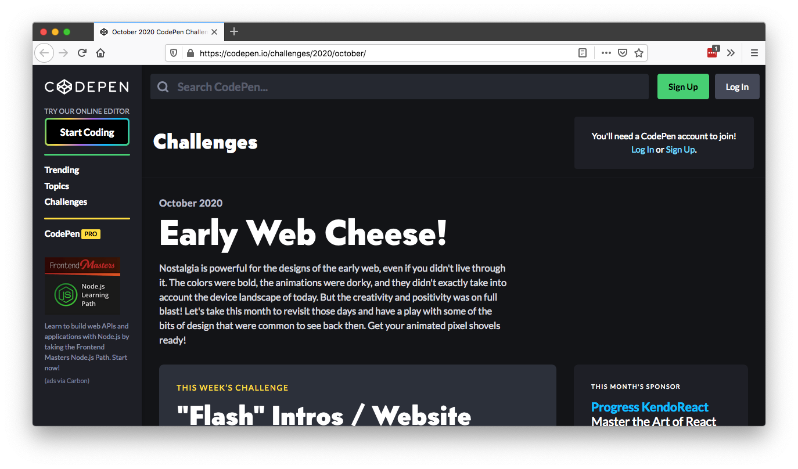
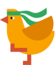
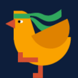
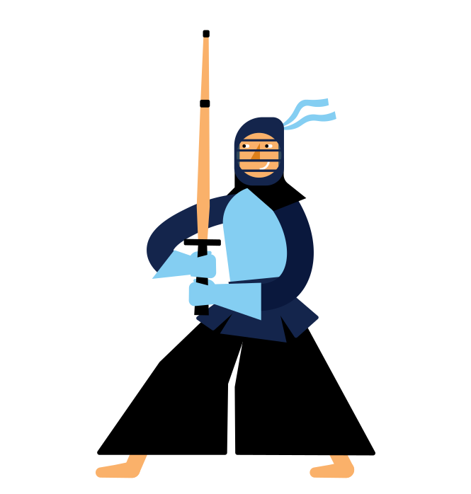
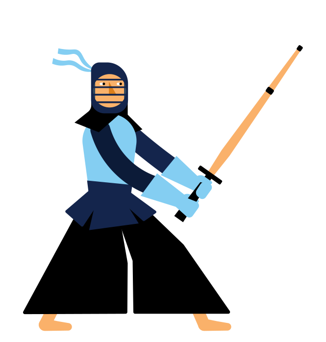
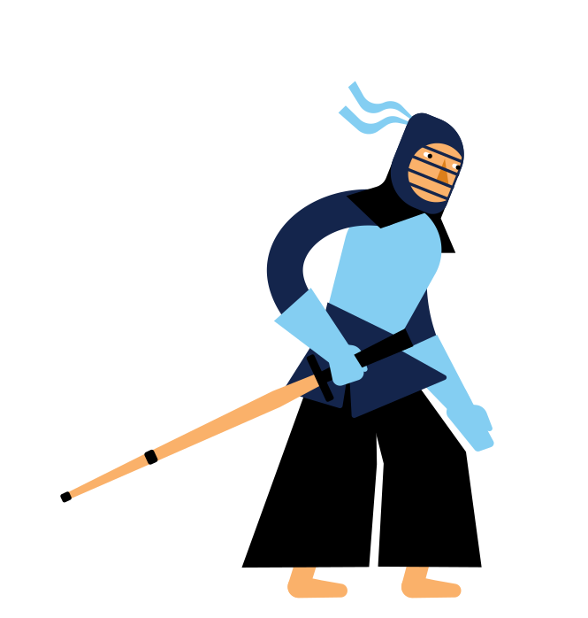

# Try the KendoReact CodePen Challenge!

Are you nostalgic for the early days of the web, with its bright colors, animated gifs and dorky designs? Well then good news! This month we’re partnering with our friends at [CodePen](https://codepen.io/), and offering a [series of challenges](https://codepen.io/challenges/2020/october/) under the theme of “Early Web Cheese”.

This week your challenge is to build a “Flash” Intro / Website Loader.

> “Flash-based websites were different in a lot of ways to the standards-based websites we have today. One big difference was that they were often just one big file. The browser had to download the whole thing before anything could happen. So one little trick was to display an intro animation (intentionally much smaller) as the complete website was downloading. Even though a loading animation isn't a common thing today (or a particularly good idea, as our users expect websites to be fast), it was certainly a time of great creativity and something we can still have fun with. Let's say you had a loading animation for your website, what would it be?”

You can build any loader you’d like, but here on the [KendoReact](https://www.telerik.com/kendo-react-ui/) team we have a special request: we’d love if you could build a loading indicator using our much beloved ninja chicken.

In fact, Kiril Peyanski from the KendoReact team has an even sweeter offer.

<blockquote class="twitter-tweet">
If anyone creates a loading indicator featuring the famous &quot;walking chicken&quot; from the <a href="https://twitter.com/tjvantoll?ref_src=twsrc%5Etfw">@tjvantoll</a>&#39;s React Wednesday stream, I will personally implement it in the <a href="https://t.co/eRPrZCJzuv">https://t.co/eRPrZCJzuv</a> as a loading indicator for our demos!!! <a href="https://t.co/HAmSdwwHTH">https://t.co/HAmSdwwHTH</a>
&mdash; Kiril Peyanski (@kspeyanski) <a href="https://twitter.com/kspeyanski/status/1313198906067562497?ref_src=twsrc%5Etfw">October 5, 2020</a></blockquote>  

One other idea: we’re also big fan of the KendoReact Kendoka, so I’ll toss those graphics in here in case you want to build something fun with them as well.

So what are you waiting for? Head to CodePen to check out the [full rules of the challenge](https://codepen.io/challenges/2020/october/), and let us know in the comments once you’ve built something cool.

Oh, and make sure to check back in future weeks, as there will be a three more fun challenges for each week in October.

