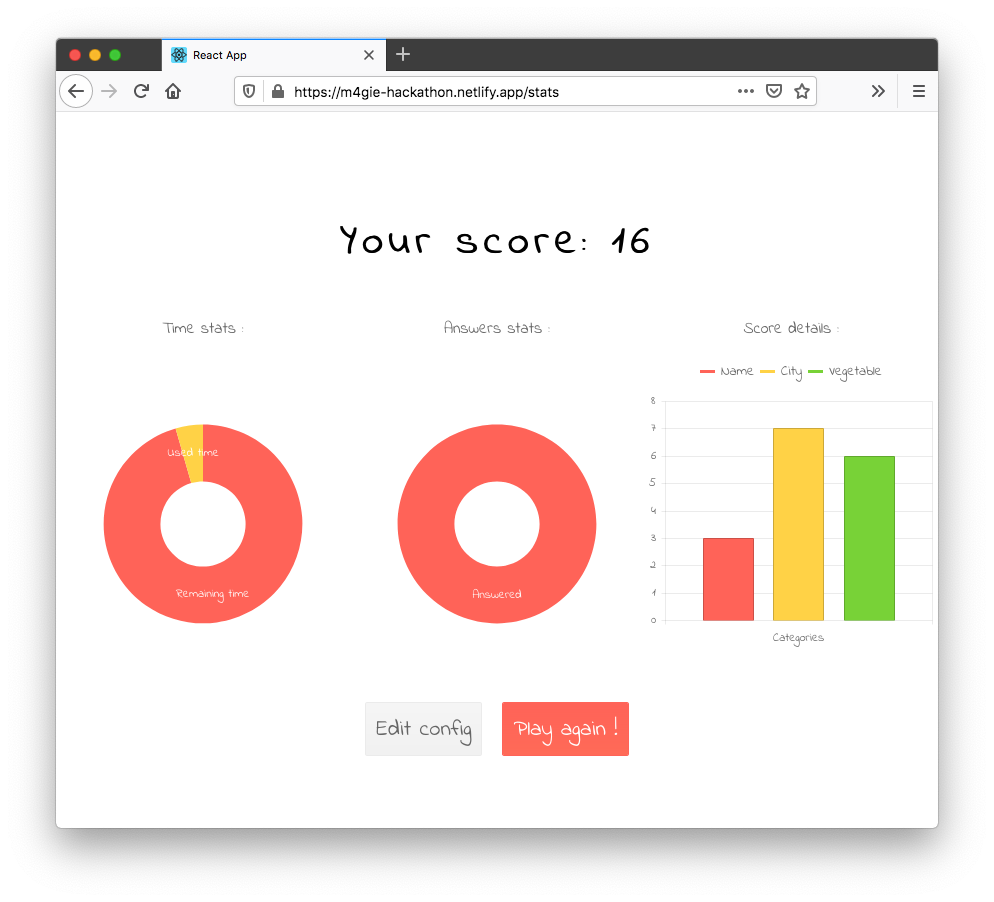

# I Watched All 27 React Europe Talks So You Don’t Have To

Ok, you still might want to watch the talks—they were quite good! But we’re all busy people, so I thought you all might appreciate my notes from all twenty seven [React Europe](https://www.react-europe.org/) talks.

The notes should help you quickly get a sense of what each talk covered, so you can decide if you want to watch the full video or not.

## I have exactly one hour, which talks should I watch?

That’s a very specific question, but I have an answer.

First you should watch [_Recoil: State Management for Today's React_](#recoil), as Dave McCabe presented an interesting new way of handling global scope in React apps

Next, watch [_Excalidraw: Cool JS Tricks Behind the Scenes_](#excalidraw), as Christopher Chedeau discussed the challenges him and his team solved building a really useful drawing app.

Technically, watching these two talks will take 81 minutes, but if you watch at 1.25 speed on YouTube you can get it done in an hour 😉

## Do you need to shamelessly plug anything before providing your useful notes?

What a convenient question!

We at [KendoReact](https://www.telerik.com/kendo-react-ui/) held a virtual hackathon at the event, which led to a lot of awesome React apps built with our UI components. We wanted to give a special shout out to the winner, Steeven Regnault, as he built a [fun little game using KendoReact and Recoil](https://www.youtube.com/watch?v=RX9IbyY090o&feature=youtu.be).

Ok, on to the talk notes. Enjoy 🙂

## State of React Animations

* Speaker: [John Adetutu](https://twitter.com/johnadetutu93)
* [react-spring](https://www.react-spring.io/) is a powerful way to create animations in React.
* react-spring has series of hooks that allow you to separate your UI code from your animation logic.
* Check out this talk if you’re looking to add some more robust ways to configure animations in your React apps.

<iframe width="560" height="315" src="https://www.youtube.com/embed/wLhRd0BldNE" frameborder="0" allow="accelerometer; autoplay; encrypted-media; gyroscope; picture-in-picture" allowfullscreen></iframe>

## The Latest in Next.js 9.4

* Speaker: [Tim Neutkens](https://twitter.com/timneutkens)
* [Next.js](https://nextjs.org/) is a React framework with a number of features to help you build React apps faster.
  * For example you can have a `pages` directory, and files in that directory automatically become routes.
  * Automatic prefetching of links on fast connections.
  * Ways of automating static generation.
* Coming soon to Next are smarter JavaScript bundles (only shipping old JavaScript bundling for older browsers), a faster development refresh cycle, a new error overlay, improved environment support (built-in `.env` loading), redirects, Eslint integration, and React concurrent mode support.
* Check out this talk if you’re curious about Next.js and want an introduction into what it can do for you.

<iframe width="560" height="315" src="https://www.youtube.com/embed/UD98x-2mido" frameborder="0" allow="accelerometer; autoplay; encrypted-media; gyroscope; picture-in-picture" allowfullscreen></iframe>

## Bringing WebGL to React

* Speaker: [Paul Henschel](https://twitter.com/0xca0a)
* [react-three-fiber](https://github.com/react-spring/react-three-fiber) is a reconciler for three.js.
  * Essentially, the library allows you to work with three.js easier by providing reusable components.
* He featured a bunch of examples that were pretty impressive. [This one](http://taotajima.jp/) and [this one](https://qf8d0.csb.app/) were my favorites, and they’re worth trying for yourself.
* Check out this talk if you’ve been thinking of trying out WebGL, as react-three-fiber makes it a lot easier for React developers.

<iframe width="560" height="315" src="https://www.youtube.com/embed/YyqBdN71nFs" frameborder="0" allow="accelerometer; autoplay; encrypted-media; gyroscope; picture-in-picture" allowfullscreen></iframe>

## Gatsby’s Roadmap and its Future

* Speaker: [Sidhartha Chatterjee](https://twitter.com/chatsidhartha)
* Static sites have have become increasingly possible over the last few years.
* Gatsby allows you to build static sites using React that you can serve from a CDN.
* Some limitations of static sites are really big sites, and sites that update very frequently.
* Gatsby Flow helps solve the problem of large sites with incremental builds.
* Gatsby streaming builds is an upcoming service that helps sites that need to update frequently.
* Watch this talk if you’re interested in Gatsby, and some of the new services its working on.

<iframe width="560" height="315" src="https://www.youtube.com/embed/yHicxrK1HOI" frameborder="0" allow="accelerometer; autoplay; encrypted-media; gyroscope; picture-in-picture" allowfullscreen></iframe>

## Render Props are Not Dead

* Speaker: [Erik Rasmussen](https://twitter.com/erikras)
* Render props greatly simplified the process of managing state in React components.
* Render props killed higher-order components. (https://twitter.com/mjackson/status/885910701520207872)
* Render props allow you to inject state without forcing a re-render of your entire component. Using hooks you have to create custom components every time to achieve this.
* This talk was one of my favorites as Erik is an amazing presenter. I’d say this one is worth watching for all React developers, but especially if you (like me), don’t understand render props well and want to learn more.

<iframe width="560" height="315" src="https://www.youtube.com/embed/pn0pIgdQvhU" frameborder="0" allow="accelerometer; autoplay; encrypted-media; gyroscope; picture-in-picture" allowfullscreen></iframe>

## Rejecting bongo kittens, achieving 3D blooms, and other lessons learned

* Speaker: [Josh Comeau](https://twitter.com/joshwcomeau)
* Josh is an avid Beat Saber player, but hated the community-built UI for building custom tracks for the game.
* [Three.js](https://threejs.org/) makes working with 3D user interfaces significantly easier, and react-three-fiber makes live even easier for React developers.
* <https://bruno-simon.com/> is an awesome example of three.js in action.
* Check out this talk if you want to hear a fun story of building up a tool for a community. I enjoyed it 🙂

<iframe width="560" height="315" src="https://www.youtube.com/embed/9u0VapB-AbE" frameborder="0" allow="accelerometer; autoplay; encrypted-media; gyroscope; picture-in-picture" allowfullscreen></iframe>

## Beyond Responsive Design: Building Mobile-Optimized Websites in React

* Speaker: [Alex Holachek](https://twitter.com/alex_holachek)
* Taps on mobile are not the same as clicks on desktop, and you can’t handle them the same.
* You can use `@media (pointer: fine)` to limit active and hover states to non-touch devices.
* For best customizability and cross-platform performance, it makes sense to apply & remove tap states with JavaScript.
* We need to strike a balance between applying the tap state fast enough for responsiveness (<100 ms), but not so fast the user accidentally triggers it when making another gesture like scroll.
* [bundle-wizard](https://github.com/aholachek/bundle-wizard) is a handy tool Alex built to visualize your JS bundles for any specific page of your app.
* This is a great talk for anyone building responsive apps, as there are a number of great tips and tricks.

<iframe width="560" height="315" src="https://www.youtube.com/embed/W6_KxNvRxr4" frameborder="0" allow="accelerometer; autoplay; encrypted-media; gyroscope; picture-in-picture" allowfullscreen></iframe>

## Transforming GraphQL

* Speaker: [Nader Dabit](https://twitter.com/dabit3)
* GraphQL Transform helps you quickly create backends for your apps, with features that allow you to scaffold out database calls and CRUD operations, configure authentication workflows, rapidly prototype APIs, and more.
* Check out this talk if you want to learn more about what AWS offers for GraphQL tooling.

<iframe width="560" height="315" src="https://www.youtube.com/embed/yR-gJ2hMIPk" frameborder="0" allow="accelerometer; autoplay; encrypted-media; gyroscope; picture-in-picture" allowfullscreen></iframe>

## Kubernetes by Keytar

* Speaker: [Jan Klienert](https://twitter.com/jankleinert)
* Kubernetes is an open-source system for automating deployment, scaling, and management of containerized applications.
* Jan literally hooked up a keytar to a Kubernetes API. You kind of have to see it for yourself, but it was a pretty creative way of teaching some of the features and terms around Kubernetes.
* Check out the talk if you’re looking to learn some Kubernetes basics.

<iframe width="560" height="315" src="https://www.youtube.com/embed/P9n8I3aGpQ0" frameborder="0" allow="accelerometer; autoplay; encrypted-media; gyroscope; picture-in-picture" allowfullscreen></iframe>

## Expo: Universal React

* Speaker: [Evan Bacon](https://twitter.com/Baconbrix)
* Expo makes working with React Native apps easier.
* `npx create-react-native-app` makes allows you to start a React Native app fast.
* Expo Snack lets you code React Native apps in the browser.
* Expo has new tools to let you authenticate with multiple different providers.
* [expo-html-elements](https://github.com/expo/expo/tree/master/packages/html-elements) helps you build elements that work across native and web apps.
* Expo is working on making their fast refresh work faster across web, iOS, and Android.
* Check out this talk if you’re looking for a deep dive into the tooling Expo offers for building universal React apps.

<iframe width="560" height="315" src="https://www.youtube.com/embed/uyZslq7Jsno" frameborder="0" allow="accelerometer; autoplay; encrypted-media; gyroscope; picture-in-picture" allowfullscreen></iframe>

## Building a Design Tool for React in React

* Speaker: [Sanket Sahu](https://twitter.com/sanketsahu)
* Builder X is a browser-based design tool for helping you build React and React Native apps.
* Sanket talked about some of the challenges building the tool, like how they optimized performance, and how they implemented undo / redo.
* Check out the talk if want to hear a story about building a design tool, and some of the challenges that Sanket’s team faced.

<iframe width="560" height="315" src="https://www.youtube.com/embed/31pjm-ifL20" frameborder="0" allow="accelerometer; autoplay; encrypted-media; gyroscope; picture-in-picture" allowfullscreen></iframe>

## Hijacking CSS With TailwindCSS

* Speaker: [Horacio Herrera](https://github.com/horacioh)
* [Tailwind CSS](https://tailwindcss.com/) is a utility-first CSS framework—basically it’s a whole bunch of CSS classes 🙂
* Tailwind makes CSS pseudo-class rules easy to apply, for example `className="hover: bg-blue-300"`.
* Tailwind is built on top of [PostCSS](https://postcss.org/).
* [PurgeCSS](https://purgecss.com/) is a tool to remove unused CSS from your code, and there’s a plugin to make it work with PostCSS.
* Check out this talk if you’re looking for an introduction to Tailwind CSS, and to see if it’s a good fit for your apps.

<iframe width="560" height="315" src="https://www.youtube.com/embed/VfvTuw90QkA" frameborder="0" allow="accelerometer; autoplay; encrypted-media; gyroscope; picture-in-picture" allowfullscreen></iframe>

<h2 id="recoil">Recoil: State Management for Today's React</h2>

* Speaker: [David McCabe](https://github.com/davidmccabe)
* David’s team at Facebook hit some limits with state management, and they built a library to help solve them.
* The tool offers a flexible shared state, derived data and queries, and app-wide state observation.
* The name of the library is [Recoil](https://recoiljs.org/).
* Recoil makes it easy to store app-wide state, which makes it easier to do time-travel debugging, and to do things like easily sharing the app state through a URL.
* The tool is experimental for now and the team is looking for feedback.
* This talk is a must watch. Everyone needs state management in React, and Recoil is an interesting new approach for making state management easier.

<iframe width="560" height="315" src="https://www.youtube.com/embed/_ISAA_Jt9kI" frameborder="0" allow="accelerometer; autoplay; encrypted-media; gyroscope; picture-in-picture" allowfullscreen></iframe>

<h2 id="excalidraw">Excalidraw: Cool JS Tricks Behind the Scenes</h2>

* Speaker: [Christopher Chedeau](https://twitter.com/vjeux)
* [Excalidraw](https://excalidraw.com/) is an app for drawing hand-drawn-like diagrams.
* Christopher did a pretty neat explanation of how they coded drawing lines with a bit of randomness so that they look hand drawn.
* Christopher also went over a number of the steps he took to make all data Excalidraw uses encrypted end to end.
* I really enjoyed this talk, as it was a fun story behind a useful tool. I’d recommend everyone check this one out.

<iframe width="560" height="315" src="https://www.youtube.com/embed/fix2-SynPGE" frameborder="0" allow="accelerometer; autoplay; encrypted-media; gyroscope; picture-in-picture" allowfullscreen></iframe>

## Design System and Accessibility

* Speaker: [Devon Govett](https://twitter.com/devongovett)
* Building a set of UI components to use throughout your company is a huge challenge, especially as you consider accessibility, internationalization, and so on. (A problem we’re very familiar with at KendoReact 🙂 )
* Devon covers a number of techniques his team used to solve some of these challenges, like dealing with UI challenges on mobile, and making components screen-reader friendly.
* Adobe is building a tool for making these things easier called React-Aria, and will be open sourcing it by the end of the month.
* Check out this talk if you’d like to hear how Adobe is addressing accessibility in a new tool they’re building.

<iframe width="560" height="315" src="https://www.youtube.com/embed/dxDcBB7Xoxs" frameborder="0" allow="accelerometer; autoplay; encrypted-media; gyroscope; picture-in-picture" allowfullscreen></iframe>

## Flipper: The Extensible DevTool Platform for React Native

* Speaker: [Michel Weststrate](https://twitter.com/mweststrate)
* React Native offers an incredibly fast development experience.
* [Flipper](https://fbflipper.com/) is an platform for debugging iOS, Android, and React Native apps.
* Flipper includes crash debugging.
* Flipper also works for native apps, so it also allows you to dig into the native components that make up your apps.
* Flipper is extensible, and has community-built plugins. You can also build app-specific plugins to meet your needs.
* Michel did several demos showing Flipper in action, and it was pretty impressive. The talk is definitely worth watching if you’re building React Native apps today.

<iframe width="560" height="315" src="https://www.youtube.com/embed/WltZTn3ODW4" frameborder="0" allow="accelerometer; autoplay; encrypted-media; gyroscope; picture-in-picture" allowfullscreen></iframe>

## Detecting the unexpected in React applications

* Speaker: [Nicolas Dubien](https://twitter.com/ndubien)
* A race condition is the condition where the system’s behavior is dependent on a sequence of events in a specific order.
* Race conditions are a common source of bugs in web apps, and are difficult to test for.
* [fast-check](https://github.com/dubzzz/fast-check) is a testing tool that can help you test for potential race condition issues in your code, by randomly reordering events.
* It looks like a pretty neat utility, and is worth checking out if you want to help protect against race conditions in your React apps.

<iframe width="560" height="315" src="https://www.youtube.com/embed/GIPbY75-lEo" frameborder="0" allow="accelerometer; autoplay; encrypted-media; gyroscope; picture-in-picture" allowfullscreen></iframe>

## Let’s Make Development Fast Again!

* [Ives van Hoorne](https://twitter.com/CompuIves)
* The average recompilation time in a React app is around ~2 seconds.
* Reducing your refresh cycle is a great way to make your team more productive.
* There are a new class of bundlers focused mainly on development, including Snowpack, Vite, and Sandpack.
* Sandpack is what CodeSandbox uses. Sandpack doesn’t do any concatenation, and does all of its reloading via the browser itself.
* [React Fast Refresh](https://reactnative.dev/docs/fast-refresh) allows you to reload your CSS and even components without refreshing your browser.
* The talk was interesting, and is worth checking out if you’re looking to speed up your development workflow.

<iframe width="560" height="315" src="https://www.youtube.com/embed/Yu9zcJJ4Uz0" frameborder="0" allow="accelerometer; autoplay; encrypted-media; gyroscope; picture-in-picture" allowfullscreen></iframe>

## Blitz.js & the Future of Fullstack

* Speaker: [Brandon Bayer](https://twitter.com/flybayer)
* [Blitz](https://github.com/blitz-js/blitz) is a Rails-like framework for monolithic, full-stack React apps — built on Next.js
* Blitz does a lot for you out of the box, including ESLint, prettier, Husky hooks, and more.
* Blitz uses [Prisma](https://www.prisma.io/) for databases, and integrates everything for you.
* Blitz is still in alpha, but it’s ready to test out today.
* The talk is worth checking out if want to take an early look at a full-stack, opinionated way to build React apps.

<iframe width="560" height="315" src="https://www.youtube.com/embed/H93WAFrlCkQ" frameborder="0" allow="accelerometer; autoplay; encrypted-media; gyroscope; picture-in-picture" allowfullscreen></iframe>

## Learn React Hooks By Building An Auth Based To Do App

* Speaker: [Luke Mwila](https://twitter.com/Luke9ine)
* Rule #1: Always use hooks at the top level of your React function.
* Rule #2: Don’t call hooks
* Custom hooks are a great way to share common logic across components in your applications.
* The code examples from the talk are [available on GitHub](https://github.com/LukeMwila/react-hooks-by-example).
* The talk is a great overview of the basic React hooks by seeing them in action.

<iframe width="560" height="315" src="https://www.youtube.com/embed/4MrzAUYfSSs" frameborder="0" allow="accelerometer; autoplay; encrypted-media; gyroscope; picture-in-picture" allowfullscreen></iframe>

## Gamedev on React + WebGL

* Speaker: [Korotaev Alexander](https://twitter.com/mamu_eval)
* [PixiJS](https://www.pixijs.com/) is the most popular WebGL renderer.
* [react-pixi-fiber](https://github.com/michalochman/react-pixi-fiber) is a library that lets you use PixiJS in a React declarative style.
* SVG is great for WebGL use because it scales up while remaining high quality.
* React can be slow for game development. Avoid `setState()` for animations, and use custom components for critical parts of your apps.
* The talk is worth checking out if you’re looking to get into game development with React, as there are lots of great tips and tricks.

<iframe width="560" height="315" src="https://www.youtube.com/embed/1UCf-GR66Gc" frameborder="0" allow="accelerometer; autoplay; encrypted-media; gyroscope; picture-in-picture" allowfullscreen></iframe>

## Scalability - React Native Architecture at Wix

* Speaker: [Omri Bruchim](https://twitter.com/omribruchim)
* Wix is an app written in React Native with 650+ screens.
* This talk is worth watching if you build large React Native apps, and are looking for tips on how to scale your apps. Omri talks about how Wix organizes their teams, such that developers can work on different parts of their app while minimizing conflicts.

<iframe width="560" height="315" src="https://www.youtube.com/embed/jHEceWEB15k" frameborder="0" allow="accelerometer; autoplay; encrypted-media; gyroscope; picture-in-picture" allowfullscreen></iframe>

## How does Material-UI build components?

* Speaker: [Olivier Tassinari](https://twitter.com/olivtassinari)
* Material UI is a suite of React components.
* Olivier walks through the decision making process that Material UI takes when considering new features and new components.
* You need to be careful adding new features, because once added features are nearly impossible to remove—no one likes breaking changes.
* Check out the talk if you’re looking for a deeper dive into the Material UI components.

<iframe width="560" height="315" src="https://www.youtube.com/embed/3zhNe4THPTQ" frameborder="0" allow="accelerometer; autoplay; encrypted-media; gyroscope; picture-in-picture" allowfullscreen></iframe>

## Using Expo OTA Updates in your React Native app

* Speaker: [Eric Samelson](https://github.com/esamelson)
* Sending out new builds of your mobile apps takes a very long time.
* [expo-updates](https://docs.expo.io/versions/latest/sdk/updates/) allows you to update your production apps over the air, and, you can now use it in any React Native app—not just Expo-built ones.
* Expo updates allows you to host your code on your own servers.
* Check out this talk if you develop React Native apps, and are looking to improve the way you push out production updates.

<iframe width="560" height="315" src="https://www.youtube.com/embed/Si909la3rLk" frameborder="0" allow="accelerometer; autoplay; encrypted-media; gyroscope; picture-in-picture" allowfullscreen></iframe>

## JavaScript ∩ WebAssembly

* Speaker: [Tadeu Zagallo](https://twitter.com/tadeuzagallo)
* Tadeu walks through how JavaScript VMs work at a high level, including lexing, parsing, and abstract syntax trees.
* He then discusses some of the optimizations VMs make to optimize the performance of your JavaScript code.
* And next how web assembly fits into JavaScript VMs internally.
* The talk is worth watching if you want a look into how JavaScript VMs work.

<iframe width="560" height="315" src="https://www.youtube.com/embed/PP5r_b3Ws8s" frameborder="0" allow="accelerometer; autoplay; encrypted-media; gyroscope; picture-in-picture" allowfullscreen></iframe>

## Data sync for realtime or offline apps with React and GraphQL

* Speaker: [Richard Threlkeld](https://twitter.com/undef_obj)
* With distributed systems it’s hard to get consistency, availability, and partition tolerance—usually you have to choose two.
* Caches are not databases. Users don’t want to see stale data.
* Watch this one if you’re looking for a deep dive into how AWS tackles the problem of realtime and offline data with GraphQL.

<iframe width="560" height="315" src="https://www.youtube.com/embed/nzeL1wZltf0" frameborder="0" allow="accelerometer; autoplay; encrypted-media; gyroscope; picture-in-picture" allowfullscreen></iframe>

## Jamstack + React Native

* Speaker: [Sebastien Lorber](https://twitter.com/sebastienlorber)
* React Native Web is a web rendered for React Native apps.
* To make React Native Web work with Gatsby you need to add in server-side rendering.
* Watch Sebastian’s talk if you have a React Native app, and you want to try to get it running on the web via Gatsby.

<iframe width="560" height="315" src="https://www.youtube.com/embed/dySNfw_VB-4" frameborder="0" allow="accelerometer; autoplay; encrypted-media; gyroscope; picture-in-picture" allowfullscreen></iframe>

## Relay Concepts

* Speaker: [Sibelius Seraphini](https://twitter.com/sseraphini)
* [Relay](https://relay.dev/) is a production-ready GraphQL client for React.
* Sibelius covers a number of Relay environment setup, configuring a Relay Store, the Relay Network Layer, 
* Check out this talk if you’re looking for a high-level overview of what Relay can do.

<iframe width="560" height="315" src="https://www.youtube.com/embed/FszbrKybdOY" frameborder="0" allow="accelerometer; autoplay; encrypted-media; gyroscope; picture-in-picture" allowfullscreen></iframe>

## The End!

Well, those are all my notes. Let me know in the comments if you found this article useful, as I might replicate this for future events 😉