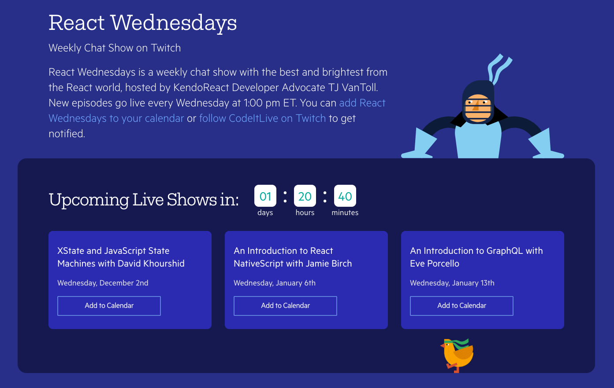

# XState and JavaScript State Machines with David Khourshid

If you’re like me, the phrase “State Machine” sounds like a term on a computer science test you didn’t study for.

Good news though—we managed to convince the one and only David Khourshid ([@DavidKPiano](https://twitter.com/DavidKPiano)) to tell us what state machines are, and why they’re important. And we’re doing it all live on [React Wednesdays](https://www.telerik.com/react-wednesdays).

## Tell me why David is awesome

David knows a little something about state machines as he is the creator of [XState](https://github.com/davidkpiano/xstate), a project that helps you build state machines and statecharts for the modern web. (And a project that has 13,000+ stars on GitHub.)

In addition to crushing it at state machines, David is also responsible for the single most impressive CSS demo I’ve ever seen.

  See the Pen <a href="https://codepen.io/davidkpiano/pen/wMqXea">
  Alex the CSS Husky</a> by David Khourshid (<a href="https://codepen.io/davidkpiano">@davidkpiano</a>)
  on <a href="https://codepen.io">CodePen</a>.

## Tell me why React Wednesdays is awesome

[React Wednesdays](https://www.telerik.com/react-wednesdays) is a weekly stream we run with experts from across the React world.

We stream on Twitch, which is a great platform for interacting with speakers. Join us to ask questions, or just to hang out on an otherwise boring Wednesday.

## Tell me how to join

David is joining us tomorrow, Wednesday, December 2nd at 1:00 PM US Eastern time. You can view the stream from the [React Wednesdays site](https://www.telerik.com/react-wednesdays), or on [Twitch](https://www.twitch.tv/codeitlive).

Join us, and let’s figure out what state machines are together 🙂

