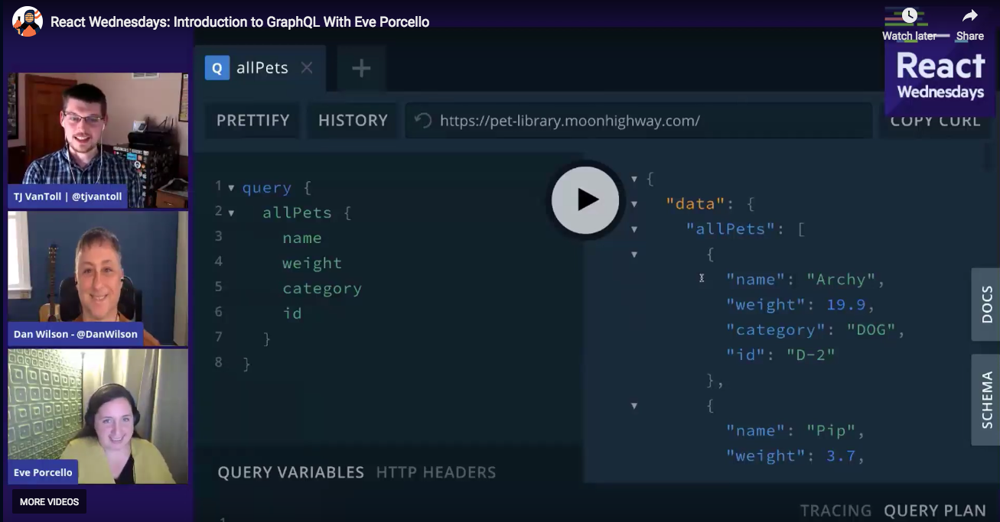
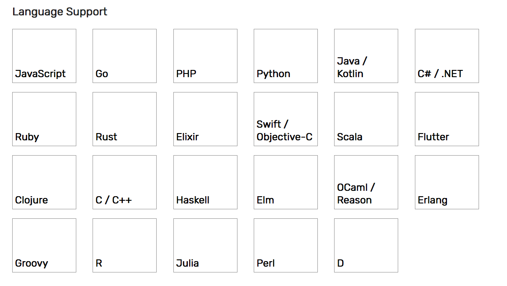

# Four Things I Learned About GraphQL From Eve Porcello

On yesterday’s [React Wednesday](https://www.telerik.com/react-wednesdays), Eve Porcello gave us an awesome introduction to GraphQL. You can (and should!) watch the [full stream](https://www.telerik.com/react-wednesdays/an-introduction-to-graphql-with-eve-porcellos), but I thought I’d quickly highlight a few things that I learned.

## 1) GraphQL backends can be written in any language

Maybe it’s because I’m a front-end developer, but I had only ever seen GraphQL examples presented with JavaScript.

But GraphQL is language agnostic, and [the official GraphQL site](https://graphql.org/code/) lists a crazy number of supported languages.

Another fun fact: the GraphQL spec has a [full type system](http://spec.graphql.org/draft/#sec-Type-System-Extensions) which is also language agnostic. I’m sure the people that work on GraphQL language parsers have some fun stories working with type edge cases 🙂

## 2) GraphQL and RESTful APIs can coexist

I had always thought of GraphQL and REST as an either-or situation—that is, your company picks GraphQL or REST, but not both.

And while it’s true that there is added maintenance for keeping both around indefinitely, Eve discussed some compelling reasons for the two to coexist.

For example, suppose your company already has RESTful APIs, but you want to experiment with GraphQL. You could start by building a GraphQL backend, but then call your RESTful APIs under the hood to do the actual data management. This gives you some ability to test out GraphQL without having to switch out your entire infrastructure.

## 3) Authorization in GraphQL is interesting

I had assumed that authorization and user roles were a part of the GraphQL specification. I was wrong.

The [GraphQL documentation](https://graphql.org/learn/authorization/) notes:

> “Authorization is a type of business logic that describes whether a given user/session/context has permission to perform an action or see a piece of data. Enforcing this kind of behavior should happen in the business logic layer.”

Aka you front end can pass around tokens (or whatever you use to manage users), and your backend should be in charge of enforcing users are authorized to access the data they’re requesting.

## 4) You can do subscriptions in GraphQL

GraphQL supports WebSocket-based subscriptions, allowing you to get data updates from your backend automatically.

It’s way cooler to see in action, so here’s a link to the [part of the stream where Eve explains it and shows it off](https://youtu.be/MCpTs7ST748?t=2335).

## Wrapping up

If you found any of this interesting, you might want to check out the [full hour-long stream](https://www.telerik.com/react-wednesdays/an-introduction-to-graphql-with-eve-porcellos), as we got into a lot more than I cover in this article.

And then check out the [React Wednesdays](https://www.telerik.com/react-wednesdays) homepage. We have streams like this every Wednesday with awesome guests. Join us and bring questions!
