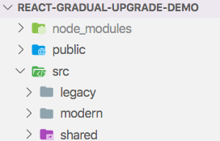
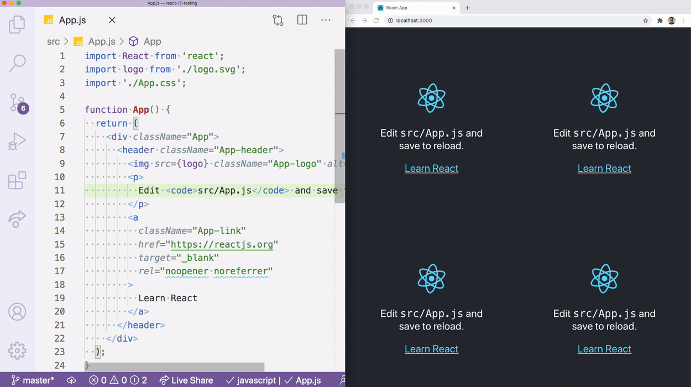

# What React 17 Means for Developers

Last week, the React team [announced a release candidate of React 17](https://reactjs.org/blog/2020/08/10/react-v17-rc.html) with the meme-friendly headline, “No New Features”.

<blockquote class="twitter-tweet"><p lang="en" dir="ltr">React 17 roadmap leaked <a href="https://t.co/gvYL5x87zE">pic.twitter.com/gvYL5x87zE</a></p>&mdash; Daniel Ramirez (@drmzio) <a href="https://twitter.com/drmzio/status/1292951064648380417?ref_src=twsrc%5Etfw">August 10, 2020</a></blockquote> <script async src="https://platform.twitter.com/widgets.js" charset="utf-8"></script> 

But despite the “No New Features” headlines, React 17 does include a few changes that all React developers should be aware of.

In this article I’ll help you get up to speed on three of the more important changes—gradual updates, changes to event delegation, and stack trace updates—then we’ll take a step back, and look at what these changes mean for the future of React as a whole.

## Gradual updates

The major focus of React 17 is to make it easier to upgrade React itself. From the release blog:

> “React 17 enables gradual React upgrades. When you upgrade from React 15 to 16 (or, soon, from React 16 to 17), you would usually upgrade your whole app at once. This works well for many apps. But it can get increasingly challenging if the codebase was written more than a few years ago and isn’t actively maintained. And while it’s possible to use two versions of React on the page, until React 17 this has been fragile and caused problems with events.”

In the enterprise world it’s common for developers to _want_ to use new framework features, but to have no ability to do so, as it’s hard to justify the time it takes to upgrade software without shipping any new features. This change in React 17 presents an interesting new upgrade workflow, where React developers can leave their existing code on a legacy version of React, while writing new code with the latest and greatest.

And there is precedence for this two-versions-of-a-framework-on-one-page workflow. For example, the Angular team has long allowed you to [run Angular 1 and Angular 2+ simultaneously](https://angular.io/guide/upgrade), and running a Google search of “running Angular one and two together” returns over 38 million results—so there’s clearly demand.

That being said, the React team wants to make it very clear that this workflow should only be used when it’s absolutely necessary.

> “For most apps, upgrading all at once is still the best solution. Loading two versions of React — even if one of them is loaded lazily on demand — is still not ideal.”

If you’re interesting in trying out this new workflow, check out the [sample app the React team shipped with the release](https://github.com/reactjs/react-gradual-upgrade-demo/). It’s well organized, and the folder structure makes it very clear which code is legacy, which is modern, and which is shared between the approaches.



## Changes to event delegation

The second big change in React 17 affects how event delegation works within React. From the blog:

> “In React 17, React will no longer attach event handlers at the document level. Instead, it will attach them to the root DOM container into which your React tree is rendered.”

This change is unlikely to affect you, as this is is an implementation detail that React didn’t expose through any APIs. But because React is now better isolated—aka the framework no longer depends on event handlers outside of its root element—that does open up some interesting possibilities.

For example, multiple React applications can now exist on the same page with little risk of conflict. For example, you could take the default Create React App application, and do something silly like this:

``` HTML
<div id="root"></div>
<div id="root2"></div>
<div id="root3"></div>
<div id="root4"></div>
```

``` JavaScript
ReactDOM.render(
  <React.StrictMode>
    <App />
  </React.StrictMode>,
  document.getElementById('root')
);

ReactDOM.render(
  <React.StrictMode>
    <App />
  </React.StrictMode>,
  document.getElementById('root2')
);

ReactDOM.render(
  <React.StrictMode>
    <App />
  </React.StrictMode>,
  document.getElementById('root3')
);

ReactDOM.render(
  <React.StrictMode>
    <App />
  </React.StrictMode>,
  document.getElementById('root4')
);
```

And with a bit CSS you could have a page with four identical React apps, which looks like this.



Although your average app shouldn’t be rendering multiple React instances, this does open up some interesting possibilities for dashboard-like apps. For example, imagine a dashboard application with a number of widgets, and all of the widgets are mini React apps.

In a more practical sense, this change to event delegation will help React play better with other frameworks. From the blog:

> “This change also makes it easier to embed React into apps built with other technologies. For example, if the outer “shell” of your app is written in jQuery, but the newer code inside of it is written with React, e.stopPropagation() inside the React code would now prevent it from reaching the jQuery code — as you would expect.”

It’s pretty common for other frameworks, especially DOM-based frameworks like jQuery, to mess with events at the document level. Now that React doesn’t use events outside of its rendering context, it’s a lot safer to introduce React into legacy apps, where you might have a bunch of older JavaScript tools you can’t easily remove.

## Better stack traces

The final change that caught my eye affects how React renders stack traces. From the blog:

> “In React 17, the component stacks are generated using a different mechanism that stitches them together from the regular native JavaScript stacks. This lets you get the fully symbolicated React component stack traces in a production environment.”

The way they accomplish this is kind of nuts.

> “The way React implements this is somewhat unorthodox. Currently, the browsers don’t provide a way to get a function’s stack frame (source file and location). So when React catches an error, it will now reconstruct its component stack by throwing (and catching) a temporary error from inside each of the components above, when it is possible.”

Woah.

But it works, and I can see this being extremely useful for production debugging. For example, suppose you use the following code to catch errors in your application.

``` JavaScript
import React from 'react';
import { ErrorBoundary } from "react-error-boundary";

function ErrorFallback({ componentStack }) {
  console.log(componentStack);

  return (
    <p style={{ color: "red" }}>Something went wrong!</p>
  )
}

function App() {
  return (
    <ErrorBoundary FallbackComponent={ErrorFallback}>
      { /* Your app */ }
    </ErrorBoundary>
  );
}
```

The `ErrorFallback` here makes use of React’s [error boundaries](https://reactjs.org/docs/error-boundaries.html) API, and logs each error’s `componentStack` each time something goes wrong. With React 16, the above code outputs less-than-helpful stack traces when something goes wrong in production.

For example. here’s a not-especially-useful trace I get when trying to call `toUpperCase()` on `null`.

```
    in s
    in i
    in u
    in StrictMode App.js:6:10
```

After upgrading the app to React 17, the stack trace now includes a link to each component’s location in the source code.

```
s@http://localhost:8000/static/js/main.15f3e38c.chunk.js:1:470
i@http://localhost:8000/static/js/2.477a9a31.chunk.js:2:1611
u
```

On its own this isn’t especially helpful—unless you’re awkwardly aware of what `2.477a9a31.chunk.js:2:1611` is—but if you combine these stack traces with source maps and an error symbolicator like Sentry, you’ll have the ability to get full component stack traces of production errors.

It’s definitely a feature that’s worth playing with if you struggle debugging your production React errors at all.

## The future of React

Overall, React 17 is aimed at making React more stable and easier to upgrade, but what does that mean for the future of React? From the blog:

> “We’re actively working on the new React features, but they’re not a part of this release. The React 17 release is a key part of our strategy to roll them out without leaving anyone behind.”

When you operate at the scale of React, it’s almost impossible to introduce changes without segmenting your userbase.

Consider React hooks. Although hooks weren’t a breaking change, they segmented all online documentation and tutorials into two groups—those that use hooks, and those that don’t. Here at Progress we’ve felt this struggle firsthand, as some of our [KendoReact](https://www.telerik.com/kendo-react-ui/) users prefer to see documentation with hooks, some prefer to see documentation with class components, and some want both to be available. Obviously we want to make all users happy, but there are only so many permutations of React versions and APIs we can feasibly support.

With this context in mind, I’m reassured that the React team spent a release focusing on the experience of your average React developer, and is putting forth an effort to improve the upgrade path. Hopefully this will make future React features easier for everyone to use 🤞