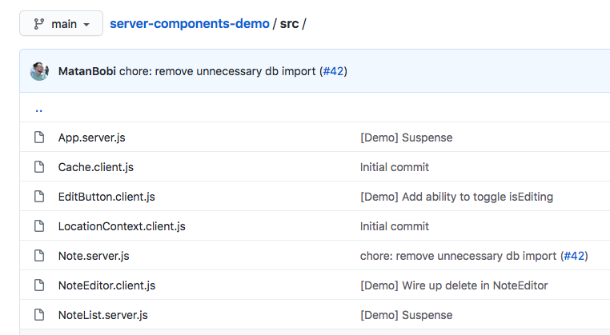

# Should You Care About React Server Components?

As developers we’re busy people, and we don’t always have time to evaluate the JavaScript world’s myriad of frameworks and tools.

In this article I want to help you quickly decide whether one of the latest feature announcements, [React Server Components](https://reactjs.org/blog/2020/12/21/data-fetching-with-react-server-components.html), is something that you should check out immediately, or whether you should wait and see.

Let’s start by quickly looking at what React Server Components are, and then discuss what problems they solve.

## What are React Server Components?

React Server Components are a new experimental feature of React. Here’s how the React team describes the feature:

> “Server Components allow developers to build apps that span the server and client, combining the rich interactivity of client-side apps with the improved performance of traditional server rendering.”

The _client_ in the context of Server Components is a web browser. Although React can run in other clients—aka React Native running on iOS and Android—this spec is currently only concerned with the web.

The _server_ in the context of Server Components is a JavaScript-based backend like [Express](https://expressjs.com/).

The idea here is Server Components give you the ability to selectively move components from the _client_, where the browser executes them, to the server, where something like Express executes them.

To make it easy to tell the difference, Server Components introduces a new naming convention, where `.server.js` files are server components, `.client.js` files are client components, and regular `.js` files are files that can run in both environments.


_An example of the new naming convention in action from the [React team’s Server Components demo](https://github.com/reactjs/server-components-demo)_

## Wait, why would I want to do any of this?

Rendering components on a server has a number of potential benefits. The React team’s [full writeup on server components](https://github.com/josephsavona/rfcs/blob/server-components/text/0000-server-components.md) lists these benefits in great detail, but I’ll summarize what I think are the most important ones here.

### Benefit #1: Using third-party dependencies without a file size penalty

One of best-known web performance tips is to minimize the amount of code you ship to your users. As such, front-end developers are hesitant to add large dependencies to their applications, even if those dependencies would save us a lot of time and effort.

Server Components offer an interesting solution to this problem. Because Server Components can live on a server (and not a client), their dependencies can live on the server as well—allowing you to use dependencies with zero impact on the size of your client-size bundles.

For example, suppose you’re writing an application that displays user-written Markdown. Two libraries that can help you do that are [marked](https://www.npmjs.com/package/marked), which parses Markdown, and [sanitize-html](https://www.npmjs.com/package/sanitize-html), which cleans up user-written HTML, including removing potential [XSS](https://en.wikipedia.org/wiki/Cross-site_scripting) attacks.

You could then write a component that looks something like this:

``` JavaScript
/* RenderMarkdown.js */
import marked from 'marked'; // 35.9K (11.2K gzipped)
import sanitizeHtml from 'sanitize-html'; // 206K (63.3K gzipped)

export function RenderMarkdown({text}) {
  const sanitizedHtml = sanitizeHtml(marked(text));
  return <div>{sanitizedHtml}</div>
}
```

No developer wants to write their own Markdown parser or HTML sanitizer (ok maybe some of you do), but a lot of developers are hesitant to add ~75K of JavaScript to their client-side bundles. Not only does that ~75K have to go across a network, the user’s browser also has to interpret that JavaScript code before it can be used.

As a Server Component those dependencies are already installed, and therefore you pay zero file-size penalty for using them. And as a bonus, switching the above implementation to be a Server Component is as easy as renaming `RenderMarkdown.js` to `RenderMarkdown.server.js`.

``` JavaScript
/* RenderMarkdown.server.js */
// Same code, but now these dependencies have no client-side penalty
import marked from 'marked';
import sanitizeHtml from 'sanitize-html';

export function RenderMarkdown({text}) {
  const sanitizedHtml = sanitizeHtml(marked(text));
  return <div>{sanitizedHtml}</div>
}
```

Before you get too excited, it’s important to know there are some limitations to Server Components that will keep you from removing a lot of your client-side dependencies.

Server Components cannot have state (they’re on a server after all), and you cannot use APIs like `useState()` and `useEffect()`. Therefore, most of your dependencies that involve the UI will still have to live on the client, as UI code almost always has to respond to user actions.

Still, being able to remove some of your code to the server has the potential to lead to large performance gains for some apps. Facebook stated that [their first production experiments with Server Components allowed them to remove almost 30% of their code from the client](https://www.youtube.com/watch?v=TQQPAU21ZUw&t=2994s).

### Benefit #2: Accessing your backend fast

## So should I care?

## If I do care how can I try them?


---
---
---
---
---
---
---
---
---
---
---
---
---
---
<div style="margin-bottom: 1000px;"></div>


## Limitations of Server Components?

* Have to have a JavaScript server
* More complexity
  * Although this should be limited in the future as frameworks like Next.js handle some of the complexity for you.
