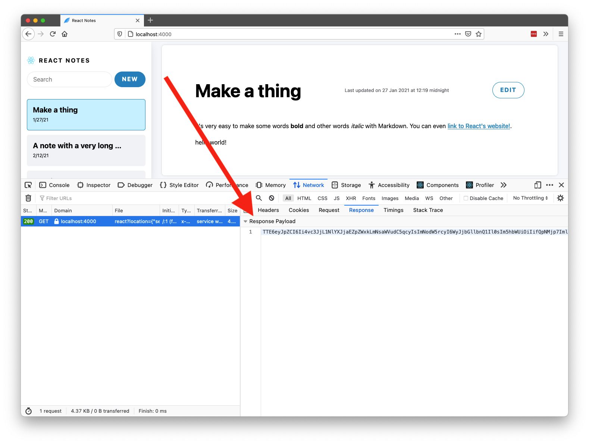

# Should You Care About React Server Components?

Developers are busy people, and we don’t always have time to evaluate the JavaScript world’s myriad of frameworks and tools.

In this article I want to help you decide whether [React Server Components](https://reactjs.org/blog/2020/12/21/data-fetching-with-react-server-components.html) is something that you should check out immediately, or whether you should wait.

We’ll start by looking at what React Server Components are, then discuss what problems they solve, and wrap up with a conversation on whether you should care or not. Let’s get started.

## What are React Server Components?

React Server Components are a new experimental feature of React. Here’s how [the React team describes the feature](https://github.com/josephsavona/rfcs/blob/server-components/text/0000-server-components.md):

> “Server Components allow developers to build apps that span the server and client, combining the rich interactivity of client-side apps with the improved performance of traditional server rendering.”

The _client_ in the context of Server Components is a web browser. Although React can run in other clients—aka React Native running on iOS and Android—the Server Components feature is currently only concerned with the web.

The _server_ in the context of Server Components is a JavaScript-based backend like [Express](https://expressjs.com/).

The idea is, Server Components give you the ability to selectively move components from the _client_, where the browser executes them, to the server, where something like Express executes them.

To make it easy to tell the difference, Server Components introduces a new naming convention, where `.server.js` files are server components, `.client.js` files are client components, and regular `.js` files are files that can run in both environments.


_An example of the new naming convention in action from the [React team’s Server Components demo](https://github.com/reactjs/server-components-demo)_

## Wait, why would I want to do any of this?

Rendering components on a server has a number of potential benefits. The React team’s [full writeup on server components](https://github.com/josephsavona/rfcs/blob/server-components/text/0000-server-components.md) lists these benefits in great detail, but I’ll summarize what I think are the most important ones here.

### Benefit #1: Using third-party dependencies without a file size penalty

One of best-known web performance tips is to minimize the amount of code you ship to your users. As such, front-end developers are hesitant to add large dependencies to their applications, even if those dependencies would save us a lot of time and effort.

Server Components offer an interesting solution to this problem. Because Server Components can live on a server (and not a client), their dependencies can live on the server as well—allowing you to use dependencies with zero impact on the size of your client-size bundles.

For example, suppose you’re writing an application that displays user-written Markdown. Two libraries that can help you do that are [marked](https://www.npmjs.com/package/marked), which parses Markdown, and [sanitize-html](https://www.npmjs.com/package/sanitize-html), which cleans up user-written HTML, including removing potential [XSS](https://en.wikipedia.org/wiki/Cross-site_scripting) attacks.

By using those two libraries you can write a simple React component that looks something like this:

``` JavaScript
/* RenderMarkdown.js */
import marked from 'marked'; // 35.9K (11.2K gzipped)
import sanitizeHtml from 'sanitize-html'; // 206K (63.3K gzipped)

export function RenderMarkdown({text}) {
  const sanitizedHtml = sanitizeHtml(marked(text));
  return <div>{sanitizedHtml}</div>
}
```

If you’re writing this component today you have to do a cost-benefit analysis. Are the conveniences of marked and sanitize-html worth the ~75K of JavaScript being added to your client-side bundle, as well as the performance hit of having your users’ browsers interpret an extra ~75K of JavaScript code at runtime?

Now let’s look at a version of this component that can run on a server as a Server Component.

``` JavaScript
/* RenderMarkdown.server.js */
// Same code, but now these dependencies have no client-side penalty
import marked from 'marked';
import sanitizeHtml from 'sanitize-html';

export function RenderMarkdown({text}) {
  const sanitizedHtml = sanitizeHtml(marked(text));
  return <div>{sanitizedHtml}</div>
}
```

The only code difference in this version is the file name (`RenderMarkdown.server.js` instead of `RenderMarkdown.js`), but the behavior difference is fairly substantial. With this version of RenderMarkdown, your user never has to download or interpret marked or sanitize-html, but you still get the benefit of using both to keep Markdown implementation clean.

This is pretty cool, but before you get too excited, there are some Server Components limitations that will keep you from removing a lot of your client-side dependencies. Here’s the full of things a Server Component can _not_ do from the [React team’s Server Components RFC (Request for Comments)](https://github.com/josephsavona/rfcs/blob/server-components/text/0000-server-components.md#sharing-code-between-server-and-client).


*List of Server Components limitations*

The big ones here are Server Components cannot have state and cannot work with DOM APIs, which means all of your components that use things like `useState()` or `onChange` are not eligible. This is a big limitation because a whole lot of UI components rely on state and DOM APIs—meaning, a lot of your dependencies will have to remain on the client.

Still, being able to remove some of your code to the server has the potential to lead to noticeable performance gains, especially for larger apps. Facebook stated that [their first production experiments with Server Components allowed them to remove almost 30% of their code from the client](https://www.youtube.com/watch?v=TQQPAU21ZUw&t=2994s), which is a big deal.

And being able to move code to the server is not the only benefit of Server Components.

### Benefit #2: Accessing your backend fast

Accessing data is one of the most expensive tasks in modern front-end applications. Because most applications store their data remotely (aka not on the client), getting the data you need involves network calls, and trying to reduce the number of network calls you make, while also keeping your code clean and maintainable, can be a big challenge.

Server Components have the ability to help here, as you now have the ability to move data-access components to a server, which can access data storage much faster.

For example, suppose you have a header component that needs to retrieve notifications, a user’s profile, and a user’s subscription. Here’s one way you could write that component today.

``` JavaScript
// Header.js
export function Header() {
  const [notifications, setNotifications] = React.useState([]);
  const [profile, setProfile] = React.useState({});
  const [subscription, setSubscription] = React.useState({});

  React.useEffect(() => {
    fetch('https://api.mycompany.com/notifications')
      .then(res => res.json())
      .then(data => { setNotifications(data); })
    fetch('https://api.mycompany.com/profile')
      .then(res => res.json())
      .then(data => { setProfile(data); })
    fetch('https://api.mycompany.com/subscription')
      .then(res => res.json())
      .then(data => { setSubscription(data); })
  }, []);

  return (
    <div>
      {...}
    </div>
  )
}
```

This approach is not ideal, as your component must wait for three separate network requests to completely render, which is not only potentially slow, but also might lead to race conditions, depending on how you use this data.

There are ways around this. For example you could ask a backend developer to build an API just for your header, that returns exactly what you need from multiple locations. But UI-specific APIs aren’t reusable, and therefore difficult to maintain over time. You could also use something like [GraphQL](https://graphql.org/) to aggregate your backend API calls, but GraphQL isn’t an option for every company.

React Server Components offers an interesting new approach to this problem, by allowing you to access your data directly on the server. For example, consider this update to the header that lets you access a database right in your component.

``` JavaScript
// Header.server.js
import db from 'my-database-of-choice';

export function Header() {
  const notifications = db.notifications.get();
  const profile = db.profile.get();
  const subscription = db.subscriptions.get();

  return (
    <div>
      {...}
    </div>
  )
}
```

With Server Components, because you’re running on a server, you have the ability to access server-side resources without making a network round trip. And this ability lets you write cleaner code, as you don’t need to write a bespoke backend API just for the UI, or architect your components to reduce as many network calls as possible.

That being said, even though the ability to quickly access server-side resources is cool, it’s also not without downsides—the big one being, this is all highly dependent on your backend setup. You stand to gain a lot if your server-side resources are JavaScript-based, but if your server-side resources are in a completely different ecosystem (Java, .NET, PHP, etc), you’ll have a hard time actually gaining much from a Server Component architecture.

Before we wrap up let’s look at some of the other limitations of Server Components.

> **NOTE**: I’m only hitting the high-level benefits of server components to keep this discussion brief. If you want to read about all the benefits, I’d recommend reading through [the section on Server Components benefits from the React team’s RFC](https://github.com/josephsavona/rfcs/blob/server-components/text/0000-server-components.md#motivation).

## What are the issues with Server Components?

After spending time with Server Components my biggest complaint is the complexity it introduces to React applications.

For example, as I started to play around with the [React team’s Server Components demo](https://github.com/reactjs/server-components-demo), I realized I had to fundamentally change how I approached building components. Instead of just creating a new file and typing `export const MyComponent = () => {}`, I now had to start thinking about how the component would be used, to help determine whether it was a better fit for the client or the server.

And that’s just when creating the components. As Server Components advance, some of those same concerns are going to apply to how you unit test your components (which remember, can live in multiple environments), and also how to debug these components when things go wrong.

For example, currently React Server Components return “a description of the rendered UI, not HTML”, which I’m sure is important to the implementation, but it does mean that the response you see in your developer tools looks like nonsense.


*The output of Server Components is... not exactly debuggable*

To be fair, most of these limitations come from Server Components being so new. The React team has stated that they expect most of the initial adoption to be through frameworks like [Next.js](https://nextjs.org/) early on, so it would make sense that some of these workflows are a bit rough today.

## So should you care?

In my opinion there are a three groups of people that should care about Server Components today.

**1) If you are a developer on a framework like Next.js.**

Frameworks like Next.js are a logical consumer of React Server Components, as Next.js is already a framework that users server-side code to help React apps run faster.

These frameworks also have the ability to help hide some of the messy implementation details of the underlying React implementation, making it easier for your average developer to use.

**2) If your company is operating at Facebook’s scale.**

In its current state, React Server Components introduces a lot of complexity for small performance gains.

For companies like Facebook this sort of tradeoff makes sense, as they have the engineering capacity to deal with this complexity, and marginal performance gains are a big deal for web applications operating at Facebook’s scale.

For most companies though, Server Components isn’t worth evaluating in its current state. You can wait until the feature stabilizes, or appears in a framework like Next.js

**3) If you like tinkering with the latest and greatest.**

The reason I looked into Server Components is I think they’re a cool idea with a lot of potential. The line between the client and server is getting blurry in the front-end world, and I think we’re going to see more experiments that try to mix and match the two environments to help developers build the best possible web applications.

With that in mind, if you’re the type of person that likes to experiment with the latest and greatest, React Server Components is well worth trying. The [Server Components intro video](https://reactjs.org/blog/2020/12/21/data-fetching-with-react-server-components.html) is excellent, [the React team’s RFC](https://github.com/josephsavona/rfcs/blob/server-components/text/0000-server-components.md) is a well-written guide that details how everything works. There’s also an [open pull request where you can submit your own feedback](https://github.com/reactjs/rfcs/pull/188) on the feature.

## Final words

Overall, Server Components is still too early for your average developer to care about, but it’s a fascinating idea with a lot of potential for those that want to guide the future of React and web development.

<hr />
<hr />
<hr />

## Master the Art of React UI with KendoReact

[](https://www.telerik.com/kendo-react-ui/)

[KendoReact](https://www.telerik.com/kendo-react-ui/) is a professional UI components and data visualization library for React on a mission to help you design and build business apps with React much faster. With KendoReact, developers get an immediate productivity boost and businesses get shorter time-to-market. Designed and built from the ground up for React, KendoReact plays well with any existing UI stack. Its 90+ customizable and feature-rich components make it the perfect foundation for your internal UI library.
 
Built by a team with 10+ years of experience in making enterprise-ready components, this library is lightning fast, highly customizable and fully accessible, delivering support for WCAG 2.1, Section 508, and WAI-ARIA a11y standards. You can find detailed accessibility compliance information [here](https://www.telerik.com/kendo-react-ui/components/accessibility/accessibility-compliance/).
