# How to Secure Your Front-End Code by Moving it to the Cloud

Front-end code is inherently insecure. Yes, you can mangle your code with something like [UglifyJS](https://github.com/mishoo/UglifyJS), or use more a more advanced obfuscation tool like [Jscrambler](https://jscrambler.com/), but at the end of the day, the public nature of front-end code means it’s accessible to nefarious users.

The tried-and-true solution to this problem has been moving sensitive code to the server, which works, but can be time consuming—especially in organizations where the server-side infrastructure is a hot mess of Java, .NET, and SAP code that has evolved over many decades.

In this article we’ll look at a modern approach to moving front-end code to the cloud using a [serverless](https://en.wikipedia.org/wiki/Serverless_computing) approach. We’ll look at two examples: one where you’ll hide a third-party API key in a serverless function, and another where you’ll move a JavaScript algorithm to the cloud.

Let’s get started.

## Scenario 1: Hiding a third-party API key

For our first scenario, suppose you’re working on an app that has a screen that shows the current weather in the user’s location.

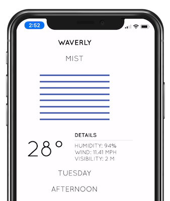

To get this data you use an API provided by [OpenWeatherMap](https://openweathermap.org/), which allows you to get weather data after signing up for an API key. Because OpenWeatherMap charges based off the number of calls you make, you don’t want your API key to fall into the wrong hands, and you therefore don’t want to ship that key in your client-side code.

This is a scenario where a serverless approach works really well. By leveraging the cloud, you can quickly and easily move this functionality out of your client-side code. Not only do you get to move your key to a safe location, you also get a cloud function on a server you don’t have to maintain, and you get a function you can use across multiple applications.

There are a number of different serverless providers, but for this articles’ examples we’ll use [Progress Kinvey](https://www.progress.com/kinvey). Kinvey makes it easy to build everything from quick serverless functions for hiding API keys, to more advanced serverless scenarios we’ll look at later in this article.

> **NOTE**: New to Kinvey? Sign up for a free account at [console.kinvey.com/signup](https://console.kinvey.com/signup) to follow along with the steps in this article.

### Creating your first serverless function

After you [set up a Kinvey account and create an app](https://www.progress.com/blogs/how-to-get-started-with-kinvey-and-nativescript-fast), you’ll see a dashboard that looks like the image below. Start by clicking “Custom Endpoints”, which is the easiest place to get started with serverless in Kinvey.

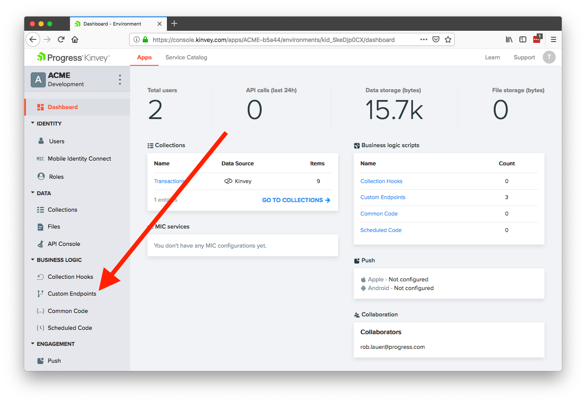

> **TIP**: Kinvey does a lot more than just serverless. You can store files and data, connect to existing data and authentication providers, and even send push notifications. Learn more on the [Kinvey Dev Center](https://devcenter.kinvey.com).

At the next screen, click the **ADD AN ENDPOINT** button, give the endpoint a name of “WeatherWrapper”, select **Code editor**, and finally click the **CREATE AN ENDPOINT** button.

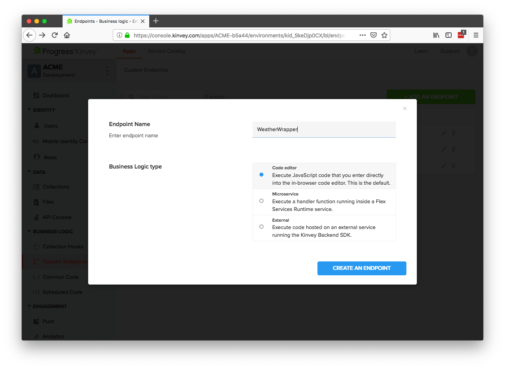

> **NOTE**: A Kinvey custom endpoint is a HTTP POST endpoint. You’ll try this out momentarily.

After you finish those steps you’ll see the Kinvey business logic editor, which is where you’ll write the serverless function that you’ll consume in your apps.

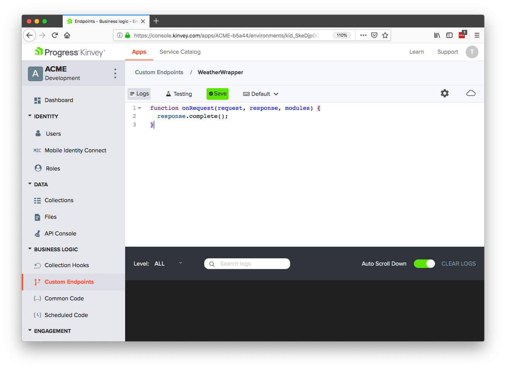

The default serverless function is a bit of boilerplate code that returns an empty response. In this example you want to include an OpenWeatherMap API key in your response, so to do that, copy the code below, paste it in the Kinvey business logic editor, and then hit the **Save** button. (Feel free to use a placeholder for the API key for now.)

```
function onRequest(request, response, modules) {
  response.body = "YOUR_API_KEY_HERE";
  response.complete();
}
```

With this code in place all you need to do is send an HTTP POST request to your new endpoint with the correct headers. The easiest place to do that is in the Kinvey API Console, which you can access from using the link shown below.

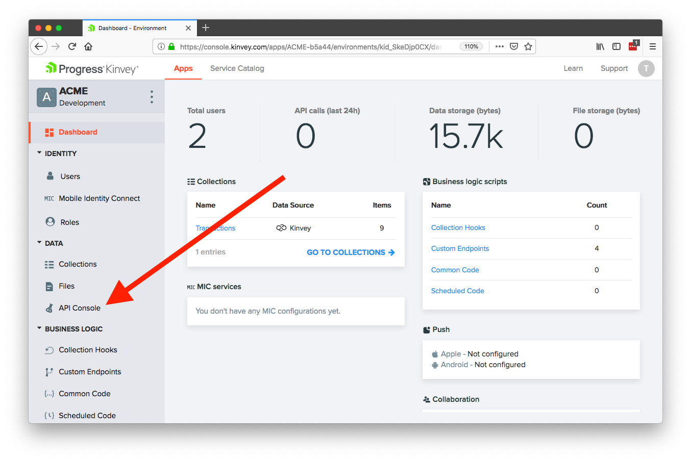

Once you’re in the console, change the first dropdown to POST, and the second dropdown to the “WeatherWrapper” endpoint you just created.

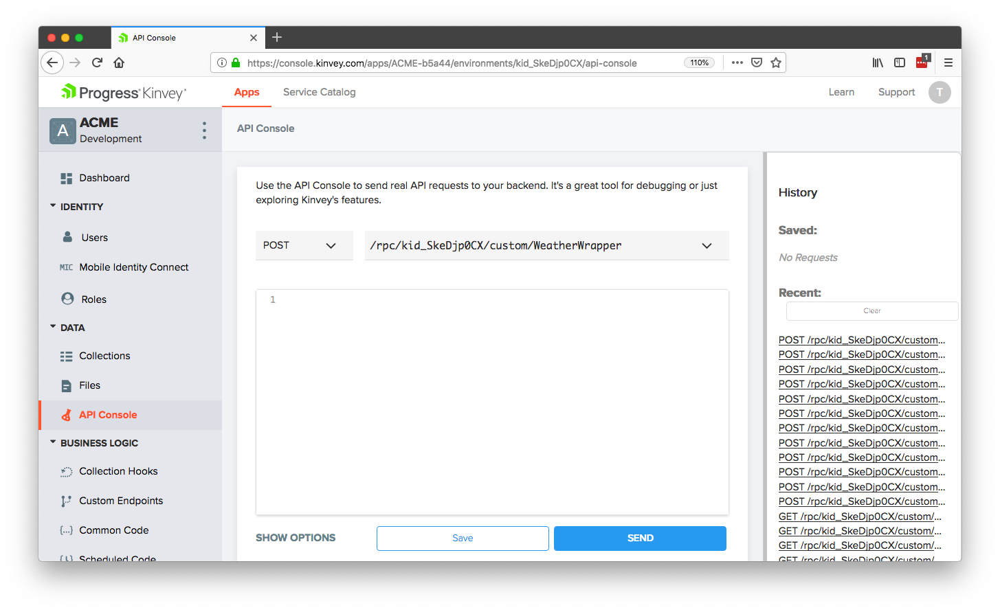

After that, click the blue **SEND** button and scroll down to see your result. If all went well, you should see your placeholder API key.

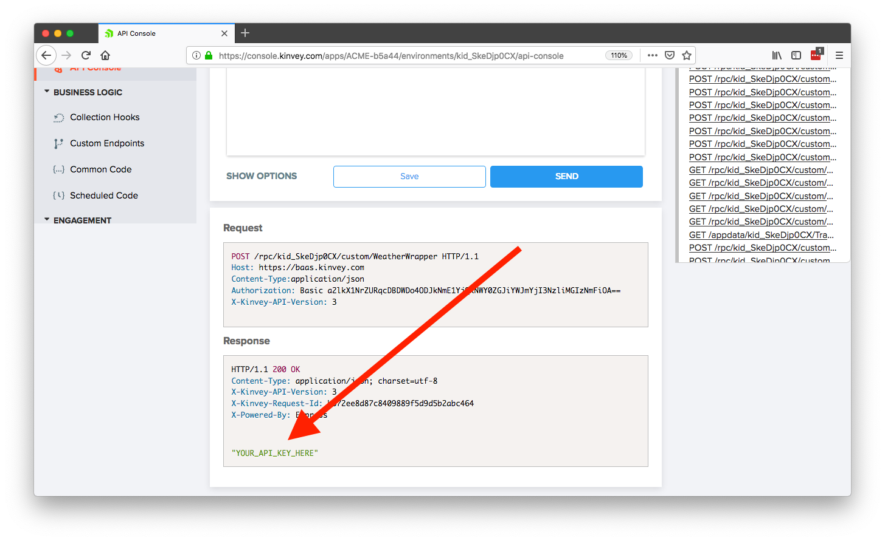

And it’s really that easy! With just a small handful of steps, you’ve created a serverless function that can return a third-party API key that you can reuse across several apps.

When it comes to integrating this functionality into your apps you have a few options. You can send a POST request manually, using your HTTP client or APIs of choice, or, you can utilize one of the [many Kinvey SDKs](https://github.com/Kinvey/js-sdk) to make your life easier. For example, this is the Kinvey SDK code you need hit the endpoint you just built.

``` JavaScript
const Kinvey = require("kinvey-nativescript-sdk");

Kinvey.CustomEndpoint.execute("WeatherWrapper", {})
  .then((data) => {
    console.log(data); // This logs your API key
  })
```

Now that you have your first first serverless function in place, let’s take things one step further to give you an idea of just what’s possible in these serverless functions

### Making HTTP calls in serverless functions

With your current function you have to make an HTTP POST request to get your OpenWeatherMap API key, and then make a second HTTP request to actually hit OpenWeatherMap for your weather data. While this works, you could simplify things for your apps if you just put the entire call to OpenWeatherMap inside your serverless function.

To do that, all you have to do is go back to the Custom Endpoint editor in Kinvey, select your “WeatherWrapper” endpoint, and swap out the current code to use the following.

``` JavaScript
function onRequest(request, response, modules) {
  // To test this, you can sign up for a free OpenWeatherMap
  // API key at https://openweathermap.org.
  var appId = "OPEN_WEATHER_MAP_KEY";
  var url = "https://api.openweathermap.org/data/2.5/weather?APPID=" + appId +
      "&units=imperial&lat=" + request.body.lat +
      "&lon=" + request.body.long;
  
  modules.request.get(url, function(err, result) {
    response.body = result;
    response.complete();
  });
}
```

This code expects there to be `lat` and `long` parameters in the request body, passes that data to the OpenWeatherMap API directly, and returns the result.

To test these updates, head back to Kinvey’s API console, and select “POST” and your “WeatherWrapper” endpoint from the two dropdowns (exactly like you did the last time you tested this endpoint). This time though, include a request body that includes both `lat` and `long` parameters as shown in the image below.

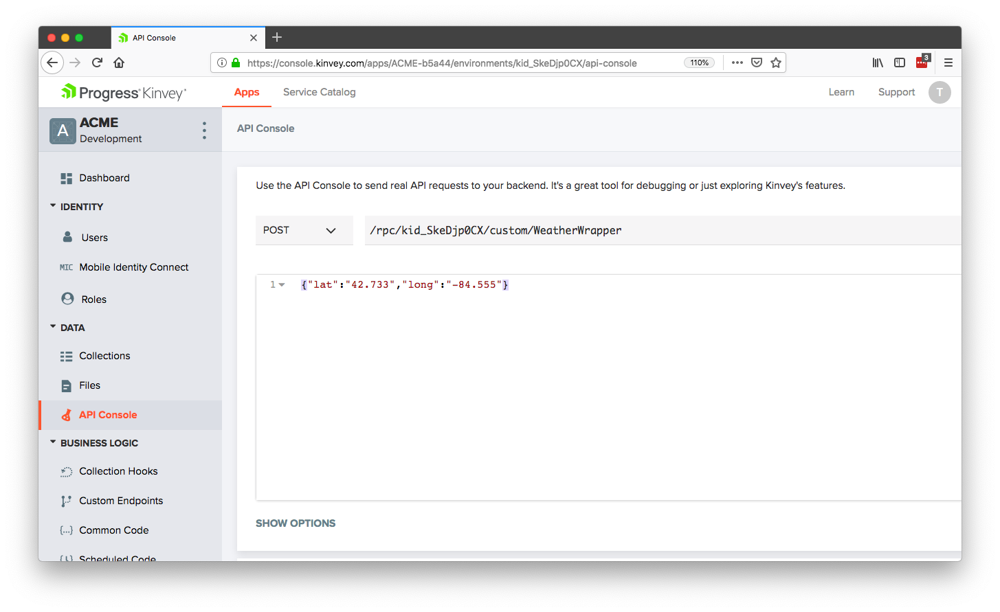

When you send this request, you should see data coming back from OpenWeatherMap that looks like the data below.

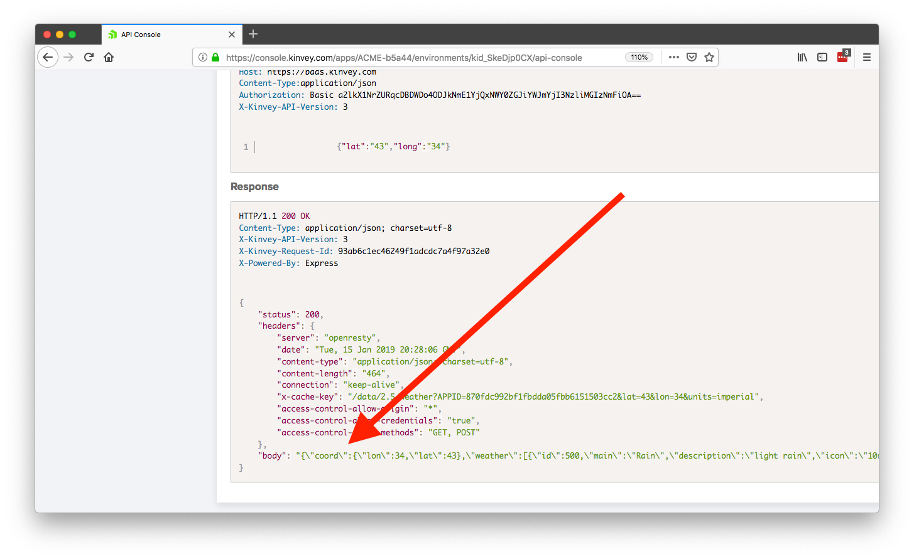

To integrate this new functionality in your apps, all you need to do change your existing Kinvey SDK call to pass in the `lat` and `long` you want to retrieve weather data for. For example, here’s how I can get weather data for my hometown.

``` JavaScript
return Kinvey.CustomEndpoint.execute("WeatherWrapper", {
  lat: "42.733",
  long: "-84.555"
}).then(data => {
  var weatherData = JSON.parse(data);
  console.log(weatherData);
});
```

Pretty cool huh? You can try this code out for yourself in [this complete weather app sample](https://play.nativescript.org/?template=play-vue&id=bP9uPN&v=3) that utilizes the cloud function you just wrote.

Hopefully this gives you an idea of just what a serverless approach makes possible. In this example you were first able to hide a third-party API key behind a serverless function. Next, you extended that function to hit a third-party API HTTP directly, giving you a secure utility function you can use across several apps. 

And we’re just getting started. Let’s move on to a more advanced way of making serverless calls.

## Scenario 2: Moving a JavaScript algorithm

For our second scenario, suppose you’re working for a large financial company, and you’re getting ready to unveil a new budgeting app called BudgetScore.

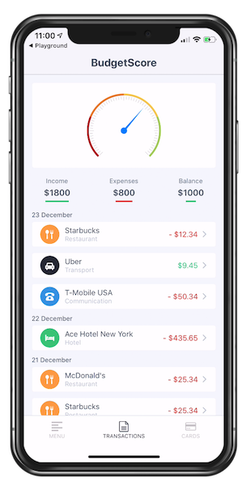

The most important feature of BudgetScore is an algorithm that grades how well a user is budgeting based on their spending habits. The code that determines this grade is something your company doesn’t want anyone to get their hands on, and is therefore something you want to move to a server.

In the real world, the algorithm that determines this score would likely be very complex, but to keep things simple for the sake of explanation, let’s assume the code to determine the score looks like this.

``` JavaScript
// Assumes transactions is an array of transaction
// data with a numeric amount and a string category.
function determineScore(transactions) {
  var score = 100;
  transactions.forEach((transaction) => {
    if (transaction.amount < 0) {
      score -= 5;
    }
    if (transaction.amount > 5) {
      score += 10;
    }
    if (transaction.category === 'restaurant') {
      score -= 5;
    }
  });
  return score.toString();
}
```

Although this function is simple, it does expect a collection of transaction data, which already makes it more complex than our previous example. And in the real world, there’s a good chance an algorithm like this might need to pull information from various data sources, and perhaps from various technologies.

For handing more advanced serverless tasks Kinvey has a featured called Flex Services, which are essentially small Node.js libraries that live and run in Kinvey’s cloud infrastructure. Let’s look at how to set one up for your BudgetScore app.

### Creating your first flex service

In Kinvey the way you create and deploy Flex Services is through the [Kinvey CLI](https://github.com/Kinvey/kinvey-cli). Therefore, your first step is to install the Kinvey CLI from npm.

```
npm install -g kinvey-cli
```

> **NOTE**: You need to have Node.js installed on your development machine for the above command to work. If you don’t, go ahead and install it from the [Node.js site](https://nodejs.org/en/).

From there, create a new folder that will contain the code for your new service.

```
mkdir BudgetScore
cd BudgetScore
```

Next, use the `npm init` command to create a `package.json` configuration file for your service. The command will ask you a number of questions, but for now feel free to accept the defaults.

```
npm init
```

After that, use the command below to install the Kinvey Flex SDK, which contains the code you’ll need to register this service with Kinvey’s backend console.

```
npm install --save kinvey-flex-sdk
```

Finally, create an `index.js` file and give it the following code, which returns a hardcoded number as a string for now.

```
const sdk = require('kinvey-flex-sdk');

sdk.service((err, flex) => {
  function getBudgetScore(context, complete, modules) {
    complete().setBody({
      score: '80'
    }).done();
  }
  
  flex.functions.register('getBudgetScore', getBudgetScore);
});
```

Most of the code you see here is the boilerplate for any Flex Service you write with kinvey. The key thing to note here is the `flex.functions.register('getBudgetScore')` call, as that’s what registers the service with the Kinvey backend.

> **TIP**: You can read more about the Kinvey Flex Service APIs on the [Kinvey DevCenter](https://devcenter.kinvey.com/nativescript/guides/flex-services#).

### Deploying your service

Now that you have the boilerplate code in place, you next have to register the Flex Service in the Kinvey Console backend.

To do so, in [your Kinvey Console](https://console.kinvey.com), choose the **Service Catalog** tab at the top of the page and then click the **Add A SERVICE** button.

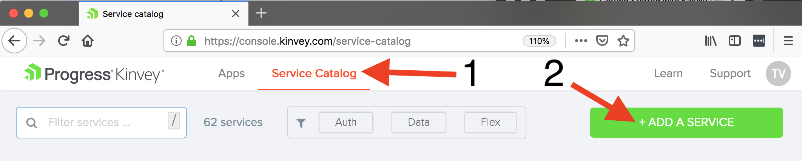

Next, select **Flex** and then **Flex Services Runtime**.

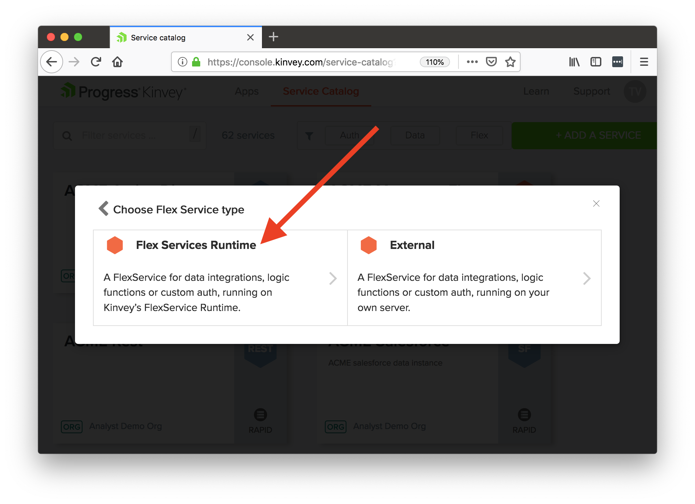

After that, give your service a name (like “BudgetScore”), and scope the service to an existing app. Hit the **SAVE** button twice (once in the dialog, once on the following screen) to finish creating your service.

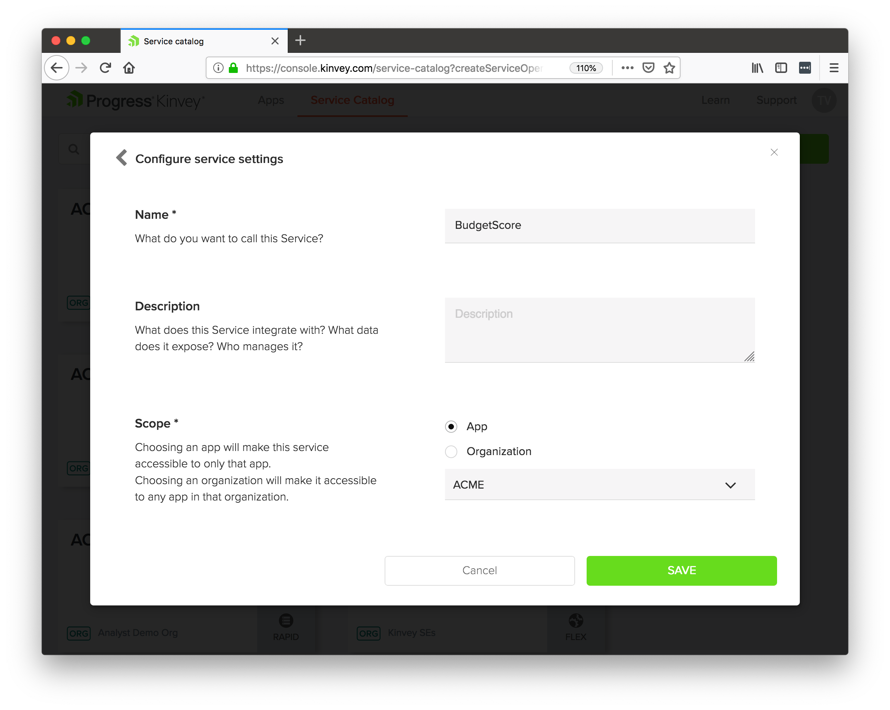

With the service created in the web console, head back to your terminal or command prompt, and use the `kinvey flex init` command.

```
kinvey flex init
```

The command will prompt you with a few questions to connect the service you’re developing locally to the one you created in the Kinvey web console. For the prompt answers, select **APP**, the app you associated the service with in the web console, and **BudgetScore**.

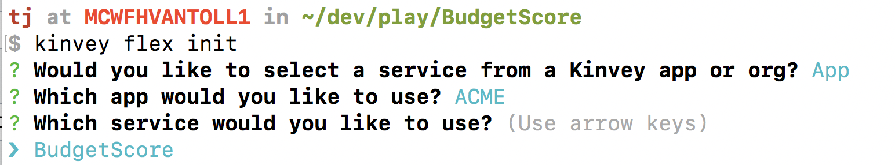

With the connection made, next run `kinvey flex deploy` to deploy the current version of your local flex service.

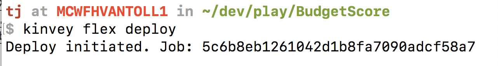

> **TIP**: See Brian Rinaldi’s article on [Testing Kinvey Flex Services the Easy Way](https://www.progress.com/blogs/developing-and-testing-of-kinvey-flex-services-the-easier-way) for help on creating a local testing environment. This will become more necessary as you start developing more advanced serverless functions.

The deployment will take around a minute, and you can check its status using the `kinvey flex status` command (look for a `deploymentStatus` of `COMPLETE`).

When it’s done, let’s look at how you can use this new Flex Service in an app.

### Using your service

The steps to using a Flex Service in Kinvey are almost exactly those for the business logic scenarios you used in this article’s first scenario.

In the Kinvey web console, you’ll want to return to the **Custom Endpoints** menu and again click the **ADD AN ENDPOINT** button.

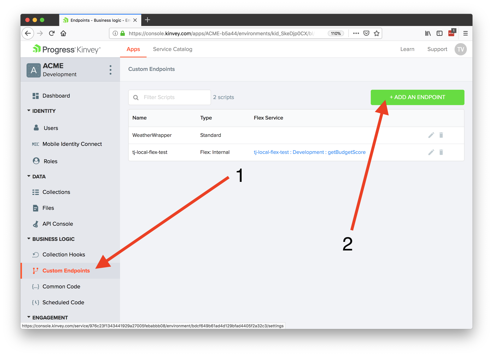

Give the endpoint a name of “BudgetScore”, select **Microservice**, and click the **CREATE AN ENDPOINT** button.

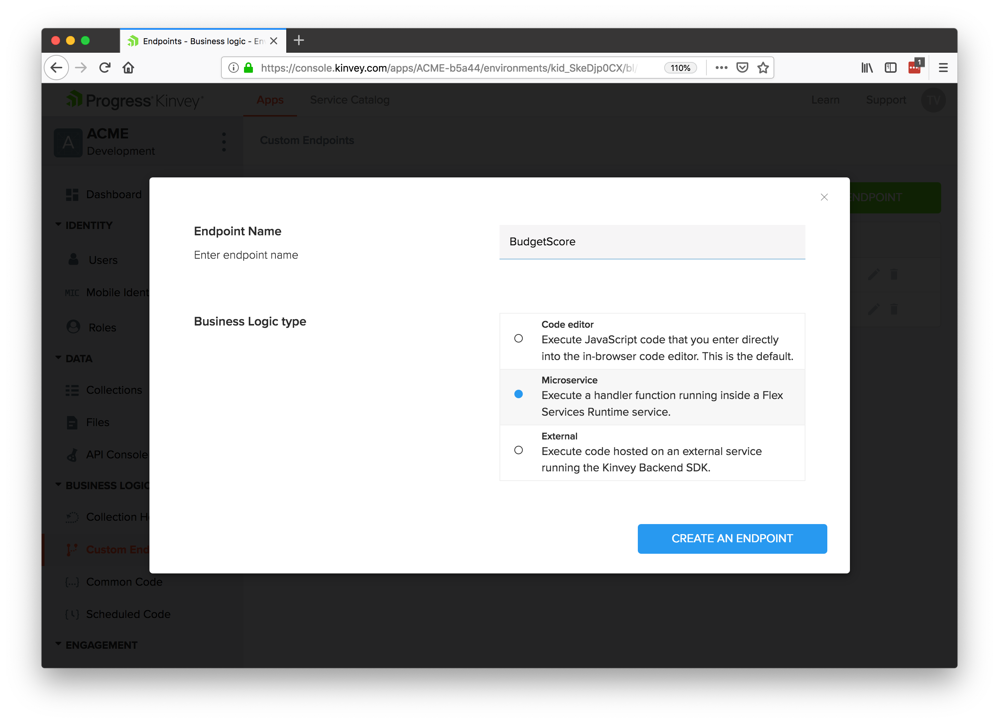

Next, select your **BudgetScore** service, the **Development** environment, and the `getBudgetScore()` handler. (This is the name of the function you passed to the `flex.functions.register` in your service’s code.)

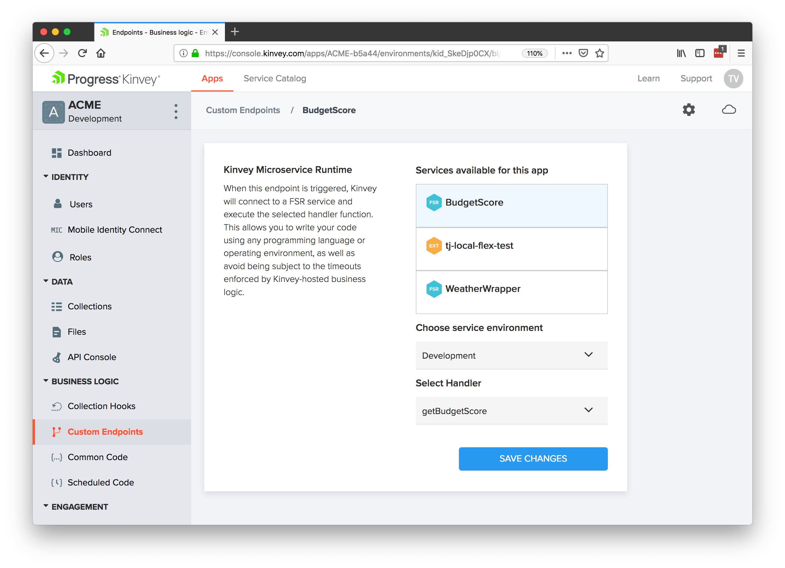

And with that you’re ready to go! To test this out, head back to the Kinvey API Console, select POST, select your new “BudgetScore” endpoint, and click the **SEND** button. If all went well, you should see your hardcoded value of `"80"` in the response body.

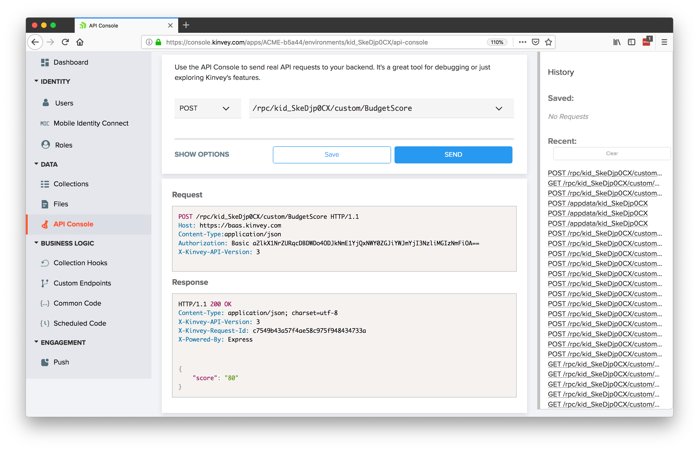

To use your new flex service in an app you again have a couple of options. As with the previous example, you could again manually send HTTP post requests in your app, using the endpoints and headers specified in the Kinvey API console you just used. Or, you could again use one of the Kinvey SDKs to make your life easier. For example, the following code uses the Kinvey SDK to hit your new endpoint.

``` JavaScript
CustomEndpoint.execute("BudgetScore", {}, {})
  .then((data) => {
      console.log(data);
  })
```

Let’s take a step back and look at the big picture here though. In just a few minutes, you now have a secure Node library that lives in the cloud, which gives you all sorts of potential. For one, you’ve met the requirement of moving your sensitive code to the cloud—without having to rewrite your code to a more traditional server-side language like .NET or Java.

But that’s just the beginning. With Kinvey Flex Services you have a fully functional Node environment, meaning, you can install npm modules, reuse JavaScript code, and architect your services any way you’d like. When you’re done, you can deploy and manage your service outside of your applications—meaning, you can change update your production services without having to redeploy your applications.

And there’s more! With a Kinvey Flex Service you can access a number of Kinvey’s other features, such as its ability to access data in a number of different systems. For example, after you [connect to your existing data](https://devcenter.kinvey.com/nativescript/guides/rapid-data#), here’s a Flex Service that reads transaction data and utilizes the algorithm we discussed earlier in this article.

``` JavaScript
const sdk = require('kinvey-flex-sdk');

function getTransactions(modules) {
  return new Promise((resolve, reject) => {
    const store = modules.dataStore({ useUserContext: false });
    const collection = store.collection('Transactions');
    const query = new modules.Query();

    collection.find(query, (err, result) => {
      if (err) {
        reject(err);
      } else {
        resolve(result);
      }
    });
  });
}

function determineScore(transactions) {
  var score = 100;
  transactions.forEach((transaction) => {
    if (transaction.amount < 0) {
      score -= 5;
    }
    if (transaction.amount > 5) {
      score += 10;
    }
    if (transaction.category === "restaurant") {
      score -= 5;
    }
  });
  return score.toString();
}

sdk.service((err, flex) => {
  function getBudgetScore(context, complete, modules) {
    getTransactions(modules).then((transactions) => {
      complete().setBody({
        score: determineScore(transactions)
      }).done();
    }).catch((err) => {
      complete().setBody(new Error(err)).runtimeError().done();
    });
  }
  
  flex.functions.register('getBudgetScore', getBudgetScore);
});
```

Overall, Kinvey Flex Services makes it possible to secure your source code in the cloud, while giving you the potential to do a whole lot more. To see the above Flex Service in action, check out this [complete BudgetScore application](https://play.nativescript.org/?template=play-ng&id=4XX1Ox&v=178).

> **TIP** To get an idea of what else is possible, see [Brian Rinaldi’s intro to Flex Services](https://www.progress.com/blogs/getting-started-with-kinvey-flexservices), as well as his [collection of Flex Service examples on GitHub](https://github.com/remotesynth/flex-service-samples).

## Wrapping up

It’s never been easier to secure your front-end code by moving it to the cloud. Serverless providers make it trivial to not only move your code, but to also leverage powerful functionality, such as the ability to hit third-party APIs.

Plus, moving to a serverless approach gives you a number of other benefits, such as not having to worry about server maintenance, giving you the ability to access your code across applications and platforms, and giving you the ability to deploy your code independent of application deployments.

To try serverless with Kinvey, get started today at [progress.com/kinvey](https://www.progress.com/kinvey).

> **TIP**: Read more about security in Kinvey with this [security overview of the Kinvey platform](https://www.progress.com/papers/kinvey-cloud-services-security-overview).