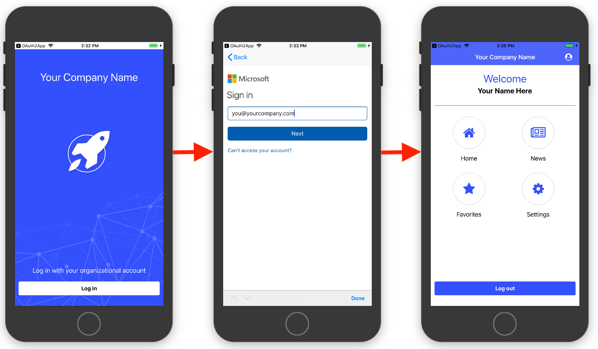
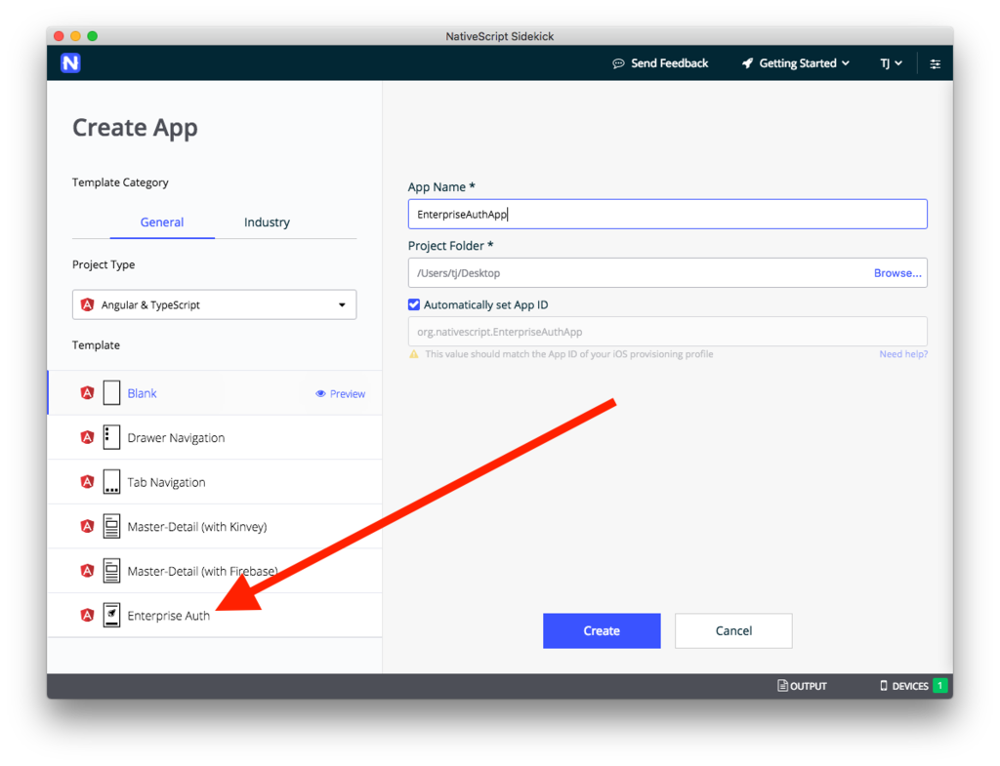
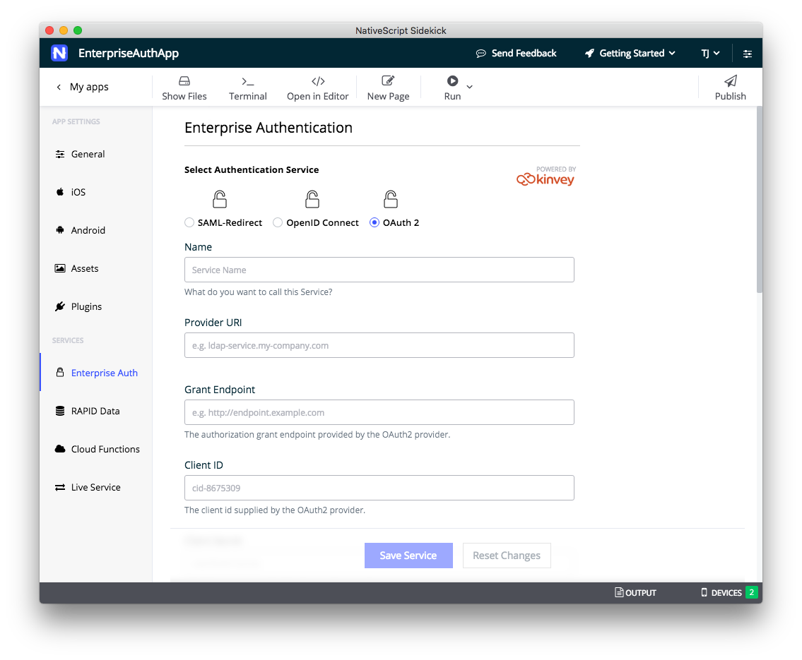
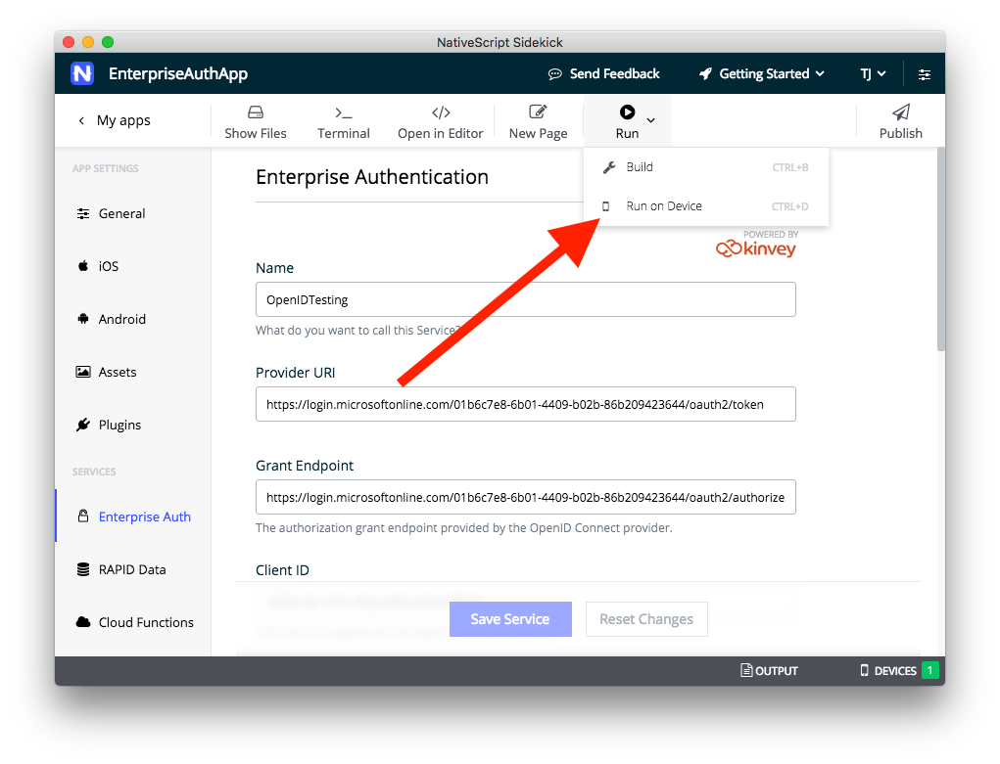
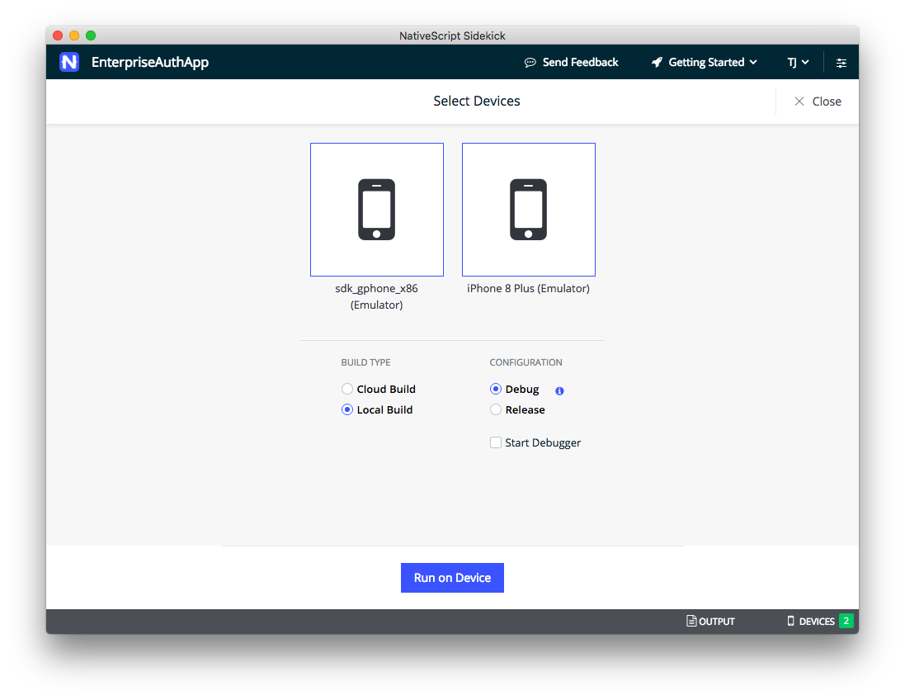
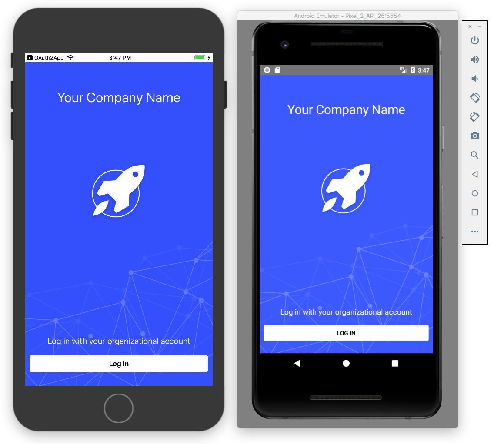

# Enterprise Authentication Made Easier with NativeScript

In the development world there are tasks that are hard, and then there are tasks that are _hard_. The most notoriously dreaded development tasks tend to use the terms “enterprise” or “authentication”, so when you combine the two, and start to throw around acronyms like “SAML” and “LDAP”, you tend to find developers running in the opposite direction.

But enterprise authentication is important. Allowing users to log in with existing identity services, like Active Directory, is oftentimes a necessity for corporate applications.

Today we’re happy to announce new functionality to make this process a little easier for NativeScript users, including a new Enterprise Auth template, and new functionality in [NativeScript Sidekick](https://www.nativescript.org/nativescript-sidekick) designed to help you connect to your authentication provider as fast as possible. Sidekick supports SAML, OAuth 2 and OpenID Connect, and can connect to any provider that supports at least one of those protocols.

Just to give you a quick visual, here’s what the workflow looks like when connecting to a sample Microsoft Azure-based Active Directory provider.

This workflow is great for any corporate app that needs users to sign in with their existing enterprise credentials. Let’s look at how it works.

## Starting from a new template

Your enterprise authentication journey starts in NativeScript Sidekick, our desktop application with a variety of helpful features for NativeScript development.

One of those features is a collection of starter templates designed to help you get up and running fast. And as of today, you’ll see one brand new template specifically designed for enterprise authentication.

The template includes a modern design, as well as all the wiring you need to connect you to your enterprise identity provider.

Select the **Enterprise Auth** template, give your app a name, and then hit the **Create** button. Sidekick will take a minute to build your app with all the necessary dependencies, and then you’ll be ready to set up a connection to your identity provider.

## Configuring your connection

After starting an app from the new authentication template, Sidekick will take you to a new Enterprise Auth configuration page, where you need to provide details about the service to which you want to connect. Here’s what that screen looks like.

First of all, a warning—completing this authentication form can be hard, as the information you need to obtain varies depending on your auth provider. Therefore, you might need to work with your IT admins to help get the information that you need to make the connection, especially if you’re not familiar with the infrastructure behind your auth provider.

To help you through the process you’ll want to refer to one of our new documentation articles that help walk you through the process step by step, including an example setup for each protocol using a Microsoft Azure-based Active Directory provider. Check out the following guides for your next step.

* [Configuring **SAML-Redirect** Authentication]()
* [Configuring **OpenID Connect** Authentication]()
* [Configuring **OAuth 2** Authentication]()

> **TODO** Add links

## Running your app

Once you complete the configuration and save your setup, all you have to do is [run your app on a device](https://docs.nativescript.org/sidekick/user-guide/run-app/run-app-on-device) using Sidekick’s **Run on Device** menu (shown below).

> **TIP**: NativeScript Sidekick allows you to build using [local iOS and Android build tools](https://docs.nativescript.org/start/quick-setup), or to [build apps in the cloud](https://docs.nativescript.org/sidekick/user-guide/build-app/cloud-build). Cloud builds keep you from needing to set up the necessary native tooling, and also allow you to build iOS apps on Windows and Linux development machines.

Here’s what the **Run on Device** menu looks like for me with an Android Virtual Device and iOS simulator running.

If I select both and click the **Run on Device** button, Sidekick will build my app for both iOS and Android, and deploy my authentication-enabled app to all selected devices. Here’s what the app looks like on my Android Virtual Device and iOS simulator.

And... that’s it! The cool thing is NativeScript Sidekick takes care of all the necessary authentication plumbing by default, given you an auth workflow that works out of the box.

## Let us know what you think

Enterprise authentication is new in NativeScript Sidekick, and we’d love to know what you think.

Are you thinking about building an app where users can log in using Active Directory? Build it! And [let us know how it went](https://github.com/NativeScript/sidekick-feedback/issues).

Finally, because we know configuring enterprise auth can be tricky, if you do run into any problems along the way, feel free to [reach out with questions on the NativeScript Community Forum](https://discourse.nativescript.org/c/Sidekick).
