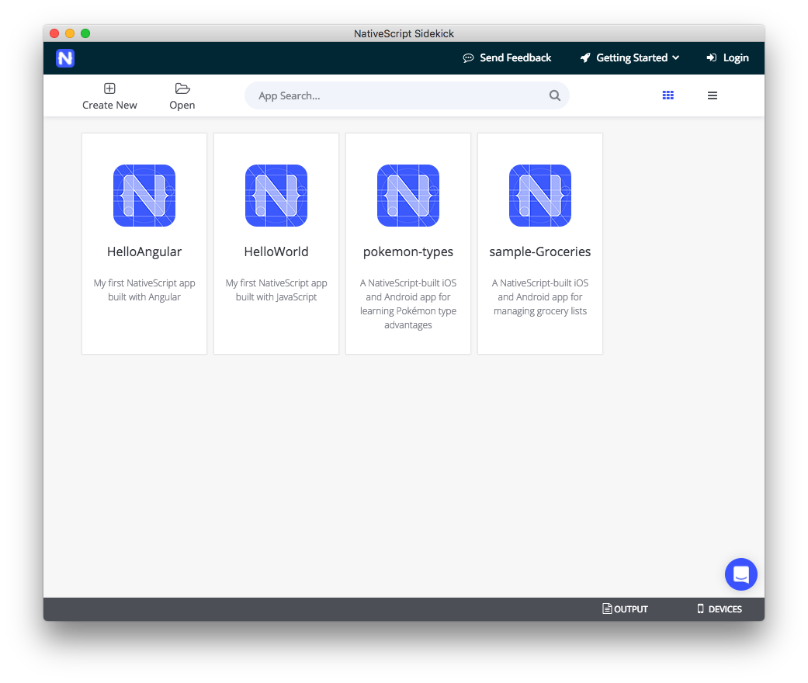
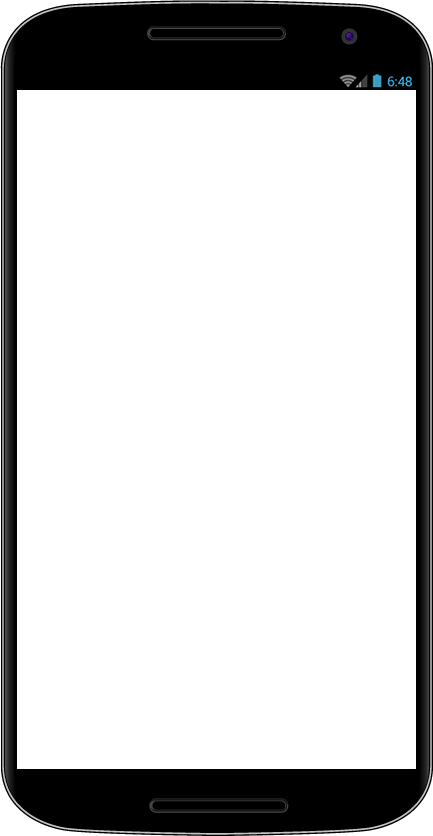
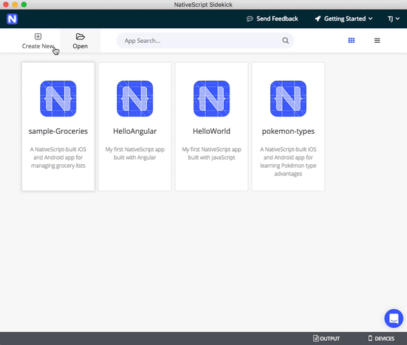
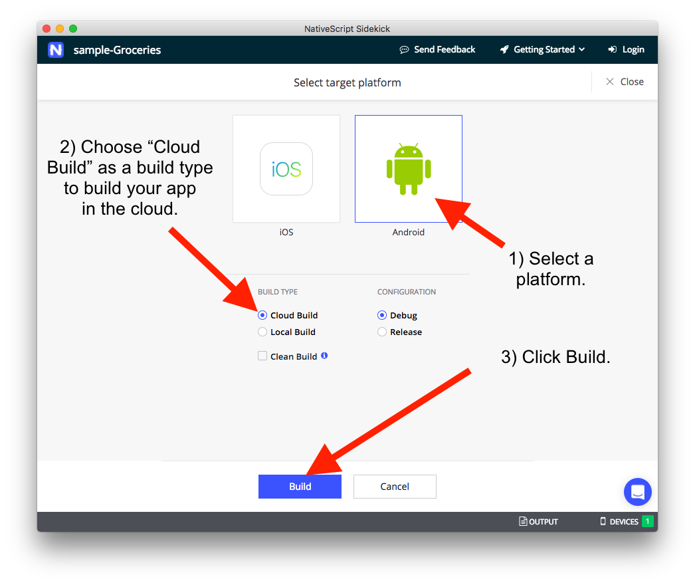
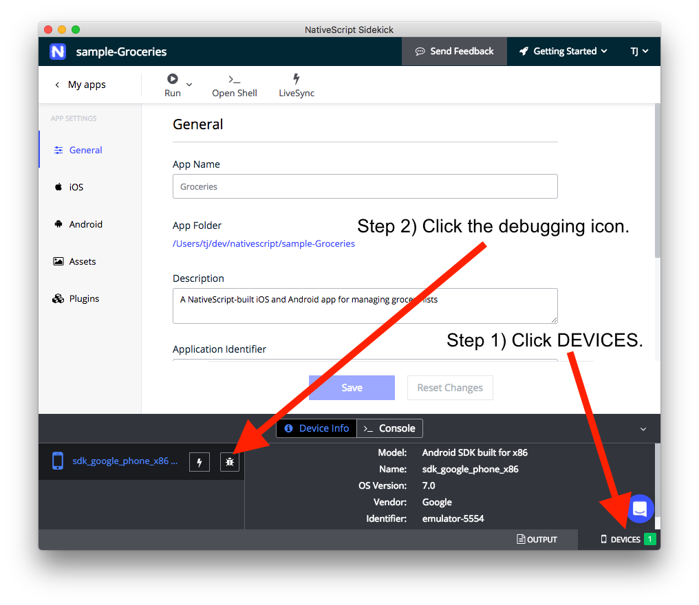
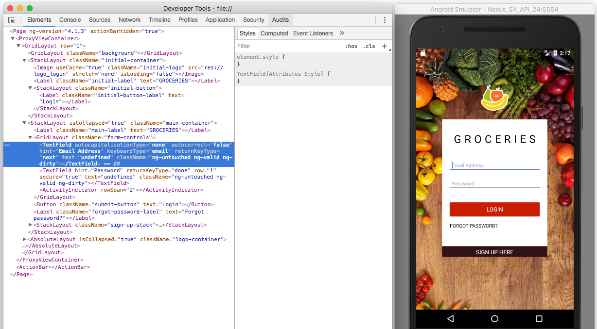
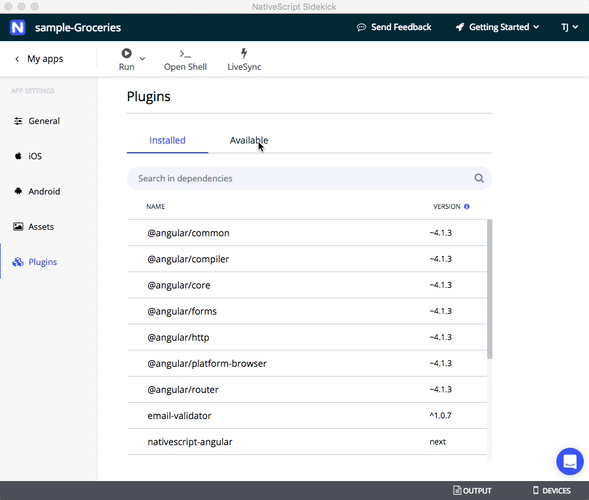
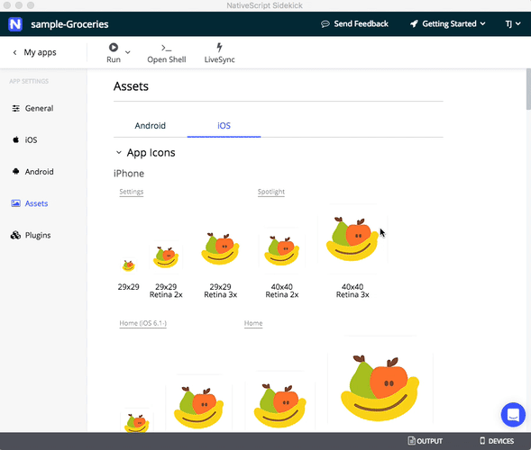
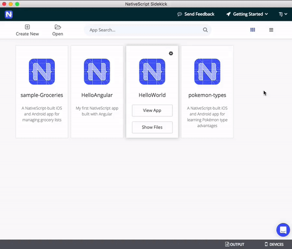
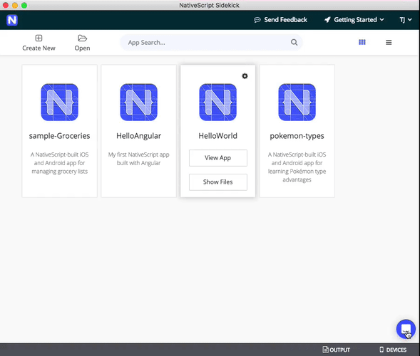

# Announcing the NativeScript Sidekick Public Preview

As the popularity of NativeScript has grown, we have seen a wide range of developers embrace it as their choice for cross-platform mobile app development. And with such breadth of developers comes an equally expansive range of comfort with command-line tooling.

Many of us have grown to embrace CLI tooling as the most efficient way to integrate our diverse tooling. Others are more used to visual tooling where we point and click our way to app utopia. Add to this mix developers on Windows who want to leverage tooling *only* available on macOS, and we find ourselves with a clear fit for a new tool we call NativeScript Sidekick.

We first discussed our plans with Sidekick a few months ago, and today we’re announcing that **Sidekick is [available as a public preview](https://www.nativescript.org/nativescript-sidekick) for everyone to try** 🎉

## What is NativeScript Sidekick...Exactly?

NativeScript Sidekick is a desktop application that simplifies some of the more tedious aspects of mobile app scaffolding, development, and building. Sidekick is built on Electron and Vue.js, giving us the best in desktop capabilities along with an ease of providing a cross-platform solution for Windows, macOS, and Linux.

Sidekick sits on top of the NativeScript CLI, so many of the capabilities of the CLI are exposed through a gorgeous UI.

However, Sidekick doesn't preclude you from using the CLI! You can use Sidekick alongside the NativeScript CLI to use visual tooling when you want it, and command-line tooling when you need it.

Let's take a quick look at just some of the best features of NativeScript Sidekick.

- [Starter Kits](#starter-kits)
- [Fast Cloud (and Local) Builds](#builds)
- [Debugging/LiveSync](#debugging-and-livesync)
- [Plugin Management](#plugin-management)
- [Asset Management](#asset-management)

<h2 id="starter-kits">Starter Kits</h2>

When building a new app, some of us like to start from scratch with a blank slate. Others of us like some help with scaffolding out the basic UI and logic of our app. NativeScript Sidekick provides a set of easy-to-use "starter kits" that let you get going from the following starting points:

- A completely blank app

  
  

- An app that uses drawer navigation

  
  

- An app that uses tab navigation

  
  

- A master/detail list

  
  

Not only do we provide multiple starter kits, but each starter kit is also available in one of three flavors:

- JavaScript
- TypeScript
- Angular

Regardless of the type of app you’re trying to build, or your architectural preferences, NativeScript Sidekick can help you get up and running quickly. Here’s what the process of creating a new app in Sidekick looks like.

> **TIP** These starter kits are NativeScript templates under the hood, so you can also use them from the NativeScript CLI using the `--template` option. Expect more documentation on these templates soon.

<h2 id="builds">Fast Cloud (and Local) Builds</h2>

When it comes to native mobile app development, nothing can be much more annoying than configuring the myriad SDKs required to build an app for iOS and Android. Luckily for us, NativeScript Sidekick allows you to build an app in the cloud, with no configuration required on your end.

Because the builds take place in the cloud, you now have the ability to build NativeScript apps on desktop platforms you couldn’t before. Specifically, this means that Windows and Linux developers can now build NativeScript iOS apps without needing a Mac! Plus, all of our iOS builds run on super fast Mac Pros, so you might find Sidekick’s cloud builds run nearly as fast as local builds.

<h2 id="debugging-and-livesync">Debugging/LiveSync</h2>

What's the next most annoying thing about mobile app development? Debugging. Historically one of the huge trade-offs from moving from the web to native mobile was the lack of debugging tools. Not any more. With NativeScript Sidekick we provide a variety of capabilities to help improve your debugging experience across all platforms with:

**LiveSync** - Imagine being able to make changes to *any* part of your app, hit save, and have those changes almost instantly appear on any simulators or connected devices. That's NativeScript’s LiveSync in a nutshell. LiveSync has always been available in the NativeScript CLI, and now Sidekick offers this powerful functionality in a visual tool.

All of have to do is enable LiveSync on your app’s LiveSync screen for each device you want to develop on. You can even LiveSync to multiple devices simultaneously! Here I turn on LiveSync for a single iPhone.

From there you can begin developing your app in your text editor of choice, and your changes will automatically be applied to each of your devices.

**Debugging** - Likewise, Sidekick exposes NativeScript’s powerful [Chrome Developer Tools](https://docs.nativescript.org/tooling/chrome-devtools) through an easy to use visual interface. Use the tooling to view your logs, debug your JavaScript, look through the Elements tab, monitor network requests, and more.

To use the debugger first click the Devices tab on the bottom right-hand side of the screen. Next, click the debugging icon next to the device you wish to debug your app on.

The Chrome Developer Tools will pop up and you’ll be able to use [its various features]((https://docs.nativescript.org/tooling/chrome-devtools)) to debug your apps. Here I take a look at the visual tree of the NativeScript Groceries sample in the Elements tab.

<h2 id="plugin-management">Plugin Management</h2>

Discovering and configuring NativeScript plugins has admittedly become much easier over the years. First, with the [new NativeScript plugins marketplace](http://plugins.nativescript.org/), finding the right plugin for the job is easier than ever before. (Hint, it's going to get even better soon!).

However, Sidekick also provides an interface for finding, installing, and updating plugins, making it even easier to find and manage your apps’ plugins.

<h2 id="asset-management">Asset Management</h2>

Finally, managing app icons and splashscreens has always been a bit of an annoyance. Sidekick provides an easy-to-use UI for viewing what your current app icons are, and very soon, will provide the capability of creating both app icons and full splashscreens (for all platforms) from one source image—stay tuned!

## Pricing

NativeScript Sidekick is a free product. You are free to use Sidekick together with Xcode and/or Android SDKs installed on your machine as much you like without any cost—you don’t even need to create an account to get going.

The cloud services that Sidekick leverages, namely the cloud builds, are currently free, but are something that we might charge for in the future. We’ll share more about this in a future article. For now, just know that NativeScript Sidekick is free, and your usage of our cloud services is completely free for the preview period.

## What's Coming Next?

This is the spot where I typically say, "it's just the beginning!" And well, that's true! This is merely the public preview phase where we invite you to test out Sidekick’s current features.

As this is a public preview, we’d love to know what you think of Sidekick. Does Sidekick help you build NativeScript apps? Are there any features you’d like to see us add?

There are two ways you can reach out with this sort of feedback. The easiest way is to click the “Send Feedback” at the top of Sidekick. This will take you to the [Sidekick feedback GitHub repo](https://github.com/nativescript/sidekick-feedback). Feel free to create issues on the Issues tab with feedback or feature requests.

If you’d prefer to provide more casual feedback, you can also click on the blue button on the bottom right side of the screen directly within Sidekick. You’ll see a little chat screen where you can let us know what you think.

So what are you waiting for?

[Download Sidekick](https://www.nativescript.org/nativescript-sidekick) and get started building the next great mobile app!

