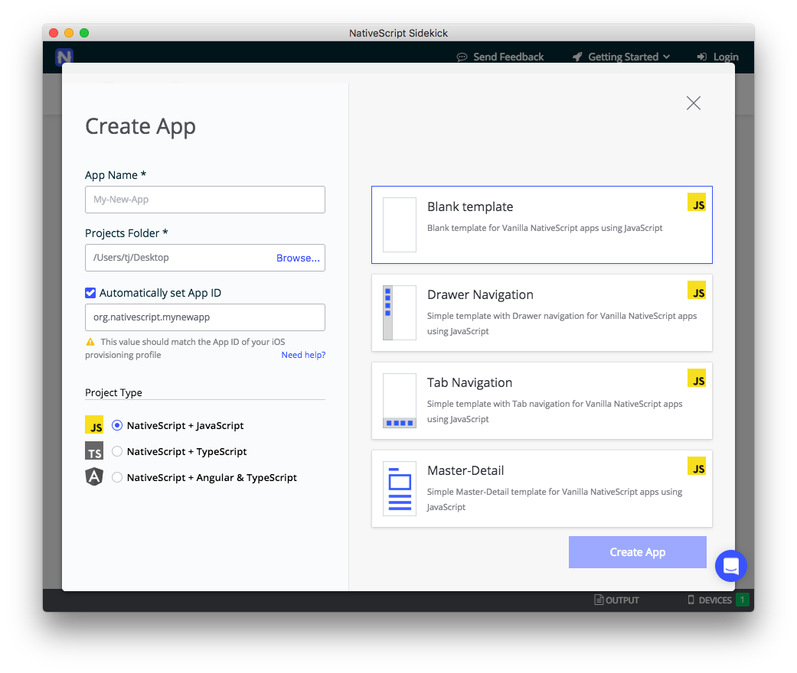

# Announcing the NativeScript Sidekick Public Beta

As the popularity of NativeScript has grown, we have seen a wide range of developers embrace it as their choice for cross-platform mobile app development. And with such breadth of developers comes an equally expansive range of comfort with command-line tooling.

Many of us have grown to embrace CLI tooling as the most efficient way to integrate our diverse tooling. Others are more used to visual tooling where we point and click our way to app utopia. Add to this mix developers on Windows who want to leverage tooling *only* available on macOS, and we find ourselves with a clear fit for a new tool we call NativeScript Sidekick.

We first discussed our plans with Sidekick a few months ago, and today we’re announcing that **Sidekick is [available as a public beta](https://www.nativescript.org/nativescript-sidekick) for everyone to try** 🎉

-- Sidekick’s logo goes here --

## What is NativeScript Sidekick...Exactly?

NativeScript Sidekick is a desktop application that simplifies some of the more tedious aspects of mobile app scaffolding, development, and building. Sidekick is built on Electron, giving us the best in desktop capabilities along with an ease of providing a cross-platform solution for Windows, macOS, and Linux.

Sidekick sits on top of the NativeScript CLI, so many of the capabilities of the CLI are exposed through a gorgeous UI.

-- image showing the opening screen in Sidekick --

However, Sidekick doesn't preclude you from using the CLI! You can use Sidekick alongside the NativeScript CLI to use visual tooling when you want it, and command-line tooling when you need it.

Let's take a quick look at just some of the best features of NativeScript Sidekick.

- [Starter Kits](#starter-kits)
- [Fast Cloud (and Local) Builds](#builds)
- [Debugging/LiveSync](#debugging-and-livesync)
- [Plugin Management](#plugin-management)
- [Asset Management](#asset-management)

<h2 id="starter-kits">Starter Kits</h2>

When building a new app, some of us like to start from scratch with a blank template. Others of us like some help with scaffolding out the basic UI and logic of our app. NativeScript Sidekick provides a set of easy-to-use "starter kits" that let you get going from the following starting points:

- A completely blank app

-- image of a blank app --

- An app that uses drawer navigation

-- image of drawer --

- An app that uses tab navigation

-- image of tabs --

- A master/detail list

-- image of master/detail --

Not only do we provide multiple starter kits, but each starter kit is also available in one of three flavors:

- JavaScript
- TypeScript
- Angular

Regardless of the type of app you’re trying to build, or your architectural preferences, NativeScript Sidekick can help you get up and running quickly. Here’s what Sidekick’s full create app screen looks like.

> **TIP** These starter kits are NativeScript templates under the hood, so you can also use them from the NativeScript CLI using the `--template` option. Expect more documentation on these templates soon.

<h2 id="builds">Fast Cloud (and Local) Builds</h2>

When it comes to native mobile app development, nothing can be much more annoying than configuring the myriad SDKs required to build an app for iOS and Android. Luckily for us, NativeScript Sidekick allows you to build an app in the cloud, with no configuration required on your end.

-- image --

Yes, that means Windows developers can generate builds for iOS without needing a Mac! Plus, all of our iOS builds run on super fast Mac Pros, so you might find Sidekick’s cloud builds run nearly as fast as local builds.

<h2 id="debugging-and-livesync">Debugging/LiveSync</h2>

What's the next most annoying thing about mobile app development? Debugging. Historically one of the huge trade-offs from moving from the web to native mobile was the lack of debugging tools. Not any more. With NativeScript Sidekick we provide a variety of capabilities to help improve your debugging experience across all platforms with:

**LiveSync** - Imagine being able to make changes to *any* part of your app, hit save, and have those changes almost instantly appear on any simulators or connected devices. That's NativeScript’s LiveSync in a nutshell. LiveSync has always been available in the NativeScript CLI, and now Sidekick offers this powerful functionality in a visual tool.

-- gif showing livesync in action --

**Debugging** - Likewise, Sidekick exposes NativeScript’s powerful [Chrome Developer Tools](https://docs.nativescript.org/tooling/chrome-devtools) through an easy to use visual interface. Use the tooling to view your logs, view your app’s visual tree, monitor network requests, and more.

-- images and/or gifs showing these in action --

<h2 id="plugin-management">Plugin Management</h2>

Discovering and configuring NativeScript plugins has admittedly become much easier over the years. First, with the [new NativeScript plugins marketplace](http://plugins.nativescript.org/), finding the right plugin for the job is easier than ever before. (Hint, it's going to get even better soon!).

However, Sidekick also provides an interface for finding, installing, and updating plugins, making it even easier to find and manage your apps’ plugins.

IMAGE

<h2 id="asset-management">Asset Management</h2>

Finally, managing app icons and splashscreens has always been a bit of an annoyance. Sidekick provides an easy-to-use UI for viewing what your current app icons are, and very soon, will provide the capability of creating both app icons and full splashscreens (for all platforms) from one source image—stay tuned!

IMAGE

## Pricing

Would you like to know how much we will be charging for NativeScript Sidekick? Once the public beta phase is over, we plan to offer an extremely generous free tier which we think will satisfy the needs of the vast majority of developers. Heavy users of our cloud builds, for instance, will have to pay a small fee to generate a certain number of builds per month. More pricing information will be available in the coming weeks!

## What's Coming Next?

This is the spot where I typically say, "it's just the beginning!". And well, that's true! This is merely the public beta phase of Sidekick where we invite you to test out all of our features and let us know what works, what doesn't, and what else you want to see.

As this is a public beta, we’d love to know what you think of Sidekick. There are two ways you can reach out with feedback. First, you can click on the blue button on the bottom right side of the screen directly within Sidekick. You’ll see a little chat screen where you can send us feedback.

-- gif of me clicking Todor’s face --

Second, we have a new #sidekick channel in our NativeScript Community Slack. Go ahead and [sign up for the Community Slack](http://tinyurl.com/nativescriptSlack) if you haven’t already, and join the #sidekick channel to chat with the NativeScript team.

-- image of Slack? --

So what are you waiting for? [Download Sidekick](https://www.nativescript.org/nativescript-sidekick) and get started building the next great mobile app!
