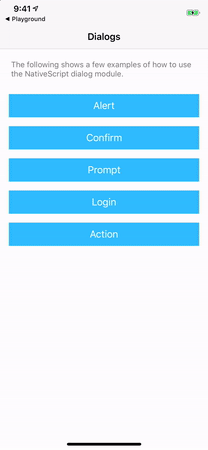
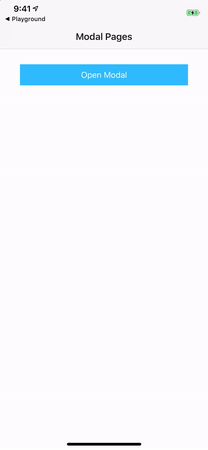
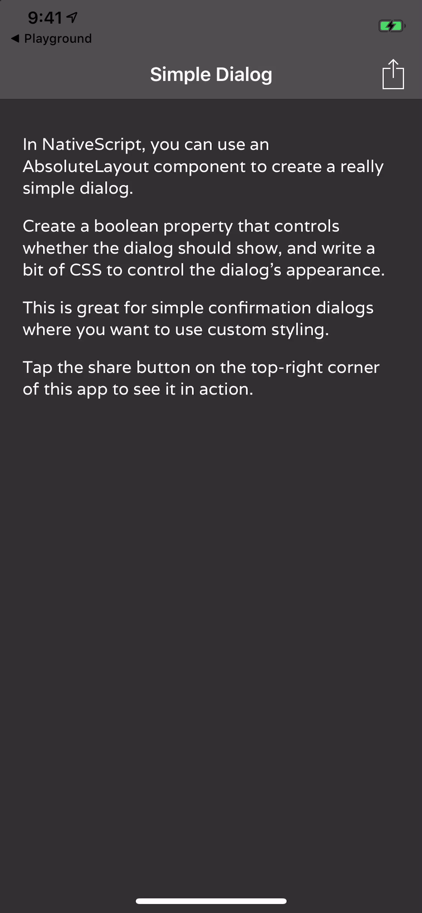
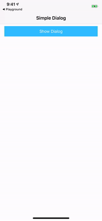

# How to Build a Simple Dialog for Your NativeScript Apps

There are a few different ways to implement dialogs in NativeScript apps. The [NativeScript dialog module](https://docs.nativescript.org/ui/dialogs) lets you show a variety of dialogs using built-in APIs, and is great for simple use cases.


_[Try this example in NativeScript Playground](https://play.nativescript.org/?template=play-ng&id=dWQhV7&v=5)_

On the other end of the spectrum, you can also create dialogs that are completely modal pages, complete with native transitions. These are great when you want to have full control over how the dialogs look and work.


_[Try this example in NativeScript Playground](https://play.nativescript.org/?template=play-ng&id=iC2pnQ&v=27)

In my experience though, sometimes you want a simple dialog that you can style without going through the hassle of creating an entire page. Basically you want something that looks like this.



In this article I’m going to walk you through how to create a simple dialog like the one above. I’ll be using Angular for my explanations, but the techniques are roughly the same whether you’re using Angular, Vue.js, or NativeScript Core. Below are links to live examples of this article’s samples using each approach.

* [Final code for Angular](https://play.nativescript.org/?template=play-ng&id=LfbvME&v=15)
* [Final code for Vue.js](https://play.nativescript.org/?template=play-vue&id=7YrUzj&v=3)
* [Final code for NativeScript Core](https://play.nativescript.org/?template=play-tsc&id=ixN0xD)

## Building the markup

Here is what the markup to make this simple dialog looks like at a high level.

``` XML
<GridLayout class="page">
  <GridLayout class="content">
    <StackLayout>
      <!-- Page content goes here -->
    </StackLayout>
  </GridLayout>

  <AbsoluteLayout class="dialog-wrapper">
    <StackLayout class="dialog">
      <!-- Dialog content goes here -->
    </StackLayout>
  </AbsoluteLayout>
</GridLayout>
```

To start, you have an outer `<GridLayout>` that contains your entire page. If you’re using Angular this would be the root element of your page component, and if you’re not using Angular, this would be a child of the root `<Page>` element.

Your page has two children, a `<GridLayout>` that will contain the content of your app, and an `<AbsoluteLayout>` that will serve as a container for your dialog. The idea here is that you’ll write your content exactly as you normally would, and show and hide the dialog as necessary in your app. In order to do that let’s write a little bit of code and CSS.

## Showing and hiding the dialog

In your code you’ll need to create a property that tracks whether the dialog is open or not, as well as a few methods for manipulating the dialog’s state. If you’re using Angular, that code will look something like this.

``` TypeScript
import { Component } from "@angular/core";

@Component({
  selector: "Home",
  moduleId: module.id,
  templateUrl: "./home.component.html",
  styleUrls: ['./home.component.css']
})
export class HomeComponent {
  dialogOpen = false;

  showDialog() {
    this.dialogOpen = true;
  }

  closeDialog() {
    this.dialogOpen = false;
  }
}
```

The `dialogOpen` property, as its name implies, tracks whether the dialog is currently open or not. You set it to a default value of `false`, as you usually don’t want the dialog to show when your page loads.

Now that you have the property in place, your next step is to use that property in your markup. One way to do so is with the following markup.

``` XML
<GridLayout class="page" [class.dialogOpen]="dialogOpen">
  <GridLayout class="content">
    <StackLayout>
      <Button class="btn btn-primary" text="Show Dialog" (tap)="showDialog()"></Button>
    </StackLayout>
  </GridLayout>

  <AbsoluteLayout class="dialog-wrapper">
    <StackLayout class="dialog">
      <Label textWrap="true" text="Are you sure you want to continue?"></Label>
      <Button class="btn btn-primary" text="Yes"></Button>
      <Button class="btn" text="No" (tap)="closeDialog()"></Button>
    </StackLayout>
  </AbsoluteLayout>
</GridLayout>
```

There are a few changes in this markup to use your new property. First, you add two `tap` event handlers, one to a button in your main content to show the dialog, and another in the dialog to close the dialog.

Second, you use Angular’s `[]` syntax to conditionally apply a `dialogOpen` CSS class name to your main page element. This class name will serve as the hook you need to make your dialog behave like a dialog. To see how it’ll all work let’s look at the CSS you’ll need to make all this come together.

## Adding styling

Believe it or not, you already have all the markup and code you need to make this example work, as the real magic of this example happens in CSS. Here’s the minimum CSS code you’ll need.

``` CSS
.dialogOpen .content {
  opacity: 0.2;
}
.dialogOpen .dialog-wrapper {
  visibility: visible;
}
.dialog-wrapper {
  visibility: collapse;
}
.dialog {
  border-width: 1 0 1 0;
  border-color: black;
  width: 100%;
  margin-top: 100;
}
```

By default the dialog wrapper element is set to a `visibility` of `collapse`, which hides the dialog from the user.

But when the `dialogOpen` class gets applied, the `.dialogOpen .dialog-wrapper` selector now applies, and the dialog wrapper’s `visibility` is set to `visible`, which shows the dialog to the user. Additionally, the `.dialogOpen .content` now applies and changes the `opacity` of the main content to `0.2`, which gives it a bit of a dim appearance so the user’s attention gets focused on the dialog itself.

When you put this all together, you should now have a dialog that looks a little something like this.



## Further improvements

There are a few different ways you can improve on this simple design. First, you can toss in a little animation to give the dialog a nice fade-in effect. That code looks a little something like this.

``` CSS
@keyframes show {
  from { opacity: 0; }
  to { opacity: 1; }
}

.dialogOpen .content {
  opacity: 0.2;
}
.dialogOpen .dialog-wrapper {
  visibility: visible;
  animation-name: show;
  animation-duration: 0.3s;
  animation-fill-mode: forwards;
}
.dialog-wrapper {
  visibility: collapse;
  opacity: 0;
}
.dialog {
  border-width: 1 0 1 0;
  border-color: black;
  width: 100%;
  margin-top: 100;
}
```

Now, when you set the `dialogOpen` class name, the `show` CSS animation will change the opacity of the dialog wrapper from `0` to `1` over 0.3 seconds. The result is a nice little fade-in effect that looks like this.


At this point you’ll probably want to write some CSS to clean up the spacing in this UI based on what you want to show in the dialog. You can refer to the full code samples listed at the end of this article for an example of this.

Before I leave you though there’s one last tip I need to mention. To discuss let’s return to this sample’s basic markup.

``` XML
<GridLayout class="page">
  <GridLayout class="content">
    <StackLayout>
      <!-- Page content goes here -->
    </StackLayout>
  </GridLayout>

  <AbsoluteLayout class="dialog-wrapper">
    <StackLayout class="dialog">
      <!-- Dialog content goes here -->
    </StackLayout>
  </AbsoluteLayout>
</GridLayout>
```

Focus on the dialog wrapper. Because the dialog wrapper is a child of the parent page, it inherits the page’s dimensions—aka the wrapper takes up the same dimensions as the page. This is by design, as it means when the dialog is open, the user cannot tap on elements behind the dialog. Essentially the wrapper turns this dialog into a modal dialog.

There is one exception to this though. While the wrapper blocks the main page from taps, it’s dimensions do not extend over the page’s `<ActionBar>`. Therefore if your page uses an `<ActionBar>`, the user will be able to interact with any controls you put in it while the dialog is open.

For example, suppose you had an `<ActionItem>` in your app that performed a sharing action. Something like this.

``` XML
<ActionItem text="Share" (tap)="share()"></ActionItem>
```

``` TypeScript
import { Component } from "@angular/core";

@Component({
  ...
})
export class HomeComponent {
  dialogOpen = false;

  share() {
    // Sharing code here
  }

  showDialog() { ... }
  closeDialog() { ... }
}
```

In this example the user could perform the sharing action while the dialog is open. This might be ok for your app and your scenario. But if it isn’t, the simplest way to prevent the action is with a simple `if` check. For example note the use of `if (this.dialogOpen)` in the example below.

``` TypeScript
import { Component } from "@angular/core";

@Component({
  ...
})
export class HomeComponent {
  dialogOpen = false;

  share() {
    if (this.dialogOpen) {
      return;
    }
    // Sharing code here
  }

  showDialog() { ... }
  closeDialog() { ... }
}
```

## Wrapping up

Ultimately how you choose to configure this sample is up to you based on the needs of your app. Feel free to copy this approach verbatim, or to customize this structure to meet your needs.

A polished version of this sample is available for Angular, Vue.js, and NativeScript Core using the links below. Feel free to use them, and if you come up with any fun customizations, please list them in the comments below.

* [Final code for Angular](https://play.nativescript.org/?template=play-ng&id=LfbvME&v=15)
* [Final code for Vue.js](https://play.nativescript.org/?template=play-vue&id=7YrUzj&v=3)
* [Final code for NativeScript Core](https://play.nativescript.org/?template=play-tsc&id=ixN0xD)

> **TIP** This simple dialog is one of many samples available for free in [NativeScript Marketplace](https://market.nativescript.org/). Check out the [full list of samples](https://market.nativescript.org/?tab=samples&framework=all_frameworks&category=all_samples), and maybe even [contribute your own](https://github.com/NativeScript/code-samples/blob/master/CONTRIBUTING.md) 😉