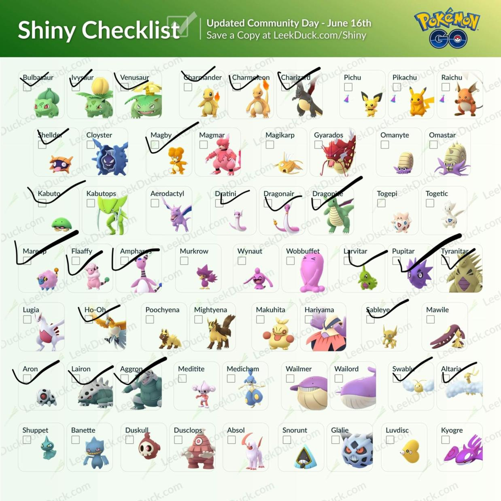

# How I Built a PWA, an iOS App, and an Android App in a Week—From One Codebase

One of my favorite things about being a software developer is being able to take a simple idea and turn it into a useful app.

Last month, a problem keep coming up in my local Pokémon GO group (yes, the game is [alive and well](https://comicbook.com/gaming/2018/07/09/pokemon-go-revenue-2018/) 🙂)—people kept manually sharing a checklist image that looks a little something like this.

The software developer in me couldn’t handle the thought of so many people doing a manual task, so I decided to build ShinyDex, a dead-simple checklist app, and I deployed the app to both Google Play and the web. The app on Google Play already has over 5,000 installs and 50 reviews.

In this article I’m going to show you how I used the recently announced [NativeScript and Angular integration](https://blog.angular.io/apps-that-work-natively-on-the-web-and-mobile-9b26852495e7) to get all three of these apps out quickly. I’ll walk you through the same process I went through, and give you some tips and tricks for things I hit along the way.

## Starting the Project