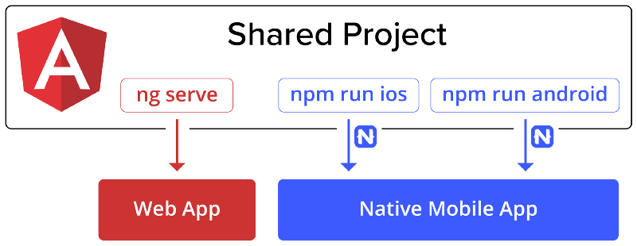
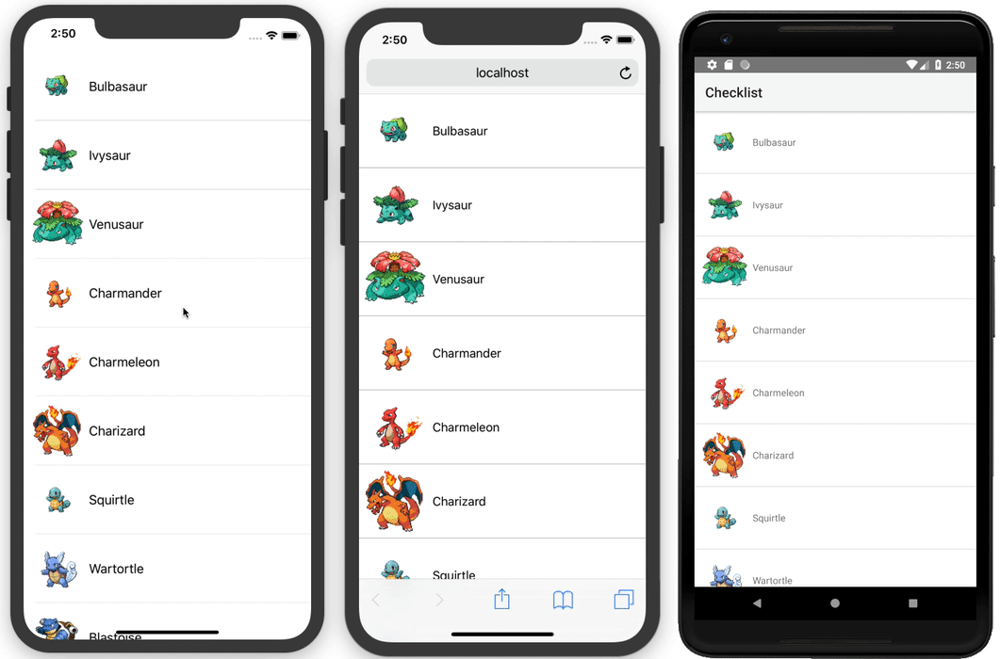
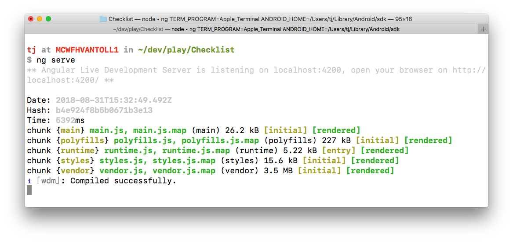
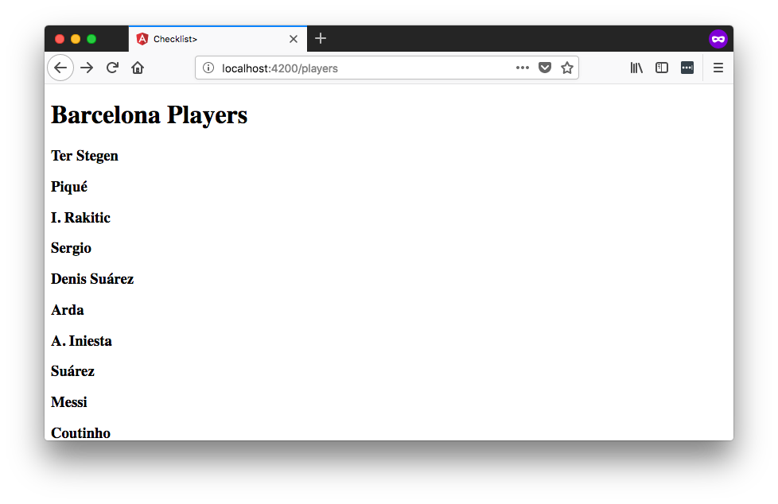
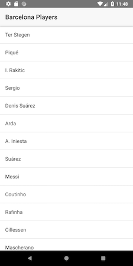
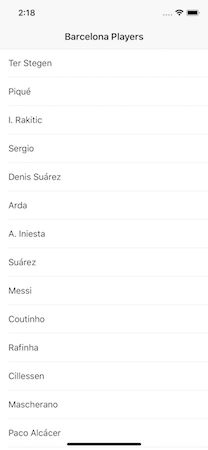
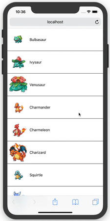
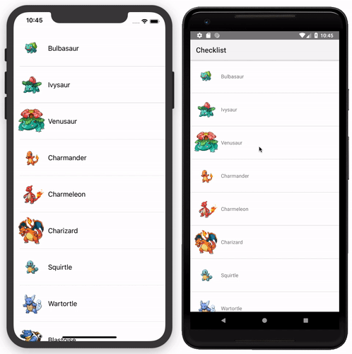

# How to Build a PWA, an iOS App, and an Android App—From One Codebase

I have a long history of choosing between web and native, often wrongly. I’ve built web apps that were scraped for native apps, and I’ve wasted time building native apps that found no audience.

In my current job as a mobile-focused developer advocate at [Progress](https://www.progress.com/), I talk to developers that regret their web or native decision every week. Sometimes you don’t realize you need a native app until you hit the limitations of the web, and conversely, sometimes you realize a web app meets your needs only after you’ve went through the lengthy process of building multiple native apps.

The good news is JavaScript developers no longer have to make this difficult choice. Through the use of the recently announced [NativeScript and Angular integration](https://blog.angular.io/apps-that-work-natively-on-the-web-and-mobile-9b26852495e7), it’s now quite easy to build a PWA (Progressive Web App), a native iOS app, and a native Android app from one codebase.



In this article I’ll show you how it works. You’ll learn the steps you’ll need to take to build for all three platforms, as well as some tips and tricks I learned from going through this process myself.

## What you’re building

Over the last month I built a Pokémon-based checklist app and deployed it to [Google Play](https://play.google.com/store/apps/details?id=com.tjvantoll.ShinyDex) and [the web](https://shinydex.app). The app is a purposely simple app designed to help teach how the NativeScript and Angular technology stack work.


> **NOTE**: The Google Play version of this app already has over ten thousand active installations. Sometimes simple is good 🙂

For this article I’ll walk you through building a similar checklist-style app that looks like this.



Feel free to follow along as a way of starting your own code-sharing application, or to just browse the code to get a high-level idea of how this whole process works.

## Starting your app

When you’re ready to build, your first step is to install the Angular CLI, NativeScript CLI, and NativeScript schematics, all of which are available on npm. Open your terminal or command prompt and run the following commands.

```
npm install -g @angular/cli
npm install -g nativescript
npm install -g @nativescript/schematics
```

Here’s what these tools do.

* The [**Angular CLI**](https://cli.angular.io/) is a command-line interface for building and running [Angular](https://angular.io/) apps.
* [**NativeScript**](https://www.nativescript.org/) is an open-source framework for building iOS and Android apps with JavaScript or TypeScript.
* [**NativeScript schematics**](https://github.com/NativeScript/nativescript-schematics) is an Angular CLI extension that adds the ability to do NativeScript-related things. As you’ll see in a minute, this is what makes it possible to run your Angular apps on iOS and Android.

With installation out of the way, your next step is to create an app. To do that, run the following command from your terminal or command prompt.

```
ng new Checklist --collection @nativescript/schematics --shared --sample
```

Let’s break down what’s happening here.

* `ng new` is the Angular CLI command you use to start new Angular apps.
* `Checklist` is your app name. For you own apps you’ll want to provide your own value here.
* The `--collection @nativescript/schematics` flag tells the Angular CLI about NativeScript schematics, which makes it possible for this app to run on iOS and Android through NativeScript.
* The `--shared` flag tells NativeScript schematics you wish to start with a code-sharing project template.
* The `--sample` flag has NativeScript schematics scaffold a few sample components which we’ll look at momentarily. You’ll want to omit this flag when you go to build your own apps.

Now that you have an app let’s look at how to run it.

## Running your app

First, `cd` into the new app you just built.

```
cd Checklist
```

Next, run `npm install` to install your app’s required dependencies.

```
npm install
```

From here there are three different commands you can use to run your app.

First, `ng serve` is how you run your newly created app on the web. Go ahead and run this command from your terminal or command prompt.

```
ng serve
```

After the command finishes, you’ll see a message about an Angular Live Development Server listening.



If you follow the instructions and visit `localhost:4200` in your browser you’ll see the default web app running, which is a simple master-detail app showing soccer players.



If you’ve done any Angular development before this will feel very familiar, as it’s the same workflow you use to build Angular web apps—which is cool!

But of course you’re not building only for the web with this workflow, and the real magic happens when you bring NativeScript into the picture.

But before you run this app on iOS and Android there’s one warning I need to give: because NativeScript apps are truly native iOS and Android apps, there are an additional set of system requirements you need to install on your development machine to build these apps. Check out [this page on the NativeScript docs](https://docs.nativescript.org/angular/start/general-requirements) for the necessary setup steps you’ll need to complete.

> **NOTE**: The next version of NativeScript, NativeScript 5.0, has some fun changes that will allow you to run apps without any local setup. You can [learn more on GitHub](https://github.com/NativeScript/nativescript-cli/issues/3813).

With the setup out of the way, return to your terminal or command prompt, use `Ctrl` + `C` to stop your `ng serve` command, and next execute `npm run android`. The command will take a minute to run, as under the hood NativeScript is building a completely native Android app. When it finishes you’ll see the following screen.



If you’re developing on macOS, you can also try running `npm run ios`, which runs through a similar process, but instead builds and starts your app on iOS. When it finishes you’ll see this screen.



With a single codebase and a set of straightforward commands you now have the same app running in three places.

Cool, huh?

Now that you know how to run your app, let’s dig into your app’s code to see what’s going on.

## Looking through the code

Starting at the root of your project, here are the top-level folders you need to know about.

```
Checklist/
├── App_Resources
├── platforms
└── src
```

* The `App_Resources` folder is where NativeScript stores iOS and Android configuration files and image resources, such as your app’s icons and splash screens. Later in your app development, you’ll want to switch to your own image assets using the NativeScript CLI’s `tns resources generate` command.
* The `platforms` folder is where NativeScript stores your generated iOS and Android apps; you can think of it as a `dist` folder for your native projects.
* The `src` folder is where your source code lives, and it’s where you’ll be spending 95% of your time.

> **NOTE**: There are a bunch of other configuration files in the root folder, such as an `angular.json` file for Angular CLI customization, a `package.json` file for managing dependencies, and a series of `tsconfig.json` files for configuring TypeScript. When getting started it’s best to leave these files alone; you can come back to them later and customize them to meet your project’s needs.

Since the `src` folder is where you’ll be spending most of your time, let’s dig into the contents of that folder in more detail.

```
src/
├── app
│   ├── app.component.css
│   ├── app.component.html
│   ├── app.component.tns.html
│   ├── app.component.ts
│   ├── app.module.tns.ts
│   ├── app.module.ts
│   ├── app.routes.ts
│   ├── app.routing.tns.ts
│   ├── app.routing.ts
│   └── barcelona
│       └── ...
├── app.css
├── assets
├── index.html
├── main.tns.ts
├── main.ts
├── package.json
└── styles.css
```

If you’ve built Angular web apps before a lot of this structure will look very familiar. All Angular apps have a `main.ts` file for initialization, an `app.module.ts` file for [module declarations](https://angular.io/guide/ngmodules), a series of `app.routing.ts` files for [setting up routing](https://angular.io/guide/router), and an `app.component.ts` file to use as the [app’s first component](https://angular.io/guide/entry-components).

> **TIP**: If you’re new to Angular and would like a more in-depth introduction to these concepts, check out the [Angular quick-start tutorial](https://angular.io/guide/quickstart). All of the concepts you learn there directly apply to the code-sharing structure in this article.

One concept unique to NativeScript’s code-sharing workflow is the `.tns` naming convention you see on some of your app’s files (for example `app.routing.tns.ts`).

By default, NativeScript schematics includes all your project’s files in both your web and mobile apps—after all, you are trying to share code. However, in certain situations you will need to create web- and mobile-specific files, and that’s where the `.tns` extension comes in.

For example, take the `app.module.ts` and `app.module.tns.ts` files. When you run your app on the web, the Angular CLI uses your `app.module.ts` file as you’d expect. However, when you run your app on iOS or Android, NativeScript schematics instead grabs and uses your `app.module.tns.ts` file. This convention is a powerful way to split your web and mobile code as necessary, and you’ll use it frequently as you build your own apps using this setup.

Now that you have a bit of background on how your project is structured, let’s build something new.

## Building your web UI

In the starter app, the vast majority of your code is in a `src/app/barcelona` folder, as that’s the code that builds up the player list you saw in your app earlier. In this section you’re going to create a brand-new component for the web, and in the next section, you’ll see just how easy it is to get that same component working in a native iOS and Android app.

Let’s start by scaffolding some files. To do so, start by using the `cd` command to navigate to your `src/app` folder.

```
cd /src/app
```

Next, make a new folder named `list`, and create the following files in that folder.

```
. app
└── list
    ├── list.common.ts
    ├── list.component.css
    ├── list.component.html
    ├── list.component.ts
    ├── list.module.ts
    └── list.service.ts
```

> **TIP**: When you get more comfortable working with NativeScript schematics, there are a series of commands you can use to help generate components and modules. See the [NativeScript schematics documentation](https://github.com/NativeScript/nativescript-schematics#generating-components-modules-directives-etc) for more information.

Here’s what to put in those files as a first step. Don’t worry too much about exactly what this code is doing, as we’ll discuss the important things to note momentarily.

`list.common.ts`

``` TypeScript
import { Routes } from '@angular/router';

import { ListComponent } from './list.component';
import { ListService } from './list.service';

export const COMPONENT_DECLARATIONS: any[] = [
  ListComponent
];

export const PROVIDERS_DECLARATIONS: any[] = [
  ListService
];

export const ROUTES: Routes = [
  { path: 'list', component: ListComponent },
];
```

`list.component.css`

``` CSS
ul {
  list-style: none;
  padding: 0;
  margin: 0;
}

li {
  border-style: solid;
  border-width: 0 0 1px 0;
  border-color: #C0C0C0;
  display: flex;
  align-items: center;
  cursor: pointer;
}

li.selected {
  background-color: #C0C0C0;
}

img {
  height: 96px;
  width: 96px;
}
```

`list.component.html`

``` HTML
<ul>
  <li *ngFor="let item of items" [class.selected]="item.selected" (click)="itemTapped(item)">
    
    <span>{{ item.name }}</span>
  </li>
</ul>
```

`list.component.ts`

``` TypeScript
import { Component, OnInit } from '@angular/core';

import { ListService } from './list.service';

@Component({
  selector: 'app-list',
  templateUrl: './list.component.html',
  styleUrls: ['./list.component.css']
})
export class ListComponent implements OnInit {
  items: any[];

  constructor(private listService: ListService) { }

  ngOnInit() {
    this.listService.get().subscribe((data: any) => {
      this.items = data;
    });
  }

  itemTapped(item) {
    this.listService.toggleSelected(item);
  }
}
```

`list.module.ts`

``` TypeScript
import { NgModule } from '@angular/core';
import { CommonModule } from '@angular/common';
import { HttpClientModule } from '@angular/common/http';
import { RouterModule } from '@angular/router';

import { ROUTES, COMPONENT_DECLARATIONS, PROVIDERS_DECLARATIONS } from './list.common';

@NgModule({
  imports: [
    CommonModule,
    HttpClientModule,
    RouterModule.forRoot(ROUTES)
  ],
  exports: [
    RouterModule
  ],
  declarations: [
    ...COMPONENT_DECLARATIONS
  ],
  providers: [
    ...PROVIDERS_DECLARATIONS
  ]
})
export class ListModule { }
```

`list.service.ts`

``` TypeScript
import { Injectable } from '@angular/core';
import { HttpClient } from '@angular/common/http';
import { map } from 'rxjs/operators';

@Injectable()
export class ListService {
  saved: any[];

  constructor(private http: HttpClient) {
    let saved = localStorage.getItem('items');
    if (saved) {
      this.saved = JSON.parse(saved);
    } else {
      this.saved = [];
    }
  }

  get() {
    return this.http.get('https://rawgit.com/tjvantoll/ShinyDex/master/assets/151.json')
      .pipe(
        map((data: any) => {
          const returnData = [];
          data.results.forEach((item) => {
            item.selected = this.saved.indexOf(item.id) != -1;
            returnData.push(item);
          })
          return returnData;
        })
      );
  }

  toggleSelected(item) {
    if (item.selected) {
      this.saved.splice(this.saved.indexOf(item.id), 1);
    } else {
      this.saved.push(item.id);
    }

    item.selected = !item.selected;
    this.save();
  }

  save() {
    localStorage.setItem('items', JSON.stringify(this.saved));
  }
}
```

Again, don’t worry if you don’t understand everything that’s going on in this code. For now, all you need to know is that this is a fairly straightforward Angular component that loads data from an API and shows it in a list.

To activate this new component so you can try it out, first, add this new component to your `app.module.ts` file so Angular knows about it. Here’s what your new `app.module.ts` file should look like.

``` TypeScript
import { NgModule } from '@angular/core';
import { BrowserModule } from '@angular/platform-browser';

import { AppRoutingModule } from './app.routing';
import { AppComponent } from './app.component';
import { ListModule } from './list/list.module';

@NgModule({
  declarations: [
    AppComponent,
  ],
  imports: [
    BrowserModule,
    AppRoutingModule,
    ListModule
  ],
  providers: [],
  bootstrap: [AppComponent]
})
export class AppModule { }
```

Next, change the default path in your `app.routes.ts` file, so Angular navigates to the new list component by default. The new `app.routes.ts` file should look like this.

``` TypeScript
import { Routes } from '@angular/router';

export const ROUTES: Routes = [
  { path: '', redirectTo: '/list', pathMatch: 'full' },
];
```

Finally, just so this app looks a little nicer, paste the following code in your `src/styles.css` file, which is the place you add global CSS for your Angular apps.

``` CSS
html, body { margin: 0; }
body {
  font-family: -apple-system,BlinkMacSystemFont,"Segoe UI",Roboto,"Helvetica Neue",Arial,sans-serif;
}
```

With this in place, return to your terminal or command prompt and run `ng serve`. After the command runs, open your browser and visit `localhost:4200`, and you should now see a simple little checklist that looks like this.



The app you now have is a really simple app that allows users to select items. If you look at the code in `list.service.ts`, you can see that the app also remembers the user’s selections using `localStorage`—meaning, all selections remain when the user returns to the app.

At this point you have a very simple mobile app. If you’d like, you could follow one of many online guides for [giving this app a service worker and making it into a Progressive Web App](https://www.smashingmagazine.com/2018/09/pwa-angular-6/)—after all, at the moment you’re just using the Angular CLI to build a web app.

The real fun of this workflow though is in just how easy it is to turn a functional app like this into a native iOS and Android app. Let’s look at how to do that.

## Creating your iOS and Android app

When converting a web interface to mobile using NativeScript schematics, your first task is to identify which code you can reuse and which code you cannot. Let’s return to the list of files that make up this component.

```
. app
└── list
    ├── list.common.ts
    ├── list.component.css
    ├── list.component.html
    ├── list.component.ts
    ├── list.module.ts
    └── list.service.ts
```

For this example you’ll need to create a NativeScript-specific markup file (`.html`), styling file (`.css`), and module file (`.module.ts`). To do that, to ahead and create three new files, `list.component.tns.css`, `list.component.tns.html`, and `list.module.tns.ts`. Your file tree should now look like this.

```
. app
└── list
    ├── list.common.ts
    ├── list.component.css
    ├── list.component.html
    ├── list.component.tns.css (new)
    ├── list.component.tns.html (new)
    ├── list.component.ts
    ├── list.module.ts
    ├── list.module.tns.ts (new)
    └── list.service.ts
```

Remember that the Angular CLI will automatically grab the code in your `.tns.*` files when building for NativeScript, and your non-`.tns` files when building for the web. Therefore, the `.tns` files are where you need to put your code that’s specific to NativeScript.

To do that, start by opening your `list.module.tns.ts` file and paste in the following code.

``` TypeScript
import { NgModule, NO_ERRORS_SCHEMA } from '@angular/core';
import { NativeScriptCommonModule } from 'nativescript-angular/common';
import { NativeScriptHttpClientModule } from 'nativescript-angular/http-client';
import { NativeScriptRouterModule } from 'nativescript-angular/router';

import { ROUTES, COMPONENT_DECLARATIONS, PROVIDERS_DECLARATIONS } from './list.common';

@NgModule({
  imports: [
    NativeScriptCommonModule,
    NativeScriptHttpClientModule,
    NativeScriptRouterModule,
    NativeScriptRouterModule.forRoot(ROUTES)
  ],
  exports: [
    NativeScriptRouterModule
  ],
  declarations: [
    ...COMPONENT_DECLARATIONS
  ],
  providers: [
    ...PROVIDERS_DECLARATIONS
  ],
  schemas: [
    NO_ERRORS_SCHEMA
  ]
})
export class ListModule { }
```

You need a NativeScript-specific module file so that you can declare NativeScript-specific imports, such as `NativeScriptHttpClientModule`, and `NativeScriptRouterModule`. However, note how both your `list.module.ts` and `list.module.tns.ts` files pull routes, declarations, and providers from your `list.common.ts` file. This gives you the ability to add those declarations in one place, without having to change two different module files every time you need to make a small update.

The next file to change is your app’s markup file. To do that, open your `list.component.tns.html` file and paste in the following code.

``` HTML
<ListView [items]="items">
  <ng-template let-item="item">
    <FlexboxLayout [class.selected]="item.selected" (tap)="itemTapped(item)">
      <Image [src]="item.image"></Image>
      <Label [text]="item.name"></Label>
    </FlexboxLayout>
  </ng-template>
</ListView>
```

> **TIP**: Need help learning these NativeScript user interface components? Try [NativeScript Playground](https://play.nativescript.org/), and specifically, try out the components pane on the bottom-left-hand side of the screen.

Next, to style these components, paste the following code into your `list.component.tns.css` file.

``` CSS
FlexboxLayout {
  padding: 5;
  align-items: center;
}
.selected {
  background-color: #C0C0C0;
}
Image {
  height: 80;
  width: 80;
}
```

> **TIP**: If you’re a fan of SASS, you can use it with NativeScript schematics and share CSS variables such as colors. Check out the [instructions here on the NativeScript documentation](https://docs.nativescript.org/angular/code-sharing/creating-a-new-project#sass).

With all this in place, your last step is to import your `ListModule` in your `app.module.tns.ts` file, exactly like you did with your `app.module.ts` file. To do so, replace the contents of your `app.component.tns.ts` file with the following code.

``` TypeScript
import { NgModule, NO_ERRORS_SCHEMA } from '@angular/core';
import { NativeScriptModule } from 'nativescript-angular/nativescript.module';

import { AppRoutingModule } from './app.routing';
import { AppComponent } from './app.component';
import { ListModule } from './list/list.module';

@NgModule({
  bootstrap: [
    AppComponent
  ],
  imports: [
    NativeScriptModule,
    AppRoutingModule,
    ListModule
  ],
  declarations: [
    AppComponent
  ],
  providers: [
  ],
  schemas: [
    NO_ERRORS_SCHEMA
  ]
})
export class AppModule { }
```

And with that, you should have a functioning NativeScript app, right? Actually there’s one last change you need to make, and to show it let’s introduce the concept of helper files.

## Using helper files

When taking a code-sharing approach, sometimes you need to completely split your implementations for web and native. Your user interfaces for example always need different implementations, as you need to use DOM nodes for the web, and NativeScript user-interface controls for mobile.

However, there are often times where you can share almost all of your code, but need slightly different implementations for the web and mobile. There’s actually one example of this in your sample app, and it’s in your `list.service.ts` file.

If you open `list.service.ts`, you’ll see two different references to `localStorage`—one in the constructor...

``` TypeScript
let saved = localStorage.getItem('items');
```

...and another in the `save()` method.

``` TypeScript
localStorage.setItem('items', JSON.stringify(this.saved));
```

The problem here is `localStorage` is a browser API. It works great on the web, but it does not exist in NativeScript apps because NativeScript apps do not run in a browser.

You have a few different ways you could handle this. You could create a `list.service.tns.ts` file, and create a separate implementation of this service that works for your mobile app. However, if you do that you need to duplicate a lot of code that is the same across both platforms, such as the code that calls your backend over HTTP and parses the data.

When you hit these scenarios another option you have is to create helper files. That is, create two files with identical APIs, and put your web implementation of those APIs in one file, and your NativeScript implementation of those APIs in another.

To do this for your service create two new files named `list.helper.ts` and `list.helper.tns.ts`. Your new folder structure should now look like this.

```
. app
└── list
    ├── list.common.ts
    ├── list.component.css
    ├── list.component.html
    ├── list.component.tns.css
    ├── list.component.tns.html
    ├── list.component.ts
    ├── list.helper.tns.ts (new)
    ├── list.helper.ts (new)
    ├── list.module.ts
    ├── list.module.tns.ts
    └── list.service.ts
```

> **TIP**: In a real-world app you would probably want to move the service and its helper files to its own folder, both to break up the folder structure, and to make the service reusable. For this tutorial though it’s easiest for us to keep everything in one place.

Open your `list.helper.ts` file and paste in the following code. This is the same `localStorage` code you had in your service extracted into a helper.

``` TypeScript
export class ListHelper {
  readItems() {
    let saved = localStorage.getItem('items');
    if (saved) {
      return JSON.parse(saved);
    } else {
      return [];
    }
  }

  writeItems(items) {
    localStorage.setItem('items', JSON.stringify(items));
  }
}
```

Next, open your `list.helper.tns.ts` file and paste in the following code. This code follows the same API as the web helper, but instead uses some of NativeScript’s built-in modules to accomplish the same task for your iOS and Andorid apps.

``` TypeScript
import { knownFolders, File } from 'tns-core-modules/file-system';

export class ListHelper {
  saveFile: File;

  constructor() {
    this.saveFile = knownFolders.documents().getFile('items.json');
  }

  readItems() {
    const items = this.saveFile.readTextSync();
    return items ? JSON.parse(items) : [];
  }

  writeItems(items) {
    this.saveFile.writeText(JSON.stringify(items));
  }
}
```

Your last step here is changing your service to utilize these new helpers, which you can do by replacing the code in your `list.service.ts` file with the code below, which makes use of the new helpers.

``` TypeScript
import { Injectable } from '@angular/core';
import { HttpClient } from '@angular/common/http';
import { map } from 'rxjs/operators';

import { ListHelper } from './list.helper';

@Injectable()
export class ListService {
  saved: any[];
  helper: ListHelper;

  constructor(private http: HttpClient) {
    this.helper = new ListHelper();
    this.saved = this.helper.readItems();
  }

  get() {
    return this.http.get('https://rawgit.com/tjvantoll/ShinyDex/master/assets/151.json')
      .pipe(
        map((data: any) => {
          const returnData = [];
          data.results.forEach((item) => {
            item.selected = this.saved.indexOf(item.id) != -1;
            returnData.push(item);
          })
          return returnData;
        })
      );
  }

  toggleSelected(item) {
    if (item.selected) {
      this.saved.splice(this.saved.indexOf(item.id), 1);
    } else {
      this.saved.push(item.id);
    }

    item.selected = !item.selected;
    this.save();
  }

  save() {
    this.helper.writeItems(this.saved);
  }
}
```

Now that you have all your code in place, go ahead and run your app on iOS or Android using one of the following commands.

```
npm run ios
```

```
npm run android
```

You should see an app that looks something like this.



Although this app is simple it’s important to remember what you’re seeing here. These are _native_ iOS and Andorid apps, using native iOS and Android user interface controls. And not only did you build these apps with Angular and TypeScript, you even shared a good chunk the code behind this app with your web app.

> **NOTE**: You can learn more about using helper files to split your code from [this article on the NativeScript documentation](https://docs.nativescript.org/angular/code-sharing/code-splitting#partial-differences).

## The big picture

In this article we looked at how to build a relatively simple component that shares code across the web and native apps. Although we focused on one component for this article, the approach is flexible enough to build apps of any scale.

For some apps you might want to create the same basic user flow on both the web and native. In other apps you might want to create some functionality for only one platforms. And heck, in some cases you might want to build very different apps that share the same underlying infrastructure and service layer.

After all, the power from using NativeScript schematics is not just code sharing, you also gain a ton from using one language and one framework to build for three platforms. Hopefully you’re as excited as me about the awesome things you can build with this technology stack.

## Resources

* [NativeScript documentation on code sharing](https://docs.nativescript.org/angular/code-sharing/intro)
* [Final source code for this article’s sample](https://github.com/tjvantoll/shinydex/tree/article)
* [Full source code of ShinyDex](https://github.com/tjvantoll/ShinyDex)
