# Releasing Updates to Your NativeScript Apps on the iOS App Store and Google Play

This article will walk you through how to release new versions of NativeScript apps that have already been released to the iOS App Store and Google Play. I’ll be using a small app I recently updated, [Pokémon Types](https://github.com/tjvantoll/pokemon-types), as a concrete example of how to go through these steps.

As with most things in mobile, iOS and Android have similar, yet slightly different processes for handling updates, so we’ll tackle the platforms one at a time, string with Android.

> **NOTE**: Since this article is about upgrading existing apps, I’ll be assuming that you’re already familiar with how to deploy your NativeScript apps to the stores. If you need help with that process, refer to [our article on publishing apps](https://www.nativescript.org/blog/steps-to-publish-your-nativescript-app-to-the-app-stores).

## Updating Android apps

Your first step when upgrading your apps, both on iOS and Android, is to update your version numbers. On Android those version numbers are located in your `app/App_Resources/Android/AndroidManifest.xml` file, so go ahead and open that file now.

At the top that file you’ll notice two configuration variables: `android:versionCode` and `android:versionName`. Android’s `versionCode` is an integer value that you must increment every time you upload a new build to Google Play. You’re free to bump this number up by any arbitrary value if you’d like, but the most common convention is to increment the number by one.

The `versionName` is the version number that users see in Google Play. Here’s how [Android’s documentation on versioning](https://developer.android.com/studio/publish/versioning.html) describes the value.

> “The value is a string so that you can describe the app version as a `<major>.<minor>.<point>` string, or as any other type of absolute or relative version identifier. The versionName has no purpose other than to be displayed to users.”

So basically, you’re free to use any string you’d like, but most developers use the same `<major>.<minor>.<point>` syntax you’d use to version any other software. Here’s how I changed my `AndroidManifest.xml` file to prep for my Pokémon Types app upgrade.

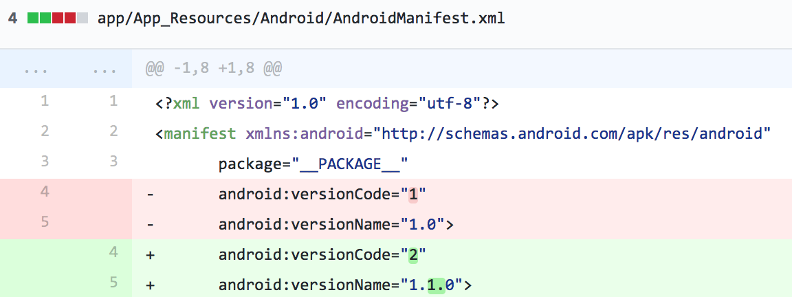

With the version change in place, your next step is to build a new APK of your app to deploy to your users. You can refer to our documentation on [creating Android release builds](https://www.nativescript.org/blog/steps-to-publish-your-nativescript-app-to-the-app-stores#step-5), but essentially, what you’ll need to do is run the following command, swapping out `~path/to/tj-vantoll.jks`, `my-very-secure-password`, and `PokemonTypes` with your own values.

```
tns build android --release
--key-store-path ~/path/to/tj-vantoll.jks
--key-store-password my-very-secure-password
--key-store-alias PokemonTypes
--key-store-alias-password my-very-secure-password
```

Once the command finishes, you’ll have a release `.apk` file in your app’s `platforms/android/build/outputs/apk` folder. You’re now ready to head out to the Google Play Developer Console to upload this new build.

## Creating updates in Google Play

Open the console at [play.google.com/apps/publish](https://play.google.com/apps/publish/) and select the app you want to upgrade. From there, click the “Manage production” button to start the process of creating a new production release.

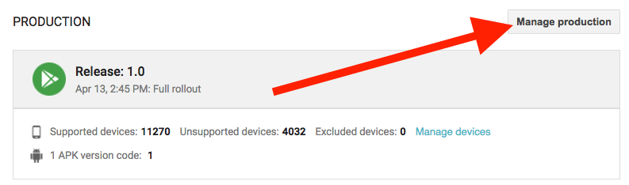

Next, click the “Create release” button.

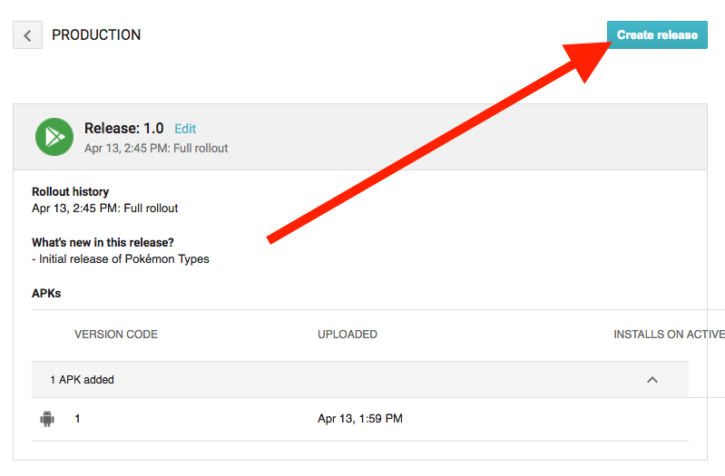

There are a few things you have to do at the next screen. First, find a “UPLOAD APK” button and click it. You’ll see the screen below.

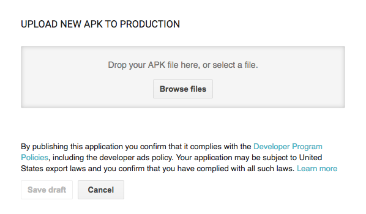

Use the “Browse files” button to upload the APK you just generated (remember it’s in your `platforms/android/build/outputs/apk` folder), and then click the “Save draft” button.

Finally, scroll down and find the “RELEASE NAME” section. Here, give you app a name (most people just provide their version name here for simplicity), and then provide update notes. Be a bit more careful with your update notes, as the user will see this text when they go to upgrade your app in Google Play. Here are the values I used for Pokémon Types.

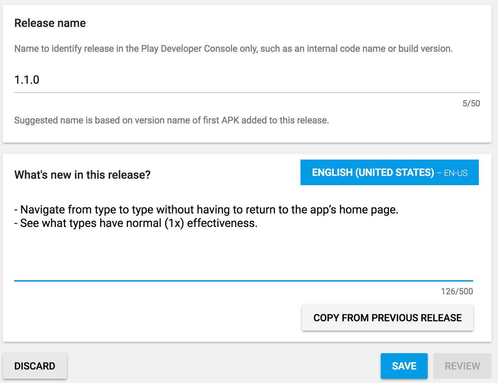

And that’s it! To wrap things up, click the “Save” button, and then the “SUBMIT UPDATE” button on the top of the screen. If all goes well, your users will start seeing updates on their devices within a day or so.

With Android out of the way, let’s move on how to go through the same upgrade process for iOS.

## Updating iOS apps

Much like on Android, your first upgrade step for iOS is updating your app’s version number. On iOS those version numbers are in your app’s `app/App_Resources/iOS/Info.plist` file, so go ahead and open that file now.

Like Android, iOS also has two version numbers, `CFBundleShortVersionString` and `CFBundleVersion`. The first, `CFBundleShortVersionString`, is the version number that end users see, so you’ll probably want to use the exact same `<major>.<minor>.<point>` convention you used for your Android app.

The `CFBundleVersion` value is a lot like Android’s `versionCode`, in that you must increment `CFBundleVersion` every time you upload a build to iTunes Connect. For most cases you’re fine to provide identical values for `CFBundleShortVersionString` and `CFBundleVersion`. That’s exactly what I did when I upgraded Pokémon Types, for example.

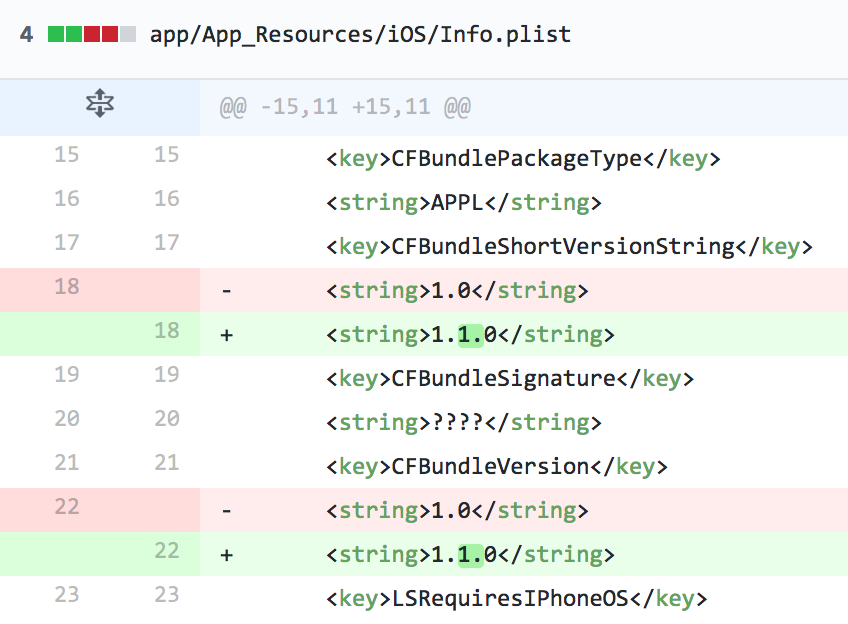

However, if you need to submit multiple builds of your app that use the same version number—for example if you’re having users test your app through TestFlight, or if Apple rejects your app and you have to submit a new version—then you must increment the `CFBundleVersion` before uploading a new build to iTunes Connect.

In those scenarios it’s most common to use a `<major>.<minor>.<point>.<build>` convention for `CFBundleVersion`. For example I could’ve given my first build of Pokeémon Types version 1.1.0 a `CFBundleVersion` of `1.1.0.0`, and given subsequent builds a `CFBundleVersion` of `1.1.0.1`, `1.1.0.2`, and so forth.

Once you have the version numbers you’d like to use in place, you need to perform your release iOS build for this new version. You can refer to our [documentation on creating iOS release builds](https://www.nativescript.org/blog/steps-to-publish-your-nativescript-app-to-the-app-stores#step-7) for details, but essentially you’ll need to run the following command with your appropriate code signing changes in place (refer to the documentation for specifics if you don’t remember).

```
tns build ios --release --for-device
--provision abdc-use-you-own-uuid
```

After this command finishes, you’ll have the `.ipa` file you’ll need in your `platforms/ios/build/device` folder. You’re now ready to head out to iTunes Connect to upload this new build.

## Creating updates in iTunes Connect

Start by opening iTunes Connect at <https://itunesconnect.apple.com/>, clicking “My Apps”, and selecting the app you’d like to update.

From there, find the “+ VERSION OR PLATFORM” link and click it.

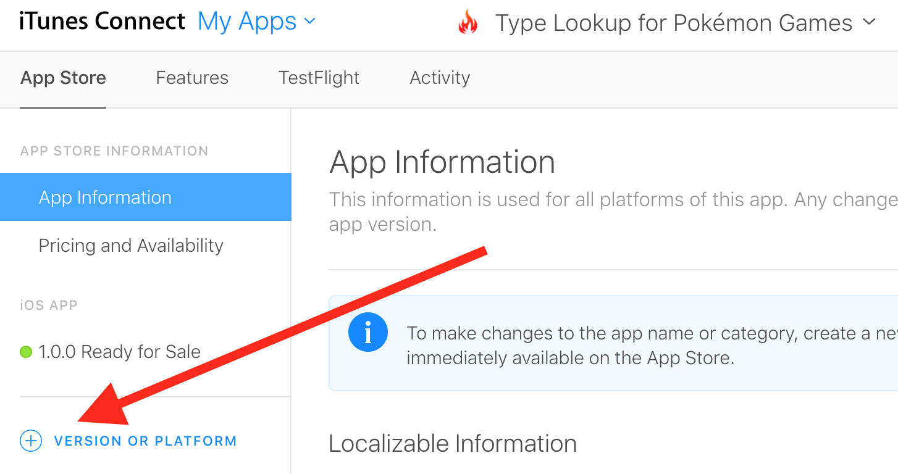

Next, give your app a version number and hit the “Create” button. (The version number you provide here should match the `CFBundleShortVersionString` you used earlier.)

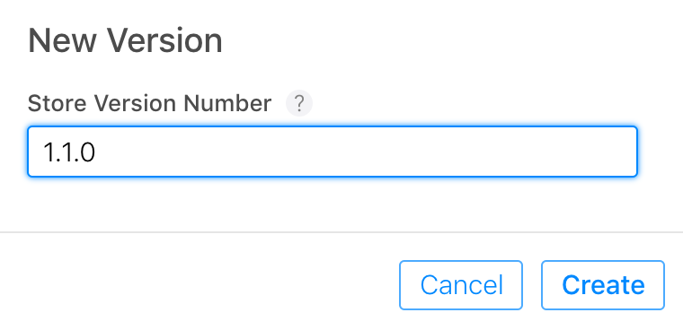

Now that you’ve created your new version, you need to provide two additional pieces of information. The first is your update notes, which you enter at the very top of the screen. I typically copy and paste the exact same notes I used for Android.

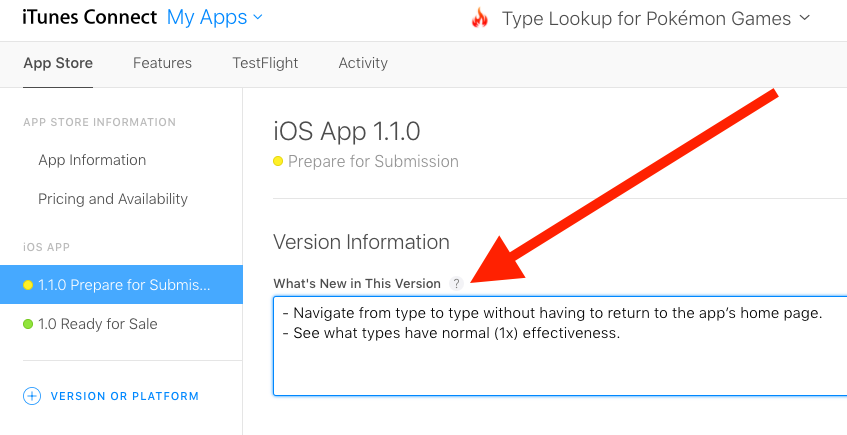

The second thing you must provide is your updated `.ipa` file. If you scroll down in iTunes Connect you’ll see that the “Build” section for this new version is empty.

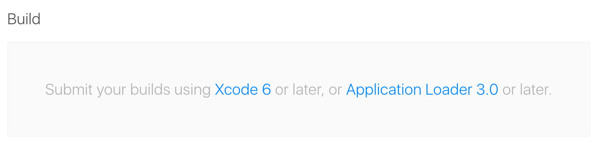

There are a few different ways to upload your builds to iTunes Connect, but the preferred route for NativeScript apps is using the NativeScript CLI’s `tns publish` command.

```
tns publish ios --ipa <path to your ipa file>
```

> **TIP**: Remember that your .ipa file is in your app’s `platforms/ios/build/device` folder. For Pokémon Types the full command I ran was `tns publish ios --ipa platforms/ios/build/device/pokemontypes.ipa`.

The command will ask you for your iTunes Connect email address and password, and then upload your build. One note: it takes a few minutes (and sometimes a few hours) for Apple to process your build, so don’t freak out if your build doesn’t immediately show up in the iTunes Connect dashboard. Instead, refresh your inbox until you see the following email, indicating that your build is ready to go.

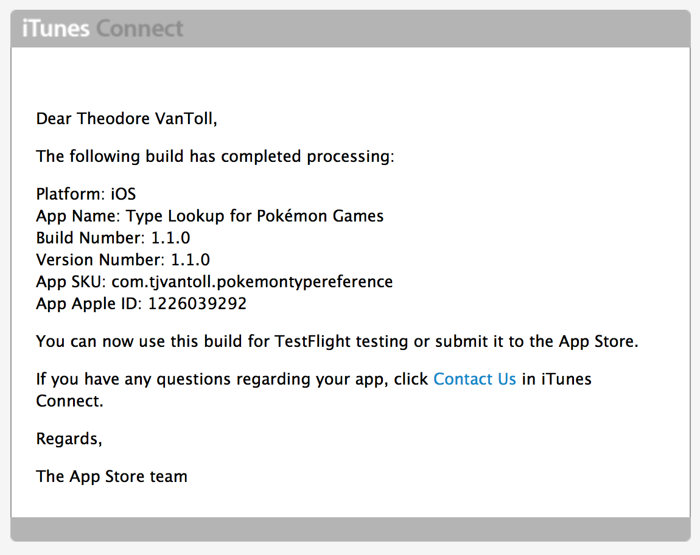

At this point, head back to iTunes Connect, select your new build, and then click the “Submit for Review” button at the top of the screen.

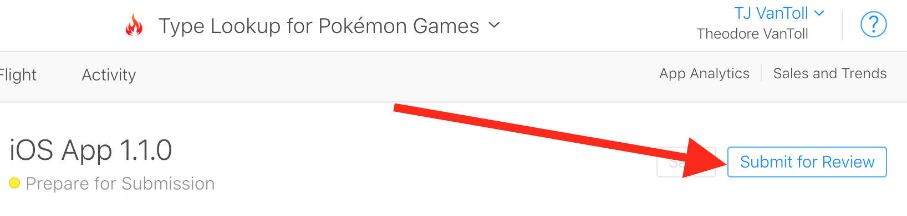

And with that you’re all set. iOS app store updates still go through Apple’s review process, so check <http://appreviewtimes.com/> to get an idea of how long you’ll have to wait before you app gets reviewed and ultimately makes it to your users. For Pokémon Types it took a little more than a day, and then the following showed up on my device 😄

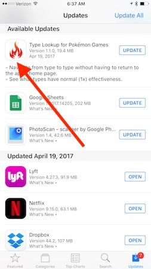

## Wrapping up

Updating iOS and Android apps can be tricky, but it’s not nearly as hard as uploading apps to the stores in the first place. After you go through the steps a few times you should be able to go through the process in less than an hour. And if you run into problems, the [NativeScript Community Forum](https://discourse.nativescript.org/) is a great place to ask for help.
