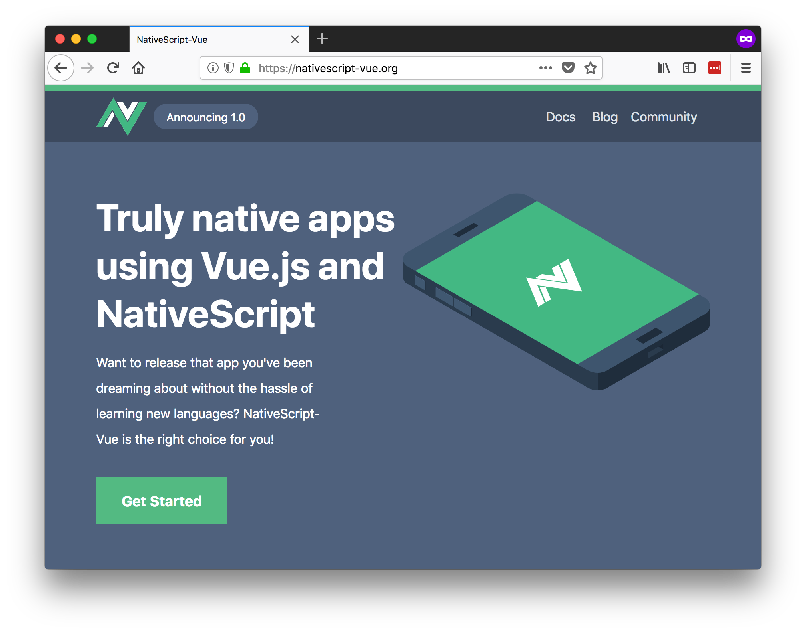
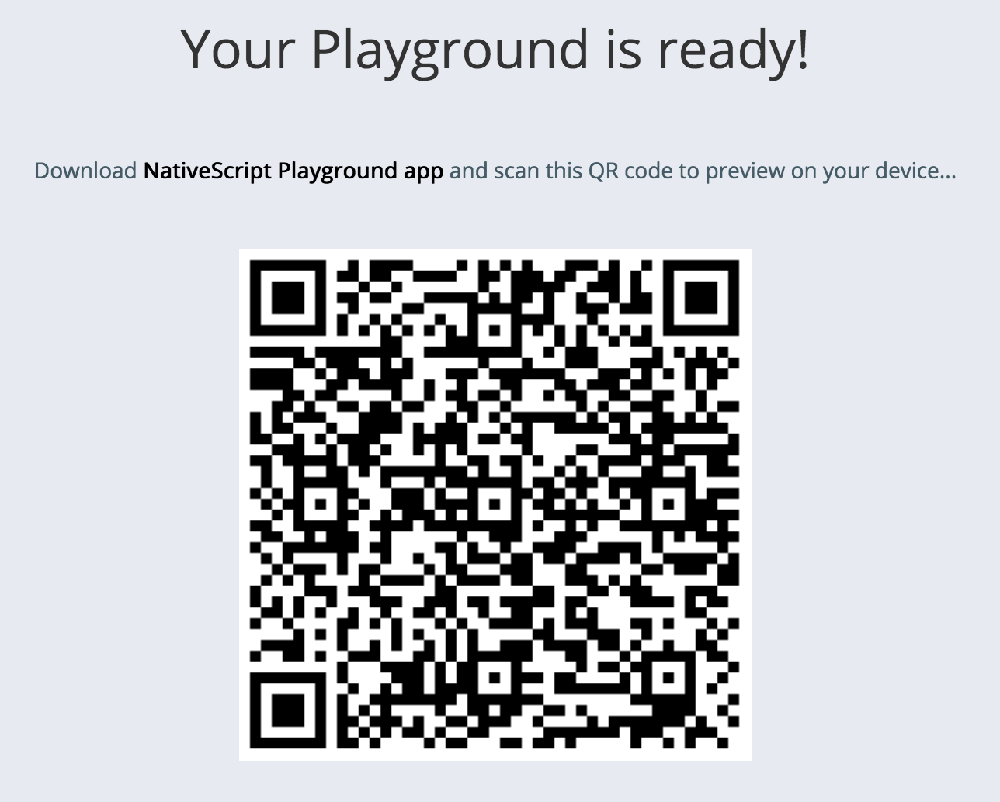
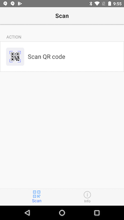
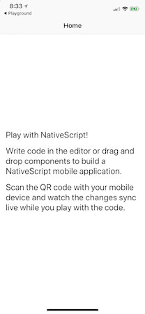
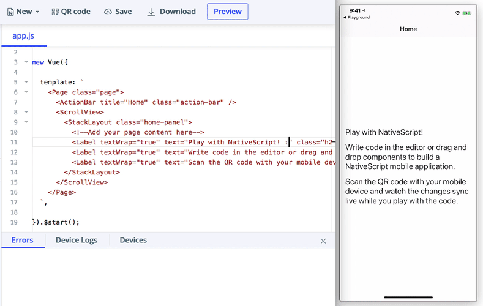
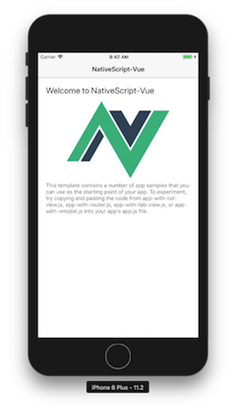
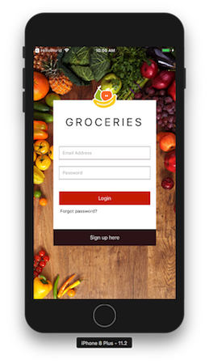
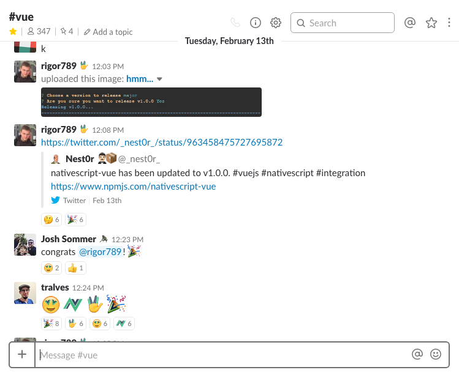

# Announcing NativeScript-Vue 1.0

Last week, Jen Looper and Igor Randjelovic announced a 1.0 release of [NativeScript-Vue](https://nativescript-vue.org/) 🎉

-- TODO: Image of Jen and Igor on stage --

If you’re new to NativeScript-Vue, the project is a [NativeScript](https://github.com/firebase/functions-samples) plugin that allows you to build native iOS and Android apps using [Vue.js](https://vuejs.org/).



With the 1.0 release, NativeScript-Vue now supports all of NativeScript’s user interface components, so now is a great time to dive in learn how to build native mobile apps using Vue.js.

In this article we’ll answer some common questions about NativeScript-Vue, talk about what’s next, and discuss how you can get involved. But let’s start by looking at how you can try NativeScript-Vue right now.

> **NOTE**: Short on time and want to learn more? Next month we’re holding an online event where we’ll talk about NativeScript-Vue in detail. [Sign up!](https://attendee.gotowebinar.com/register/9059771692589680643?source=blog)

## Getting Started

The best place to get started with NativeScript-Vue is in [NativeScript Playground](https://play.nativescript.org/), a browser-based NativeScript development environment that lets you start coding without setting up native iOS and Android SDKs on your development machine.

Start by visiting https://play.nativescript.org/?template=play-vue, which opens Playground with a Vue template preloaded. The first thing you’ll see is a prompt that looks like this.



To use NativeScript Playground you need to download and install two apps on your iOS or Android device. The first app, “**NativeScript Playground**”, has the ability to scan QR codes you see in your browser, and the second, “**NativeScript Preview**”, is a the app that runs the code that you write in your browser.

Download and install both apps, open the NativeScript Playground app on your device, and tap the “Scan QR Code” option.




Go ahead and scan the QR code in your Playground (not the one in this article); you should see the following app on your device.




This app might seem simple, but remember, what you’re seeing is a completely native iOS and Android app. The label components are not DOM `<label>`s like you use on the web; they’re actually `UILabel` controls on iOS and `android.widget.TextView` controls on Android. The power of NativeScript is you get to use these native controls using JavaScript and using frameworks like Vue.

The power of NativeScript Playground is you can now start coding your app, and as you save changes you’ll see updates on your device automatically. For example, try changing the text of some of the labels and using `Cmd` + `S` (or `Ctrl` + `S` on Windows) to save your updates. You should see the updates on your device automatically.



> **NOTE**: I didn’t speed up that gif at all—Playground really is that fast. Try it for yourself!

Let’s do a few more things with this example. Playground has a collection of components that you can easily drag and drop into your code to add to your app. Grab a button control (refer to the gif below if you can’t find it), and drag the component into your app’s template. Save your changes, and you should see a button automatically appear on your device. Cool, huh?


We’ve talked about the power of NativeScript and the power of Playground, but let’s take a moment to consider the power of NativeScript-Vue. Let’s look closer at the syntax of this button example.

``` JavaScript
const Vue = require("./nativescript-vue");

new Vue({
  methods: {
    onButtonTap() {
      console.log("Button was pressed");
    },
  },
  template: `
    <Page>
      ...
      <Button text="Button" @tap="onButtonTap" />
      ...
    </Page>
  `,
}).$start();
```

If you’re familiar with Vue.js you probably recognize this syntax, as it’s identical to the syntax you use for event binding in Vue.js web apps. In fact, basically all the syntax you know from building Vue.js web apps can directly apply to working with native user interface components in NativeScript-Vue.

For instance, the code below uses Vue’s data-binding syntax change the text of the previous example’s button.

``` JavaScript
const Vue = require("./nativescript-vue");

new Vue({
  data: {
    buttonText: "Tap Me!"
  },
  template: `
    <Page>
      ...
      <Button :text="buttonText" />
      ...
    </Page>
  `,
}).$start();
```

The power of NativeScript-Vue is that you can use familiar Vue.js syntax to build native iOS and Android interfaces from a single code base.

> **TIP**: Read through [Building Native iOS and Android Apps With Vue and NativeScript](https://developer.telerik.com/products/nativescript/native-ios-android-vue-nativescript/) for more a thorough guide to the NativeScript-Vue syntax and integration.

Try dragging in a few other components to get a feel of how NativeScript-Vue works (make sure to try the charts and calendar specifically 😄). When you’re ready, let’s next address some of the common questions about NativeScript-Vue.

## Common questions

Now that you have the basics down, let’s look at some common questions related to NativeScript-Vue.

### How do I start developing locally?

Although Playground is great for getting started with NativeScript-Vue, eventually you’ll want to set up a local development environment. A local environment will let you work in your text editor or IDE of choice, will let you install and use [NativeScript plugins](https://market.nativescript.org/), and will let you leverage some advanced Vue templates that let you do things like use `.vue` files.

You need to start by [installing the NativeScript CLI and setting up the appropriate native iOS and Android dependencies](https://nativescript-vue.org/en/docs/getting-started/installation/) on your machine.

> **NOTE**: Setting up native dependencies can be tricky, especially if you’re new to mobile development. If you hit issues going through the process the [NativeScript community forum](https://discourse.nativescript.org) is a great place to reach out for help.

Once you complete the setup, you’ll be able to use the NativeScript CLI to build, run, and deploy NativeScript-Vue applications. For example, you can use the following command to create a new NativeScript-Vue app.

```
tns create sample-app --template nativescript-vue-template
```

Next, you can use the `tns run android` command to run your app on an Android emulator or USB-connected Android device.

```
tns run android
```


And finally, you can use the `tns run ios` command on macOS to run your app on an iOS simulator or USB-connected iOS device.

```
tns run ios
```



> **TIP**: There are also [a variety NativeScript-Vue templates](https://nativescript-vue.org/en/docs/getting-started/templates/) that you might want to check out depending on your personal preferences and project requirements.

### What samples are out there?

Once you get started developing locally, you might want to look at a more fully featured NativeScript-Vue app to see how to implement some more advanced functionality.

The best sample out there is [the NativeScript-Vue Groceries sample built by Tiago Alves](https://github.com/tralves/groceries-ns-vue). The Groceries sample makes use of Vuex, Vue-router, NativeScript animations, and more, so it’s a great reference once you get serious about NativeScript-Vue.




Refer to the [Groceries sample’s README](https://github.com/tralves/groceries-ns-vue/blob/master/README.md) for details on running the sample.

### Who is behind NativeScript-Vue?

NativeScript-Vue is a community initiative led by Igor Randjelovic. Although many members of the NativeScript team are involved in the NativeScript-Vue project in one way or another, NativeScript-Vue is not currently an officially supported Progress product—meaning, for example, that NativeScript-Vue is not covered by [NativeScript’s developer support plans](https://www.nativescript.org/enterprise).

That being said, the NativeScript team is 100% committed to ensuring that NativeScript-Vue is successful. Meaning, we will continue to address bugs and issues that are blockers for the NativeScript-Vue project, as well as provide help working through integration issues as necessary.

NativeScript is an open platform, and helping integrations such as NativeScript-Vue is incredibly important to us.

> **NOTE**: [Progress](https://www.progress.com/) is the company behind NativeScript. If you haven’t heard of us—hi 👋  We make software and stuff.

### Is this ready for production?

It depends. Has NativeScript-Vue been battle tested by multiple large enterprise application building mission-critical software? No. Has NativeScript-Vue been used to build some [cool things](https://www.nativescript.org/blog/announcing-the-winners-of-the-vue.js-nativescript-contest) and [fun samples](https://www.nativescript.org/blog/i-had-a-blast-developing-the-groceries-sample-app-in-vue.js-and-this-is-why)? Yes.

With the 1.0 release the NativeScript-Vue team is asking you to try the release out and decide for yourself. There are definitely some issues with the integration currently, and we’d love to have your help finding them and helping this project succeed.

### What’s next for this integration?

While stability is a major focus of the project moving forward, here are a few [upcoming features to be aware of](https://nativescript-vue.org/blog/nativescript-vue-1.0-and-a-new-site/).

* **Code Sharing**—We are working on an official webpack based template that will allow sharing code between your mobile and web application. You can [follow the project on GitHub](https://github.com/nativescript-vue/nativescript-vue-webpack-template).
* **vue-cli 3 support**—The Vue team is working on a completely new CLI tool for Vue which is currently in alpha. We would love to add support for NativeScript-Vue so it can be part of the regular Vue workflow.

### How do I get involved?

The NativeScript-Vue team hangs out in the #vue channel in the [NativeScript community Slack](https://developer.telerik.com/wp-login.php?action=slack-invitation). The Slack channel is a great place to meet other NativeScript-Vue users, ask any questions you might have, and even get involved with the development of the integration. Bonus—we have custom Vue-related emoji, so I mean.



If you’re the type that likes to dive straight into code, the entirety of NativeScript-Vue is [open source and on GitHub](https://github.com/nativescript-vue). Feel free to look around, and contributions are absolutely welcome!

## What’s next?

Excited and want to learn more? Excellent! Next month we’re holding an online event where we’ll talk about NativeScript-Vue in detail. We’ll have interviews with Igor, as well as some prominent Vue community members. (We might even have one very special surprise guest 😉)

[Sign up now! 🎉](https://attendee.gotowebinar.com/register/9059771692589680643?source=blog)
