# Getting Started with NativeScript-Vue 1.0

Last week, the NativeScript-Vue team announced a 1.0 release of [NativeScript-Vue](https://nativescript-vue.org/) 🎉


As its name implies, NativeScript-Vue is a project that integrates [Vue.js](https://vuejs.org/) into [NativeScript](https://www.nativescript.org/), allowing you to build completely native iOS and Android apps using Vue.js.

In this article we’ll look at how you can start building your first app using NativeScript-Vue, and answer some common questions along the way. Let’s get started.

## Choosing your environment

First things first, there are two ways to develop with NativeScript-Vue.

* **Option 1: Work in NativeScript Playground**: [NativeScript Playground](https://play.nativescript.org/) is a browser-based NativeScript development environment that lets you start coding without setting up native iOS and Android SDKs on your development machine.
* **Option 2: Use the NativeScript CLI**: The NativeScript CLI is a command-line interface for creating, building, and running NativeScript apps. Because the NativeScript CLI builds actual iOS and Android binary files, you must install the necessary native dependencies to develop using the CLI.

In this article we’ll start devleoping using NativeScript Playground, as it’s a great tool for learning how NativeScript-Vue works without going through the hassle of setting up a local environment. After that, we’ll look at the next steps you need to take to set up a local NativeScript-Vue development workflow.

For now, let’s dive right in and start building.

## Using NativeScript Playground

Start by visiting https://play.nativescript.org/?template=play-vue, which opens Playground with a Vue template preloaded. The first thing you’ll see is a prompt that looks like this.

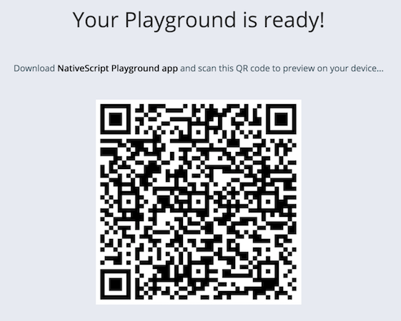

To use NativeScript Playground you need to download and install two apps on your iOS or Android device. The first app, “**NativeScript Playground**”, has the ability to scan QR codes you see in your browser, and the second, “**NativeScript Preview**”, is an app that runs the code that you write in your browser. Here’s what you need to do.

* 1) Download and install both the NativeScript Playground and NativeScript Preview apps on your iOS or Android device. If you have multiple devices you can install the apps on all of them. Playground lets you develop on multiple devices simultaneously, and it’s pretty cool.
* 2) Open the NativeScript Playground app on your device(s), and tap the “Scan QR Code” option.

<div style="display: flex;">
  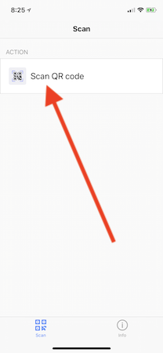
  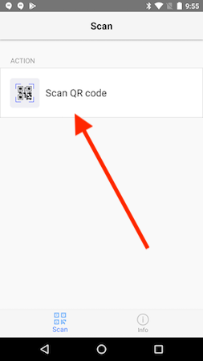
</div>

Go ahead and scan the QR code in your Playground (not the QR code in this article); you should see the following app on your device.

<div style="display: flex;">
  
  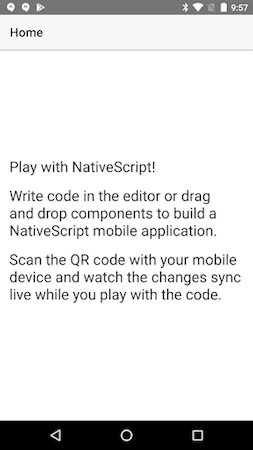
</div>

This app might seem simple, and it kind of is, but there’s one not-especially-obvious thing going on here: the user interface components you see on the screen are not DOM elements—they’re completely native Android and iOS controls. Specifically, the text controls you see in your app are `UILabel`s on iOS and `android.widget.TextView`s on Android.

The power of NativeScript is you get to use these native controls using JavaScript and using frameworks like Vue. Cool, huh?

Now that you have your up and running let’s start making some changes. For example, go ahead and change the `text` attribute of one of the app’s `<Label>` controls, and then use `Cmd` + `S` (or `Ctrl` + `S` on Windows) to save your update. You should see the change on your device automatically.


> **NOTE**: I didn’t speed up that gif at all—Playground really is that fast. Try it for yourself!

Let’s do a few more things with this example. Playground has a collection of components that you can easily drag and drop into your code to add to your app. Grab a button control (refer to the gif below if you can’t find it), and drag the component into your app’s template. Save your changes, and you should see a button automatically appear on your device.

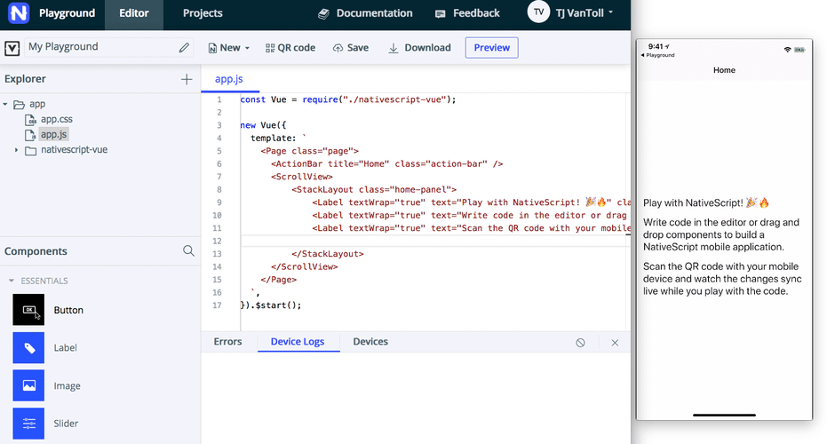


Now that you’ve had a minute to play around in Playground, let’s look closer at the syntax of this button example.

``` JavaScript
const Vue = require("./nativescript-vue");

new Vue({
  methods: {
    onButtonTap() {
      console.log("Button was pressed");
    },
  },
  template: `
    <Page>
      ...
      <Button text="Button" @tap="onButtonTap" />
      ...
    </Page>
  `,
}).$start();
```

If you’re familiar with Vue.js you probably recognize this syntax, as it’s identical to the syntax you use for event binding in Vue.js web apps. In fact, basically all the syntax you know from building Vue.js web apps can directly apply to working with native user interface components in NativeScript-Vue.

For instance, the code below uses Vue’s data-binding syntax to change the text of the previous example’s button.

``` JavaScript
const Vue = require("./nativescript-vue");

new Vue({
  data: {
    buttonText: "Tap Me!"
  },
  template: `
    <Page>
      ...
      <Button :text="buttonText" />
      ...
    </Page>
  `,
}).$start();
```

The power of NativeScript-Vue is that you can use familiar Vue.js syntax to build native iOS and Android interfaces from a single code base.

Try dragging in a few other components to get a feel of how NativeScript-Vue works (make sure to try the charts and calendar especially 😄). When you’re ready, let’s move on to the next steps you need to take.

## Learning NativeScript-Vue

One of the great things about NativeScript-Vue is it considerably lowers the barrier to building native iOS and Android applications. Although this article’s examples have been simple so far, remember that normally you’d have to learn new software (Xcode and Android Studio) and new languages (Swift or Objective-C, Kotlin or Java) even to build trivial native applications.

Even though NativeScript-Vue makes mobile development easier, Vue.js web developers still have a number of concepts they need to learn to be successful with NativeScript-Vue. Let’s look at some of the most important ones.

### Learning task #1: NativeScript user interface components

Because NativeScript uses native iOS and Android user interface components, there is no NativeScript equivalent of HTML elements like `<div>`s or `<span>`s. Instead, you need to learn a [new set of user interface components](https://docs.nativescript.org/ui/components) for building your views.

Don’t worry though; although these user interface components are new, you can still use familiar Vue syntax to handle tasks like event and data binding. You just need to learn what the new components are and how to configure them. And to do that, you can refer to the component documentation [NativeScript-Vue docs](https://nativescript-vue.org/en/docs/introduction/).

For example, remember the `<Button>` from earlier in this article? The [NativeScript-Vue documentation on the component](https://nativescript-vue.org/en/docs/elements/components/button/) has an example and links to the full API documentation.

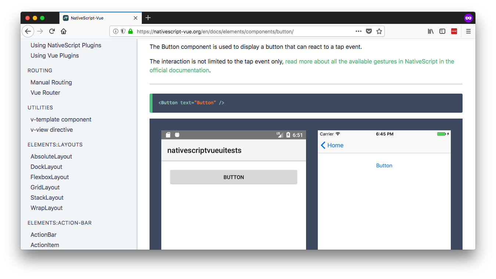

### Learning task #2: NativeScript layouts

Because NativeScript does not use HTML or a DOM, NativeScript cannot replicate many web layout concepts such as `float` and `display: block|inline`. You must therefore learn some new ways to organize your user interface components on the screen.

There are two pieces of good news though. First, NativeScript does have a [full flexbox implementation](https://nativescript-vue.org/en/docs/elements/layouts/flexbox-layout/) that works on both iOS and Android—meaning, you can use a familiar syntax for most of your layout tasks.

Second, the NativeScript team has a [site dedicated to teaching the non-flexbox NativeScript layouts](https://www.nslayouts.com/). When you’re ready to get serious with NativeScript-Vue, it’s worth setting aside 30 minutes to go through the tutorials on the site.

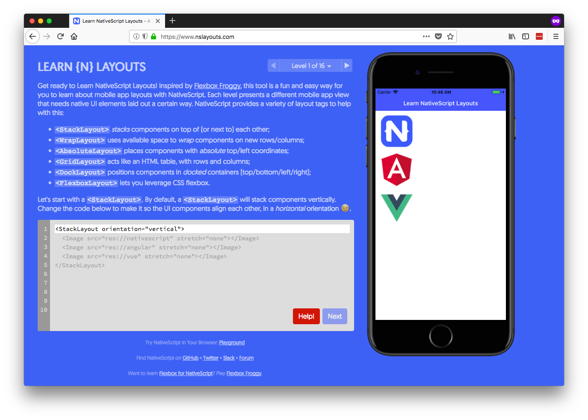

### Learning task #3: The NativeScript CLI

In this article we started with NativeScript Playground, a browser-based NativeScript learning environment. Although Playground is great for getting started, eventually you’ll want to set up a local environment for NativeScript development. A local environment allows you to compile apps for the iOS App Store and Google Play, utilize [NativeScript plugins](https://market.nativescript.org/) in your apps, and take advantage of [tooling such as webpack and `.vue` files](https://github.com/tralves/nativescript-vue-webpack-template).

To develop locally you need to first install the NativeScript CLI from npm.

```
npm install -g nativescript
```

Next, and this is the tricky part, you need to set up the appropriate iOS and Android dependencies for performing builds on your development machine. The NativeScript documentation has a [full guide to walk you through the process](https://nativescript-vue.org/en/docs/getting-started/installation/), but it’s easy to get stuck here as there are lots of moving pieces (different npm versions, different Android versions, etc).

> **NOTE**: If you hit issues going through the installation process, the [NativeScript community forum](https://discourse.nativescript.org) is a great place to reach out for help.

Once you complete the setup, you’ll be able to use the NativeScript CLI to build, run, and deploy NativeScript-Vue applications. For example, you can use the following command to create a new NativeScript-Vue app.

```
tns create sample-app --template nativescript-vue-template
```

Next, you can use the `tns run android` command to run your app on an Android emulator or USB-connected Android device.

```
tns run android
```

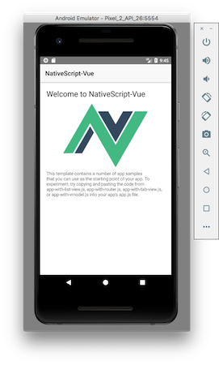

And finally, you can use the `tns run ios` command on macOS to run your app on an iOS simulator or USB-connected iOS device.

```
tns run ios
```


## Where to go from here

Once you learn the NativeScript user inteface components, figure out how NativeScript layouts work, and get the NativeScript CLI down, you’re well on your way to building your next mobile app with NativeScript-Vue. Here are some other links you might find useful as you move on to more advanced NativeScript-Vue development.

* [**Debugging**](https://docs.nativescript.org/tooling/chrome-devtools)—NativeScript includes an integrated debugger built on top of the Chrome Developer Tools. The debugger allows you to step through JavaScript code, view your console, monitor network requests, and even view the visual tree of your iOS and Android application.

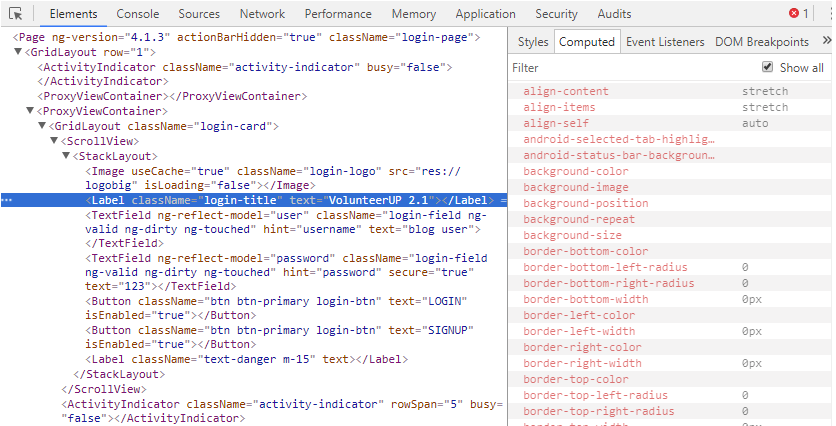

* [**How NativeScript Works**](https://developer.telerik.com/featured/nativescript-works/)—As you start to build advanced applications, it’s good to have some background on exactly how NativeScript allows you to build native iOS and Android apps using JavaScript.

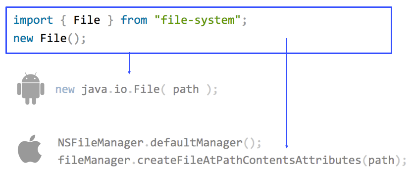

* [**NativeScript Plugins**](https://market.nativescript.org/)—Although NativeScript provides a number of cross-platform APIs out of the box, the NativeScript plugin ecosystem provides hundreds of additional APIs you might need for your app. It’s worth taking a few minutes to [peruse the NativeScript Marketplace](https://market.nativescript.org/) to see what’s out there.

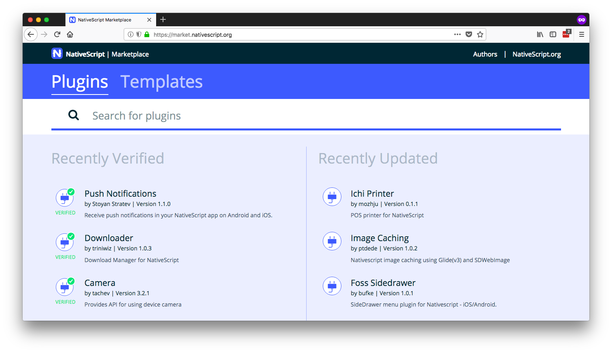

* [**NativeScript Community Slack**](https://developer.telerik.com/wp-login.php?action=slack-invitation)—The NativeScript-Vue team hangs out in the #vue channel in the [NativeScript community Slack](https://developer.telerik.com/wp-login.php?action=slack-invitation). The Slack channel is a great place to meet other NativeScript-Vue developers, ask any questions you might have, and even get involved with the development of the integration.


## Wrapping up

All in all, NativeScript-Vue offers an exciting new way to build iOS and Android apps using Vue.js.

The single best way to get started with NativeScript-Vue is in [NativeScript Playground](https://play.nativescript.org/?template=play-vue), as it lets you get started without having to set up an iOS and Android development environment locally. Once you’re comfortable with the basics, [download and install the NativeScript CLI](https://docs.nativescript.org/start/quick-setup) and [try out one of the NativeScript CLI templates](https://nativescript-vue.org/en/docs/getting-started/templates/). If you have questions, the [NativeScript Community Forum](https://discourse.nativescript.org/) and [Community Slack](https://developer.telerik.com/wp-login.php?action=slack-invitation) are great places to reach out.

And most importantly—have fun 😄 It’s pretty cool that you can building completely native iOS and Android apps with Vue.js, so try it out!
