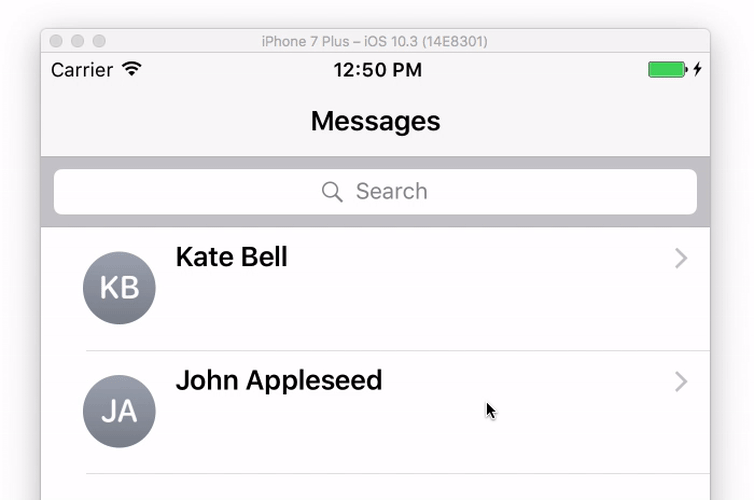
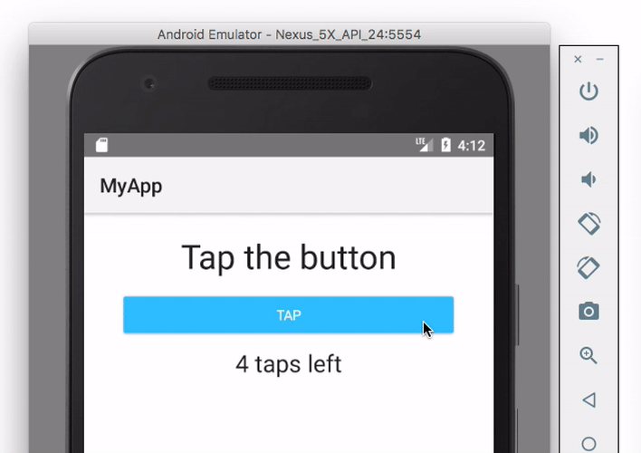
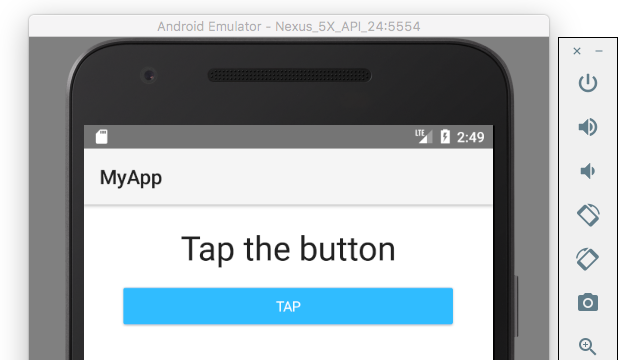
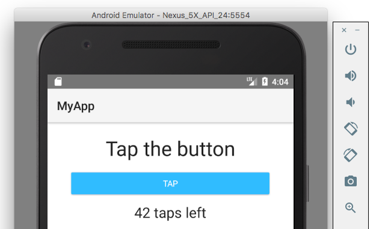

# Building Native iOS and Android Apps With Vue and NativeScript

[Vue](https://vuejs.org/) is a popular JavaScript framework for handling the view layer of your application. NativeScript is technology that lets developers use JavaScript to drive completely native iOS and Android applications.

Together the two technologies build native applications with the simplicity you expect from Vue, and the power you expect from NativeScript. The NativeScript community has been [hard at work trying to make this possible](https://www.nativescript.org/blog/a-new-vue-for-nativescript), and has made considerable progress over the last few months. Although the integration is still in an early state and not ready for production apps, the stack is ready for you to experiment and see what you can build.

And in this article we’ll do just that. You’ll learn how to build a simple app with NativeScript and Vue by going through a handful of examples to see how it all works. Let’s get started.

> **NOTE**: If you want to follow along with the instructions in this article you’ll need to have NativeScript and its dependencies installed on your machine. If you don’t already have NativeScript installed, go ahead and go through the [NativeScript installation guide](http://docs.nativescript.org/start/quick-setup).

## Starting your app

In NativeScript you create, build, and deploy apps using the NativeScript CLI. That applies regardless of whether you’re using NativeScript without any frameworks (NativeScript Core), or whether you’re using NativeScript with a framework like Angular or Vue. Therefore, if you have existing NativeScript experience, you’ll know a lot of what you need to know to get started with Vue. If you’re new to NativeScript there are a small handful of commands you need to know to get started.

The first of those commands is `tns create`, which is the command you use to create new NativeScript apps. The `create` command takes an optional `--template` option to start your app from one of many pre-defined templates. To start a new NativeScript app that uses Vue, run the following command from your terminal or command prompt.

```
tns create MyApp --template nativescript-vue-template
```

This command will take take a few seconds to complete, as it will scaffold out the files you need for your new NativeScript app. After that command completes, `cd` into your new `MyApp` folder.

```
cd MyApp
```

Next, run the app for either iOS or Android using the `tns run` command.

```
tns run ios
```

or

```
tns run android
```

> **NOTE**: If you get an error running your app you probably haven’t installed NativeScript’s dependencies. Refer to [NativeScript’s installation guide](http://docs.nativescript.org/start/quick-setup) for help, and feel free to ask any questions you might have on the [NativeScript community forum](https://discourse.nativescript.org/).

And with that, you’re now running a completely native iOS or Android app driven by NativeScript and Vue. This is what the default app currently looks like.


Don’t worry about the details of what this app is doing at the moment. We’re going to replace this app with a dead-simple implementation so we can talk about how all of this works. To do so, open your project’s `app/app.js` file in your editor of choice and replace the entire contents of that file with the following code.

```
const Vue = require("nativescript-vue/dist");

new Vue({
  template: `
    <Page>
      <StackLayout>
        <Label text="Hello Vue user 👋"></Label>
      </StackLayout>
    </Page>
  `
}).$start();
```

When you save your `app.js` file, the NativeScript CLI will detect the change and automatically refresh your app. You should now see something like this.


Now that you have a functioning starting point, let’s dig into what this code is doing.

## How all of all this works

If you’re a Vue developer you probably recognize some of the syntax from the previous example, but there are a few new things in there too.

To give ourselves a little context for this conversation, let’s look at how the previous example compares to a typical “hello world” Vue web app. Here’s [the code you’d use to build this exact same type of app on the web](https://jsfiddle.net/50wL7mdz/43777/).

```
<script src="vue.js"></script>

<div id="app"></div>

<script>
  new Vue({
    el: "#app",
    template: `
      <div>
        <label>Hello Vue 👋</label>
      </div>
    `
  })
</script>
```

In this example you bring in Vue’s JavaScript code with a `<script>` tag, and initialize a new app by invoking the `Vue()` constructor. Vue takes your app’s template, in this case a `<div>` with a `<label>`, and renders that markup in the DOM (specifically in the `<div id="app">` element).

The code is simple and easy, and this simplicity is one of the reasons that people like Vue so much. With the background of how Vue web apps work in mind, let’s go back to the NativeScript code.

```
const Vue = require("nativescript-vue");

new Vue({
  template: `
    <Page>
      <StackLayout>
        <Label text="Hello Vue user 👋"></Label>
      </StackLayout>
    </Page>
  `
}).$start();
```

As you can see the code is similar, but there are some very clear differences. Let’s start at the top.

```
const Vue = require("nativescript-vue");
```

This line of code is the equivalent of the `<script>` tag from the web example, and is the way that you bring in the `Vue` constructor in a NativeScript context.

NativeScript implements the CommonJS spec, which you might have used if you used if you’ve done any Node development before. If you’re not familiar with CommonJS don’t worry because it’s rather simple. CommonJS modules use the `require()` function to bring in JavaScript functionality from other modules, and use the `export` and `exports` keywords to expose their own APIs for other modules to import. In this case the “nativescript-vue” plugin exports the `Vue` constructor, and you use the `require()` function to get a reference to it in your `app.js` file.

Once you have the `Vue` constructor from the `require()` call you next need to invoke that constructor to initialize your app. On the web that initialization code looked like this.

```
new Vue({
  el: "#app",
  template: `
    <div>
      <label>Hello Vue 👋</label>
    </div>
  `
});
```

And in NativeScript the code to initialize your app looks like this.

```
new Vue({
  template: `
    <Page>
      <StackLayout>
        <Label text="Hello Vue user 👋"></Label>
      </StackLayout>
    </Page>
  `
});
```

The first thing to note is the lack of an `el` property in your NativeScript app. When using Vue on the web you have the ability to have Vue control only a certain portion of your web app, and you configure which portion by passing a selector into the `el` property.

In the context of NativeScript you don’t have that option—by default Vue controls your entire native iOS and Android app, and therefore the `el` property is unnecessary.

Now that you’ve seen how the `Vue` constructor works in both Vue web and NativeScript apps, let’s move on to how NativeScript templates works.

## Working with templates

The `template` property of this example is where the differences between using Vue in web apps and using Vue in NativeScript apps is most noticeable. For context here’s the template you’re using on the web.

```
<div>
  <label>Hello Vue 👋</label>
</div>
```

And here’s the template you’re using in NativeScript.

```
<Page>
  <StackLayout>
    <Label text="Hello Vue user 👋"></Label>
  </StackLayout>
</Page>
```

The key to understanding this code is remembering that in a NativeScript app there is no browser. Therefore, browser-specific tags like `<div>` and `<span>` do not work because they have no equivalent in native iOS and Android apps. If you tried to use a `<div>` in a NativeScript app you would get a parsing error.

Instead, NativeScript provides [a series of user interface components](https://docs.nativescript.org/ui/components) that abstract underlying native iOS and Android controls. For example, the `<Label>` you see in the code above isn’t rendering a label in a browser—it’s actually instantiating a [`UILabel`](https://developer.apple.com/library/ios/documentation/UIKit/Reference/UILabel_Class/) on iOS, and an [`android.widget.TextView`](http://developer.android.com/reference/android/widget/TextView.html) on Android.

The cool thing about NativeScript is these implementation details are completely transparent to you as a developer. You’re doing the equivalent of building an Android app in Android Studio, AND an iOS app in Xcode, but you’re doing so using JavaScript, Vue, and a few new user interface controls.

These new user interface controls do mean that there’s a bit of a learning curve to getting up and running with NativeScript if you come from a web background. To be successful with NativeScript you need to learn what the NativeScript UI components are and how they work. For example let’s back up to your example code.

```
<Page>
  <StackLayout>
    <Label text="Hello Vue user 👋"></Label>
  </StackLayout>
</Page>
```

Let’s start at the top with the `<Page>` component. Pages are the basic building blocks of native mobile apps. In native apps you must designate portions of your interfaces as pages so you can transition between them, as iOS and Android both have built-in conventions for this behavior. For example, Android has a hardware back button you can use for navigation, and iOS has a swipe-right-to-go-back feature that you’re likely familiar with.



In NativeScript apps you mark these distinct pages in your apps using the `<Page>` UI component, so that these sort of transitions are possible.

> **NOTE:** Page routing is not yet supported by the NativeScript Vue plugin, but support is [in the works](https://github.com/rigor789/nativescript-vue/issues/11). Join us on GitHub or [hop on our #vue channel in Slack](http://developer.telerik.com/wp-login.php?action=slack-invitation) if you’d like to help make page navigation happen. 

That brings us to the next chunk of code in the template.

```
<StackLayout>
  <Label text="Hello Vue user 👋"></Label>
</StackLayout>
```

Because NativeScript is not using a browser, web concepts like `display: block` and `display: inline` don’t exist. Instead, NativeScript provides a [series of layout UI controls](https://docs.nativescript.org/ui/layout-containers) you use to arrange your app’s components on your screens.

The easiest of these layouts to use is the [`<StackLayout>`](https://docs.nativescript.org/ui/layout-containers#stacklayout), as it stacks components up the screen (vertically by default, horizontally if you add an `orientation="horizontal"` attribute). The other popular layout components are the [`<GridLayout>`](https://docs.nativescript.org/ui/layout-containers#gridlayout), which allows you to divide the screen in to a set of rows and columns, and the `<FlexboxLayout>` component, which allows you to align elements using the same flexbox syntax you might be used to using in web applications.

For this simple app the single `<StackLayout>` starts stacking child components at the top of the page, which is why you see a simple label right under your app’s status bar.


Before we end our conversation of this basic example, there’s one last bit of syntax we need to discuss, and that’s the `$start()` method that your NativeScript Vue app uses.

```
new Vue({
  template: `...`
}).$start();
```

The `$start()` method is a custom method that the NativeScript Vue plugin adds specifically for NativeScript & Vue development. Why?

NativeScript requires that you call an [`application.start()` method](https://docs.nativescript.org/core-concepts/application-lifecycle#start-application) so the framework can invoke the appropriate iOS and Android APIs to get your app up and running. The `$start()` method that the Vue plugin provides is an abstraction that makes that initialization seamless—just instantiate your `Vue` instance and call its `$start()` method to get your new iOS and Android app up and running.

And with that, we’ve made it through the explanation of this simple Vue and NativeScript starting point. Our discussion wasn’t short, but it’s important to keep in mind what you were able to accomplish in those handful of lines of code. You were able to create a functional native iOS and native Android app, something that would normally require you to jump into multiple new development environments to accomplish, and you were able to do so using JavaScript, Vue, and a small handful of new NativeScript concepts.

Let’s keep going with this example and add a bit more functionality so you can see how the integration works.

## Building a small functional example

If you’ve built NativeScript apps before you’re probably familiar with the NativeScript tap challenge. The tap challenge is a silly little app that asks you to tap a button an arbitrary number of times to see a message. It’s been the default NativeScript app for over two years now because it provides a convenient way to teach app development basics, such as data binding, event handful, and styling.



In this section you’re going to build this simple tap challenge app using Vue to learn a little more about how the Vue and NativeScript integration works. As a first step, replace the code in your `app.js` file with the code below, which adds a few new user interface components.

```
const Vue = require("nativescript-vue");

new Vue({
  template: `
    <Page>
      <StackLayout class="p-20">
        <Label text="Tap the button" class="h1 text-center"></Label>
        <Button text="TAP" class="btn btn-primary btn-active"></Button>
      </StackLayout>
    </Page>
  `
}).$start();
```

This code looks a lot like our previous example, except this time the components all have a `class` attribute. And as you can see, the `class` attribute affects the appearance of the components.



So how is this working? Although NativeScript doesn’t use HTML or DOM elements, the framework does let you [style apps using a subset of CSS](https://docs.nativescript.org/ui/styling) to change the appearance native UI components. Because NativeScript uses native UI components, only certain CSS properties are available for styling your apps—you can view the [full list of properties on the NativeScript documentation](https://docs.nativescript.org/ui/styling#supported-css-properties)—but the really common properties like `margin`, `padding`, `color`, `background-color` and such all work.

NativeScript also includes a [Bootstrap-like theme](https://docs.nativescript.org/ui/theme) you can use to style your controls with a familiar `class` attribute syntax, and that’s exactly what the code above is using. The `<Label>`’s `h1` class name makes the control appear like an `<h1>` on the web, and the `btn`, `btn-primary`, and `btn-active` class names help you build native iOS and Android buttons that look decent by default.

Feel free to look through the NativeScript documentation on [styling](https://docs.nativescript.org/ui/styling) or [theming](https://docs.nativescript.org/ui/theme) if you want to play a bit more with how this all works, but for now let’s continue to evolve this example by exploring how data binding works.

## Data binding in NativeScript and Vue

Data binding on the web works by letting you bind properties on DOM objects to properties in JavaScript objects. In NativeScript there is no DOM, but the exact same syntax that Vue uses on the web can be used to bind data to native iOS and Android user interface controls.

Let’s add one more component to your example so you can get an idea of how this works. Replace the contents of your `app.js` file with the code below, which adds a new `<Label>` and some data binding to set its text.

```
const Vue = require("nativescript-vue");

new Vue({
  data: {
    counter: 42
  },

  template: `
    <Page>
      <StackLayout class="p-20">
        <Label text="Tap the button" class="h1 text-center"></Label>
        <Button text="TAP" class="btn btn-primary btn-active"></Button>
        <Label class="h2 text-center" textWrap="true">{{ setMessage() }}</Label>
      </StackLayout>
    </Page>
  `,

  methods: {
    setMessage() {
      return this.counter + " taps left";
    }
  }
}).$start();
```

Let’s break down what’s happening here. First, note the new `data` property you include in your `Vue` instance.

```
data: {
  counter: 42
}
```

The `data` object is where you place all properties that you need to bind to in the user interface of your Vue app. In your case, you’re using the `counter` property to track how many taps the user has left. (Remember that the user has to tap the button an arbitrary number of times to complete the tap “challenge”.)

Vue provides a [number of different ways you can bind to data](https://vuejs.org/v2/guide/index.html#Handling-User-Input) in your user interface components, but the easiest to use is the `{{ }}` syntax. For example, you could bind to the `counter` property with `<Button text="{{ counter }}"></Button>`.

In this case, your example uses another of Vue’s features, the `methods` property, to bind to a dynamically generated message.

```
<Label class="h2 text-center" textWrap="true">{{ setMessage() }}</Label>
```

```
methods: {
  setMessage() {
    return this.counter + " taps left";
  }
}
```

With this code, when your app loads Vue interprets the `{{ setMessage() }}` call in the template, invokes the `setMessage()` function in the `methods` property, and sets it to the returned string. You now have an app that looks like this.



Before we finish this example by adding a bit of logic it’s worth taking a step back to think about how cool that previous bit of code is. Remember that the “42 taps left” label you see above isn’t a DOM `<label>`—it’s a `UILabel` on iOS and an `android.widget.TextView` on Android. And you can bind to those completely native controls using the same Vue syntax you use to build apps for the web.

With that aside out of the way, the last step you need to take to make this app work is adding a bit of logic that decrements the `counter` property when you tap the button. To implement this functionality and complete this example, take the code below and paste it into your `app.js` file.

> **WARNING**: This code adds a `tap` event handler—which we’ll chat about in a second—and there’s currently an issue in the NativeScript Vue integration that causes apps to crash on `tap` events on iOS. Therefore, if you’re following along on iOS you’ll need to switch over to Android to see this demo work as expected. You can follow the progress of this issue at <https://github.com/rigor789/nativescript-vue/issues/24>.

```
const Vue = require("nativescript-vue");

new Vue({
  data: {
    counter: 42
  },

  template: `
    <Page>
      <StackLayout class="p-20">
        <Label text="Tap the button" class="h1 text-center"></Label>
        <Button text="TAP" @tap="onTap" class="btn btn-primary btn-active"></Button>
        <Label class="h2 text-center" textWrap="true">{{ setMessage() }}</Label>
      </StackLayout>
    </Page>
  `,

  methods: {
    onTap() {
      this.counter--;
      this.setMessage();
    },
    setMessage() {
      if (this.counter <= 0) {
        return "Hoorraaay! You unlocked the NativeScript clicker achievement 🎉";
      } else {
        return this.counter + " taps left";
      }
    }
  }
}).$start();
```

There are two new things in the code above to note. The first is the `@tap="onTap"` attribute on the app’s button, which is Vue’s syntax for handling event binding. NativeScript fires a `tap` event when the user taps user interface controls, and the `@tap="methodName` syntax is how you can bind to that event. (Again, how cool is it that you can bind to native iOS and Android events using the same Vue syntax.)

The second new piece of code is the `onTap` handler, which is a simple function that decrements the app’s counter and updates its message.

```
onTap() {
  this.counter--;
  this.setMessage();
}
```

And with that, you now have a complete tap challenge implementation in thirty lines of code.


## What else can you do?

The tap challenge is not the world’s most complex mobile app, but it’s important to keep in perspective what you just built—this is a functional native iOS _and_ Android app that uses completely native user interface controls.

NativeScript’s Vue integration is a community-led effort that’s still in its infancy, but that doesn’t mean there isn’t some cool stuff you can build. To start, take a look at the `app-with-list-view.js`, `app-with-router.js`, `app-with-tab-view.js`, and `app-with-vmodel.js` files that are a part of your sample app. Each of those are complete chunks of code that you can copy and paste into your `app.js` file to try building different types of Vue apps.

Oh, one last thing: although NativeScript’s Vue integration is in its infancy, NativeScript itself is production-ready app framework for building robust iOS and Android applications with JavaScript. Most NativeScript concepts apply regardless of what framework you choose to use NativeScript with, so you could set aside some time to learn NativeScript today, and keep tabs on NativeScript’s Vue integration as it evolves. If you’re curious, the best place to start is in [one of the NativeScript getting started tutorials](https://docs.nativescript.org/#get-started).
