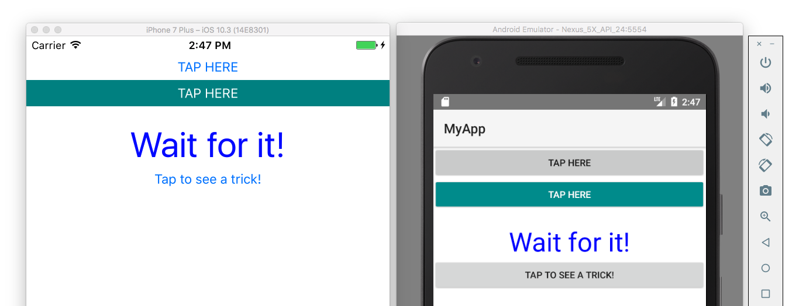
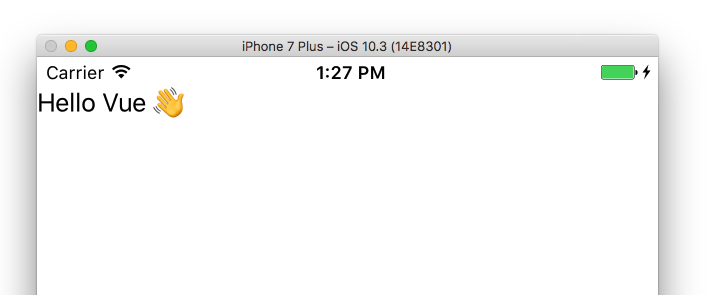

# Building Native iOS and Android Apps With Vue and NativeScript

[Vue](https://vuejs.org/) is a popular JavaScript framework for handling the view layer of your application. NativeScript is technology that lets developers use JavaScript to drive completely native iOS and Android applications.

Together the two technologies build native applications with the simplicity you expect from Vue, and the power you expect from NativeScript. In this article you’ll see how it all works by building a simple application that shows the integration in action.

> **NOTE**: Two important caveats before we get started.
> * This article assumes you have NativeScript and its dependencies installed on your machine. If you don’t, go ahead and go through the [NativeScript installation guide](http://docs.nativescript.org/start/quick-setup).
> * The NativeScript Vue integration is a community-led project that is at a very early stage, and not something you should be using to build production apps—yet. That being said the integration is very much ready for you to experiment with the stack and see what you can build.

Let’s get started.

## Starting your app

To start a new NativeScript app that uses Vue run the following command from your terminal or command prompt.

```
tns create MyApp --template nativescript-vue-template
```

The `tns create` command generates a new NativeScript app from a template, in this case a template that uses Vue. After that command completes, `cd` into your new `MyApp` folder.

```
cd MyApp
```

Next, run the app for either iOS or Android using the `tns run` command.

```
tns run ios
```

or

```
tns run android
```

And with that, you’re now running a completely native iOS or Android app driven by NativeScript and Vue.



Don’t worry about the details of what this default app is doing at the moment. We’re going to replace this app with a dead-simple implementation so we can talk about how all of this works. To do so, start by opening your project’s `app/app.js` file and replacing the entire contents of that file with the following code.

```
const Vue = require("nativescript-vue/dist");

new Vue({
  template: `
    <Page>
      <StackLayout>
        <Label text="Hello Vue user 👋"></Label>
      </StackLayout>
    </Page>
  `
}).$start();
```

When you save your `app.js` file, the NativeScript will detect the change and automatically refresh your app. You should see something like this.



Now that you have a functioning starting point, let’s dig into what this code is doing.

## Initializing your apps

Let’s start by looking at how the code you just used in your `app.js` file compares to a typical Vue web app. For example, here’s what a [“Hello World” Vue web app looks like](https://jsfiddle.net/50wL7mdz/43777/).

```
<script src="vue.js"></script>

<div id="app"></div>

<script>
  new Vue({
    el: "#app",
    template: `
      <div>
        <label>Hello Vue 👋</label>
      </div>
    `
  })
</script>
```

In this example you bring in Vue’s JavaScript code via a `<script>` tag, and initialize a new app by invoking the `Vue()` constructor. Vue takes your app’s template, in this case a `<div>` with a `<label>`, and renders that markup in the DOM (specifically in the `<div id="app">`).

The approach is simple and easy, and is one of the reasons that people like Vue so much. With that background in mind, let’s go back to the NativeScript code.

```
const Vue = require("nativescript-vue");

new Vue({
  template: `
    <Page>
      <StackLayout>
        <Label text="Hello Vue user 👋"></Label>
      </StackLayout>
    </Page>
  `
}).$start();
```

As you can see the code is similar, but there are some very clear differences. Let’s start at the top.

```
const Vue = require("nativescript-vue");
```

This is the equivalent of the `<script>` tag from the web, and is the way that you bring in Vue so you can use the framework in a NativeScript context.

NativeScript implements the CommonJS spec, which you might have used if you used if you’ve done any Node development before. If you’re not familiar with CommonJS don’t worry because it’s rather simple. CommonJS modules use the `require()` function to bring in JavaScript functionality from other modules, and use the `export` and `exports` keywords to expose their own APIs for other modules to import.

Once you have the `Vue` constructor from the `require()` call you need to use it to initialize your app. On the web that code looked like this.

```
new Vue({
  el: "#app",
  template: `
    <div>
      <label>Hello Vue 👋</label>
    </div>
  `
});
```

And in NativeScript the code to initialize your app looks like this.

```
new Vue({
  template: `
    <Page>
      <StackLayout>
        <Label text="Hello Vue user 👋"></Label>
      </StackLayout>
    </Page>
  `
});
```

The first thing to note is the lack of an `el` property in your NativeScript app. When using Vue on the web you have the ability to have Vue control only a certain portion of your web app, and you can control which portion by passing a selector into the `el` property. In the context of NativeScript you don’t have that option—by default Vue controls your entire native iOS and Android app, and therefore the `el` property is unnecessary.

Now that you’ve seen how the `Vue` constructor works in both Vue web and NativeScript apps, let’s move on to how NativeScript templates works.

## Working with templates

The `template` property of this example is where the differences between using Vue in web apps and using Vue in NativeScript apps is most noticeable. For context here’s the template you’re using on the web.

```
<div>
  <label>Hello Vue 👋</label>
</div>
```

And here’s the template you’re using in NativeScript.

```
<Page>
  <StackLayout>
    <Label text="Hello Vue user 👋"></Label>
  </StackLayout>
</Page>
```

The key to understanding this code is remembering that in a NativeScript app there is no browser. Therefore, browser-specific tags like `<div>` and `<span>` do not work because they have no equivalent in native iOS and Android apps. If you tried to use a `<div>` in a NativeScript app you would get a parsing error.

Instead, NativeScript provides [a series of user interface components](https://docs.nativescript.org/ui/components) that abstract underlying native iOS and Android controls. For example, the `<Label>` you see in the code above isn’t rendering a label in a browser; it’s actually instantiating a [`UILabel`](https://developer.apple.com/library/ios/documentation/UIKit/Reference/UILabel_Class/) on iOS, and an [`android.widget.TextView`](http://developer.android.com/reference/android/widget/TextView.html) on Android.

The cool thing about using NativeScript is those implementation details are completely transparent to you as a developer, which is kind of neat. You’re doing the equivalent of building an Android app in Android Studio, AND an iOS app in Xcode, but you’re doing so in JavaScript.

Even though you’re building iOS and Android apps in JavaScript doesn’t mean there isn’t a learning curve though. The main thing Vue web developers need to learn to be successful with NativeScript is what the NativeScript UI components are and how they work. For example let’s back up to your example code.

```
<Page>
  <StackLayout>
    <Label text="Hello Vue user 👋"></Label>
  </StackLayout>
</Page>
```

Let’s start at the top with the `<Page>` component. Pages are the basic building blocks of native mobile apps. Unlike mobile web apps where you can transition from one `<div>` to another, in native apps you must designate portions of your interfaces as pages so you can transition between them. iOS and Android both have built-in conventions for this behavior. For example, Android has a hardware back button you can use for navigation, and iOS has a swipe-right-to-go-back feature that you’re likely familiar with.

-- gif of iOS transition in action --

In NativeScript apps you mark these distinct pages in your apps using the `<Page>` UI component, so that these sort of transitions are possible.

> **NOTE** Page routing is not yet supported by the NativeScript Vue plugin, but support is [in the works](https://github.com/rigor789/nativescript-vue/issues/11). Join us on GitHub or [hop on our #vue channel in Slack](http://developer.telerik.com/wp-login.php?action=slack-invitation) if you’d like to help make page navigation happen. 

That brings us to the next chunk of code in the template.

```
<StackLayout>
  <Label text="Hello Vue user 👋"></Label>
</StackLayout>
```

Because NativeScript is not using a browser, web concepts like `display: block` and `display: inline` don’t exist. Instead, NativeScript provides a [series of user interface components you use to arrange other UI components on your screens](https://docs.nativescript.org/ui/layout-containers).

The easiest of these to use is the [`<StackLayout>`](https://docs.nativescript.org/ui/layout-containers#stacklayout), as it stacks components up the screen (vertically by default, horizontally if you add an `orientation="horizontal"` attribute). The other popular layout components are the [`<GridLayout>`](https://docs.nativescript.org/ui/layout-containers#gridlayout), which allows you to divide the screen in to a set of rows and columns, and the `<FlexboxLayout>` component, which allows you to align elements using the same flexbox syntax you might be used to using in web applications.

For this simple app the single `<StackLayout>` starts stacking child components at the top of the page, which is why you see a simple label right under your app’s status bar.


Before we end our conversation of this basic example, there’s one last bit of syntax we need to discuss, and that’s the `$start()` method that your NativeScript Vue app uses.

```
new Vue({
  template: `...`
}).$start();
```

The `$start()` method is a custom method that the NativeScript Vue plugin adds specifically for NativeScript & Vue development. Why?

NativeScript requires that you call a `start()` method when you’re ready for your app to start, just so NativeScript can call the appropriate iOS and Android APIs to initialize the underlying native application. The `$start()` method that the Vue plugin provides is an abstraction that makes that initialization seamless—just instantiate your `Vue` instance, and call its `$start()` method to get your new iOS and Android app up and running.

Phew! That wasn’t short, but it’s important to keep in mind what you were able to accomplish in those handful of lines of code. You were able to create a functional native iOS and native Android app, and you were able to do so with Vue in JavaScript.

That being said this app doesn’t feel much like a native app yet. Let’s start to fill in this app to make it do more than display a simple message.

## Building a more complete example

To see a little bit more of what NativeScript and Vue are capable of, let’s build something that’s a little more useful than a Hello World message. 