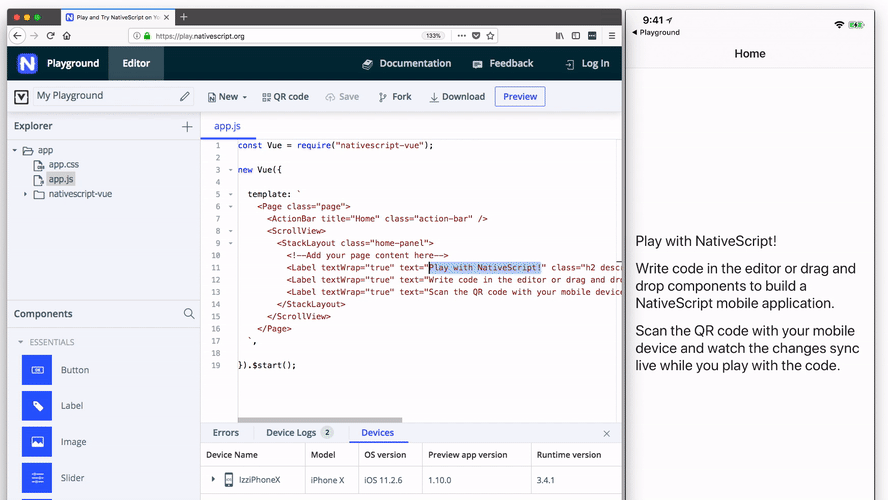
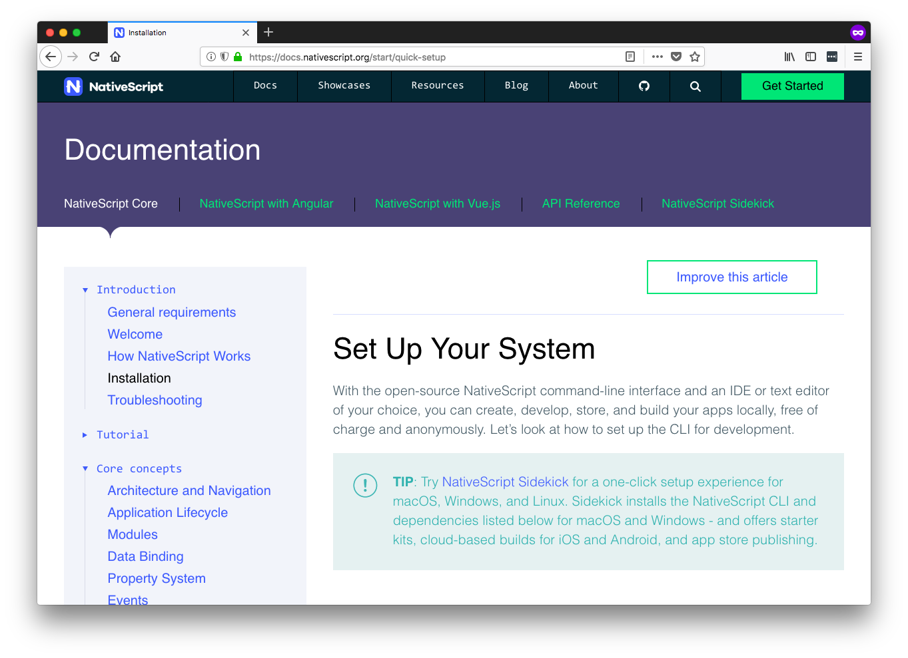
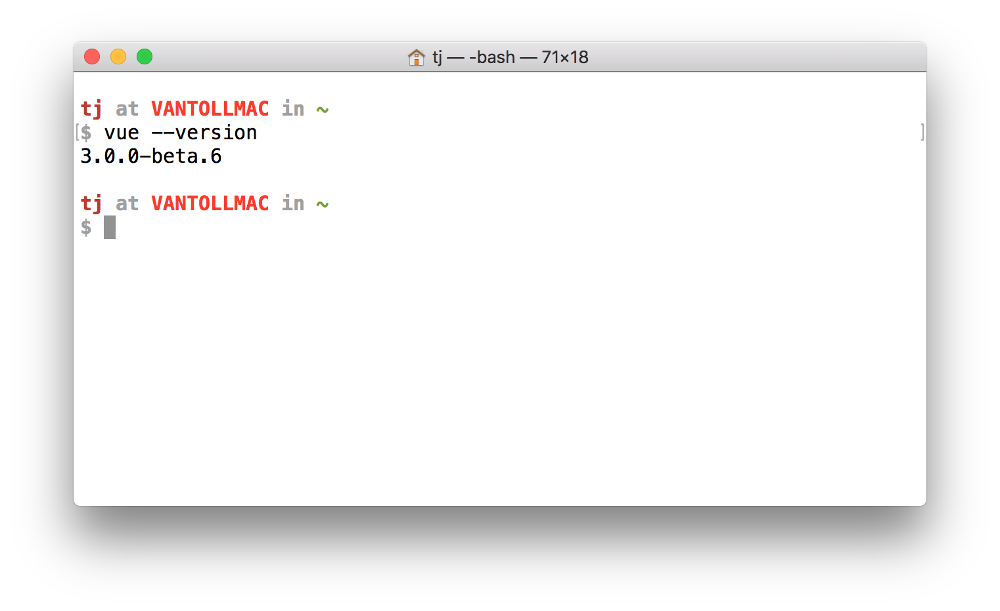
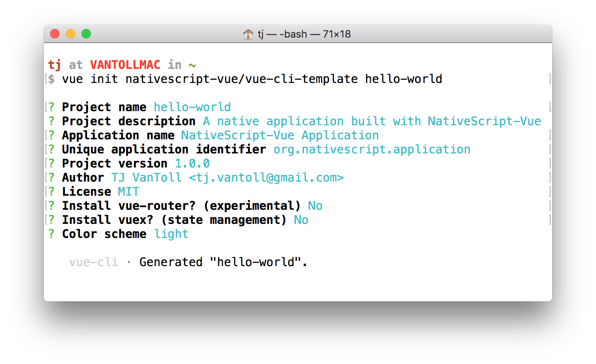
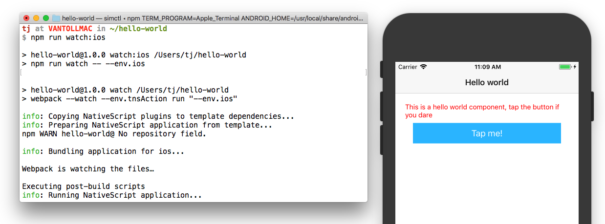
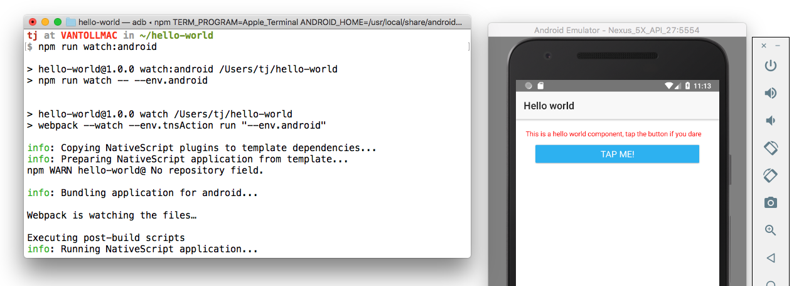
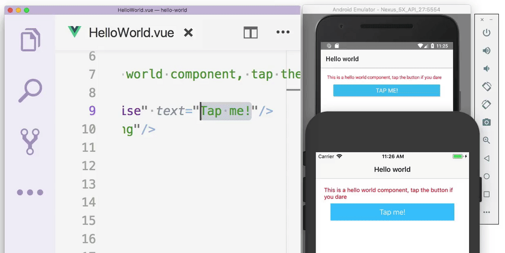

# Setting Up a Robust NativeScript-Vue Development Environment

Welcome back to the week of Vue.js on the NativeScript blog. Just as a reminder, here’s a schedule of the articles we’ve published and that are on the way.

* [A Brief Intro to Using Vue.js with NativeScript](https://www.nativescript.org/blog/a-brief-intro-to-using-vue-with-nativescript)
* [Using Plugins in a NativeScript-Vue App](https://www.nativescript.org/blog/using-plugins-in-a-nativescript-vue-app)
* Setting Up a Robust NativeScript-Vue Development Environment (👋🏻 )
* The Making and Remaking of Elocute (tomorrow)

Today we’re going to step beyond the basics, and look at how to set up a robust local NativeScript-Vue development environment.

> **NOTE**: Short on time? Make sure to sign up for our upcoming [NativeScript-Vue webinar](https://register.gotowebinar.com/register/9059771692589680643?source=week-of-vue) where we go over local development and more on April 5th!

First, let’s back up. If you read our [intro to NativeScript-Vue](https://www.nativescript.org/blog/a-brief-intro-to-using-vue-with-nativescript) from earlier this week, you know that you have two primary ways to get started with NativeScript-Vue. The first is [NativeScript Playground](https://www.nativescript.org/blog/a-brief-intro-to-using-vue-with-nativescript#playground), a web-based environment for quickly tinkering with NativeScript-Vue apps right in your browser.


_In NativeScript Playground you can change NativeScript-Vue code, and see those changes on your device instantly._

Although Playground is great for getting started, it’s not without limitations. Playground is browser based, and therefore you can’t use your favorite text editor or IDE. You also can’t take advantage of local build tools, such as webpack, which give you the ability to do things like build your apps with `.vue` files.

Therefore, as you move into more advanced NativeScript development, you’ll want to switch over to the second NativeScript-Vue development option—the Vue CLI. Let’s look at how to get things up and running.

## Setting up dependencies

First a quick word of warning: setting up a local NativeScript development environment is potentially challenging. NativeScript builds actual native iOS and Android applications, and because of that, you must set up local environments for both Android and iOS development to build NativeScript apps.

There is some good news though. First, the NativeScript docs have [a comprehensive guide](https://docs.nativescript.org/start/quick-setup) that walks you through the necessary setup, including a script that installs many of the necessary dependencies automatically. If you haven’t already, go ahead and complete the NativeScript installation as a first step.


_The installation guide from the NativeScript documentation. You’ll need to complete these steps before starting with NativeScript-Vue local development._

Oh, and some more good news. If you hit problems during installation, the NativeScript and NativeScript-Vue communities are here to help. The [NativeScript community forum](https://discourse.nativescript.org/) is a great place to ask questions if you get stuck; there’s even a category specifically for [getting started questions](https://discourse.nativescript.org/c/getting-started).


_The NativeScript community forum is a great place to ask questions if you get stuck getting started._

> **TIP**: As another option for getting help, the NativeScript-Vue community also hangs out on the NativeScript community Slack. [Join us](https://developer.telerik.com/wp-login.php?action=slack-invitation)!

Once you have the necessary NativeScript dependencies in place, let’s look at how to get started using NativeScript-Vue.

## Setting up NativeScript-Vue

As of [NativeScript-Vue 1.0](https://nativescript-vue.org/blog/nativescript-vue-1.0-and-a-new-site/) the Vue CLI is the recommended way to develop apps using NativeScript-Vue. To use the CLI, you’ll first have to install it from npm.

```
npm install -g @vue/cli @vue/cli-init
```

If you run `vue --version` you can check that the installation succeeded.


_You can check what version of the Vue CLI you’re using with the `vue --version` command._

> **NOTE**: NativeScript-Vue uses version 3.x of the Vue CLI to leverage some newer features of the CLI

, which at the time of this writing is still in beta. Check out [this article](https://alligator.io/vuejs/using-new-vue-cli-3/) if you want to learn more about version 3.x of the Vue CLI.

After the installation, use the `vue init` command to create a new application using the NativeScript-Vue’s default template. For example, the following command creates a new project named “hello-vue”.

```
vue init nativescript-vue/vue-cli-template hello-vue
```

After you run that command, your terminal will prompt you with a number of questions on how to build your app. Feel free to customize these if you’d like, but if you’re just getting started it’s fine to hit enter a few times to accept all the defaults.


_The `vue init` command let’s you configure your new NativeScript-Vue app._

After that, `cd` into your project and use `npm install` to install all necessary dependencies.

```
cd hello-vue
npm install
```

And with that you’re now ready to test out your new app on iOS and Android devices. Let’s look at how to do that.

## Running your apps

Because NativeScript apps are iOS and Android apps, you must run NativeScript apps on either iOS simulators, Android emulators, or USB-connected iOS or Android devices.

If you went through the [NativeScript installation instructions](https://docs.nativescript.org/start/quick-setup) earlier, you should have Xcode installed, which includes the iOS Simulators you need for testing iOS apps.

> **NOTE** iOS apps can only be build on macOS machines. If you’re interested in building iOS apps on Windows or Linux, check out [NativeScript Sidekick](https://www.nativescript.org/nativescript-sidekick), a NativeScript development companion that includes the ability to build apps in the cloud—making it possible to build for iOS on Windows and Linux.

For Android development you’ll want to take a minute to set up at least one Android Virtual Device if you haven’t already. Check out [this guide on how to do that](https://developer.android.com/studio/run/managing-avds.html) on Android Studio’s documentation if you still need to create one.

Once you have your emulators and simulators in place, head back to your terminal or command prompt. You next need to execute the `npm run watch:<platform>` command, where platform is either `ios` or `android`. For example, below I use the `npm run watch:ios` command to launch my app on an iOS simulator.



And below I use the `npm run watch:android` command to launch my app on an Android Virtual Device.



> **TIP**: If you omit the platform from the `watch` command, aka if you use `npm run watch`, the command will deploy your app to _all_ running iOS simualtors, Android Virtual Devices, and USB-connected devices. It’s great when you need to test your app on multiple devices simultaneously. If you’re interested in this workflow, check out our article on [launching Android emulators and iOS simulators from the command line](https://developer.telerik.com/topics/mobile-development/launch-android-emulators-ios-simulators-command-line/), as you need to start the emulators/simulators before running `watch` for this setup to work.

Each of those commands will take a minute or so to complete, as under the hood NativeScript generates an actual application binary file for iOS or Android, respectively, and pushes that application out to simulators and devices as necessary.

Once it’s done though you get some functionality that’s pretty cool though. To see it in action, open your new app’s `src/components/HelloWorld.vue` file in your text editor or IDE of choice. Find the `<Button>` component’s `text` attribute (`text="Tap me!"`), change `Tap me!` to some other value, and save the file.

Your CLI will automatically detect the change, and push it out to all connected devices. Here’s what that looks like in action.



It’s important to take a step back here to appreciate what’s happening here. Remember, what you’re looking at is not a web app; you’re updating native iOS and Android apps, using native iOS and Android UI components, and you’re doing so with Vue.js!

## Wrapping up

If you followed this article from start to finish you should now have a local NativeScript-Vue development environment in place, and a workflow you can use to update your app and see those changes immediately.

From here, you’ll want to check out the [NativeScript-Vue docs](https://nativescript-vue.org/en/docs/introduction/) for a list of the NativeScript elements and what you can do with them. You might also want to [join the NativeScript community Slack](https://developer.telerik.com/wp-login.php?action=slack-invitation) to chat with others developers starting out with NativeScript-Vue.

And finally, if you have any tips or tricks you use with NativeScript-Vue, feel free to share them in the comments!