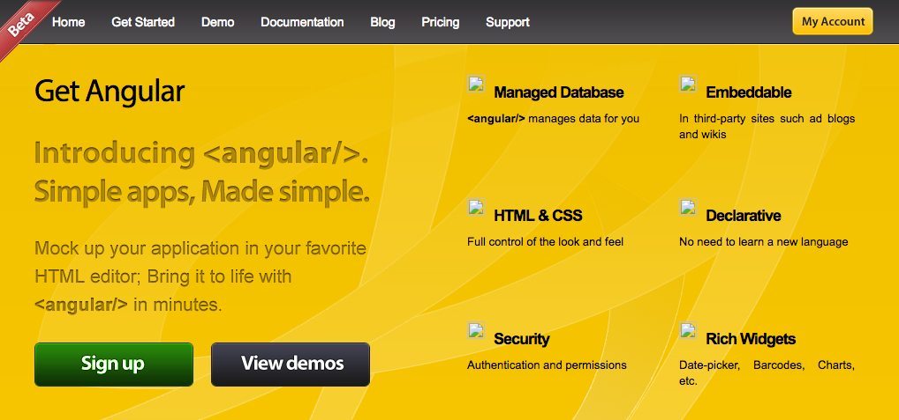
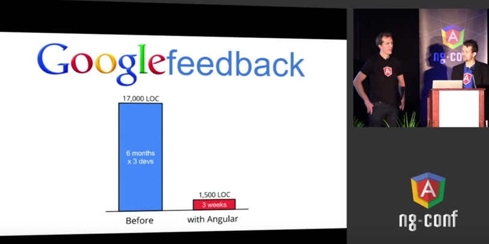
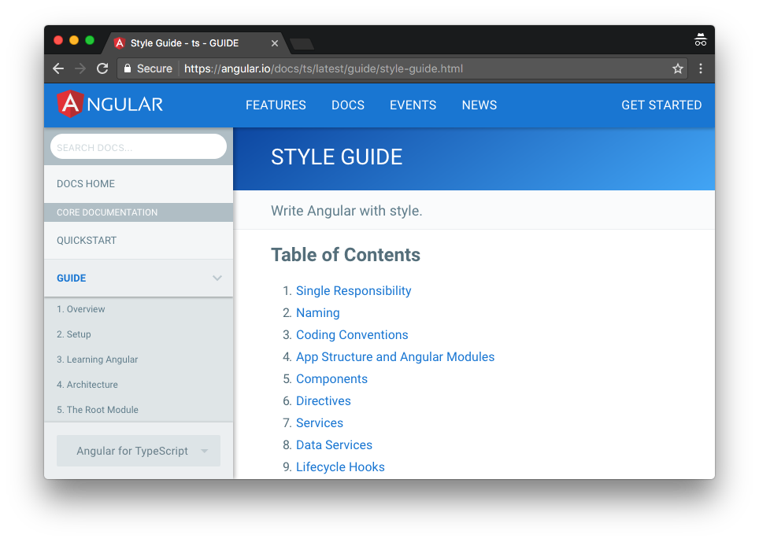
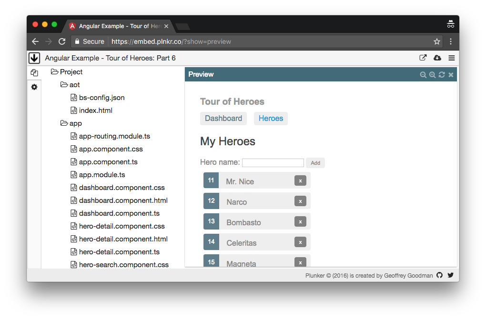
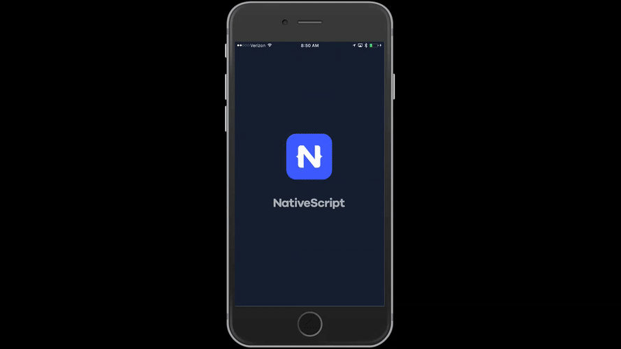
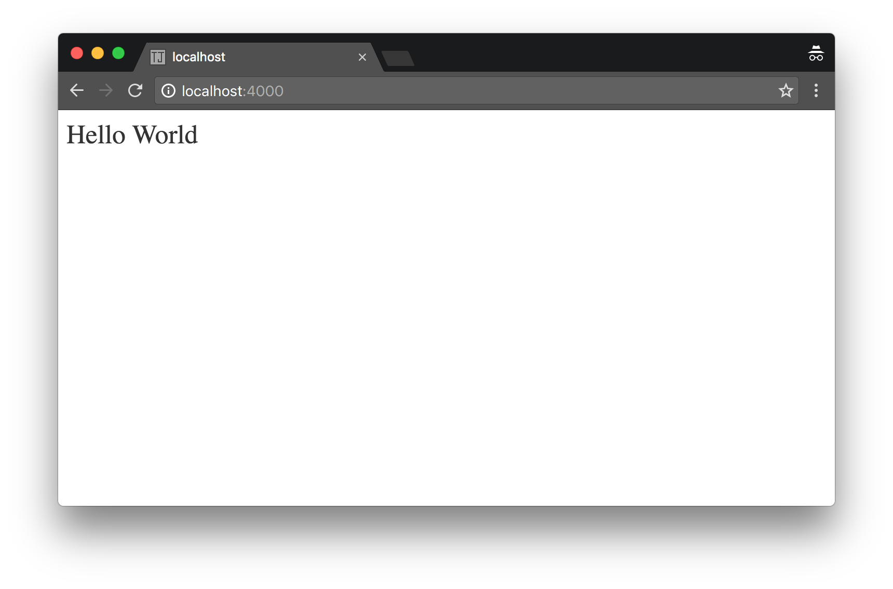
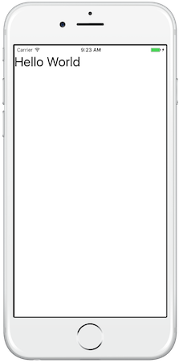
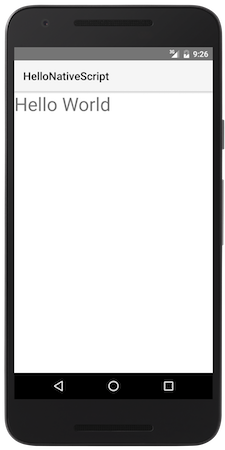

# What is Angular?

Every once in a while it’s worth taking a step back and looking at the development world from a beginner’s perspective. Here at Progress we use Angular a lot. [Angular](https://angular.io/) is a fundamental building block in both our web framework [Kendo UI](http://www.telerik.com/kendo-ui), as well as our mobile framework [NativeScript](https://www.nativescript.org). And as such, we get a lot of questions about what Angular is and how to use it. When did Angular start? Who maintains Angular? Why would you use Angular? When shouldn’t you use Angular?

In this article we’ll answer these questions and more. We’ll look at what Angular is, how it got started, and when using Angular is a good idea. After that we’ll take a brief look at the very basics of how an Angular apps works with a few simple examples. But let’s start at the beginning, and look at how the Angular framework got its start.

## How did Angular start?

Angular started as a side project. Back in 2009, Miško Hevery and Adam Abrons [released a project called &lt;angular /&gt;]((http://misko.hevery.com/2009/09/28/hello-world-angular-is-here/)) that would help developers, as well as designers, build web applications using simple HTML tags. The name “Angular” comes from the angle brackets, or < >, that surround all HTML tags—`<div>`, `<span>`, and so forth.

Miško described the idea behind the framework in an [interview done in 2013](http://www.infoworld.com/article/2612801/javascript/what-s-so-special-about-google-s-angularjs.html):

> “We wanted to see if we could make it easier for Web designers, not necessarily Web developers, but Web designers, to sprinkle a little bit of extra HTML into their code so that they could turn a static form to something they could actually send in an email. The idea would be that you could [for example] have a mom-and-pop shop that sells pizza or something, maybe you could [have] a simple ordering system just by adding a bunch of these tags and they could send an email to the server.”

Because the domain angular.com was taken—which it still is today, by the way—eventually the maintainers renamed the library to GetAngular, and put out a small little site that talked about the framework’s features.


*The Angular homepage as of December 2009 [retrieved via the Internet Archive](https://web.archive.org/web/20091230110525/http://getangular.com/)*

Soon after Miško started working for Google, and in 2010 he was working on a project called Google Feedback. Miško convinced his manager, Brad Green, to rewrite the project with his Angular side project, and the amount of time and code the team was able to save helped convince Google of the power Angular offered.


*Brad Green and Miško Hevery showing just how much time and code they were able to save my using Angular. The screenshot is from the [ng-conf 2014 keynote](https://www.youtube.com/watch?v=r1A1VR0ibIQ), which is well worth watching if you really want to dive deep into how Angular got started.*

Shortly after the success of the Google Feedback rewrite the same team open sourced the library, and then eventually released a 1.0 version of Angular in May of 2011. Within a few years Angular usage skyrocketed, and today Google boasts that [over one-and-a-half million developers use Angular](https://dzone.com/articles/angularjs-2-official-release-from-google-team).

## What does Angular do?

Angular is a JavaScript framework that helps developers build applications. The library provides a number of features that make it trivial to implement the complex requirements of modern applications, such as data binding, routing, and animations.

Angular also provides a series of conventions for how you approach application development, which can be beneficial for large teams that need to work together on a single code base. Angular is one of the only JavaScript libraries to provide a [comprehensive style guide](https://angular.io/docs/ts/latest/guide/style-guide.html) with a number of opinionated guidelines on how you could write your code with the framework.


*The Angular style guide provides guidelines on how to structure and build your apps.*

## When should you use Angular?

Technically you can use Angular to build just about anything, but Angular works best in non-trivial applications that involve data. If you look over the various Angular apps listed on [madewithangular.com](https://www.madewithangular.com/) you’ll see a fairly consistent theme—apps that collect data from forms and do something with it.

This doesn’t mean you need to have forms in your app to use Angular. Developers have built a surprising number of [games with Angular](http://www.angularjs4u.com/games/top-10-angularjs-games-built-angular/), as well as crazier things like [virtual reality applications](https://www.youtube.com/watch?v=E3P4KMoE3VU). However, most Angular tutorials and guides you’ll find will walk you through setting up some sort of form-based app. Angular’s documentation, for example, has you [build an app where you create heroes through a form and see them in a list](https://angular.io/docs/ts/latest/tutorial/toh-pt1.html).


*The final result of the Tour of Heroes demo tutorial app from Angular’s documentation*

Angular works well in form-based apps, and it is also well suited for large and complex applications. Angular is neither the simplest JavaScript framework nor the smallest; therefore, if you’re building something small you’ll likely find simpler libraries like [jQuery](http://jquery.com/) to be a better fit. Similarly, Angular is well suited for applications developed by medium to large teams. If you’re working on an app by yourself, you may find Angular’s boilerplate code and development conventions to be overkill for your own needs.

Angular also works well for applications that need to run in multiple development environments. If you have an app that must run on the web as well as a Windows or Mac desktop application, you can follow one of many [online tutorials for running your Angular app with the popular Electron project](https://scotch.io/tutorials/creating-desktop-applications-with-angularjs-and-github-electron). If you have an app that must run on the web as well as iOS or Android, you can leverage technologies like [NativeScript](https://www.nativescript.org/) to render your app in a truly native mobile environment. In some cases you can even [share code across these platforms](https://www.youtube.com/watch?v=R3nyG2xtzeQ), saving valuable development time.


*An example of a native iOS app written with Angular. You can [try this app on your own device](https://www.nativescript.org/nativescript-example-application), or [read about using NativeScript with Angular](https://docs.nativescript.org/angular/tutorial/ng-chapter-0.html) to see how to build something like this yourself.*

## Whom maintains Angular?

The Angular Core Team includes a vast array of people that span the world and the Angular community. That being said, most of the day-to-day development of Angular is done by Google employees. [Angular’s about page](https://angular.io/about/) lists roughly 20 Googlers on the Angular Core Team, and all of the [top contributors](https://github.com/angular/angular/graphs/contributors) to the Angular project work at Google.

That being said, although Google controls Angular, the library itself is still very much a community effort. Well over two thousand individuals have contributed to one of the [many open-source Angular repositories](https://github.com/angular/), countless community-written tutorials and guides are available, and numerous companies offer training and tooling for developers to leverage.

Also, having a single company control a project is not necessarily a bad thing. Having one company drive a library mitigates cross-company arguments when non-trivial changes need to be made.

## What version of Angular should I use?

At the time of this writing there are two popular versions of Angular. Version 1 is available at <https://angularjs.org/>, and is an updated version of the same Angular library Miško and team released back in 2011. The other popular version is now referred to as simply “Angular”, and is available at <https://angular.io/>. The modern Angular is a completely redesigned version of the library designed for newer browsers, workflows, and development platforms.


In almost all cases you should stick with the most recent version of Angular for new development. Although the Angular team has committed to maintaining Angular 1 for the forseeable future, there is no reason to believe they’ll continue to maintain the older version indefinitely. Furthermore, Angular 1 does not allow usage of the library outside of a web browser, therefore you’re unable to take advantage of libraries like NativeScript for creating native mobile apps.

## What does an Angular app look like?

Now that you have a little background on where Angular came from and what it does, let’s dive into some code, starting with a little hello world example. All Angular apps start in HTML, and all start with an HTML page that looks something like this.

``` HTML
<!doctype html>
<html>
  <head>
    <!-- The various &lt;script&gt; tags needed to load Angular -->
    <!-- For a full list, see https://angular.io/docs/ts/latest/quickstart.html -->
  </head>
  <body>
    <my-app></my-app>
  </body>
</html>
```

In a real app the `<script>` tags in the `<head>` can get a bit complex, but at a high-level Angular apps are just like any other web apps—you load a bunch of JavaScript in an HTML document, and that JavaScript makes the app work.

The one unique thing in the above example is the `<my-app>` element, as that’s not an element you’d regularly use in a web-based application. Angular’s goal has always been to extend the vocabulary of HTML, and it does so by allowing you do define your own tags.

These custom tags are known as components and you define their behavior in code. Here’s the world’s simplest implementation of the `<my-app>` element.

``` JavaScript
import { Component } from "@angular/core";

@Component({
  selector: "my-app",
  template: `
    <h1>Hello World</h1>
  `
})
export class AppComponent {}
```

There are a couple things you need to know to understand what’s going in the chunk of code above. The first is that code is [TypeScript](https://www.typescriptlang.org/) and not JavaScript. TypeScript can seem scary if you’ve never seen the language before, but the basics aren’t too hard to understand.

TypeScript is a superset of JavaScript, meaning, all JavaScript syntax is valid TypeScript syntax. In fact, all of the funky looking syntax in the above example—`import`, `export`, `@Component`, and so forth—are all either current features of JavaScript, or proposed features that are likely coming to the language in the near future. So for the most part when you learn TypeScript you’re learning the future of JavaScript. And for the parts that are different, the TypeScript language has [superb documentation](https://www.typescriptlang.org/docs/tutorial.html) that you can refer to at any time. TypeScript was created and is maintained by Microsoft, and has been [growing in popularity](http://developer.telerik.com/featured/the-rise-of-typescript/) for the last few years; therefore it’s not much of a risk to incorporate TypeScript in to your application development. It’s not going anywhere.

Let’s look back at the TypeScript code that defines the `<my-app>` component.

``` JavaScript
import { Component } from "@angular/core";

@Component({
  selector: "my-app",
  template: `
    <h1>Hello World</h1>
  `
})
export class AppComponent {}
```

In Angular you use the `@Component` tag—which is known as a decorator—to mark classes that should be considered elements that can be used in your HTML markup. You have the ability to pass that `@Component` properties to describe the element.

* The `selector` property determines that tag’s name when typed in HTML. The use of `selector: "my-app"` is how Angular knows what to do when it see a `<my-app>` tag in HTML.
* The `template` property controls what HTML gets rendered when this component is used. The use of `template: "<h1>Hello World</h1>"` is how Angular determines what to render when it sees `<my-app>`, and is why this app renders a basic `<h1>` tag when you preview this basic app in a web browser.


*How our basic “Hello World” example renders in a web browser.*

## Why would I use this again?

Angular is not the world’s simplest framework, and it takes time to understand some of the concepts that Angular builds on top of. But once you do there are some really powerful things you can do in a surprisingly small amount of code. For example, suppose you wanted to add data binding to the previous example. There’s a really [easy-to-use syntax for doing so](https://angular.io/docs/ts/latest/guide/displaying-data.html).

Want to build a form to drive this app? Want that form to have validation and two-way data binding? There’s an [easy-to-follow guide for that](https://angular.io/docs/ts/latest/guide/forms.html). Is your app getting big and you want help structuring it to grow? There’s a [guide for that](https://angular.io/docs/ts/latest/guide/architecture.html) too. Getting into unit testing and want to know how to test your code? That’s [built-in](https://angular.io/docs/ts/latest/guide/testing.html) too.

With Angular you’re not getting the world’s easiest-to-use framework, but you are getting an incredibly robust, well documented, and battle-tested framework used by millions of developers to create incredibly powerful applications. The Angular community is enormous, and help is readily available via Google searches, Stack Overflow, and all around the web. Hiring? There are tons of Angular developers available, and there are even [recuiting sites dedicated to Angular jobs](https://www.weloveangular.com/).

Oh, and remember how I mentioned that Angular runs on multiple plaforms? With a small tweak to the Hello World example you can have the beginning of the next great iOS and Android app—just switch the `<h1>` HTML element to a [component that NativeScript can render in native mobile environment](https://docs.nativescript.org/ui/components), like `<Label>`. Here’s what that code looks like.

``` JavaScript
import { Component } from "@angular/core";

@Component({
  selector: "my-app",
  template: `
    <Label text="Hello World" class="h1"></Label>
  `
})
export class AppComponent {}
```

And here’s what that code renders in a completely native iOS and Android app.




Angular makes this possible and a whole more. From enabling teams to build awesome apps, to empowering developers to build on multiple platforms, Angular may be the solution you’re looking for on your next development project. 

If you’re looking for more details than this simple introduction can offer, go ahead and [go through Angular’s quick-start tutorial](https://angular.io/docs/ts/latest/quickstart.html) to start to learn the framework by coding. And if you’re looking to use Angular to get into mobile development, give [using Angular with NativeScript a shot](http://docs.nativescript.org/angular/tutorial/ng-chapter-0); you’ll learn one of the web’s most popular JavaScript frameworks while getting familiar with in-demand world of mobile application development.
