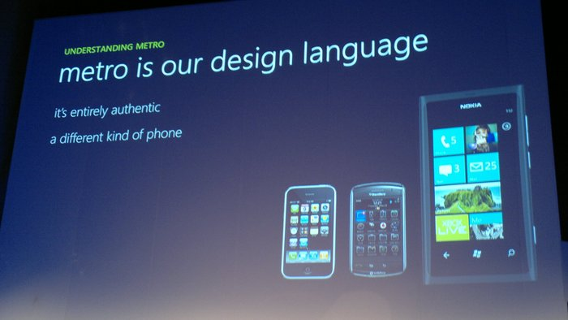

TJ VanToll [9:08 AM] 
As an employee of a company with a strong history in the Microsoft world, I’m ashamed of how naive I am about common Windows technologies and terms.

One of those technologies is UWP, or Universal Windows Platform, which I personally know very little about. To fix that we’ve invited in a few of our experts in the space to help explain the basics. Can we start with having someone give us a super simple definition of what UWP is?

Sam Basu [9:09 AM] 
We can talk about UWP .. but I can set some quick context as to how we got here

[9:09]  
2 min history lesson here kids

TJ VanToll [9:09 AM] 
:popcorn:

Ed Charbeneau [9:09 AM] 
> Kids: But Mr. Basu, history is boring

Sam Basu [9:09 AM] 
So, before smartphones were a thing ..

Carey Payette [9:09 AM] 
And dinosaurs roamed the earth

Sam Basu [9:10 AM] 
Between 1996-2008, MSFT had a thing called Windows Mobile

Jen Looper [9:10 AM] 
:phone:

Sam Basu [9:10]  
It was aimed at enterprise users and ran Windows CE (Embedded)

TJ VanToll [9:10 AM] 
Wait, 1996?

Sam Basu [9:10 AM] 
Yep

Ed Charbeneau [9:10 AM] 
1996 B.I. (Before Internet)

Carey Payette [9:11 AM] 
... pretty sure I was writing CGI scripts prior to '96 :wink:

TJ VanToll [9:11 AM] 
I was making Geocities sites :slightly_smiling_face:

Carey Payette [9:11 AM] 
midi background music, and a scrolling marquee required... don't forget blink

Sam Basu [9:11 AM] 
Then, a lanky man  showed off a new device in 2007 and things went south quickly

[9:11]  
For Windows Mobile that is

Sam Basu [9:12 AM] 
The last version was WM 6.5 - the geeks still loved it

Ed Charbeneau [9:12 AM] 
I've tried to black out those days :slightly_smiling_face:

Sam Basu [9:12 AM] 
Full file system access + stylus etc.

Jen Looper [9:12 AM] 
a stylus!? no!

TJ VanToll [9:12 AM] 
I thought this was 2 minutes @samidip :stuck_out_tongue:

Sam Basu [9:12 AM] 
So MSFT had to reboot .. hang on, getting to good parts

Ed Charbeneau [9:12 AM] 

Sam Basu [9:13 AM] 
In 2010, they launched Windows Phone 7

Sam Basu [9:13 AM] 
Same Windows CE OS, but with Metro design language UX

They stumbled for a year or so

[9:13]  
Then came Windows Phone 8

Jen Looper [9:13 AM] 
I kind of liked Metro

Sam Basu [9:14 AM] 
This was breaking - with a new Windows NT kernel OS

Ed Charbeneau [9:14 AM] 

Sam Basu [9:14 AM] 
Yeah, many like Metro - nothing wrong in the design paradigm

[9:14]  
So folks couldn’t upgrade from WP 7/7.5 to WP 8

Ed Charbeneau [9:15 AM] 
Windows Phone is still my favorite OS. Too bad there's no apps. But is this what UWP could fix @samidip.

Sam Basu [9:15 AM] 
But on the plus side, now WP shared some core OS bits with Windows - and developers could target either 

Carey Payette [9:15 AM] 
I still carry my Nokia 1520 ... luckily I have no time for apps, so it's all about the experience for me

Sam Basu [9:16 AM] 
Then came WP 8.1 with Cortana and a bunch of enhancements

[9:16]  
And then another reboot - to UWP

[9:16]  
And Windows 10

TJ VanToll [9:16 AM] 
tl;dr Microsoft had some good ideas, but none really caught on.

Carey Payette [9:16 AM] 
Microsoft has been working in a direction to unify the Windows Operating system across multiple device families. Universal Windows Platform (UWP) provides a core API that allows development across them. This means, with one code base, you can target Desktop Computers, Phones, Xbox, HoloLens and IoT devices. Using languages and a declarative UI (XAML) that Windows Developers are already familiar with.

Sam Basu [9:16 AM] 
Yep

[9:16]  
WP, Tablets & Desktop now share much of the core

Ed Charbeneau [9:17 AM] 
HoloLens!

TJ VanToll [9:17 AM] 
So to go back to our timeline when did UWP become a thing?

Sam Basu [9:17 AM] 
2015

Jen Looper [9:17 AM] 
and… and what is it exactly?

TJ VanToll [9:17 AM] 
A strategy, or software? (edited)

Sam Basu [9:17 AM] 
A platform - of APIs

Instead of individual form factors, now you have device families

[9:18]  
One could target the lowest common denominator

[9:18 AM] 
in which case your app runs everywhere

Carey Payette [9:18 AM] 
Yep, I run Windows IoT Core on the raspberry pi

Sam Basu [9:18 AM] 
Or pick a device family with specific APIs

[9:18]  
Check this: https://msdn.microsoft.com/en-us/windows/uwp/get-started/universal-application-platform-guide

Carey Payette [9:19 AM] 
To develop for the Pi, you create a UWP project, add the IoT extensions, and you have full GPIO access

TJ VanToll [9:19 AM] 
So paint a picture for me. I want to develop the next great app and I want it to run on all the devices. What’s my first step?

Sam Basu [9:19 AM] 
There are some APIs that all UWP apps can use freely, and some conditional based on device families

TJ VanToll [9:19 AM] 
Visual Studio?

Sam Basu [9:19 AM] 
For now, yes

Carey Payette [9:19 AM] 
You can even do it free, TJ ... Visual Studio Community :slightly_smiling_face:

Sam Basu [9:19 AM] 
Pick UWP templates & choose your device family

Jen Looper [9:20 AM] 
Can I use it on my Mac? with VS Code?

Jen Looper [9:21 AM] 

Carey Payette [9:21 AM] 
awwwww :wink:

Sam Basu [9:21 AM] 
So nope, you can’t build UWP apps on a Mac yet

Jen Looper [9:21 AM] 

Sam Basu [9:21 AM] 
Although there were rumors of something being in the works

Sam Basu [9:27 AM] 
There are ways to build UWP apps - like through an Electron shell, but it is tricky

TJ VanToll [9:21 AM] 
So let’s chat about UWP is well suited for.

Ed Charbeneau
What are some killer UWP apps that have been created since its introduction in 2015? It's 2017 now.

Sam Basu [9:22 AM] 
Most Windows Store apps are UWP apps now

Jen Looper [9:23 AM] 
Can you give me a link?

Sam Basu [9:23 AM] 
Store: https://www.microsoft.com/en-us/windows/windows-10-apps

Sam Basu
And yes, attracting developer mindset has been a challenge - chicken vs egg problem

Sam Basu [9:23 AM] 
UWP shines in a few places - like ink apps, and apps for Hololens

Jen Looper [9:23 AM] 
what is an ink app?

[9:23]  
:lower_left_ballpoint_pen:

Ah https://www.microsoft.com/en-us/store/collections/WindowsInkCollection/pc

Carey Payette [9:23 AM] 
Skype is pretty popular :wink:

TJ VanToll [9:23 AM] 
Oh Skype is UWP?

Carey Payette [9:24 AM] 
Yes

Jen Looper [9:24 AM] 
ahhhhh

TJ VanToll [9:24 AM] 
Nice!

Sam Basu [9:24 AM] 
On Windows platforms

Jen Looper [9:24 AM] 
THAT EXPLAINS IT

[9:24]  
sry

Sam Basu [9:24 AM] 
Lol

TJ VanToll [9:24 AM] 
So on a related note, whenever I see UWP marketing it’s always along the lines of running your app in Windows and like an Xbox. It sounds cool, but does anyone actually do that?

Sam Basu [9:24 AM] 
Hard sell - hardcore Windows devs bought it

Carey Payette [9:24 AM] 
I run skype on my xbox too :wink:

TJ VanToll [9:25 AM] 
@cpayette Ah true, I didn’t even think about that.

Ed Charbeneau [9:25 AM] 
and on HoloLens https://developer.microsoft.com/en-us/windows/holographic/updating_your_existing_universal_app_for_hololens

Jen Looper [9:26 AM] 
so what does UWP bring to the developer that wasn’t available prior? An ecosystem?

Sam Basu [9:26 AM] 
A consistent API layer for all of Windows ecosystem

Ed Charbeneau [9:27 AM] 
That consistency will really come in to focus when UWP is added to the .NET Standard ecosystem

Carey Payette [9:26 AM] 
I think anything that can be beneficial as a Kiosk would be a good use case. For "desk" workers, you can run it on your Windows OS. For field users, you an run it on a small device. The same app can be built to target both

[9:26]  
You can also build UI's that are adaptive, so you can share that layer as well

[9:27]  
(Wrap panel)

Sam Basu [9:28 AM] 
Yeah, to @cpayette’s point, the UI layer is smart - same controls are responsive across various screens

Jen Looper [9:27 AM] 
And what language do you use to build them?

[9:27]  
.NET?

TJ VanToll [9:27 AM] 
C#?

Jen Looper [9:27 AM] 
(totally ignorant)

[9:28]  
can you use JS?

[9:28]  
C# & .NET

[9:28]  
You cannot use straight up JS - WinJS is no longer a thing, afaik

Ed Charbeneau [9:28 AM] 
and Visual Studio :metal:

Carey Payette [9:30 AM] 
(Don't forget VB.Net, and C++ as languages)

TJ VanToll [9:28 AM] 
So I’m a company looking to build an app. Can we list a few criterion that would make UWP a good/bad fit?

[9:29]  
Like, good—you’re a Windows shop.

Carey Payette [9:29 AM] 
Distribution/connectivity requirements

TJ VanToll [9:29 AM] 
Bad—you love Macs :slightly_smiling_face:

Sam Basu [9:29 AM] 
Good - Have .NET devs. Have users using various Windows devices.

[9:31]  
UWP is good in the Windows ecosystem for those specialized apps - like Surface Hub, Hololens, IoT & XBox - lot of code sharing

TJ VanToll [9:32 AM] 
Is UWP beneficial at all if you’re targeting a single platform? Like if I’m just building a desktop Windows 10 app for instance.

Sam Basu [9:32 AM] 
Yeah, that’s hard though - I sticking to my utopia of Write once & suck, err, run everywhere

Sam Basu [9:33 AM] 
@tjvantoll I wouldn’t say so - with a narrow focus

[9:33]  
For just a desktop app, you could go with WPF

[9:33]  
But, in future, if you want to code share & run your apps elsewhere, then pick UWP

Carey Payette [9:33 AM] 
WPF is great, and the XAML chops can be used in UWP

Sam Basu [9:34 AM] 
Yeah, the nice thing about UWP is bringing over your C#/XAML chops as is

Jen Looper [9:35 AM] 
So I’m sort of convinced. But for full disclosure…what is the downside of using UWP?

Sam Basu [9:34 AM] 
The downside is, Universal in UWP isn’t quite universal yet, if you cannot target iOS/Android

Carey Payette [9:34 AM] 
One downside is that I would say that not every feature of "regular" .NET is available in UWP.

TJ VanToll [9:35 AM] 
@cpayette What sort of features?

Sam Basu [9:35 AM] 
Uh oh - @cpayette just opened a can of worms

Jen Looper [9:35 AM] 
ruh roh!

TJ VanToll [9:36 AM] 

Carey Payette [9:36 AM] 
I know when developing on the PI, I tried to get things like memory usage directly from UWP and it wasn't possible...

Sam Basu [9:37 AM] 
The runtime is WinRT and powered by .NET Core - with a few bits borrowed from the full .NET

[9:37]  
But if you’re a pro .NET guy, you may miss features

Jen Looper [9:39 AM] 
(Carey, what are you building on that Pi, anyway!?)

Carey Payette [9:39 AM] 
I'm always messing around on the Pi ... I created a fun hotwheels track for the kids using UWP :wink:

Carey Payette [9:41 AM] 
All of these projects I used UWP -> https://www.hackster.io/careypayette/projects

TJ VanToll [9:42 AM] 
@cpayette Woah :open_mouth: I think you just sold me on UWP :slightly_smiling_face:

Carey Payette [9:42 AM] 
:smile: I love it!

TJ VanToll [9:38 AM] 
So where is UWP going? What’s can we expect in the next year or so.

Sam Basu [9:39 AM] 
I think the big thing could be integration of Xamarin tooling into the UWP fold - make it truly Universal

TJ VanToll [9:39 AM] 
@samidip Are there actual plans to make that happen, or is it still theoretical at this point?

Sam Basu [9:39 AM] 
Rumors

The dev experience on UWP is pretty nice already, but edge cases like IoT/Hololens could get better chops

Sam Basu [9:40 AM] 
And I am on a Mac entirely - so would love UWP dev from a Mac

Jen Looper [9:41 AM] 
ohh I see

Sam Basu [9:41 AM] 
Anyone looking to start, should look here: https://developer.microsoft.com/en-us/windows

Sam Basu [9:42 AM] 
Oh and one more thing - traditional Windows desktop software now have a place in the Windows Store

Sam Basu [9:42 AM] 
Easy to upconvert them to UWP apps

TJ VanToll [9:44 AM] 
Well thanks everyone. I understand UWP at least 50% better now :stuck_out_tongue: Anything else you want to mention before we wrap up? (edited)

Jen Looper [9:44 AM] 
Same, I have more clarity

Sam Basu [9:44 AM] 
Keep in mind, as much as you hipsters love your fruit devices, Windows has a Yuge consumer base

Sam Basu [9:45 AM] 
UWP lets developers target all those devices from a single code base

Carey Payette [9:45 AM] 
I think it's important to note that some skew of Windows OS runs on each device family... so for instance, Windows IoT core on Pi3, Pi2, Minnowboard Max and DragonBoard 410c

[9:45]  
Core obviously has a much smaller footprint

[9:46]  
That's why UWP has extensions to target other devices, so it's not all inclusive and bloating

Sam Basu [9:46 AM] 
The last thing I would say is this

[9:46]  
If you are doing any greenfield dev on Windows, go UWP

[9:46]  
MSFT is clearly headed in that direction

Jen Looper [9:47 AM] 
app dev, not so much web, right?

Sam Basu [9:47 AM] 
If you want to go truly X-Plat, look into Xamarin or NativeScript

[9:47]  
Yup, no web technologies in UWP stack as of now

Jen Looper [9:47 AM] 
ok

TJ VanToll [9:48 AM] 
Alright thanks all! Happy UWP-ing :slightly_smiling_face:

Jen Looper [9:48 AM] 
that sounds bad lool

TJ VanToll [9:48 AM] 
lol let’s go with Happy Coding instead :wink: