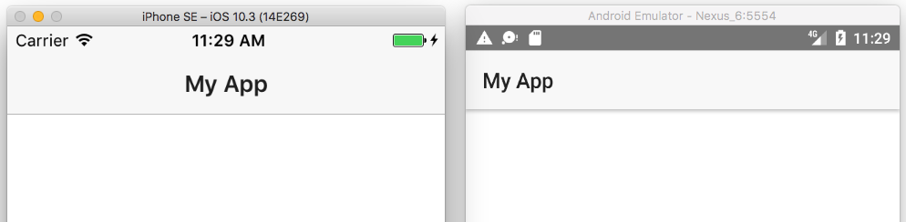
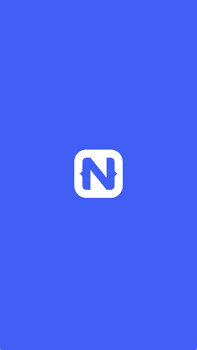

# Why Do You Need NativeScript?

There are more ways to build mobile apps than there are Nicholas Cage DVDs in the bargain bin at your local Walmart. Because there are so many choices, it can be difficult to tell which frameworks will improve your development processes, and which will turn out worse than Nicholas Cage’s [twelve <=10% Rotten Tomatoes movies](https://www.rottentomatoes.com/celebrity/nicolas_cage/).

In this article I’ll discuss why my mobile app framework of choice, [NativeScript](https://www.nativescript.org) might be a good fit for your next app development project. Here’s the idea: if your app meets the six reasons I spell out in this article, NativeScript should be a good fit for your next app.

Sound good? Ok, let’s get started.

## Reason #1: Your app must run natively on iOS and Android

NativeScript is a cross-platform framework that lets you write native iOS and Android applications from a single codebase. NativeScript’s cross-platform nature can be a huge timer saver, especially if you currently maintain separate Android and iOS applications.

At a high level, NativeScript lets you code to familiar JavaScript, TypeScript, XML, and CSS APIs, and interprets the code you write into native user interfaces on iOS and Android. For example, the following NativeScript `<ActionBar>` component abstracts away underlying an underlying `UINavigationBar` for iOS and `android.support.v7.app.ActionBar` for Android.

```
<ActionBar title="My App"></ActionBar>
```

But as a developer these native APIs are completely transparent—you can run your app with an `<ActionBar>` and let native translate the control into the appropriate native user interface components.



While you could write this same app fairly easily as both a native iOS and Android app, the cost of maintaining two different codebases that use two separate technology stacks can be high. Oftentimes, the two apps need to be maintained by separate teams that have the appropriate skillset for each platform. And different teams move at different paces, which can make keeping a consistent release schedule a real pain.

Therefore, although you can use NativeScript to write an app for a single platform, NativeScript works best for apps that need to run on both iOS and Android.

## Reason #2: Your app needs native performance

NativeScript is not the only framework that lets you create Android and iOS apps from a single codebase. One popular alternative is Apache Cordova, and frameworks that build on top of Cordova like Onsen and Ionic.

The key thing that differentiates NativeScript from these web-based frameworks is the user interface. Whereas Cordova-based frameworks use a [WebView](http://developer.telerik.com/featured/what-is-a-webview/) (essentially an embedded browser) to let you write your UI in HTML, NativeScript renders completely native iOS and Android user interface controls. This use of native user interface components allows NativeScript to build really compelling UIs, as NativeScript is not limited by what can be done with the DOM in web apps.


_An example of a NativeScript app in action. Search for “Examples NativeScript” in Google Play or the iOS App Store to try this app yourself._

The downside is that NativeScript can have a higher learning curve than Cordova-based frameworks that use HTML and the DOM. If you’re building a Cordova app from scratch, you probably already have an idea of how HTML works and how to build interfaces with it. If you’re building a NativeScript app from scratch, you probably have to spend some time getting familiar with how the [NativeScript UI components](https://docs.nativescript.org/ui/components) work.

Therefore, NativeScript works best for apps that need the rich performance that native user interface controls provide. Do you have an app with transition or animation requirements? Does your app include any sort of “feed”, or any large list of data where performance is critical? In those cases you’re often best off going with NativeScript, rather than trying a web-based framework, and potentially hitting performance problems that you cannot resolve.

## Reason #3: Your app needs native iOS or Android APIs

Another reason you might need an iOS or Android app is for access to native iOS or Android APIs. NativeScript provides several features out of the box to make this sort of native access simple.

First, NativeScript allows you to [directly access iOS and Android APIs](https://docs.nativescript.org/core-concepts/accessing-native-apis-with-javascript) in your JavaScript or TypeScript code. That means you can type things like `java.lang.Math.min`, or `UIAlert`, and have those native APIs just work.

If using native APIs directly sounds scary, you’ll be happy to know that there are [hundreds of NativeScript plugins](http://plugins.nativescript.org/) that abstract away the nitty-gritty native details into easy to use APIs. For example, if you need to make use of your device’s flashlight, you could directly use APIs like `AVCaptureDevice` or `android.hardware.Camera`, but you’d probably rather use the [NativeScript flashlight plugin](https://github.com/tjvantoll/nativescript-flashlight) instead, as using the flashlight plugin is as simple as a few lines of easily readable JavaScript or TypeScript code.

```
import * as flashlight from "nativescript-flashlight";

if (flashlight.isAvailable()) {
  flashlight.on();
}
```

NativeScript is not the only cross-platform mobile framework with a plugin ecosystem. [Cordova has plugins too](http://plugins.telerik.com/cordova), but NativeScript plugins can do a whole lot more than Cordova plugins can, including [accessing native frameworks such as CocoaPods](https://docs.nativescript.org/plugins/cocoapods), and letting you build native [user interface plugins](https://docs.nativescript.org/plugins/ui-plugin).

> **NOTE**: For a detailed comparison of Cordova and NativeScript plugins, see _[How to Write NativeScript Plugins and Why They’re Easier Than Cordova Plugins](http://developer.telerik.com/featured/write-nativescript-plugins-theyre-easier-cordova-plugins/)_.

These sort of NativeScript plugins can be a huge time saver for your next development project. Go ahead and search the [NativeScript Plugins Repository](http://plugins.nativescript.org/) to see if the NativeScript community has already created the functionality you need.

Overall, whether you want to access native APIs directly, or through a plugin, NativeScript is a great fit for any app that needs a non-trivial amount of access to device functionality.

## Reason #4: You want to reuse existing web development skills

Perhaps the biggest thing that divides popular mobile frameworks is the language you write the majority of your code in. For native iOS apps that language is Objective-C or Swift, for native Android apps that language is Java, for Xamarin that language is C#, and for NativeScript that language is JavaScript.

NativeScript uses JavaScript because of the language’s flexibility (it’s what the native API access discussed in the previous section possible), and also because of JavaScript’s sheer popularity. Chances are your team or company has a non-trivial number of developers that use JavaScript on a daily basis.

Also, if you’re a fan of [TypeScript](https://www.typescriptlang.org/), a typed superset of JavaScript, NativeScript offers [first-class support for it](https://www.nativescript.org/using-typescript-with-nativescript-when-developing-mobile-apps) directly from the NativeScript CLI. Additionally, NativeScript uses a [subset of CSS](https://docs.nativescript.org/ui/styling) for styling your apps, [npm for package management](https://docs.nativescript.org/tutorial/chapter-5), [webpack for app bundling](https://docs.nativescript.org/tooling/bundling-with-webpack), as well as many other tools you might be familiar with from web development.

And it doesn’t stop there. Perhaps the biggest feature NativeScript offers for skill reuse is its integration with the [Angular](https://angular.io/) framework. If you or your company are looking to consolidate technology stacks, the ability to use a single framework on both the web and in native apps is a compelling feature. You can even [share code between both platforms](https://www.youtube.com/watch?v=R3nyG2xtzeQ).


Overall, NativeScript is a good fit for any team of company that has existing web development skills. Because of just how many existing skills these developers are able to use, NativeScript can drastically reduce the amount of time you need to develop native iOS and Android applications.

## Reason #5: Your tool needs to be free and open source

The entire NativeScript framework is free, open source, and available at <https://github.com/nativescript/>. The NativeScript project has a hundreds of contributors across its core framework, its sample projects, and its documentation.

The core of NativeScript is licensed under the very business friendly Apache 2.0 software license. You are free to use NativeScript in your projects and license your works in a way that makes sense for your organizational policies.

Furthermore, nearly all of the [community-written NativeScript plugins](http://plugins.nativescript.org/) are free and open source as well. Therefore, if you need to extend your app with native functionality, you have plenty of existing examples you can reference and build on top of.

Overall, if it’s important for you to build on an open technology stack that you can easily modify and inspect, NativeScript has you covered.

## Reason #6: You need a framework with a strong corporate backing

Finally, in today’s age of JavaScript frameworks that come and go, for many organizations it’s important to pick a framework backed by a major company that you can feel comfortable won’t disappear as you’re developing your next project. 

NativeScript is backed by [Progress](https://www.progress.com/), a large, publicly traded company with a long history of building software for screens of all sizes. If you’re looking to adopt NativeScript at a large scale, the NativeScript team offers a variety of [enterprise support agreements](https://www.nativescript.org/enterprise) to suit your needs.

## Wrapping up

To wrap things up, although you can use NativeScript to build a apps for a variety of use cases, NativeScript works best for apps that

* must run natively on iOS and Android,
* need native performance,
* need native iOS or Android APIs.

And apps that are written by teams and companies that want to

* reuse existing web development skills,
* use free and open source tools,
* use a framework with a strong corporate backing.

Want to get started learning NativeScript? Start by going through either NativeScript’s [JavaScript Getting Started Tutorial](http://docs.nativescript.org/tutorial/chapter-0), or NativeScript’s [TypeScript and Angular Getting Started Guide](http://docs.nativescript.org/angular/tutorial/ng-chapter-0).
